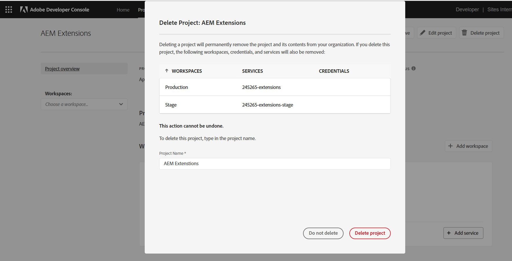

# Een extensie implementeren

Voor gebruik in AEM as a Cloud Service-omgevingen moet de App Builder-extensie worden geïmplementeerd en goedgekeurd.

Houd rekening met verschillende aspecten bij het implementeren van App Builder-apps voor extensies:

+ Extensies worden geïmplementeerd in de Adobe Developer Console-projectwerkruimte. De standaardwerkruimten zijn:
   + __de werkruimte van de Productie__ bevat uitbreidingsplaatsingen die in alle AEM as a Cloud Service beschikbaar zijn.
   + __werkruimte van het Stadium__ dienst als ontwikkelaarwerkruimte. Extensies die worden geïmplementeerd in de werkruimte van het werkgebied, zijn niet beschikbaar in AEM as a Cloud Service.
Adobe Developer Console-werkruimten hebben geen directe correlatie met AEM as a Cloud Service-omgevingstypen.
+ Een uitbreiding die aan de werkruimte van de Productie wordt opgesteld toont in alle milieu&#39;s van AEM as a Cloud Service in Adobe Org dat de uitbreiding binnen bestaat.
Een uitbreiding kan niet tot de milieu&#39;s worden beperkt het met door [&#x200B; voorwaardelijke logica toe te voegen die de de gastheernaam van AEM as a Cloud Service &#x200B;](https://developer.adobe.com/uix/docs/guides/publication/#enabling-extension-only-on-specific-aem-environments) controleert.
+ Op AEM as a Cloud Service kunnen meerdere extensies worden gebruikt. Adobe raadt aan dat elke App Builder-extensie wordt gebruikt om één bedrijfsdoel op te lossen. Een App Builder-app met één extensie kan echter meerdere extensiepunten implementeren die een gemeenschappelijk bedrijfsdoel ondersteunen.

## Eerste implementatie

Een extensie die beschikbaar is in AEM as a Cloud Service-omgevingen, moet worden geïmplementeerd in Adobe Developer Console.

Het plaatsingsproces verdeeld in twee logische stappen:

1. Implementatie van de extensie App Builder-app op Adobe Developer Console door een ontwikkelaar.
1. Goedkeuring van de extensie door een implementatiebeheerder of bedrijfseigenaar.

### De extensie implementeren

Implementeer de extensie in de werkruimte Productie. Extensies die worden geïmplementeerd in de werkruimte Productie worden automatisch toegevoegd aan alle AEM as a Cloud Service Author-services in Adobe Org waarnaar de extensie wordt geïmplementeerd.

1. Open een opdrachtregel naar de hoofdmap van de bijgewerkte App Builder-app voor extensies.
1. Zorg ervoor dat de werkruimte Productie actief is

   ```shell
   $ aio app use -w Production
   ```

   Voeg eventuele wijzigingen in `.env` en `.aio` samen.

1. Implementeer de bijgewerkte extensie App Builder-app.

   ```shell
   $ aio app deploy
   ```

#### Implementatiegoedkeuring aanvragen

{align="center"}

1. Login aan [&#x200B; Adobe Developer Console &#x200B;](https://developer.adobe.com)
1. Selecteer __Console__
1. Ga aan __Projecten__
1. Selecteer het project dat aan de extensie is gekoppeld
1. Selecteer de __Productie__ werkruimte
1. Selecteer __voorleggen voor goedkeuring__
1. Vul het formulier in en verzend het, waarbij u de velden zo nodig bijwerkt.

### Implementatie-goedkeuring

{align="center"}

1. Login aan [&#x200B; Adobe Exchange &#x200B;](https://exchange.adobe.com/)
1. Navigeer aan __leiden__ > __Apps in afwachting van overzicht__
1. __Overzicht__ de uitbreiding App Builder app
1. Als de uitbreidingsveranderingen aanvaardbaar ____ zijn keurt de overzicht goed. Hiermee wordt de extensie onmiddellijk geïnjecteerd op alle AEM as a Cloud Service Author-services binnen de Adobe Org.

Zodra de extensieaanvraag is goedgekeurd, wordt de extensie onmiddellijk actief in de AEM as a Cloud Service Author-services.

## Een extensie bijwerken

Het bijwerken en de uitbreiding App Builder app volgt het zelfde proces zoals [&#x200B; aanvankelijke plaatsing &#x200B;](#initial-deployment), met de afwijking die de bestaande uitbreidingsplaatsing eerst moet worden ingetrokken.

### De extensie intrekken

Als u een nieuwe versie van een extensie wilt implementeren, moet u deze eerst intrekken (of verwijderen). Hoewel de extensie is ingetrokken, is deze niet beschikbaar in AEM-consoles.

1. Login aan [&#x200B; Adobe Exchange &#x200B;](https://exchange.adobe.com/)
1. Navigeer aan __leidt__ > __de Apps van App Builder__
1. __trekt__ de bij te werken Uitbreiding in

Na het intrekken van de extensie is deze nog steeds zichtbaar met de ingetrokken status in Extensiebeheer. Om het volledig te verwijderen moet u het project verwijderen.

De knoop om project te verwijderen is op hoogste recht:

{align="center"}

Zolang de extensie niet is ingetrokken, kan het project niet worden verwijderd:

{align="center"}

Wanneer de extensie wordt ingetrokken, kan het project worden verwijderd:

{align="center"}

Nadat u het project hebt verwijderd, is de extensie niet meer zichtbaar in Extension Manager.

### De extensie implementeren

Implementeer de extensie in de werkruimte Productie. Extensies die worden geïmplementeerd in de werkruimte Productie worden automatisch toegevoegd aan alle AEM as a Cloud Service Author-services in Adobe Org waarnaar de extensie wordt geïmplementeerd.

1. Open een opdrachtregel naar de hoofdmap van de bijgewerkte App Builder-app voor extensies.
1. Zorg ervoor dat de werkruimte Productie actief is

   ```shell
   $ aio app use -w Production
   ```

   Voeg eventuele wijzigingen in `.env` en `.aio` samen.

1. Implementeer de bijgewerkte extensie App Builder-app.

   ```shell
   $ aio app deploy
   ```

#### Implementatiegoedkeuring aanvragen

{align="center"}

1. Login aan [&#x200B; Adobe Developer Console &#x200B;](https://developer.adobe.com)
1. Selecteer __Console__
1. Ga aan __Projecten__
1. Selecteer het project dat aan de extensie is gekoppeld
1. Selecteer de __Productie__ werkruimte
1. Selecteer __voorleggen voor goedkeuring__
1. Vul het formulier in en verzend het, waarbij u de velden zo nodig bijwerkt.

#### De aanvraag voor implementatie goedkeuren

{align="center"}

1. Login aan [&#x200B; Adobe Exchange &#x200B;](https://exchange.adobe.com/)
1. Navigeer aan __leiden__ > __Apps in afwachting van overzicht__
1. __Overzicht__ de uitbreiding App Builder app
1. Als de uitbreidingsveranderingen aanvaardbaar ____ zijn keurt de overzicht goed. Hiermee wordt de extensie onmiddellijk geïnjecteerd op alle AEM as a Cloud Service Author-services binnen de Adobe Org.

Zodra de extensieaanvraag is goedgekeurd, wordt de extensie onmiddellijk actief in de AEM as a Cloud Service Author-services.

## Een extensie verwijderen


Als u een extensie wilt verwijderen, moet u deze uit Adobe Exchange intrekken (of verwijderen). Wanneer de extensie wordt ingetrokken, wordt deze verwijderd uit alle AEM as a Cloud Service Author-services.

1. Login aan [&#x200B; Adobe Exchange &#x200B;](https://exchange.adobe.com/)
1. Navigeer aan __leidt__ > __de Apps van App Builder__
1. __trekt__ de Uitbreiding in om te verwijderen
