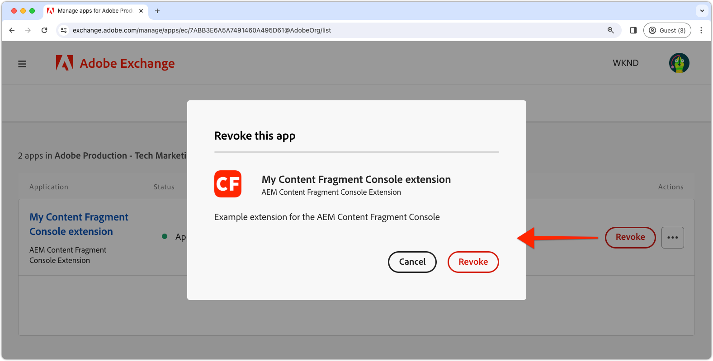

# Een extensie implementeren

Voor gebruik in AEM as a Cloud Service omgevingen moet de extensie App Builder-app worden geïmplementeerd en goedgekeurd.

Er zijn verschillende aspecten die u moet onthouden wanneer u App Builder-apps voor extensies implementeert:

+ Extensies worden geïmplementeerd in de Adobe Developer Console-projectwerkruimte. De standaardwerkruimten zijn:
   + __Productie__ De werkruimte bevat extensies die beschikbaar zijn in alle AEM as a Cloud Service.
   + __Werkgebied__ als ontwikkelaarswerkruimte. Extensies die worden geïmplementeerd in de werkruimte van het werkgebied, zijn niet beschikbaar in AEM as a Cloud Service.
De werkruimten van Adobe Developer Console hebben geen directe correlatie met AEM as a Cloud Service omgevingstypen.
+ Een uitbreiding die aan de werkruimte van de Productie wordt opgesteld toont in alle AEM as a Cloud Service milieu&#39;s in Adobe Org dat de uitbreiding binnen bestaat.
Een extensie kan niet worden beperkt tot de omgevingen waarmee de extensie is geregistreerd door [voorwaardelijke logica die de AEM as a Cloud Service hostnaam controleert](https://developer.adobe.com/uix/docs/guides/publication/#enabling-extension-only-on-specific-aem-environments).
+ Meerdere extensies kunnen worden gebruikt voor AEM as a Cloud Service. Adobe raadt aan dat elke extensie App Builder-app wordt gebruikt om één bedrijfsdoel op te lossen. Toch kan één extensie App Builder-app meerdere extensiepunten implementeren die een gemeenschappelijk bedrijfsdoel ondersteunen.

## Eerste implementatie

Een extensie is alleen beschikbaar in AEM as a Cloud Service omgevingen als deze is geïmplementeerd in Adobe Developer Console.

Het plaatsingsproces verdeeld in twee logische stappen:

1. Implementatie van de extensie App Builder-app in Adobe Developer Console door een ontwikkelaar.
1. Goedkeuring van de extensie door een implementatiebeheerder of bedrijfseigenaar.

### De extensie implementeren

Implementeer de extensie in de werkruimte Productie. De uitbreidingen die aan de werkruimte van de Productie worden opgesteld worden automatisch toegevoegd aan alle AEM as a Cloud Service diensten van de Auteur in Adobe Org dat de uitbreiding wordt opgesteld aan.

1. Open een opdrachtregel naar de hoofdmap van de bijgewerkte extensie App Builder-app.
1. Zorg ervoor dat de werkruimte Productie actief is

   ```shell
   $ aio app use -w Production
   ```

   Alle wijzigingen samenvoegen in `.env` en `.aio`.

1. Implementeer de bijgewerkte app App Builder.

   ```shell
   $ aio app deploy
   ```

#### Implementatiegoedkeuring aanvragen

{align="center"}

1. Aanmelden bij [Adobe Developer Console](https://developer.adobe.com)
1. Selecteren __Console__
1. Navigeren naar __Projecten__
1. Selecteer het project dat aan de extensie is gekoppeld
1. Selecteer de __Productie__ werkruimte
1. Selecteren __Ter goedkeuring indienen__
1. Vul het formulier in en verzend het, waarbij u de velden zo nodig bijwerkt.

### Implementatie-goedkeuring

{align="center"}

1. Aanmelden bij [Adobe Exchange](https://exchange.adobe.com/)
1. Navigeren naar __Beheren__ > __Apps in behandeling__
1. __Controleren__ de extensie App Builder-app
1. Als de extensie wordt gewijzigd __Accepteren__ de evaluatie. Dit injecteert de verlenging onmiddellijk op alle AEM as a Cloud Service Auteur diensten binnen de Adobe Org.

Zodra het uitbreidingsverzoek wordt goedgekeurd, wordt de uitbreiding onmiddellijk actief in de AEM as a Cloud Service diensten van de Auteur.

## Een extensie bijwerken

De app App Builder bijwerken en uitbreiden volgt hetzelfde proces als de [initiële implementatie](#initial-deployment), met dien verstande dat de bestaande uitrol van extensies eerst moet worden ingetrokken.

### De extensie intrekken

Als u een nieuwe versie van een extensie wilt implementeren, moet u deze eerst intrekken (of verwijderen). Hoewel de extensie is ingetrokken, is deze niet beschikbaar in AEM consoles.

1. Aanmelden bij [Adobe Exchange](https://exchange.adobe.com/)
1. Navigeren naar __Beheren__ > __App Builder-toepassingen__
1. __Intrekken__ De extensie die moet worden bijgewerkt

### De extensie implementeren

Implementeer de extensie in de werkruimte Productie. De uitbreidingen die aan de werkruimte van de Productie worden opgesteld worden automatisch toegevoegd aan alle AEM as a Cloud Service diensten van de Auteur in Adobe Org dat de uitbreiding wordt opgesteld aan.

1. Open een opdrachtregel naar de hoofdmap van de bijgewerkte extensie App Builder-app.
1. Zorg ervoor dat de werkruimte Productie actief is

   ```shell
   $ aio app use -w Production
   ```

   Alle wijzigingen samenvoegen in `.env` en `.aio`.

1. Implementeer de bijgewerkte app App Builder.

   ```shell
   $ aio app deploy
   ```

#### Implementatiegoedkeuring aanvragen

{align="center"}

1. Aanmelden bij [Adobe Developer Console](https://developer.adobe.com)
1. Selecteren __Console__
1. Navigeren naar __Projecten__
1. Selecteer het project dat aan de extensie is gekoppeld
1. Selecteer de __Productie__ werkruimte
1. Selecteren __Ter goedkeuring indienen__
1. Vul het formulier in en verzend het, waarbij u de velden zo nodig bijwerkt.

#### De aanvraag voor implementatie goedkeuren

{align="center"}

1. Aanmelden bij [Adobe Exchange](https://exchange.adobe.com/)
1. Navigeren naar __Beheren__ > __Apps in behandeling__
1. __Controleren__ de extensie App Builder-app
1. Als de extensie wordt gewijzigd __Accepteren__ de evaluatie. Dit injecteert de verlenging onmiddellijk op alle AEM as a Cloud Service Auteur diensten binnen de Adobe Org.

Zodra het uitbreidingsverzoek wordt goedgekeurd, wordt de uitbreiding onmiddellijk actief in de AEM as a Cloud Service diensten van de Auteur.

## Een extensie verwijderen



Als u een extensie wilt verwijderen, trekt u deze in de Adobe Exchange in (of verwijdert u deze. Wanneer de extensie wordt ingetrokken, wordt deze verwijderd uit alle AEM as a Cloud Service Auteursservices.

1. Aanmelden bij [Adobe Exchange](https://exchange.adobe.com/)
1. Navigeren naar __Beheren__ > __App Builder-toepassingen__
1. __Intrekken__ De extensie die moet worden verwijderd
