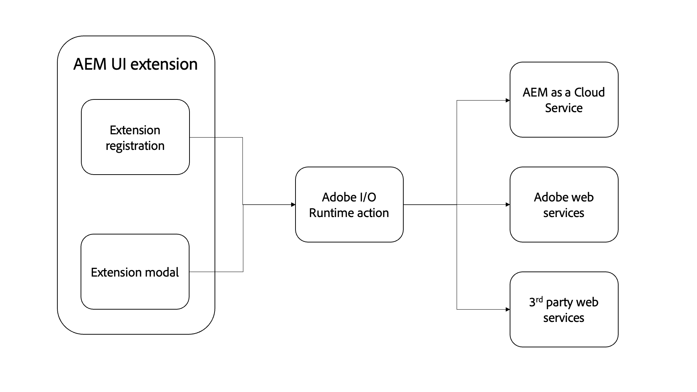

# Adobe I/O Runtime-actie

{align="center"}

AEM UI-extensies kunnen optioneel een willekeurig aantal bevatten [Adobe I/O Runtime-acties](https://developer.adobe.com/runtime/docs/).

Adobe I/O Runtime-handelingen zijn serverloze functies die door de extensie kunnen worden aangeroepen. Handelingen zijn handig voor het uitvoeren van werk waarvoor interactie met AEM of andere webservices van de Adobe vereist is. Handelingen zijn meestal handig voor het uitvoeren van langdurige (iets langer dan een paar seconden) taken of voor het indienen van HTTP-aanvragen bij AEM of andere webservices.

De voordelen van Adobe I/O Runtime-handelingen voor het uitvoeren van bewerkingen zijn:

+ Handelingen zijn serverloze functies die buiten de context van een browser worden uitgevoerd, zodat u zich geen zorgen hoeft te maken over CORS
+ Handelingen kunnen niet worden onderbroken door de gebruiker (bijvoorbeeld de browser vernieuwen)
+ Handelingen zijn asynchroon, zodat ze zo lang als nodig kunnen worden uitgevoerd zonder de gebruiker te blokkeren

In de context van AEM uitbreidingen UI, worden de acties vaak gebruikt om met AEM direct te communiceren as a Cloud Service:

+ Verwante gegevens verzamelen van AEM over de geselecteerde of huidige inhoud
+ Aangepaste bewerkingen op inhoud uitvoeren
+ Aanmaken van inhoud overnemen

Terwijl de AEM UI-extensie wordt weergegeven in specifieke AEM UI&#39;s, kunnen extensies en hun ondersteunende acties elke beschikbare AEM HTTP API aanroepen, inclusief de eindpunten van de aangepaste AEM API.

## Een handeling aanroepen

Adobe I/O Runtime-handelingen worden voornamelijk aangeroepen vanuit twee plaatsen in een AEM UI-extensie:

1. De [extensieregistratie](./extension-registration.md) `onClick(..)` handler
1. Binnen een [modaal](./modal.md)

### Vanaf uitbreidingsregistratie

Adobe I/O Runtime-handelingen kunnen rechtstreeks vanuit de registratiecode voor extensies worden aangeroepen. De meest gebruikelijke manier om een handeling aan een [kopmenu](https://developer.adobe.com/uix/docs/services/aem-cf-console-admin/api/header-menu/)s-knop die niet wordt gebruikt [modaliteiten](./modal.md).

+ `./src/aem-ui-extension/web-src/src/components/ExtensionRegistration.js`

```javascript
// allActions is an object containing all the actions defined in the extension's manifest
import allActions from '../config.json'

// actionWebInvoke is a helper that invokes an action
import actionWebInvoke from '../utils'
...
function ExtensionRegistration() {
  const init = async () => {
    const guestConnection = await register({
      id: extensionId, // A unique ID for the extension
      methods: {
        // Configure your header menu button here
        headerMenu: {
          getButton() {
            return {
              'id': 'example.my-header-menu-extension',  // Unique ID for the button
              'label': 'My header menu extension',       // Button label 
              'icon': 'Edit'                             // Button icon from https://spectrum.adobe.com/page/icons/
            }
          },

          // Click handler for the extension button
          onClick() {
            // Set the HTTP headers required to access the Adobe I/O runtime action
            const headers = {
              'Authorization': 'Bearer ' + guestConnection.sharedContext.get('auth').imsToken,
              'x-gw-ims-org-id': guestConnection.sharedContext.get('auth').imsOrg
            };

            // Set the parameters to pass to the Adobe I/O Runtime action
            const params = {
              aemHost: `https://${guestConnection.sharedContext.get('aemHost')}`, // Pass in the AEM host if the action interacts with AEM
              aemAccessToken: guestConnection.sharedContext.get('auth').imsToken
            };

            try {
              // Invoke Adobe I/O Runtime action named `generic`, with the configured headers and parameters.
              const actionResponse = await actionWebInvoke(allActions['generic'], headers, params);
            } catch (e) {
              // Log and store any errors
              console.error(e)
            }           
          }
        }
      }
    })
  }
  init().catch(console.error);
}
```

### Van modaal

Adobe I/O Runtime-acties kunnen rechtstreeks via modals worden aangeroepen om meer betrokken taken uit te voeren, met name werk dat afhankelijk is van communicatie met AEM as a Cloud Service, Adobe webservice of zelfs met externe services.

Adobe I/O Runtime-acties zijn JavaScript-toepassingen die zijn gebaseerd op Node.js en die worden uitgevoerd in de Adobe I/O Runtime-omgeving zonder server. Deze handelingen kunnen via HTTP worden uitgevoerd via de SPA extensie.

+ `./src/aem-ui-extension/web-src/src/components/MyModal.js`

```javascript
import React, { useState, useEffect } from 'react'
import { attach } from "@adobe/uix-guest"
import {
  Flex,
  Provider,
  Content,
  defaultTheme,
  Text,
  ButtonGroup,
  Button
} from '@adobe/react-spectrum'
import Spinner from "./Spinner"
import { useParams } from "react-router-dom"
import { extensionId } from "./Constants"

export default function MyModal() {
  // Initial modal views for Action Bar extensions typically pass in the list of selected Content Fragment Paths from ExtensionRegistration.js
  // Get the paths from useParams() and split on delimiter used
  let { selection } = useParams();
  let contentFragmentPaths = selection?.split('|') || [];

  const [actionInvokeInProgress, setActionInvokeInProgress] = useState(false);
  const [actionResponse, setActionResponse] = useState();

  // Asynchronously attach the extension to AEM. 
  // Wait or the guestConnection to be set before doing anything in the modal.
  const [guestConnection, setGuestConnection] = useState()
  useEffect(() => {
    (async () => {
      const guestConnection = await attach({ id: extensionId })
      setGuestConnection(guestConnection);
    })()
  }, [])

  if (!guestConnection) {
    // If the guestConnection is not initialized, display a loading spinner
    return <Spinner />
  } else if (!actionResponse) {
    // Else if the modal is ready to render and has not called the Adobe I/O Runtime action yet
    return (
        <Provider theme={defaultTheme} colorScheme='light'>
            <Content width="100%">
                <Flex width="100%">
                    <Text>
                        The selected Content Fragments are: { contentFragmentPaths.join(', ') }
                    </Text>                    

                     <ButtonGroup align="end">
                        <Button variant="cta" onPress={doWork}>Do work</Button>
                        <Button variant="primary" onPress={() => guestConnection.host.modal.close()}>Close</Button>
                    </ButtonGroup>
                </Flex>
            </Content>
        </Provider>
    )
  } else {
    // Else the modal has called the Adobe I/O Runtime action and is ready to render the response
    return (
        <Provider theme={defaultTheme} colorScheme='light'>
            <Content width="100%">
                <Flex width="100%">
                    <Text>
                        Done! The response from the action is: { actionResponse }
                    </Text>                    

                     <ButtonGroup align="end">
                        <Button variant="primary" onPress={() => guestConnection.host.modal.close()}>Close</Button>
                    </ButtonGroup>
                </Flex>
            </Content>
        </Provider>
    )
  }

  /**
   * Invoke the Adobe I/O Runtime action and store the response in the React component's state.
   */
  async function doWork() {
    // Mark the extension as invoking the action, so the loading spinner is displayed
    setActionInvokeInProgress(true);

    // Set the HTTP headers to access the Adobe I/O runtime action
    const headers = {
      'Authorization': 'Bearer ' + guestConnection.sharedContext.get('auth').imsToken,
      'x-gw-ims-org-id': guestConnection.sharedContext.get('auth').imsOrg
    };

    // Set the parameters to pass to the Adobe I/O Runtime action
    const params = {
      aemHost: `https://${guestConnection.sharedContext.get('aemHost')}`,
      contentFragmentPaths: contentFragmentPaths
    };

    try {
      // Invoke Adobe I/O Runtime action with the configured headers and parameters
      // Invoke the Adobe I/O Runtime action named `generic`.
      const actionResponse = await actionWebInvoke(allActions['generic'], headers, params);

      // Set the response from the Adobe I/O Runtime action
      setActionResponse(actionResponse);
    } catch (e) {
      // Log and store any errors
      console.error(e)
    }

    // Set the action as no longer being invoked, so the loading spinner is hidden
    setActionInvokeInProgress(false);
  }
}
```

## Adobe I/O Runtime-actie

+ `src/aem-ui-extension/actions/generic/index.js`

```javascript
const fetch = require('node-fetch')
const { Core } = require('@adobe/aio-sdk')
const { errorResponse, getBearerToken, stringParameters, checkMissingRequestInputs } = require('../utils')

async function main (params) {
  const logger = Core.Logger('main', { level: params.LOG_LEVEL || 'info' })

  try {
    logger.debug(stringParameters(params))

    // Check for missing request input parameters and headers
    const requiredParams = [ 'aemHost', 'contentFragmentPaths' ]
    const requiredHeaders = ['Authorization']
    const errorMessage = checkMissingRequestInputs(params, requiredParams, requiredHeaders)
    if (errorMessage) {
      // return and log client errors
      return errorResponse(400, errorMessage, logger)
    }
      
    // Extract the user Bearer token from the Authorization header used to authenticate the request to AEM
    const accessToken = getBearerToken(params);

    // Example HTTP request to AEM payload; This updates all 'title' properties of the Content Fragments to 'Hello World'
    const body = {
      "properties": {
        "elements": {
          "title": {
            "value": "Hello World"
          }
        }
      }
    };

    let results = await Promise.all(params.contentFragmentPaths.map(async (contentFragmentPath) => {
      // Invoke the AEM HTTP Assets Content Fragment API to update each Content Fragment
      // The AEM host is passed in as a parameter to the Adobe I/O Runtime action
      const res = await fetch(`${params.aemHost}${contentFragmentPath.replace('/content/dam/', '/api/assets/')}.json`, { 
        method: 'put',
        body: JSON.stringify(body),
        headers: {
          // Pass in the accessToken as AEM Author service requires authentication/authorization
          'Authorization': `Bearer ${accessToken}`,
          'Content-Type': 'application/json'
        }
      });

      if (res.ok) {
        logger.info(`Successfully updated title of ${contentFragmentPath}`);
        return { contentFragmentPath, status: res.status, statusText: res.statusText, body: await res.json() };
      } else {
        logger.info(`Failed to update title of ${contentFragmentPath}`);
        return { contentFragmentPath, status: res.status, statusText: res.statusText, body: await res.text() };
      }
    }));

    // Return a response to the AEM Content Fragment extension React application
    const response = {
      statusCode: 200,
      body: results
    };
    return response;

  } catch (error) {
    logger.error(error)
    return errorResponse(500, 'server error', logger)
  }
}
```

## HTTP-API&#39;s AEM

De volgende AEM HTTP-API&#39;s worden vaak gebruikt voor interactie met AEM van extensies:

+ [GraphQL API&#39;s AEM](https://experienceleague.adobe.com/landing/experience-manager/headless/developer.html)
+ [AEM ASSETS HTTP API](https://experienceleague.adobe.com/docs/experience-manager-cloud-service/content/assets/admin/mac-api-assets.html)
   + [Ondersteuning voor contentfragmenten in HTTP-API van AEM Assets](https://experienceleague.adobe.com/docs/experience-manager-cloud-service/content/assets/admin/assets-api-content-fragments.html)
+ [AEM QueryBuilder-API](https://experienceleague.adobe.com/docs/experience-manager-cloud-service/content/implementing/developing/full-stack/search/query-builder-api.html)
+ [Volledige AEM as a Cloud Service API-referentie](https://experienceleague.adobe.com/docs/experience-manager-cloud-service/content/implementing/developing/reference-materials.html)


## Npm-modules voor Adobe

Hieronder vindt u nuttige npm-modules voor het ontwikkelen van Adobe I/O Runtime-acties:

+ [@adobe/aio-sdk](https://www.npmjs.com/package/@adobe/aio-sdk)
   + [Core SDK](https://github.com/adobe/aio-sdk-core)
   + [Framebibliotheek](https://github.com/adobe/aio-lib-state)
   + [Bestandsbibliotheek](https://github.com/adobe/aio-lib-files)
   + [Adobe Target Library](https://github.com/adobe/aio-lib-target)
   + [Adobe Analytics Library](https://github.com/adobe/aio-lib-analytics)
   + [Adobe Campaign Standard Library](https://github.com/adobe/aio-lib-campaign-standard)
   + [Adobe Klantprofielbibliotheek](https://github.com/adobe/aio-lib-customer-profile)
   + [Adobe Audience Manager Customer Data Library](https://github.com/adobe/aio-lib-audience-manager-cd)
   + [Adobe I/O Events](https://github.com/adobe/aio-lib-events)
+ [@adobe/aio-lib-core-networking](https://github.com/adobe/aio-lib-core-networking)
+ [@adobe/node-httptransfer](https://github.com/adobe/node-httptransfer)
