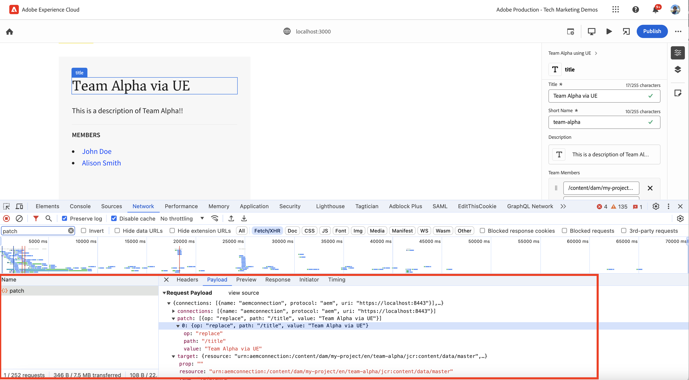

# Instrument Reageren app om inhoud te bewerken met Universal Editor

Leer hoe u de React-app kunt gebruiken om de inhoud te bewerken met de Universal Editor.

## Vereisten

U hebt de lokale ontwikkelomgeving ingesteld zoals beschreven in de voorgaande [Instelling voor lokale ontwikkeling](./local-development-setup.md) stap.

## De kernbibliotheek van de universele editor opnemen

Laten we beginnen met het opnemen van de kernbibliotheek van de Universal Editor in de WKND Teams React-app. Het is een JavaScript-bibliotheek die de communicatielaag vormt tussen de bewerkte app en de universele editor.

Er zijn twee manieren om de kernbibliotheek van de Universal Editor op te nemen in de React-app:

1. De modulegebiedsdeel van de knoop van het npm register, zie [@adobe/Universal-editor-cors](https://www.npmjs.com/package/@adobe/universal-editor-cors).
1. Script-tag (`<script>`) in het HTML-bestand.

Voor deze zelfstudie gebruiken we de methode Scripttag.

1. Installeer de `react-helmet-async` pakket om het `<script>` -tag in de React-app.

   ```bash
   $ npm install react-helmet-async
   ```

1. Werk de `src/App.js` bestand van de WKND Teams React-app om de kernbibliotheek van de Universal Editor op te nemen.

   ```javascript
   ...
   import { Helmet, HelmetProvider } from "react-helmet-async";
   
   function App() {
   return (
       <HelmetProvider>
           <div className="App">
               <Helmet>
                   {/* AEM Universal Editor :: CORE Library
                     Loads the LATEST Universal Editor library
                   */}
                   <script
                       src="https://universal-editor-service.experiencecloud.live/corslib/LATEST"
                       async
                   />
               </Helmet>
               <Router>
                   <header>
                       <Link to={"/"}>
                       
                       </Link>
                       <hr />
                   </header>
                   <Routes>
                       <Route path="/" element={<Home />} />
                       <Route path="/person/:fullName" element={<Person />} />
                   </Routes>
               </Router>
           </div>
       </HelmetProvider>
   );
   }
   
   export default App;
   ```

## Metagegevens toevoegen - inhoudsbron

De app Reageren voor WKND-teams verbinden _met de inhoudsbron_ voor het bewerken moet u verbindingsmetagegevens opgeven. De Universal Editor-service gebruikt deze metagegevens om een verbinding met de inhoudsbron tot stand te brengen.

De verbindingsmetagegevens worden opgeslagen als `<meta>` -tags in het HTML-bestand. De syntaxis voor de verbindingsmeta-gegevens is als volgt:

```html
<meta name="urn:adobe:aue:<category>:<referenceName>" content="<protocol>:<url>">
```

Voeg de verbindingsmetagegevens toe aan de React-app van de WKND-teams in het dialoogvenster `<Helmet>` component. Werk de `src/App.js` bestand met het volgende `<meta>` -tag. In dit voorbeeld is de inhoudsbron een lokale AEM-instantie waarop `https://localhost:8443`.

```javascript
...
function App() {
return (
    <HelmetProvider>
        <div className="App">
            <Helmet>
                {/* AEM Universal Editor :: CORE Library
                    Loads the LATEST Universal Editor library
                */}
                <script
                    src="https://universal-editor-service.experiencecloud.live/corslib/LATEST"
                    async
                />
                {/* AEM Universal Editor :: Connection metadata 
                    Connects to local AEM instance
                */}
                <meta
                    name="urn:adobe:aue:system:aemconnection"
                    content={`aem:https://localhost:8443`}
                />
            </Helmet>
            ...
    </HelmetProvider>
);
}

export default App;
```

De `aemconnection` geeft een korte naam voor de inhoudsbron. De volgende instrumentatie gebruikt de korte naam om naar de inhoudsbron te verwijzen.

## Metagegevens toevoegen - lokale Universal Editor-serviceconfiguratie

In plaats van de Adobe-ontvangen Universele dienst van de Redacteur, wordt een lokale kopie van de Universele dienst van de Redacteur gebruikt voor lokale ontwikkeling. De lokale dienst bindt de Universele Redacteur en AEM SDK, zodat voegen de lokale Universele dienst meta-gegevens van de Redacteur aan de Reactie app van de Teams WKND toe.

Deze configuratie-instellingen worden ook opgeslagen als `<meta>` -tags in het HTML-bestand. De syntaxis voor de lokale Universal Editor-metagegevens is als volgt:

```html
<meta name="urn:adobe:aue:config:service" content="<url>">
```

Voeg de verbindingsmetagegevens toe aan de React-app van de WKND-teams in het dialoogvenster `<Helmet>` component. Werk de `src/App.js` bestand met het volgende `<meta>` -tag. In dit voorbeeld wordt de lokale Universal Editor-service uitgevoerd `https://localhost:8001`.

```javascript
...

function App() {
  return (
    <HelmetProvider>
      <div className="App">
        <Helmet>
          {/* AEM Universal Editor :: CORE Library
              Loads the LATEST Universal Editor library
          */}
          <script
            src="https://universal-editor-service.experiencecloud.live/corslib/LATEST"
            async
          />
          {/* AEM Universal Editor :: Connection metadata 
              Connects to local AEM instance
          */}
          <meta
            name="urn:adobe:aue:system:aemconnection"
            content={`aem:https://localhost:8443`}
          />
          {/* AEM Universal Editor :: Configuration for Service
              Using locally running Universal Editor service
          */}
          <meta
            name="urn:adobe:aue:config:service"
            content={`https://localhost:8001`}
          />
        </Helmet>
        ...
    </HelmetProvider>
);
}
export default App;
```

## Instrueer de React-componenten

De inhoud van de Reactie-app voor WKND-teams bewerken, zoals _teamtitel en teambeschrijving_, moet u de React componenten instrumenten. De instrumenten betekenen het toevoegen van relevante gegevenskenmerken (`data-aue-*`) aan de HTML-elementen die u bewerkbaar wilt maken met de Universal Editor. Zie voor meer informatie over gegevenskenmerken [Kenmerken en typen](https://experienceleague.adobe.com/en/docs/experience-manager-cloud-service/content/implementing/developing/universal-editor/attributes-types).

### Bewerkbare elementen definiëren

Eerst definieert u de elementen die u wilt bewerken met de universele editor. In de React app van de Teams WKND, worden de teamtitel en de beschrijving opgeslagen in het Fragment van de Inhoud van het Team in AEM, zo de beste kandidaten voor het uitgeven.

Laten we het instrument `Teams` Reageer component om de teamtitel en beschrijving bewerkbaar te maken.

1. Open de `src/components/Teams.js` bestand van de React-app voor WKND-teams.
1. Voeg de `data-aue-prop`, `data-aue-type` en `data-aue-label` attribuut aan de teamtitel en beschrijvingselementen.

   ```javascript
   ...
   function Teams() {
       const { teams, error } = useAllTeams();
       ...
   
       return (
           <div className="team">
               // AEM Universal Editor :: Instrumentation using data-aue-* attributes
               <h2 className="team__title" data-aue-prop="title" data-aue-type="text" data-aue-label="title">{title}</h2>
               <p className="team__description" data-aue-prop="description" data-aue-type="richtext" data-aue-label="description">{description.plaintext}</p>
               ...
           </div>
       );
   }
   
   export default Teams;
   ```

1. Vernieuw de pagina Universal Editor in de browser die de React-app voor WKND-teams laadt. U kunt nu zien dat de elementen van de teamtitel en beschrijving bewerkbaar zijn.

   

1. Als u de teamtitel of beschrijving probeert te bewerken via inline bewerken of de eigenschappencontrole, wordt een spinner weergegeven die wordt geladen, maar kunt u de inhoud niet bewerken. Omdat de Universele Redacteur zich niet van de AEM middeldetails voor het laden van en het bewaren van de inhoud bewust is.

   

Samengevat, merken de bovengenoemde veranderingen de teamtitel en beschrijvingselementen zoals editable in de Universele Redacteur. Maar **u kunt de wijzigingen nog niet bewerken (via inline of properties rail) en opslaan**, voor dat moet u de AEM middeldetails toevoegen gebruikend `data-aue-resource` kenmerk. Laten we dat in de volgende stap doen.

### Brondetails AEM definiëren

Als u de bewerkte inhoud wilt opslaan in AEM en ook als u de inhoud in de eigenschappenrails wilt laden, moet u de AEM-brongegevens opgeven voor de Universal Editor.

In dit geval, is het AEM middel de weg van het Fragment van de Inhoud van het Team, zodat voeg de middeldetails aan toe `Teams` Reageer component op het hoogste niveau `<div>` element.

1. Werk de `src/components/Teams.js` bestand toevoegen `data-aue-resource`, `data-aue-type` en `data-aue-label` kenmerken op het hoogste niveau `<div>` element.

   ```javascript
   ...
   function Teams() {
       const { teams, error } = useAllTeams();
       ...
   
       // Render single Team
       function Team({ _path, title, shortName, description, teamMembers }) {
           // Must have title, shortName and at least 1 team member
           if (!_path || !title || !shortName || !teamMembers) {
               return null;
           }
   
         return (
           // AEM Universal Editor :: Instrumentation using data-aue-* attributes
           <div className="team" data-aue-resource={`urn:aemconnection:${_path}/jcr:content/data/master`} data-aue-type="reference" data-aue-label={title}>
           ...
           </div>
       );
       }
   }
   export default Teams;
   ```

   De waarde van `data-aue-resource` attribuut is de AEM middelweg van het Fragment van de Inhoud van het Team. De `urn:aemconnection:` gebruikt de korte naam van de inhoudsbron die is gedefinieerd in de verbindingsmetagegevens.

1. Vernieuw de pagina Universal Editor in de browser die de React-app voor WKND-teams laadt. U kunt nu zien dat het top-level element van het Team editable is maar de eigenschappen spoorstaaf laadt nog niet de inhoud. Op het netwerktabblad van de browser kunt u de fout 401 Niet-geautoriseerde voor de `details` verzoek om de inhoud te laden. Het probeert het IMS-token te gebruiken voor verificatie, maar de lokale AEM SDK ondersteunt IMS-verificatie niet.

   

1. Als u de fout 401 zonder toestemming wilt corrigeren, moet u de lokale AEM SDK-verificatiegegevens opgeven voor de Universal Editor met de opdracht **Verificatiekoppen** in de Universal Editor. Als lokale AEM SDK stelt u de waarde in op `Basic YWRtaW46YWRtaW4=` for `admin:admin` referenties.

   

1. Vernieuw de pagina Universal Editor in de browser die de React-app voor WKND-teams laadt. U ziet nu dat de eigenschappenrails de inhoud laden en u kunt de teamtitel en beschrijving inline bewerken of de eigenschappenrails gebruiken.

   

#### Onder de kap

De eigenschappen per spoor laden de inhoud van de AEM bron met behulp van de lokale Universal Editor-service. Gebruikend het netwerklusje van browser, kunt u het verzoek van de POST aan de lokale Universele dienst van de Redacteur zien (`https://localhost:8001/details`) voor het laden van de inhoud.

Wanneer u de inhoud bewerkt met inline bewerken of eigenschappenrails, worden de wijzigingen met de lokale Universal Editor-service weer opgeslagen in de AEM. Gebruikend het netwerklusje van browser, kunt u het verzoek van de POST aan de lokale Universele dienst van de Redacteur zien (`https://localhost:8001/update` of `https://localhost:8001/patch`) voor het opslaan van de inhoud.


Het JSON-object voor aanvraaglading bevat de benodigde details, zoals de inhoudsserver (`connections`), resource path (`target`) en de bijgewerkte inhoud (`patch`).



### De bewerkbare inhoud uitbreiden

Vouw de bewerkbare inhoud uit en pas de instrumentatie toe op de **teamleden** zodat u de teamleden kunt bewerken met de eigenschappen rail.

Zoals hierboven, voegen wij relevante `data-aue-*` kenmerken voor de teamleden in de `Teams` Reageer component.

1. Werk de `src/components/Teams.js` bestand om gegevenskenmerken toe te voegen aan de `<li key={index} className="team__member">` element.

   ```javascript
   ...
   function Teams() {
       const { teams, error } = useAllTeams();
       ...
   
       <div>
           <h4 className="team__members-title">Members</h4>
           <ul className="team__members">
               {/* Render the referenced Person models associated with the team */}
               {teamMembers.map((teamMember, index) => {
                   return (
                       // AEM Universal Editor :: Instrumentation using data-aue-* attributes
                       <li key={index} className="team__member" data-aue-resource={`urn:aemconnection:${teamMember?._path}/jcr:content/data/master`} data-aue-type="component" data-aue-label={teamMember.fullName}>
                       <Link to={`/person/${teamMember.fullName}`}>
                           {teamMember.fullName}
                       </Link>
                       </li>
                   );
               })}
           </ul>
       </div>
       ...
   }
   export default Teams;
   ```

   De waarde van `data-aue-type` kenmerk is `component` als de teamleden worden opgeslagen als `Person` Inhoudsfragmenten in AEM en helpen u de beweegbare/verplaatsbare delen van de inhoud aan te geven.

1. Vernieuw de pagina Universal Editor in de browser die de React-app voor WKND-teams laadt. U kunt nu zien dat de teamleden bewerkbaar zijn met de eigenschappen rail.

   

#### Onder de kap

Zoals hierboven, worden de inhoudsherwinning en het bewaren gedaan door de lokale Universele dienst van de Redacteur. De `/details`, `/update` of `/patch` er worden aanvragen ingediend bij de lokale Universal Editor-service om de inhoud te laden en op te slaan.

### Inhoud toevoegen en verwijderen definiëren

Tot nu toe hebt u de bestaande inhoud bewerkbaar gemaakt, maar wat als u nieuwe inhoud wilt toevoegen? Laten wij de capaciteit toevoegen om teamleden aan het team toe te voegen of te schrappen WKND gebruikend de Universele Redacteur. De auteurs van de inhoud hoeven dus niet naar de AEM te gaan om teamleden toe te voegen of te verwijderen.

Nochtans, wordt een snelle recap, de leden van het Team WKND opgeslagen zoals `Person` De Fragmenten van de inhoud in AEM en worden geassocieerd met het Fragment van de Inhoud van het Team gebruikend `teamMembers` eigenschap. Om de modeldefinitie in AEM bezoek te herzien [mijn-project](http://localhost:4502/libs/dam/cfm/models/console/content/models.html/conf/my-project).

1. Maak eerst het componentdefinitiebestand `/public/static/component-definition.json`. Dit bestand bevat de componentdefinitie voor de `Person` Inhoud fragment. De `aem/cf` Met insteekmodule kunt u inhoudsfragmenten invoegen op basis van een model en een sjabloon met de standaardwaarden die u wilt toepassen.

   ```json
   {
       "groups": [
           {
           "title": "Content Fragments",
           "id": "content-fragments",
           "components": [
               {
               "title": "Person",
               "id": "person",
               "plugins": {
                   "aem": {
                       "cf": {
                           "name": "person",
                           "cfModel": "/conf/my-project/settings/dam/cfm/models/person",
                           "cfFolder": "/content/dam/my-project/en",
                           "title": "person",
                           "template": {
                               "fullName": "New Person",
                               "biographyText": "This is biography of new person"
                               }
                           }
                       }
                   }
               }
           ]
           }
       ]
   }
   ```

1. Verwijs vervolgens boven componentdefinitiebestand in `index.html` van de WKND Team React App. Werk de `public/index.html` bestand `<head>` -sectie om het componentdefinitiebestand op te nemen.

   ```html
   ...
   <script
       type="application/vnd.adobe.aue.component+json"
       src="/static/component-definition.json"
   ></script>
   <title>WKND App - Basic GraphQL Tutorial</title>
   </head>
   ...
   ```

1. Tot slot werkt u de `src/components/Teams.js` bestand om gegevenskenmerken toe te voegen. De **LEDEN** sectie om als container voor de teamleden te handelen, laten wij toevoegen `data-aue-prop`, `data-aue-type`, en `data-aue-label` aan de `<div>` element.

   ```javascript
   ...
   function Teams() {
       const { teams, error } = useAllTeams();
       ...
   
       {/* AEM Universal Editor :: Team Members as container */}
       <div data-aue-prop="teamMembers" data-aue-type="container" data-aue-label="members">
           <h4 className="team__members-title">Members</h4>
           <ul className="team__members">
           {/* Render the referenced Person models associated with the team */}
           {teamMembers.map((teamMember, index) => {
               return (
               // AEM Universal Editor :: Instrumentation using data-aue-* attributes
               <li key={index} className="team__member" data-aue-resource={`urn:aemconnection:${teamMember?._path}/jcr:content/data/master`} data-aue-type="component" data-aue-label={teamMember.fullName}>
                   <Link to={`/person/${teamMember.fullName}`}>
                   {teamMember.fullName}
                   </Link>
               </li>
               );
           })}
           </ul>
       </div>
       ...
   }
   export default Teams;
   ```

1. Vernieuw de pagina Universal Editor in de browser die de React-app voor WKND-teams laadt. U kunt nu zien dat de **LEDEN** -sectie fungeert als een container. U kunt nieuwe teamleden invoegen met de eigenschappen rail en de **+** pictogram.

   

1. Om een teamlid te schrappen, selecteer het teamlid en klik **Verwijderen** pictogram.

   

#### Onder de kap

De inhoud voegt en schrapt verrichtingen toe worden gedaan door de lokale Universele dienst van de Redacteur. Het verzoek van de POST aan `/add` of `/remove` met een gedetailleerde lading aan de lokale Universele dienst van de Redacteur wordt gemaakt om de inhoud aan de AEM toe te voegen of te schrappen.

## Oplossingsbestanden

Als u de wijzigingen in uw implementatie wilt controleren of als u de WKND-teams Reageer-app die werkt met de Universal Editor niet kunt ophalen, raadpleegt u de [basic-tutorial-instrumentented-for-UE](https://github.com/adobe/aem-guides-wknd-graphql/tree/solution/basic-tutorial-instrumented-for-UE) oplossingsvertakking.

Bestands-per-dossier vergelijking met het werken **basiszelfstudie** vertakking is beschikbaar [hier](https://github.com/adobe/aem-guides-wknd-graphql/compare/solution/basic-tutorial...solution/basic-tutorial-instrumented-for-UE?expand=1).

## Gefeliciteerd

U hebt met succes van instrumenten voorzien de WKND Teams React app om de inhoud toe te voegen, uit te geven en te schrappen gebruikend de Universele Redacteur. U hebt geleerd hoe u de kernbibliotheek kunt opnemen, verbinding kunt toevoegen en de lokale metagegevens van de Universal Editor-service kunt gebruiken en de component React kunt bewerken met behulp van diverse gegevens (`data-aue-*`).
