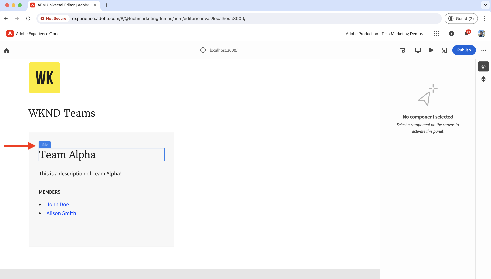

# Instrument Reageren app om inhoud te bewerken met Universal Editor

Leer hoe u de React-app kunt gebruiken om de inhoud te bewerken met de Universal Editor.

## Vereisten

U hebt opstelling het lokale ontwikkelmilieu zoals die in de vorige [&#x200B; Lokale stap van de ontwikkelingsOpstelling &#x200B;](./local-development-setup.md) wordt beschreven.

## De kernbibliotheek van de universele editor opnemen

Laten we beginnen met het opnemen van de kernbibliotheek van de Universal Editor in de WKND Teams React-app. Het is een JavaScript-bibliotheek die de communicatielaag vormt tussen de bewerkte app en de Universal Editor.

Er zijn twee manieren om de kernbibliotheek van de Universal Editor op te nemen in de React-app:

1. De moduleafhankelijkheid van de knoop van het npm- register, zie [@adobe/Universal-editor-cors &#x200B;](https://www.npmjs.com/package/@adobe/universal-editor-cors).
1. Scripttag (`<script>`) in het HTML-bestand.

Voor deze zelfstudie gebruiken we de methode Scripttag.

1. Installeer het `react-helmet-async` -pakket om de `<script>` -tag in de React-app te beheren.

   ```bash
   $ npm install react-helmet-async
   ```

1. Werk het `src/App.js` -bestand van de React-app voor WKND-teams bij en voeg de kernbibliotheek van de Universal Editor toe.

   ```javascript
   ...
   import { Helmet, HelmetProvider } from "react-helmet-async";
   
   function App() {
   return (
       <HelmetProvider>
           <div className="App">
               <Helmet>
                   {/* AEM Universal Editor :: CORE Library
                     Loads the LATEST Universal Editor library
                   */}
                   <script
                       src="https://universal-editor-service.adobe.io/cors.js"
                       async
                   />
               </Helmet>
               <Router>
                   <header>
                       <Link to={"/"}>
                       
                       </Link>
                       <hr />
                   </header>
                   <Routes>
                       <Route path="/" element={<Home />} />
                       <Route path="/person/:fullName" element={<Person />} />
                   </Routes>
               </Router>
           </div>
       </HelmetProvider>
   );
   }
   
   export default App;
   ```

## Metagegevens toevoegen - inhoudsbron

Om de WKND Teams te verbinden Reageer app _met de inhoudsbron_ voor het uitgeven, moet u verbindingsmeta-gegevens verstrekken. De Universal Editor-service gebruikt deze metagegevens om een verbinding met de inhoudsbron tot stand te brengen.

De verbindingsmetagegevens worden opgeslagen als `<meta>` -tags in het HTML-bestand. De syntaxis voor de verbindingsmeta-gegevens is als volgt:

```html
<meta name="urn:adobe:aue:<category>:<referenceName>" content="<protocol>:<url>">
```

Voeg de verbindingsmetagegevens toe aan de React-app van WKND-teams in de component `<Helmet>` . Werk het `src/App.js` -bestand bij met de volgende `<meta>` -tag. In dit voorbeeld is de inhoudsbron een lokale AEM-instantie die wordt uitgevoerd op `https://localhost:8443` .

```javascript
...
function App() {
return (
    <HelmetProvider>
        <div className="App">
            <Helmet>
                {/* AEM Universal Editor :: CORE Library
                    Loads the LATEST Universal Editor library
                */}
                <script
                    src="https://universal-editor-service.adobe.io/cors.js"
                    async
                />
                {/* AEM Universal Editor :: Connection metadata 
                    Connects to local AEM instance
                */}
                <meta
                    name="urn:adobe:aue:system:aemconnection"
                    content={`aem:https://localhost:8443`}
                />
            </Helmet>
            ...
    </HelmetProvider>
);
}

export default App;
```

`aemconnection` biedt een korte naam voor de inhoudsbron. De volgende instrumentatie gebruikt de korte naam om naar de inhoudsbron te verwijzen.

## Metagegevens toevoegen - lokale Universal Editor-serviceconfiguratie

In plaats van de door Adobe gehoste Universal Editor-service wordt een lokale kopie van de Universal Editor-service gebruikt voor lokale ontwikkeling. De lokale service bindt de Universal Editor en de AEM SDK, dus laten we de lokale metagegevens van de Universal Editor-service toevoegen aan de React-app voor WKND-teams.

Deze configuratie-instellingen worden ook opgeslagen als `<meta>` -tags in het HTML-bestand. De syntaxis voor de lokale Universal Editor-metagegevens is als volgt:

```html
<meta name="urn:adobe:aue:config:service" content="<url>">
```

Voeg de verbindingsmetagegevens toe aan de React-app van WKND-teams in de component `<Helmet>` . Werk het `src/App.js` -bestand bij met de volgende `<meta>` -tag. In dit voorbeeld wordt de lokale Universal Editor-service uitgevoerd op `https://localhost:8001` .

```javascript
...

function App() {
  return (
    <HelmetProvider>
      <div className="App">
        <Helmet>
          {/* AEM Universal Editor :: CORE Library
              Loads the LATEST Universal Editor library
          */}
          <script
            src="https://universal-editor-service.adobe.io/cors.js"
            async
          />
          {/* AEM Universal Editor :: Connection metadata 
              Connects to local AEM instance
          */}
          <meta
            name="urn:adobe:aue:system:aemconnection"
            content={`aem:https://localhost:8443`}
          />
          {/* AEM Universal Editor :: Configuration for Service
              Using locally running Universal Editor service
          */}
          <meta
            name="urn:adobe:aue:config:service"
            content={`https://localhost:8001`}
          />
        </Helmet>
        ...
    </HelmetProvider>
);
}
export default App;
```

## Instrueer de React-componenten

Om de inhoud van de Teams uit te geven WKND Reageer app zoals _teamtitel en teambeschrijving_, moet u de componenten van het Antwoord van instrumenten voorzien. De instrumentatie betekent het toevoegen van relevante gegevensattributen (`data-aue-*`) aan de elementen van HTML die u editable wilt maken gebruikend de Universele Redacteur. Voor meer informatie over gegevensattributen, zie [&#x200B; Attributen en Types &#x200B;](https://experienceleague.adobe.com/en/docs/experience-manager-cloud-service/content/implementing/developing/universal-editor/attributes-types).

### Bewerkbare elementen definiëren

Eerst definieert u de elementen die u wilt bewerken met de universele editor. In de React app van de Teams WKND, worden de teamtitel en de beschrijving opgeslagen in het Fragment van de Inhoud van het Team in AEM, zo de beste kandidaten voor het uitgeven.

Instrueer de component `Teams` Reageren om de teamtitel en beschrijving bewerkbaar te maken.

1. Open het bestand `src/components/Teams.js` van de React-app voor WKND-teams.
1. Voeg het attribuut `data-aue-prop`, `data-aue-type` en `data-aue-label` toe aan de teamtitel en beschrijvingselementen.

   ```javascript
   ...
   function Teams() {
       const { teams, error } = useAllTeams();
       ...
   
       return (
           <div className="team">
               // AEM Universal Editor :: Instrumentation using data-aue-* attributes
               <h2 className="team__title" data-aue-prop="title" data-aue-type="text" data-aue-label="title">{title}</h2>
               <p className="team__description" data-aue-prop="description" data-aue-type="richtext" data-aue-label="description">{description.plaintext}</p>
               ...
           </div>
       );
   }
   
   export default Teams;
   ```

1. Vernieuw de pagina Universal Editor in de browser die de React-app voor WKND-teams laadt. U kunt nu zien dat de elementen van de teamtitel en beschrijving bewerkbaar zijn.

   

1. Als u de teamtitel of beschrijving probeert te bewerken via inline bewerken of de eigenschappencontrole, wordt een spinner weergegeven die wordt geladen, maar kunt u de inhoud niet bewerken. Omdat de Universal Editor zich niet bewust is van de AEM-brongegevens voor het laden en opslaan van de inhoud.

   

Samengevat, merken de bovengenoemde veranderingen de teamtitel en beschrijvingselementen zoals editable in de Universele Redacteur. Nochtans, **kunt u niet (via gealigneerde of eigenschappen spoorstaaf) uitgeven en de veranderingen nog opslaan**, voor dat moet u de het middeldetails van AEM toevoegen gebruikend het `data-aue-resource` attribuut. Laten we dat in de volgende stap doen.

### AEM-brongegevens definiëren

Als u de bewerkte inhoud wilt opslaan naar AEM en ook als u de inhoud in de eigenschappenrails wilt laden, moet u de AEM-brongegevens opgeven voor de Universal Editor.

In dit geval is de AEM-bron het pad van het Team Content Fragment, dus laten we de brondetails toevoegen aan de `Teams` React-component op het hoogste niveau `<div>` -element.

1. Werk het `src/components/Teams.js` -bestand bij om de kenmerken `data-aue-resource` , `data-aue-type` en `data-aue-label` toe te voegen aan het element op hoofdniveau `<div>` .

   ```javascript
   ...
   function Teams() {
       const { teams, error } = useAllTeams();
       ...
   
       // Render single Team
       function Team({ _path, title, shortName, description, teamMembers }) {
           // Must have title, shortName and at least 1 team member
           if (!_path || !title || !shortName || !teamMembers) {
               return null;
           }
   
         return (
           // AEM Universal Editor :: Instrumentation using data-aue-* attributes
           <div className="team" data-aue-resource={`urn:aemconnection:${_path}/jcr:content/data/master`} data-aue-type="reference" data-aue-label={title}>
           ...
           </div>
       );
       }
   }
   export default Teams;
   ```

   De waarde van het attribuut `data-aue-resource` is de het middelweg van AEM van het Fragment van de Inhoud van het Team. Het voorvoegsel `urn:aemconnection:` gebruikt de korte naam van de inhoudsbron die is gedefinieerd in de verbindingsmetagegevens.

1. Vernieuw de pagina Universal Editor in de browser die de React-app voor WKND-teams laadt. U kunt nu zien dat het top-level element van het Team editable is maar de eigenschappen spoorstaaf laadt nog niet de inhoud. Op het netwerktabblad van de browser ziet u de fout 401 Niet-geautoriseerde voor de `details` -aanvraag waarmee de inhoud wordt geladen. De toepassing probeert het IMS-token te gebruiken voor verificatie, maar de lokale AEM SDK ondersteunt IMS-verificatie niet.

   

1. Om de 401 onbevoegde fout te bevestigen, moet u de lokale de authentificatiedetails van AEM SDK aan de Universele Redacteur verstrekken gebruikend de **kopballen van de Authentificatie** optie in de Universele Redacteur. Als lokale AEM SDK stelt u de waarde in op `Basic YWRtaW46YWRtaW4=` for `admin:admin` credentials.

    toe

1. Vernieuw de pagina Universal Editor in de browser die de React-app voor WKND-teams laadt. U ziet nu dat de eigenschappenrails de inhoud laden en u kunt de teamtitel en beschrijving inline bewerken of de eigenschappenrails gebruiken.

   

#### Onder de kap

De eigenschappen per spoor laden de inhoud uit de AEM-bron met behulp van de lokale Universal Editor-service. Gebruikend het netwerklusje van browser, kunt u het POST- verzoek aan de lokale Universele dienst van de Redacteur (`https://localhost:8001/details`) zien om de inhoud te laden.

Wanneer u de inhoud bewerkt met inline bewerken of eigenschappenrails, worden de wijzigingen weer opgeslagen in de AEM-bron met behulp van de lokale Universal Editor-service. Met het netwerktabblad van de browser kunt u de POST-aanvraag naar de lokale Universal Editor-service (`https://localhost:8001/update` of `https://localhost:8001/patch` ) bekijken om de inhoud op te slaan.


Het JSON-object voor aanvraaglading bevat de benodigde details, zoals de inhoudsserver (`connections`), het bronnenpad (`target`) en de bijgewerkte inhoud (`patch`).


### De bewerkbare inhoud uitbreiden

Laat de editable inhoud uitbreiden en de instrumentatie op de **teamleden** toepassen zodat u de teamleden kunt uitgeven gebruikend de eigenschappen spoorstaaf.

Laten we, net als hierboven, de relevante `data-aue-*` -kenmerken toevoegen aan de teamleden in de `Teams` React-component.

1. Werk het `src/components/Teams.js` -bestand bij om gegevenskenmerken toe te voegen aan het `<li key={index} className="team__member">` -element.

   ```javascript
   ...
   function Teams() {
       const { teams, error } = useAllTeams();
       ...
   
       <div>
           <h4 className="team__members-title">Members</h4>
           <ul className="team__members">
               {/* Render the referenced Person models associated with the team */}
               {teamMembers.map((teamMember, index) => {
                   return (
                       // AEM Universal Editor :: Instrumentation using data-aue-* attributes
                       <li key={index} className="team__member" data-aue-resource={`urn:aemconnection:${teamMember?._path}/jcr:content/data/master`} data-aue-type="component" data-aue-label={teamMember.fullName}>
                       <Link to={`/person/${teamMember.fullName}`}>
                           {teamMember.fullName}
                       </Link>
                       </li>
                   );
               })}
           </ul>
       </div>
       ...
   }
   export default Teams;
   ```

   De waarde van het kenmerk `data-aue-type` is `component` omdat de teamleden worden opgeslagen als `Person` Inhoudsfragmenten in AEM en helpt bij het aangeven van de beweegbare/delbare delen van de inhoud.

1. Vernieuw de pagina Universal Editor in de browser die de React-app voor WKND-teams laadt. U kunt nu zien dat de teamleden bewerkbaar zijn met de eigenschappen rail.

   

#### Onder de kap

Zoals hierboven, worden de inhoudsherwinning en het bewaren gedaan door de lokale Universele dienst van de Redacteur. De aanvragen `/details` , `/update` of `/patch` worden ingediend bij de lokale Universal Editor-service voor het laden en opslaan van de inhoud.

### Inhoud toevoegen en verwijderen definiëren

Tot nu toe hebt u de bestaande inhoud bewerkbaar gemaakt, maar wat als u nieuwe inhoud wilt toevoegen? Laten wij de capaciteit toevoegen om teamleden aan het team toe te voegen of te schrappen WKND gebruikend de Universele Redacteur. De auteurs van de inhoud hoeven dus niet naar de AEM te gaan om teamleden toe te voegen of te verwijderen.

Nochtans, snel worden de leden van het Team WKND opgeslagen als `Person` Fragments van de Inhoud in AEM en met het Fragment van de Inhoud van het Team geassocieerd gebruikend het `teamMembers` bezit. Om de modeldefinitie in AEM te herzien bezoek [&#x200B; my-project &#x200B;](http://localhost:4502/libs/dam/cfm/models/console/content/models.html/conf/my-project).

1. Maak eerst het componentdefinitiebestand `/public/static/component-definition.json` . Dit bestand bevat de componentdefinitie voor het `Person` Content Fragment. Met de insteekmodule `aem/cf` kunt u inhoudsfragmenten invoegen op basis van een model en een sjabloon met de standaardwaarden die u wilt toepassen.

   ```json
   {
       "groups": [
           {
           "title": "Content Fragments",
           "id": "content-fragments",
           "components": [
               {
               "title": "Person",
               "id": "person",
               "plugins": {
                   "aem": {
                       "cf": {
                           "name": "person",
                           "cfModel": "/conf/my-project/settings/dam/cfm/models/person",
                           "cfFolder": "/content/dam/my-project/en",
                           "title": "person",
                           "template": {
                               "fullName": "New Person",
                               "biographyText": "This is biography of new person"
                               }
                           }
                       }
                   }
               }
           ]
           }
       ]
   }
   ```

1. Raadpleeg vervolgens het bovenstaande componentdefinitiebestand in `index.html` van de WKND Team React-app. Werk de sectie `public/index.html` file `<head>` bij om het componentdefinitiebestand op te nemen.

   ```html
   ...
   <script
       type="application/vnd.adobe.aue.component+json"
       src="/static/component-definition.json"
   ></script>
   <title>WKND App - Basic GraphQL Tutorial</title>
   </head>
   ...
   ```

1. Werk ten slotte het bestand `src/components/Teams.js` bij om gegevenskenmerken toe te voegen. De **sectie van LEDEN** om als container voor de teamleden te handelen, laten wij `data-aue-prop`, `data-aue-type`, en `data-aue-label` attributen aan het `<div>` element toevoegen.

   ```javascript
   ...
   function Teams() {
       const { teams, error } = useAllTeams();
       ...
   
       {/* AEM Universal Editor :: Team Members as container */}
       <div data-aue-prop="teamMembers" data-aue-type="container" data-aue-label="members">
           <h4 className="team__members-title">Members</h4>
           <ul className="team__members">
           {/* Render the referenced Person models associated with the team */}
           {teamMembers.map((teamMember, index) => {
               return (
               // AEM Universal Editor :: Instrumentation using data-aue-* attributes
               <li key={index} className="team__member" data-aue-resource={`urn:aemconnection:${teamMember?._path}/jcr:content/data/master`} data-aue-type="component" data-aue-label={teamMember.fullName}>
                   <Link to={`/person/${teamMember.fullName}`}>
                   {teamMember.fullName}
                   </Link>
               </li>
               );
           })}
           </ul>
       </div>
       ...
   }
   export default Teams;
   ```

1. Vernieuw de pagina Universal Editor in de browser die de React-app voor WKND-teams laadt. U kunt nu zien dat de **sectie 0&rbrace; LEDEN &lbrace;als container dienst doet.** U kunt nieuwe teamleden invoegen met de eigenschappen rail en het pictogram **+** .

    in

1. Om een teamlid te schrappen, selecteer het teamlid en klik het **pictogram van de Schrapping**.

   

#### Onder de kap

De inhoud voegt en schrapt verrichtingen toe worden gedaan door de lokale Universele dienst van de Redacteur. De POST-aanvraag bij `/add` of `/remove` met een gedetailleerde lading wordt uitgevoerd naar de lokale Universal Editor-service voor het toevoegen of verwijderen van inhoud aan de AEM.

## Oplossingsbestanden

Om uw implementatieveranderingen te verifiëren of als u niet de Reageer app die van de Teams WKND met de Universele Redacteur werkt kunt krijgen, verwijs naar [&#x200B; basis-tutorial-instrumentented-for-UE &#x200B;](https://github.com/adobe/aem-guides-wknd-graphql/tree/solution/basic-tutorial-instrumented-for-UE) oplossingstak.

De vergelijking van dossier-door-dossier met de werkende **tak 0&rbrace; basis-tutorial &lbrace;is hier** [&#x200B; beschikbaar.](https://github.com/adobe/aem-guides-wknd-graphql/compare/solution/basic-tutorial...solution/basic-tutorial-instrumented-for-UE?expand=1)

## Gefeliciteerd

U hebt met succes van instrumenten voorzien de WKND Teams React app om de inhoud toe te voegen, uit te geven en te schrappen gebruikend de Universele Redacteur. U hebt geleerd hoe te om de kernbibliotheek te omvatten, verbinding en de lokale Universele dienst meta-gegevens van de Redacteur toe te voegen, en de component van het Reageren te instrumenten gebruikend diverse gegevens (`data-aue-*`) attributen.
