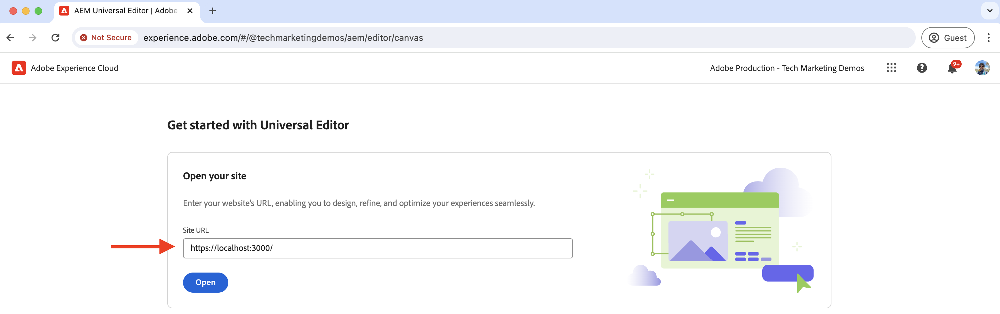
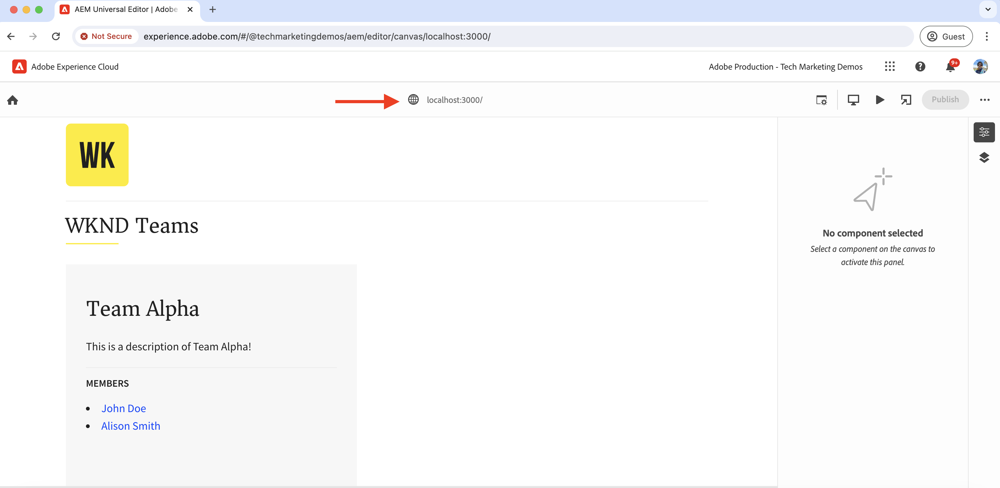

# Instelling voor lokale ontwikkeling

Leer hoe u een lokale ontwikkelomgeving instelt voor het bewerken van de inhoud van een React-app met de AEM Universal Editor.

## Vereisten

U hebt het volgende nodig om deze zelfstudie te volgen:

- Standaard HTML- en JavaScript-vaardigheden.
- De volgende gereedschappen moeten lokaal zijn geïnstalleerd:
   - [Node.js](https://nodejs.org/en/download/)
   - [Git](https://git-scm.com/downloads)
   - Een winde of coderedacteur, zoals [Visual Studio-code](https://code.visualstudio.com/)
- Download en installeer het volgende:
   - [AS A CLOUD SERVICE SDK AEM](https://experienceleague.adobe.com/en/docs/experience-manager-learn/cloud-service/local-development-environment-set-up/aem-runtime#download-the-aem-as-a-cloud-service-sdk): Het bevat de Quickstart Jar die wordt gebruikt om AEM auteur en Publish plaatselijk voor ontwikkelingsdoeleinden in werking te stellen.
   - [Universal Editor-service](https://experienceleague.adobe.com/en/docs/experience-cloud/software-distribution/home): Een lokale kopie van de Universal Editor-service heeft een subset met functies en kan worden gedownload van het portal Softwaredistributie.
   - [local-ssl-proxy](https://www.npmjs.com/package/local-ssl-proxy#local-ssl-proxy): Een eenvoudige lokale SSL HTTP-proxy die een zelfondertekend certificaat voor lokale ontwikkeling gebruikt. De AEM Universal Editor heeft de HTTPS-URL van de React-app nodig om deze in de editor te laden.

## Lokale instellingen

Voer de onderstaande stappen uit om de lokale ontwikkelomgeving in te stellen:

### AEM SDK

Installeer de volgende pakketten in de lokale AEM SDK om de inhoud voor de React-app van de WKND-teams op te geven.

- [WKND-teams - Inhoudspakket](./assets/basic-tutorial-solution.content.zip): Bevat de modellen van het Fragment van de Inhoud, de Fragmenten van de Inhoud, en voortgeduurde vragen van GraphQL.
- [WKND-teams - Configuratiepakket](./assets/basic-tutorial-solution.ui.config.zip): Bevat de configuraties Cos (Cross-Origin Resource Sharing) en Token Authentication Handler. CORS vergemakkelijkt niet-AEM Web-eigenschappen om op browser-gebaseerde cliënt-zijvraag aan AEM GraphQL APIs te maken en de Symbolische Handler van de Authentificatie wordt gebruikt om elk verzoek aan AEM voor authentiek te verklaren.

  

### Toepassingen Reageren

Voer de onderstaande stappen uit om de React-app voor WKND-teams in te stellen:

1. Klonen met [WKND-teams Reageren app](https://github.com/adobe/aem-guides-wknd-graphql/tree/solution/basic-tutorial) van de `basic-tutorial` oplossingsvertakking.

   ```bash
   $ git clone -b solution/basic-tutorial git@github.com:adobe/aem-guides-wknd-graphql.git
   ```

1. Ga naar de `basic-tutorial` en opent u deze in de code-editor.

   ```bash
   $ cd aem-guides-wknd-graphql/basic-tutorial
   $ code .
   ```

1. Installeer de afhankelijkheden en start de React-app.

   ```bash
   $ npm install
   $ npm start
   ```

1. Open de WKND Teams React-app in uw browser op [http://localhost:3000](http://localhost:3000). Het toont een lijst van teamleden en hun details. De inhoud voor de React-app wordt geleverd door de lokale AEM SDK met behulp van GraphQL API&#39;s (`/graphql/execute.json/my-project/all-teams`), die u kunt verifiëren met de netwerktab van de browser.

   

### Universal Editor-service

Als u de opdracht **lokaal** De Universal Editor-service voert u de volgende stappen uit:

1. Download de nieuwste versie van de Universal Editor-service via de [Software Distribution Portal](https://experience.adobe.com/downloads).

   

1. Het gedownloade zip-bestand extraheren en het `universal-editor-service.cjs` bestand naar nieuwe map met de naam `universal-editor-service`.

   ```bash
   $ unzip universal-editor-service-vproduction-<version>.zip
   $ mkdir universal-editor-service
   $ cp universal-editor-service.cjs universal-editor-service
   ```

1. Maken `.env` in het `universal-editor-service` en voeg de volgende omgevingsvariabelen toe:

   ```bash
   # The port on which the Universal Editor service runs
   EXPRESS_PORT=8000
   # Disable SSL verification
   NODE_TLS_REJECT_UNAUTHORIZED=0
   ```

1. Start de lokale Universal Editor-service.

   ```bash
   $ cd universal-editor-service
   $ node universal-editor-service.cjs
   ```

Het bovenstaande bevel begint de Universele dienst van de Redacteur op haven `8000` en u zou de volgende output moeten zien:

```bash
Either no private key or certificate was set. Starting as HTTP server
Universal Editor Service listening on port 8000 as HTTP Server
```

### Lokale SSL HTTP-proxy

De AEM Universal Editor vereist dat de React-app via HTTPS wordt aangeboden. Stel een lokale SSL HTTP-proxy in die een zelfondertekend certificaat gebruikt voor lokale ontwikkeling.

Voer de onderstaande stappen uit om de lokale SSL HTTP-proxy in te stellen en de AEM SDK en Universal Editor-service via HTTPS te bedienen:

1. Installeer de `local-ssl-proxy` globaal pakket maken.

   ```bash
   $ npm install -g local-ssl-proxy
   ```

1. Start twee instanties van de lokale SSL HTTP-proxy voor de volgende services:

   - Lokale SSL HTTP-proxy van SDK AEM op poort `8443`.
   - Universal Editor service lokale SSL HTTP-proxy op poort `8001`.

   ```bash
   # AEM SDK local SSL HTTP proxy on port 8443
   $ local-ssl-proxy --source 8443 --target 4502
   
   # Universal Editor service local SSL HTTP proxy on port 8001
   $ local-ssl-proxy --source 8001 --target 8000
   ```

### De React-app bijwerken voor het gebruik van HTTPS

Voer de onderstaande stappen uit om HTTPS voor de React-app voor WKND-teams in te schakelen:

1. De reactie stoppen door op `Ctrl + C` in de terminal.
1. Werk de `package.json` bestand om het `HTTPS=true` omgevingsvariabele in de `start` script.

   ```json
   "scripts": {
       "start": "HTTPS=true react-scripts start",
       ...
   }
   ```

1. Werk de `REACT_APP_HOST_URI` in de `.env.development` bestand voor gebruik van het HTTPS-protocol en de lokale SSL HTTP-proxypoort van de AEM SDK.

   ```bash
   REACT_APP_HOST_URI=https://localhost:8443
   ...
   ```

1. Werk de `../src/proxy/setupProxy.auth.basic.js` bestand voor gebruik van relaxed SSL-instellingen met `secure: false` -optie.

   ```javascript
   ...
   module.exports = function(app) {
   app.use(
       ['/content', '/graphql'],
       createProxyMiddleware({
       target: REACT_APP_HOST_URI,
       changeOrigin: true,
       secure: false, // Ignore SSL certificate errors
       // pass in credentials when developing against an Author environment
       auth: `${REACT_APP_BASIC_AUTH_USER}:${REACT_APP_BASIC_AUTH_PASS}`
       })
   );
   };
   ```

1. Start de React-app.

   ```bash
   $ npm start
   ```

## De installatie controleren

Nadat u de lokale ontwikkelomgeving hebt ingesteld met de bovenstaande stappen, controleren we de installatie.

### Lokale verificatie

Controleer of de volgende services lokaal via HTTPS worden uitgevoerd. Mogelijk moet u de beveiligingswaarschuwing in de browser voor het zelfondertekende certificaat accepteren:

1. WKND-teams Reageren app op [https://localhost:3000](https://localhost:3000)
1. SDK AEM ingeschakeld [https://localhost:8443](https://localhost:8443)
1. Universal Editor-service aan [https://localhost:8001](https://localhost:8001)

### WKND-teams laden Reageren app in Universal Editor

Laad de React-app voor de WKND-teams in de Universal Editor om de installatie te controleren:

1. Open de Universal Editor https://experience.adobe.com/#/aem/editor in uw browser. Meld u aan met uw Adobe ID als u hierom wordt gevraagd.

1. Voer de URL van de toepassing React app URL van de WKND-teams in in het invoerveld URL van de Universal Editor en klik op `Open`.

   

1. De WKND-teams reageren op het laden van de app in de Universal Editor **maar u kunt de inhoud nog niet bewerken**. U moet de React-app gebruiken om het bewerken van inhoud in te schakelen met de Universal Editor.

   


## Volgende stap

Leer hoe u [de React-app gebruiken om de inhoud te bewerken](./instrument-to-edit-content.md).
