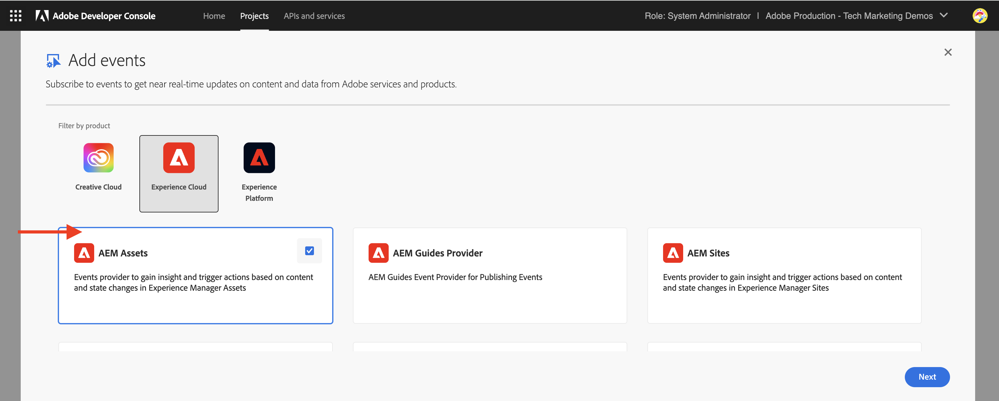
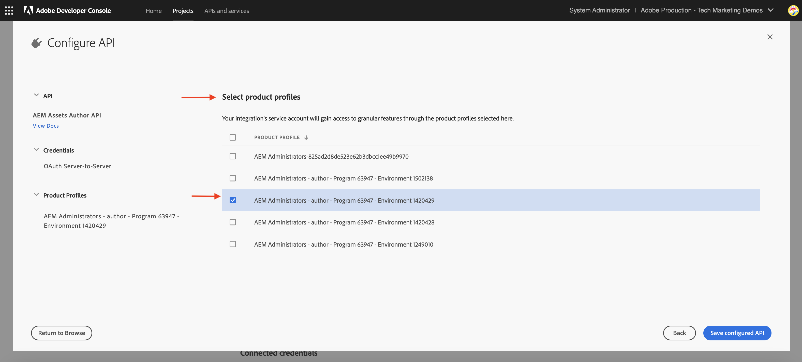

# AEM Assets-gebeurtenissen voor PIM-integratie

>[!IMPORTANT]
>
>Deze zelfstudie maakt gebruik van experimentele AEM as a Cloud Service API&#39;s. Om toegang te krijgen tot deze API&#39;s, moet u een pre-release softwareovereenkomst accepteren en deze API&#39;s handmatig voor uw omgeving laten inschakelen door Adobe engineering. Om toegang te verzoeken bereiken tot de steun van de Adobe.

Leer hoe te om AEM Assets met een derdesysteem, zoals een systeem van het Beheer van de Informatie van het Product (PIM) of van het Beheer van de Lijn van het Product (PLM) te integreren, om activa meta-gegevens **gebruikend inheemse gebeurtenissen AEM IO** bij te werken. Als u een AEM Assets-gebeurtenis ontvangt, kunnen de metagegevens van de elementen op basis van de zakelijke vereisten worden bijgewerkt in AEM, de PIM of beide systemen. In dit voorbeeld wordt echter getoond hoe de metagegevens van de elementen in AEM worden bijgewerkt.

>[!VIDEO](https://video.tv.adobe.com/v/3427592?quality=12&learn=on)

Om de update van activameta-gegevens **code buiten AEM** in werking te stellen, [ Adobe I/O Runtime ](https://developer.adobe.com/runtime/docs/guides/overview/what_is_runtime/), wordt een serverloos platform gebruikt.

De stroom voor gebeurtenisverwerking is als volgt:


1. De AEM dienst van de Auteur teweegbrengt een _Voltooide gebeurtenis van de Verwerking van Activa_ teweeg wanneer een activa uploadt wordt voltooid en alle activiteiten van de activaverwerking hebben voltooid. Wachten tot de verwerking is voltooid, zorgt ervoor dat alle verwerking buiten de verpakking, zoals het extraheren van metagegevens, is voltooid.
1. De gebeurtenis wordt verzonden naar de [ Adobe I/O Gebeurtenissen ](https://developer.adobe.com/events/) dienst.
1. De dienst van de Gebeurtenissen van Adobe I/O gaat de gebeurtenis tot de [ Actie van Adobe I/O Runtime ](https://developer.adobe.com/runtime/docs/guides/using/creating_actions/) voor verwerking over.
1. De actie van Adobe I/O Runtime roept API van het PIM systeem om extra meta-gegevens zoals SKU, leveranciersinformatie, of andere details terug te winnen.
1. De extra meta-gegevens die van PIM worden teruggewonnen worden dan bijgewerkt in AEM Assets gebruikend [ de Auteur API van Assets ](https://developer.adobe.com/experience-cloud/experience-manager-apis/api/experimental/assets/author/).

## Vereisten

U hebt het volgende nodig om deze zelfstudie te voltooien:

- Het milieu van AEM as a Cloud Service met [ toegelaten AEM Gebeurtenis ](https://developer.adobe.com/experience-cloud/experience-manager-apis/guides/events/#enable-aem-events-on-your-aem-cloud-service-environment). Ook, moet het steekproef ](https://github.com/adobe/aem-guides-wknd?#aem-wknd-sites-project) project van de Plaatsen WKND [ worden opgesteld aan het.

- Toegang tot [ Adobe Developer Console ](https://developer.adobe.com/developer-console/docs/guides/getting-started/).

- [ Adobe Developer CLI ](https://developer.adobe.com/runtime/docs/guides/tools/cli_install/) geïnstalleerd op uw lokale machine.

## Ontwikkelingsstappen

De ontwikkelingsstappen op hoog niveau zijn:

1. [Een project maken in de Adobe Developer Console (ADC)](./runtime-action.md#Create-project-in-Adobe-Developer-Console)
1. [Initialiseer het project voor lokale ontwikkeling](./runtime-action.md#initialize-project-for-local-development)
1. Vorm het project in ADC
1. Vorm de AEM dienst van de Auteur om ADC projectmededeling toe te laten
1. Een runtimeactie ontwikkelen die het ophalen en bijwerken van metagegevens ordent
1. Middelen uploaden naar de AEM Auteur-service en controleren of de metagegevens zijn bijgewerkt

Voor details op stappen 1-2, verwijs naar de [ Actie van Adobe I/O Runtime en AEM Gebeurtenissen ](./runtime-action.md#) voorbeeld, en voor stappen 3-6 verwijzen naar de volgende secties.

### Het project configureren in Adobe Developer Console (ADC)

Als u AEM Assets Events wilt ontvangen en de Adobe I/O Runtime-actie wilt uitvoeren die in de vorige stap is gemaakt, configureert u het project in ADC.

- In ADC, navigeer aan het [ project ](https://developer.adobe.com/console/projects). Selecteer de werkruimte van `Stage` . Hier is de runtime-actie geïmplementeerd.

- Klik **toevoegen de** knoop van de Dienst {en selecteren de **optie van de Gebeurtenis**. In **voeg Gebeurtenissen** dialoog toe, uitgezocht **Experience Cloud** > **AEM Assets**, en klik **daarna**. Volg extra configuratiestappen, uitgezochte instantie AEMCS, _Voltooide de Verwerking van Activa_ gebeurtenis, OAuth server-aan-Server authentificatietype, en andere details.

   toe

- Tot slot in **hoe te om gebeurtenissen** stap te ontvangen, breid **Runtime actie** optie uit en selecteer de _generische_ actie die in de vorige stap wordt gecreeerd. Klik **sparen gevormde gebeurtenissen**.

  

- Eveneens, klik **voeg de knoop van de Dienst** toe en selecteer de **API** optie. In **voeg API** modaal toe, selecteer **Experience Cloud** > **AEM as a Cloud Service API** en klik **daarna**.

  

- Dan selecteer **OAuth Server-aan-Server** voor authentificatietype en klik **daarna**.

- Dan selecteer het **AEM Beheerders-XXX** productprofiel en klik **sparen gevormde API**. Als u het desbetreffende element wilt bijwerken, moet het geselecteerde productprofiel zijn gekoppeld aan de AEM Assets-omgeving waaruit de gebeurtenis wordt geproduceerd en moet het voldoende toegang hebben om elementen in die omgeving bij te werken.

  

### Vorm AEM de dienst van de Auteur om ADC projectmededeling toe te laten

Om de activa meta-gegevens in AEM van het bovengenoemde project van ADC bij te werken, vorm AEM de dienst van de Auteur met cliënt identiteitskaart van het project ADC. _cliënt identiteitskaart_ wordt toegevoegd als milieuvariabele gebruikend [ Adobe Cloud Manager ](https://experienceleague.adobe.com/docs/experience-manager-cloud-service/content/implementing/using-cloud-manager/environment-variables.html#add-variables) UI.

- Login aan [ Adobe Cloud Manager ](https://my.cloudmanager.adobe.com/), uitgezochte **Programma** > **Milieu** > **Ellipse** > **Details van de Mening** > **Configuratie** tabel.

  

- Dan **voeg de knoop van de Configuratie** toe en ga de veranderlijke details als in

  | Naam | Waarde | AEM | Type |
  | ----------- | ----------- | ----------- | ----------- |
  | ADOBE_PROVIDED_CLIENT_ID | &lt;COPY_FROM_ADC_PROJECT_CREDENTIALS> | Auteur | Variabele |

  

- Klik **toevoegen** en **sparen** de configuratie.

### Handeling bij uitvoering ontwikkelen

Om de meta-gegevensherwinning en update uit te voeren, begin door de auto tot stand gebrachte _generische_ actiecode in `src/dx-excshell-1/actions/generic` omslag bij te werken.

Verwijs naar het in bijlage [ WKND-Assets-PIM-Integration.zip ](../assets/examples/assets-pim-integration/WKND-Assets-PIM-Integration.zip) dossier voor de volledige code, en onder sectie benadrukt de belangrijkste dossiers.

- In het bestand `src/dx-excshell-1/actions/generic/mockPIMCommunicator.js` wordt de aanroep van de PIM API bewogen om aanvullende metagegevens op te halen, zoals de SKU- en leveranciersnaam. Dit bestand wordt gebruikt voor demo-doeleinden. Zodra u de stroom van begin tot eind het werken hebt, vervang deze functie met een vraag aan uw echt PIM systeem om meta-gegevens voor de activa terug te winnen.

  ```javascript
  /**
   * Mock PIM API to get the product data such as SKU, Supplier, etc.
   *
   * In a real-world scenario, this function would call the PIM API to get the product data.
   * For this example, we are returning mock data.
   *
   * @param {string} assetId - The assetId to get the product data.
   */
  module.exports = {
      async getPIMData(assetId) {
          if (!assetId) {
          throw new Error('Invalid assetId');
          }
          // Mock response data for demo purposes
          const data = {
          SKUID: 'MockSKU 123',
          SupplierName: 'mock-supplier',
          // ... other product data
          };
          return data;
      },
  };
  ```

- Het `src/dx-excshell-1/actions/generic/aemCommunicator.js` dossier werkt de activa meta-gegevens in AEM gebruikend [ de Auteur API van Assets ](https://developer.adobe.com/experience-cloud/experience-manager-apis/api/experimental/assets/author/) bij.

  ```javascript
  const fetch = require('node-fetch');
  
  ...
  
  /**
  *  Get IMS Access Token using Client Credentials Flow
  *
  * @param {*} clientId - IMS Client ID from ADC project's OAuth Server-to-Server Integration
  * @param {*} clientSecret - IMS Client Secret from ADC project's OAuth Server-to-Server Integration
  * @param {*} scopes - IMS Meta Scopes from ADC project's OAuth Server-to-Server Integration as comma separated strings
  * @returns {string} - Returns the IMS Access Token
  */
  async function getIMSAccessToken(clientId, clientSecret, scopes) {
    const adobeIMSV3TokenEndpointURL = 'https://ims-na1.adobelogin.com/ims/token/v3';
  
    const options = {
      method: 'POST',
      headers: {
        'Content-Type': 'application/x-www-form-urlencoded',
      },
      body: `grant_type=client_credentials&client_id=${clientId}&client_secret=${clientSecret}&scope=${scopes}`,
    };
  
    const response = await fetch(adobeIMSV3TokenEndpointURL, options);
    const responseJSON = await response.json();
  
    return responseJSON.access_token;
  }    
  
  async function updateAEMAssetMetadata(metadataDetails, aemAssetEvent, params) {
    ...
    // Transform the metadata details to JSON Patch format,
    // see https://developer.adobe.com/experience-cloud/experience-manager-apis/api/experimental/assets/author/#operation/patchAssetMetadata
    const transformedMetadata = Object.keys(metadataDetails).map((key) => ({
      op: 'add',
      path: `wknd-${key.toLowerCase()}`,
      value: metadataDetails[key],
    }));
  
    ...
  
    // Get ADC project's OAuth Server-to-Server Integration credentials
    const clientId = params.ADC_CECREDENTIALS_CLIENTID;
    const clientSecret = params.ADC_CECREDENTIALS_CLIENTSECRET;
    const scopes = params.ADC_CECREDENTIALS_METASCOPES;
  
    // Get IMS Access Token using Client Credentials Flow
    const access_token = await getIMSAccessToken(clientId, clientSecret, scopes);
  
    // Call AEM Author service to update the metadata using Assets Author API
    // See https://developer.adobe.com/experience-cloud/experience-manager-apis/api/experimental/assets/author/
    const res = await fetch(`${aemAuthorHost}/adobe/assets/${assetId}/metadata`, {
      method: 'PATCH',
      headers: {
        'Content-Type': 'application/json-patch+json',
        'If-Match': '*',
        'X-Adobe-Accept-Experimental': '1',
        'X-Api-Key': 'aem-assets-management-api', // temporary value
        Authorization: `Bearer ${access_token}`,
      },
      body: JSON.stringify(transformedMetadata),
    });
  
    ...
  }
  
  module.exports = { updateAEMAssetMetadata };
  ```

  In het bestand `.env` worden de aanmeldingsgegevens van OAuth Server-to-Server van het ADC-project opgeslagen. Deze gegevens worden als parameters aan de actie doorgegeven met behulp van het `ext.config.yaml` -bestand. Verwijs naar de [ Dossiers van de Configuratie van App Builder ](https://developer.adobe.com/app-builder/docs/guides/configuration/) voor het beheren van geheimen en actieparameters.

- De map `src/dx-excshell-1/actions/model` bevat `aemAssetEvent.js` - en `errors.js` -bestanden, die door de handeling worden gebruikt om respectievelijk de ontvangen gebeurtenis te parseren en fouten af te handelen.

- In het bestand `src/dx-excshell-1/actions/generic/index.js` worden de eerder vermelde modules gebruikt om het ophalen en bijwerken van metagegevens te ordenen.

  ```javascript
  ...
  
  let responseMsg;
  // handle the challenge probe request, they are sent by I/O to verify the action is valid
  if (params.challenge) {
    logger.info('Challenge probe request detected');
    responseMsg = JSON.stringify({ challenge: params.challenge });
  } else {
    logger.info('AEM Asset Event request received');
  
    // create AEM Asset Event object from request parameters
    const aemAssetEvent = new AEMAssetEvent(params);
  
    // Call mock PIM API to get the product data such as SKU, Supplier, etc.
    const mockPIMData = await mockPIMAPI.getPIMData(
      aemAssetEvent.getAssetName(),
    );
    logger.info('Mock PIM API response', mockPIMData);
  
    // Update PIM received data in AEM as Asset metadata
    const aemUpdateStatus = await updateAEMAssetMetadata(
      mockPIMData,
      aemAssetEvent,
      params,
    );
    logger.info('AEM Asset metadata update status', aemUpdateStatus);
  
    if (aemUpdateStatus) {
      // create response message
      responseMsg = JSON.stringify({
        message:
          'AEM Asset Event processed successfully, updated the asset metadata with PIM data.',
        assetdata: {
          assetName: aemAssetEvent.getAssetName(),
          assetPath: aemAssetEvent.getAssetPath(),
          assetId: aemAssetEvent.getAssetId(),
          aemHost: aemAssetEvent.getAEMHost(),
          pimdata: mockPIMData,
        },
      });
    } 
  
    // response object
    const response = {
      statusCode: 200,
      body: responseMsg,
    };
  
    // Return the response to the caller
    return response;
  
    ...
  }
  ```

Voer de bijgewerkte handeling uit naar Adobe I/O Runtime met de volgende opdracht:

```bash
$ aio app deploy
```

### Uploaden van middelen en verificatie van metagegevens

Voer de volgende stappen uit om de integratie met AEM Assets en PIM te controleren:

- Om het modelPIM verstrekte meta-gegevens zoals SKU, en de Naam van de Leverancier te bekijken, creeer meta-gegevensschema in AEM Assets zie [ het schema van Meta-gegevens ](https://experienceleague.adobe.com/docs/experience-manager-learn/assets/configuring/metadata-schemas.html) dat SKU en de eigenschappen van de leveranciersnaam meta-gegevens toont.

- Upload een element in AEM Auteur-service en controleer de update van de metagegevens.

  

## Concept en toetsaanslagen

De synchronisatie van de metagegevens van bedrijfsmiddelen tussen AEM en andere systemen, zoals PIM, is vaak vereist in de onderneming. Met AEM Eventing kunnen dergelijke vereisten worden bereikt.

- De code voor het ophalen van metagegevens van elementen wordt buiten AEM uitgevoerd, waarbij het laden op AEM service Auteur wordt vermeden. Hierdoor wordt gebeurtenisgestuurde architectuur die onafhankelijk van elkaar wordt geschaald, geschaald.
- De nieuwe Assets-auteur-API wordt gebruikt om de metagegevens van de elementen in AEM bij te werken.
- De API authentificatie gebruikt server-aan-server OAuth (de stroom van de cliëntgeloofsbrieven van de alias), zie [ Server-aan-Server de gids van de credentieimplementatie ](https://developer.adobe.com/developer-console/docs/guides/authentication/ServerToServerAuthentication/implementation/).
- In plaats van Adobe I/O Runtime-handelingen kunnen andere websites of Amazon EventBridge worden gebruikt om de AEM Assets-gebeurtenis te ontvangen en de update van de metagegevens te verwerken.
- Asset Events via AEM Event stellen bedrijven in staat om kritieke processen te automatiseren en te stroomlijnen, waardoor de efficiëntie en de coherentie tussen het ecosysteem van de inhoud worden bevorderd.
