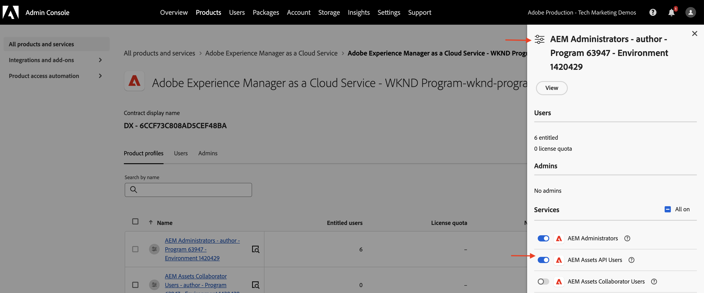

# AEM Assets-gebeurtenissen voor PIM-integratie

>[!IMPORTANT]
>
>Deze zelfstudie gebruikt op OpenAPI gebaseerde AEM API&#39;s. Zij zijn beschikbaar als deel van een vroege toegangsprogramma, als u in de toegang tot van hen geinteresseerd bent, moedigen wij u aan om [ aem-apis@adobe.com ](mailto:aem-apis@adobe.com) met een beschrijving van uw gebruiksgeval te e-mailen.

Leer hoe u een AEM gebeurtenis ontvangt en erop reageert om de status van de inhoud bij te werken in AEM met de Assets-auteur-API van OpenAPI.

Hoe te om de ontvangen gebeurtenis te verwerken hangt van de bedrijfsvereisten af. De gebeurtenisgegevens kunnen bijvoorbeeld worden gebruikt om het systeem van derden bij te werken, of AEM, of beide.

In dit voorbeeld wordt getoond hoe een systeem van derden, zoals een PIM-systeem (Product Information Management), kan worden geïntegreerd met AEM as a Cloud Service Assets. Als een AEM Assets-gebeurtenis wordt ontvangen, worden aanvullende metagegevens opgehaald van het PIM-systeem en worden de metagegevens van de elementen in AEM bijgewerkt. De bijgewerkte metagegevens voor elementen kunnen aanvullende informatie bevatten, zoals de SKU, de naam van de leverancier of andere productgegevens.

Om de gebeurtenis van AEM Assets te ontvangen en te verwerken, [ Adobe I/O Runtime ](https://developer.adobe.com/runtime/docs/guides/overview/what_is_runtime/), wordt een serverloos platform gebruikt. U kunt echter ook andere systemen voor gebeurtenisverwerking gebruiken, zoals Webhaak in uw systeem van derden of Amazon EventBridge.

De integratiestroom op hoog niveau is als volgt:


1. De AEM dienst van de Auteur teweegbrengt een _Voltooide gebeurtenis van de Verwerking van Activa_ teweeg wanneer een activa uploadt wordt voltooid en alle activiteiten van de activaverwerking ook worden voltooid. Het wachten op de voltooiing van de verwerking van activa zorgt ervoor dat om het even welke uit-van-de-doosverwerking, zoals meta-gegevensextractie, is voltooid.
1. De gebeurtenis wordt verzonden naar de [ Adobe I/O Gebeurtenissen ](https://developer.adobe.com/events/) dienst.
1. De dienst van de Gebeurtenissen van Adobe I/O gaat de gebeurtenis tot de [ Actie van Adobe I/O Runtime ](https://developer.adobe.com/runtime/docs/guides/using/creating_actions/) voor verwerking over.
1. De actie van Adobe I/O Runtime roept API van het PIM systeem om extra meta-gegevens zoals SKU, leveranciersinformatie, of andere details terug te winnen.
1. De extra meta-gegevens die van PIM worden teruggewonnen worden dan bijgewerkt in AEM Assets gebruikend op OpenAPI-Gebaseerde [ de Auteur API van Assets ](https://developer.adobe.com/experience-cloud/experience-manager-apis/api/experimental/assets/author/).

## Vereisten

U hebt het volgende nodig om deze zelfstudie te voltooien:

- Het milieu van AEM as a Cloud Service met [ toegelaten AEM Gebeurtenis ](https://developer.adobe.com/experience-cloud/experience-manager-apis/guides/events/#enable-aem-events-on-your-aem-cloud-service-environment). Ook, moet het steekproef ](https://github.com/adobe/aem-guides-wknd?#aem-wknd-sites-project) project van de Plaatsen WKND [ worden opgesteld aan het.

- Toegang tot [ Adobe Developer Console ](https://developer.adobe.com/developer-console/docs/guides/getting-started/).

- [ Adobe Developer CLI ](https://developer.adobe.com/runtime/docs/guides/tools/cli_install/) geïnstalleerd op uw lokale machine.

## Ontwikkelingsstappen

De ontwikkelingsstappen op hoog niveau zijn:

1. [ Modernisering van het milieu van AEM as a Cloud Service ](https://experienceleague.adobe.com/en/docs/experience-manager-learn/cloud-service/aem-apis/invoke-openapi-based-aem-apis#modernization-of-aem-as-a-cloud-service-environment)
1. [ laat AEM APIs toegang ](https://experienceleague.adobe.com/en/docs/experience-manager-learn/cloud-service/aem-apis/invoke-openapi-based-aem-apis#enable-aem-apis-access) toe
1. [Een project maken in de Adobe Developer Console (ADC)](./runtime-action.md#Create-project-in-Adobe-Developer-Console)
1. [Initialiseer het project voor lokale ontwikkeling](./runtime-action.md#initialize-project-for-local-development)
1. Vorm het project in ADC
1. Vorm de AEM dienst van de Auteur om ADC projectmededeling toe te laten
1. Een runtimeactie ontwikkelen om te ordenen
   1. metagegevens ophalen uit het PIM-systeem
   1. update van metagegevens in AEM Assets met de Assets Author API
1. Metagegevensschema voor elementen maken en toepassen
1. Verificatie van het uploaden van elementen en update van metagegevens

Voor details op stappen 1-2, verwijs naar [ Invoke OpenAPI-Gebaseerde AEM ](https://experienceleague.adobe.com/en/docs/experience-manager-learn/cloud-service/aem-apis/invoke-openapi-based-aem-apis) gids en voor stappen 3-4 verwijzen naar de [ Actie van Adobe I/O Runtime en AEM Gebeurtenissen ](./runtime-action.md#) voorbeeld. Raadpleeg de volgende secties voor stappen 5-9.

### Het project configureren in Adobe Developer Console (ADC)

Als u AEM Assets Events wilt ontvangen en de Adobe I/O Runtime-actie wilt uitvoeren die in de vorige stap is gemaakt, configureert u het project in ADC.

- In ADC, navigeer aan het [ project ](https://developer.adobe.com/console/projects) dat u in stap-3 creeerde. Selecteer in dat project de `Stage` -werkruimte waar de runtimeactie wordt uitgevoerd wanneer u `aio app deploy` uitvoert als onderdeel van de instructies voor stap 4.

- Klik **toevoegen de** knoop van de Dienst {en selecteren de **optie van de Gebeurtenis**. In **voeg Gebeurtenissen** dialoog toe, uitgezocht **Experience Cloud** > **AEM Assets**, en klik **daarna**.
   toe

- In **vorm gebeurtenisregistratie** stap, selecteer de gewenste instantie AEMCS, toen _Voltooide gebeurtenis van de Verwerking van Activa_, en het Server-aan-Server authentificatietype OAuth.

  

- Tot slot in **hoe te om gebeurtenissen** stap te ontvangen, breid de **Runtime actie** optie uit en selecteer de _generische_ actie die in de vorige stap wordt gecreeerd. Klik **sparen gevormde gebeurtenissen**.

  

- Eveneens, klik **voeg de knoop van de Dienst** toe en selecteer de **API** optie. In **voeg API** modaal toe API, selecteer **Experience Cloud** > **Auteur API van AEM Assets** en klik **daarna**.

  

- Dan selecteer **OAuth Server-aan-Server** voor authentificatietype en klik **daarna**.

- Dan selecteer het correcte **Profiel van het Product** dat met het milieu van AEM Assets wordt geassocieerd waarvan de gebeurtenis wordt geproduceerd en voldoende toegang hebben om activa daar bij te werken. Tot slot klik **sparen gevormde API** knoop.

  

  In mijn geval wordt het _AEM Beheerders - auteur - Programma XXX - Milieu YYY_ productprofiel geselecteerd, heeft het **toegelaten de dienst van de Gebruikers van AEM Assets API**.

  

## AEM instantie configureren om ADC-projectcommunicatie in te schakelen

Om OAuth server-aan-Server van het Project van ADC toe te laten credential ClientID aan communicatie met de AEM instantie, moet u de AEM instantie vormen.

Hiervoor definieert u de configuratie in het `config.yaml` -bestand in het AEM Project. Implementeer vervolgens het `config.yaml` -bestand met behulp van de Config Pipeline in de Cloud Manager.

- Zoek in AEM Project het `config.yaml` -bestand in de map `config` of maak dit.

  

- Voeg de volgende configuratie toe aan het `config.yaml` dossier.

  ```yaml
  kind: "API"
  version: "1.0"
  metadata: 
      envTypes: ["dev", "stage", "prod"]
  data:
      allowedClientIDs:
          author:
          - "<ADC Project's OAuth Server-to-Server credential ClientID>"
  ```

  Vervang `<ADC Project's OAuth Server-to-Server credential ClientID>` door werkelijke ClientID van de OAuth Server-to-Server referentie van het ADC-project.

- Leg de configuratiewijzigingen vast in de Git-opslagplaats en duw op de wijzigingen in de externe opslagplaats.

- Implementeer de bovenstaande wijzigingen met behulp van de configuratiegids in de Cloud Manager. Het `config.yaml` -bestand kan ook worden geïnstalleerd in een RDE met behulp van opdrachtregelprogramma&#39;s.

   op

### Handeling bij uitvoering ontwikkelen

Om de meta-gegevensherwinning en update uit te voeren, begin door de auto tot stand gebrachte _generische_ actiecode in `src/dx-excshell-1/actions/generic` omslag bij te werken.

Verwijs naar het in bijlage [ WKND-Assets-PIM-Integration.zip ](../assets/examples/assets-pim-integration/WKND-Assets-PIM-Integration.zip) dossier voor de volledige code, en de hieronder sectie benadrukt de belangrijkste dossiers.

- In het bestand `src/dx-excshell-1/actions/generic/mockPIMCommunicator.js` wordt de aanroep van de PIM API bewogen om aanvullende metagegevens op te halen, zoals de SKU- en leveranciersnaam. Dit bestand wordt gebruikt voor demo-doeleinden. Zodra u de stroom van begin tot eind het werken hebt, vervang deze functie met een vraag aan uw echt PIM systeem om meta-gegevens voor de activa terug te winnen.

  ```javascript
  /**
   * Mock PIM API to get the product data such as SKU, Supplier, etc.
   *
   * In a real-world scenario, this function would call the PIM API to get the product data.
   * For this example, we are returning mock data.
   *
   * @param {string} assetId - The assetId to get the product data.
   */
  module.exports = {
      async getPIMData(assetId) {
          if (!assetId) {
          throw new Error('Invalid assetId');
          }
          // Mock response data for demo purposes
          const data = {
          SKUID: 'MockSKU 123',
          SupplierName: 'mock-supplier',
          // ... other product data
          };
          return data;
      },
  };
  ```

- Het `src/dx-excshell-1/actions/generic/aemCommunicator.js` dossier werkt de activa meta-gegevens in AEM gebruikend [ de Auteur API van Assets ](https://developer.adobe.com/experience-cloud/experience-manager-apis/api/experimental/assets/author/) bij.

  ```javascript
  const fetch = require('node-fetch');
  ...
  /**
  *  Get IMS Access Token using Client Credentials Flow
  *
  * @param {*} clientId - IMS Client ID from ADC project's OAuth Server-to-Server Integration
  * @param {*} clientSecret - IMS Client Secret from ADC project's OAuth Server-to-Server Integration
  * @param {*} scopes - IMS Meta Scopes from ADC project's OAuth Server-to-Server Integration as comma separated strings
  * @returns {string} - Returns the IMS Access Token
  */
  async function getIMSAccessToken(clientId, clientSecret, scopes) {
    const adobeIMSV3TokenEndpointURL = 'https://ims-na1.adobelogin.com/ims/token/v3';
    const options = {
      method: 'POST',
      headers: {
        'Content-Type': 'application/x-www-form-urlencoded',
      },
      body: `grant_type=client_credentials&client_id=${clientId}&client_secret=${clientSecret}&scope=${scopes}`,
    };
    const response = await fetch(adobeIMSV3TokenEndpointURL, options);
    const responseJSON = await response.json();
    return responseJSON.access_token;
  }    
  async function updateAEMAssetMetadata(metadataDetails, aemAssetEvent, params) {
    ...
    // Transform the metadata details to JSON Patch format,
    // see https://developer.adobe.com/experience-cloud/experience-manager-apis/api/experimental/assets/author/#operation/patchAssetMetadata
    const transformedMetadata = Object.keys(metadataDetails).map((key) => ({
      op: 'add',
      path: `wknd-${key.toLowerCase()}`,
      value: metadataDetails[key],
    }));
    ...
    // Get ADC project's OAuth Server-to-Server Integration credentials
    const clientId = params.ADC_CECREDENTIALS_CLIENTID;
    const clientSecret = params.ADC_CECREDENTIALS_CLIENTSECRET;
    const scopes = params.ADC_CECREDENTIALS_METASCOPES;
    // Get IMS Access Token using Client Credentials Flow
    const access_token = await getIMSAccessToken(clientId, clientSecret, scopes);
    // Call AEM Author service to update the metadata using Assets Author API
    // See https://developer.adobe.com/experience-cloud/experience-manager-apis/api/experimental/assets/author/
    const res = await fetch(`${aemAuthorHost}/adobe/assets/${assetId}/metadata`, {
      method: 'PATCH',
      headers: {
        'Content-Type': 'application/json-patch+json',
        'If-Match': '*',
        'X-Adobe-Accept-Experimental': '1',
        'X-Api-Key': 'aem-assets-management-api', // temporary value
        Authorization: `Bearer ${access_token}`,
      },
      body: JSON.stringify(transformedMetadata),
    });
    ...
  }
  module.exports = { updateAEMAssetMetadata };
  ```

  In het bestand `.env` worden de aanmeldingsgegevens van OAuth Server-to-Server van het ADC-project opgeslagen. Deze gegevens worden als parameters aan de actie doorgegeven met behulp van het `ext.config.yaml` -bestand. Verwijs naar de [ Dossiers van de Configuratie van App Builder ](https://developer.adobe.com/app-builder/docs/guides/configuration/) voor het beheren van geheimen en actieparameters.
- De map `src/dx-excshell-1/actions/model` bevat `aemAssetEvent.js` - en `errors.js` -bestanden, die door de handeling worden gebruikt om respectievelijk de ontvangen gebeurtenis te parseren en fouten af te handelen.
- In het bestand `src/dx-excshell-1/actions/generic/index.js` worden de bovenstaande modules gebruikt om het ophalen en bijwerken van metagegevens te ordenen.

  ```javascript
  ...
  let responseMsg;
  // handle the challenge probe request, they are sent by I/O to verify the action is valid
  if (params.challenge) {
    logger.info('Challenge probe request detected');
    responseMsg = JSON.stringify({ challenge: params.challenge });
  } else {
    logger.info('AEM Asset Event request received');
    // create AEM Asset Event object from request parameters
    const aemAssetEvent = new AEMAssetEvent(params);
    // Call mock PIM API to get the product data such as SKU, Supplier, etc.
    const mockPIMData = await mockPIMAPI.getPIMData(
      aemAssetEvent.getAssetName(),
    );
    logger.info('Mock PIM API response', mockPIMData);
    // Update PIM received data in AEM as Asset metadata
    const aemUpdateStatus = await updateAEMAssetMetadata(
      mockPIMData,
      aemAssetEvent,
      params,
    );
    logger.info('AEM Asset metadata update status', aemUpdateStatus);
    if (aemUpdateStatus) {
      // create response message
      responseMsg = JSON.stringify({
        message:
          'AEM Asset Event processed successfully, updated the asset metadata with PIM data.',
        assetdata: {
          assetName: aemAssetEvent.getAssetName(),
          assetPath: aemAssetEvent.getAssetPath(),
          assetId: aemAssetEvent.getAssetId(),
          aemHost: aemAssetEvent.getAEMHost(),
          pimdata: mockPIMData,
        },
      });
    } 
    // response object
    const response = {
      statusCode: 200,
      body: responseMsg,
    };
    // Return the response to the caller
    return response;
    ...
  }
  ```

- Voer de bijgewerkte handeling uit naar Adobe I/O Runtime met de volgende opdracht:

  ```bash
  $ aio app deploy
  ```

### Metagegevensschema voor elementen maken en toepassen

Door gebrek, heeft het project van Plaatsen WKND niet het schema van activa meta-gegevens om de specifieke meta-gegevens PIM zoals SKU, de Naam van de Leverancier, enz. te tonen. Laten we het metagegevensschema voor elementen maken en toepassen op een elementenmap in de AEM-instantie.

1. Login aan de instantie van Activa van AEM as a Cloud Service en is in de [ mening van Activa ](https://experienceleague.adobe.com/en/docs/experience-manager-learn/assets/authoring/switch-views).

   

1. Navigeer aan de **Montages** > **optie van Forms van Meta-gegevens** van het linkerspoor en klik **creeer** knoop. In **creeer de dialoog van de Vorm van Meta-gegevens**, ga de volgende details in en klik **creeer**.
   - Naam: `PIM`
   - Bestaande formulierstructuur als sjabloon gebruiken: `Check`
   - Kiezen uit: `default`

   

1. Klik het **+** pictogram om een nieuw **PIM** lusje toe te voegen en **Enige Tekst van de Lijn** componenten aan het toe te voegen.

    toe

   In de volgende tabel staan de eigenschappen van de metagegevens en de bijbehorende velden.

   | Label | Plaatsaanduiding | Eigenschap Metadata |
   | --- | --- | --- |
   | SKU | Automatisch gevuld via AEM integratie Eventing | `wknd-skuid` |
   | Naam leverancier | Automatisch gevuld via AEM integratie Eventing | `wknd-suppliername` |

1. Klik **sparen** en **dicht** om de meta-gegevensvorm te bewaren.

1. Tot slot pas het **PIM** meta-gegevensschema op de **PIM** omslag toe.

    toe

Met de bovengenoemde stappen, zijn de activa van de **omslag Adventures** klaar om de PIM specifieke meta-gegevens zoals SKU, de Naam van de Leverancier, enz. te tonen.

### Uploaden van middelen en verificatie van metagegevens

Om de integratie van AEM Assets en PIM te verifiëren, upload activa aan de **omslag van Adventures** in AEM Assets. Op het tabblad PIM in de pagina met elementdetails moeten de metagegevens voor SKU en Naam leverancier worden weergegeven.


## Concept en toetsaanslagen

De synchronisatie van de metagegevens van bedrijfsmiddelen tussen AEM en andere systemen, zoals PIM, is vaak vereist in de onderneming. Met AEM Eventing kunnen dergelijke vereisten worden bereikt.

- De code voor het ophalen van metagegevens van elementen wordt buiten AEM uitgevoerd, waarbij het laden op de AEM Auteur-service wordt vermeden. Dit is dus een gebeurtenisgestuurde architectuur die onafhankelijk van elkaar wordt geschaald.
- De nieuwe Assets-auteur-API wordt gebruikt om de metagegevens van de elementen in AEM bij te werken.
- De API authentificatie gebruikt server-aan-server OAuth (de stroom van de cliëntgeloofsbrieven van de alias), zie [ Server-aan-Server de gids van de credentieimplementatie ](https://developer.adobe.com/developer-console/docs/guides/authentication/ServerToServerAuthentication/implementation/).
- In plaats van Adobe I/O Runtime-handelingen kunnen andere websites of Amazon EventBridge worden gebruikt om de AEM Assets-gebeurtenis te ontvangen en de update van de metagegevens te verwerken.
- Asset Events via AEM Event stellen bedrijven in staat om kritieke processen te automatiseren en te stroomlijnen, waardoor de efficiëntie en de samenhang in het ecosysteem van de inhoud worden bevorderd.
