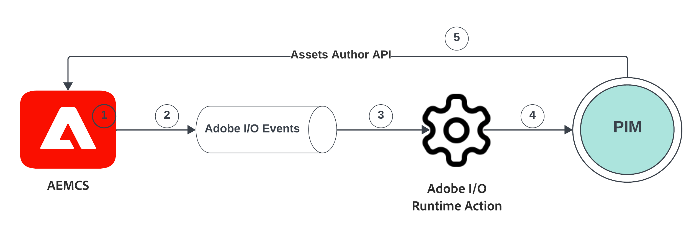

# AEM Assets-gebeurtenissen voor PIM-integratie

Leer hoe u AEM Assets en het PIM-systeem (Product Information Management) kunt integreren om metagegevens van bedrijfsmiddelen bij te werken **AEM Event gebruiken**. Na ontvangst van een AEM Assets-gebeurtenis kunnen de metagegevens van de elementen op basis van de zakelijke vereisten worden bijgewerkt in AEM, PIM of beide systemen. In dit voorbeeld werken we de metagegevens van de elementen echter bij in AEM.

De update voor metagegevens van elementen uitvoeren **code buiten AEM** de [Adobe I/O Runtime](https://developer.adobe.com/runtime/docs/guides/overview/what_is_runtime/) er wordt een serverloos platform gebruikt. De stroom voor gebeurtenisverwerking is als volgt:



1. De AEM-auteur activeert een _Middelverwerking voltooid_ gebeurtenis wanneer het uploaden van middelen is voltooid.
1. De gebeurtenis wordt verzonden naar de [Adobe I/O Events](https://developer.adobe.com/events/) service.
1. De dienst van de Gebeurtenissen van de Adobe I/O gaat de gebeurtenis tot over [Adobe I/O Runtime-actie](https://developer.adobe.com/runtime/docs/guides/using/creating_actions/) voor verwerking.
1. De Adobe I/O Runtime-actie roept de vergrendelde PIM-API aan om aanvullende metagegevens op te halen, zoals SKU, leveranciersinformatie.
1. De opgehaalde PIM aanvullende metagegevens worden vervolgens in AEM Assets bijgewerkt met behulp van de [API voor middelenauteur](https://developer.adobe.com/experience-cloud/experience-manager-apis/api/experimental/assets/author/).

## Vereisten

U hebt het volgende nodig om deze zelfstudie te voltooien:

- as a Cloud Service omgeving AEM met [AEM Event ingeschakeld](https://developer.adobe.com/experience-cloud/experience-manager-apis/guides/events/#enable-aem-events-on-your-aem-cloud-service-environment). Ook het voorbeeld [WKND-sites](https://github.com/adobe/aem-guides-wknd?#aem-wknd-sites-project) het project moet worden uitgevoerd .

- Toegang tot [Adobe Developer Console](https://developer.adobe.com/developer-console/docs/guides/getting-started/).

- [ADOBE DEVELOPER CLI](https://developer.adobe.com/runtime/docs/guides/tools/cli_install/) op uw lokale computer is geïnstalleerd.

## Ontwikkelingsstappen

De ontwikkelingsstappen op hoog niveau zijn:

1. [Project maken in Adobe Developer Console (ADC)](./runtime-action.md#Create-project-in-Adobe-Developer-Console)
1. [Project initialiseren voor lokale ontwikkeling](./runtime-action.md#initialize-project-for-local-development)
1. Project configureren in ADC
1. Vorm AEM de dienst van de Auteur om ADC projectmededeling toe te laten
1. Voer runtimeactie uit om het ophalen en bijwerken van metagegevens te ordenen
1. Middelen uploaden in AEM Auteur-service en bijwerken van metagegevens controleren

Raadpleeg voor gedetailleerde stappen bij 1-2 [Adobe I/O Runtime Action and AEM Events](./runtime-action.md#) en 3-6 verwijs bijvoorbeeld naar de volgende secties.

### Project configureren in Adobe Developer Console (ADC)

Als u AEM Assets Events wilt ontvangen en de Adobe I/O Runtime-actie wilt uitvoeren die in de vorige stap is gemaakt, configureert u het project in ADC.

- Ga in ADC naar de [project](https://developer.adobe.com/console/projects). Selecteer de `Stage` werkruimte, dit is waar de runtime actie werd opgesteld.

- Klikken **Service toevoegen** en selecteert u **Gebeurtenis** -optie. In de **Gebeurtenissen toevoegen** dialoogvenster, selecteren **Experience Cloud** > **AEM Assets** en klik op **Volgende**. Voer aanvullende configuratiestappen uit en selecteer AEMCS-instantie. _Middelverwerking voltooid_ gebeurtenis, OAuth Server-aan-Server authentificatietype, en andere details.

  

- Tot slot, in het **Hoe kan ik gebeurtenissen ontvangen** stap, uitbreiden **Runtime, actie** en selecteert u de _algemeen_ handeling die in de vorige stap is gemaakt. Klikken **geconfigureerde gebeurtenissen opslaan**.

  

- Klik op **Service toevoegen** en selecteert u **API** -optie. In de **Een API toevoegen** modal, selecteer **Experience Cloud** > **AS A CLOUD SERVICE API AEM** en klik op **Volgende**.

  

- Selecteer vervolgens **OAuth Server-to-Server** voor verificatietype en klik op **Volgende**.

- Selecteer vervolgens de optie **Beheerders AEM-XXX** productprofiel en klik op **geconfigureerde API opslaan**. Om toegang te krijgen tot korrelfuncties en machtigingen, moet het geselecteerde productprofiel worden gekoppeld aan de AEM Assets-gebeurtenis die AEMCS-omgeving produceert.

  

### Vorm AEM de dienst van de Auteur om ADC projectmededeling toe te laten

Om de activa meta-gegevens in AEM van het bovengenoemde project van ADC bij te werken, vorm AEM de dienst van de Auteur met cliënt identiteitskaart van het project ADC. De _client-id_ wordt toegevoegd als omgevingsvariabele met behulp van [Adobe Cloud Manager](https://experienceleague.adobe.com/docs/experience-manager-cloud-service/content/implementing/using-cloud-manager/environment-variables.html#add-variables) UI.

- Aanmelden bij [Adobe Cloud Manager](https://my.cloudmanager.adobe.com/), selecteert u **Programma** > **Omgeving** > **Weglatingsteken** > **Details weergeven** > **Configuratie** tab.

  

- Vervolgens **Configuratie toevoegen** en voert u de variabeledetails in als

  | Naam | Waarde | AEM | Type |
  | ----------- | ----------- | ----------- | ----------- |
  | ADOBE_PROVIDED_CLIENT_ID | &lt;COPY_FROM_ADC_PROJECT_CREDENTIALS> | Auteur | Variabele |

  

- Klikken **Toevoegen** en **Opslaan** de configuratie.

### Handeling bij uitvoering ontwikkelen

Als u de metagegevens wilt ophalen en bijwerken, begint u met het bijwerken van de automatisch gemaakte _algemeen_ actiecode in `src/dx-excshell-1/actions/generic` map.

Raadpleeg het bestand WKND-Assets-PIM-Integration.zip in de bijlage voor de volledige code en in de onderstaande sectie worden de belangrijkste bestanden gemarkeerd.

- De `src/dx-excshell-1/actions/generic/mockPIMCommunicator.js` het dossier controleert de vraag PIM API om extra meta-gegevens zoals SKU en leveranciersnaam terug te winnen.

  ```javascript
  /**
   * Mock PIM API to get the product data such as SKU, Supplier, etc.
   *
   * In a real-world scenario, this function would call the PIM API to get the product data.
   * For this example, we are returning mock data.
   *
   * @param {string} assetId - The assetId to get the product data.
   */
  module.exports = {
      async getPIMData(assetId) {
          if (!assetId) {
          throw new Error('Invalid assetId');
          }
          // Mock response data for demo purposes
          const data = {
          SKUID: 'MockSKU 123',
          SupplierName: 'mock-supplier',
          // ... other product data
          };
          return data;
      },
  };
  ```

- De `src/dx-excshell-1/actions/generic/aemCommunicator.js` het bestand werkt de metagegevens van het element bij in AEM met behulp van de [API voor middelenauteur](https://developer.adobe.com/experience-cloud/experience-manager-apis/api/experimental/assets/author/).

  ```javascript
  const fetch = require('node-fetch');
  
  ...
  
  /**
  *  Get IMS Access Token using Client Credentials Flow
  *
  * @param {*} clientId - IMS Client ID from ADC project's OAuth Server-to-Server Integration
  * @param {*} clientSecret - IMS Client Secret from ADC project's OAuth Server-to-Server Integration
  * @param {*} scopes - IMS Meta Scopes from ADC project's OAuth Server-to-Server Integration as comma separated strings
  * @returns {string} - Returns the IMS Access Token
  */
  async function getIMSAccessToken(clientId, clientSecret, scopes) {
    const adobeIMSV3TokenEndpointURL = 'https://ims-na1.adobelogin.com/ims/token/v3';
  
    const options = {
      method: 'POST',
      headers: {
        'Content-Type': 'application/x-www-form-urlencoded',
      },
      body: `grant_type=client_credentials&client_id=${clientId}&client_secret=${clientSecret}&scope=${scopes}`,
    };
  
    const response = await fetch(adobeIMSV3TokenEndpointURL, options);
    const responseJSON = await response.json();
  
    return responseJSON.access_token;
  }    
  
  async function updateAEMAssetMetadata(metadataDetails, aemAssetEvent, params) {
    ...
    // Transform the metadata details to JSON Patch format,
    // see https://developer.adobe.com/experience-cloud/experience-manager-apis/api/experimental/assets/author/#operation/patchAssetMetadata
    const transformedMetadata = Object.keys(metadataDetails).map((key) => ({
      op: 'add',
      path: `wknd-${key.toLowerCase()}`,
      value: metadataDetails[key],
    }));
  
    ...
  
    // Get ADC project's OAuth Server-to-Server Integration credentials
    const clientId = params.ADC_CECREDENTIALS_CLIENTID;
    const clientSecret = params.ADC_CECREDENTIALS_CLIENTSECRET;
    const scopes = params.ADC_CECREDENTIALS_METASCOPES;
  
    // Get IMS Access Token using Client Credentials Flow
    const access_token = await getIMSAccessToken(clientId, clientSecret, scopes);
  
    // Call AEM Author service to update the metadata using Assets Author API
    // See https://developer.adobe.com/experience-cloud/experience-manager-apis/api/experimental/assets/author/
    const res = await fetch(`${aemAuthorHost}/adobe/assets/${assetId}/metadata`, {
      method: 'PATCH',
      headers: {
        'Content-Type': 'application/json-patch+json',
        'If-Match': '*',
        'X-Adobe-Accept-Experimental': '1',
        'X-Api-Key': 'aem-assets-management-api', // temporary value
        Authorization: `Bearer ${access_token}`,
      },
      body: JSON.stringify(transformedMetadata),
    });
  
    ...
  }
  
  module.exports = { updateAEMAssetMetadata };
  ```

  De `.env` het dossier slaat de Server-aan-Server van het ADC-project geloofsbrieven details op, en zij worden overgegaan als parameters tot de actie gebruikend `ext.config.yaml` bestand. Zie de [Configuratiebestanden van App Builder](https://developer.adobe.com/app-builder/docs/guides/configuration/) voor het beheren van geheimen en actieparameters.

- De `src/dx-excshell-1/actions/model` map bevat `aemAssetEvent.js` en `errors.js` bestanden, die door de handeling worden gebruikt om respectievelijk de ontvangen gebeurtenis te parseren en fouten te verwerken.

- De `src/dx-excshell-1/actions/generic/index.js` in het bestand worden de bovenstaande modules gebruikt voor het inwinnen en bijwerken van metagegevens.

  ```javascript
  ...
  
  let responseMsg;
  // handle the challenge probe request, they are sent by I/O to verify the action is valid
  if (params.challenge) {
    logger.info('Challenge probe request detected');
    responseMsg = JSON.stringify({ challenge: params.challenge });
  } else {
    logger.info('AEM Asset Event request received');
  
    // create AEM Asset Event object from request parameters
    const aemAssetEvent = new AEMAssetEvent(params);
  
    // Call mock PIM API to get the product data such as SKU, Supplier, etc.
    const mockPIMData = await mockPIMAPI.getPIMData(
      aemAssetEvent.getAssetName(),
    );
    logger.info('Mock PIM API response', mockPIMData);
  
    // Update PIM received data in AEM as Asset metadata
    const aemUpdateStatus = await updateAEMAssetMetadata(
      mockPIMData,
      aemAssetEvent,
      params,
    );
    logger.info('AEM Asset metadata update status', aemUpdateStatus);
  
    if (aemUpdateStatus) {
      // create response message
      responseMsg = JSON.stringify({
        message:
          'AEM Asset Event processed successfully, updated the asset metadata with PIM data.',
        assetdata: {
          assetName: aemAssetEvent.getAssetName(),
          assetPath: aemAssetEvent.getAssetPath(),
          assetId: aemAssetEvent.getAssetId(),
          aemHost: aemAssetEvent.getAEMHost(),
          pimdata: mockPIMData,
        },
      });
    } 
  
    // response object
    const response = {
      statusCode: 200,
      body: responseMsg,
    };
  
    // Return the response to the caller
    return response;
  
    ...
  }
  ```

Voer de bijgewerkte handeling uit naar Adobe I/O Runtime met de volgende opdracht:

```bash
$ aio app deploy
```

### Uploaden van middelen en verificatie van metagegevens

Voer de volgende stappen uit om de integratie met AEM Assets en PIM te controleren:

- Als u de door PIM verschafte metagegevens zoals SKU en Naam leverancier wilt bekijken, maakt u een metagegevensschema in AEM Assets. Zie [Metagegevensschema&#39;s](https://experienceleague.adobe.com/docs/experience-manager-learn/assets/configuring/metadata-schemas.html) die de eigenschappen van de metagegevens van de SKU- en leveranciersnaam weergeeft.

- Upload een element in AEM Auteur-service en controleer de update van de metagegevens.

  

## Concept en toetsaanslagen

De synchronisatie van de metagegevens van bedrijfsmiddelen tussen AEM en andere systemen, zoals PIM, is vaak vereist in de onderneming. Met AEM Eventing kunnen dergelijke vereisten worden bereikt.

- De metagegevenscode van het element wordt buiten AEM uitgevoerd, waarbij de belasting op AEM service Auteur wordt vermeden. Deze architectuur is dus gebaseerd op gebeurtenissen en wordt onafhankelijk geschaald.
- De nieuwe API voor middelenauteur wordt gebruikt om de metagegevens van elementen in AEM bij te werken.
- De API-verificatie gebruikt OAuth server-to-server (ook wel clientverificatiestroom genoemd), zie [OAuth Server-to-Server referentie implementatiegids](https://developer.adobe.com/developer-console/docs/guides/authentication/ServerToServerAuthentication/implementation/).
- In plaats van Adobe I/O Runtime-handelingen kunnen andere websites of Amazon EventBridge worden gebruikt om de AEM Assets-gebeurtenis te ontvangen en de update van de metagegevens te verwerken.
- Asset Events via AEM Event stelt bedrijven in staat om kritieke processen te automatiseren en te stroomlijnen, waardoor de efficiëntie en de coherentie van het ecosysteem van de inhoud worden bevorderd.

