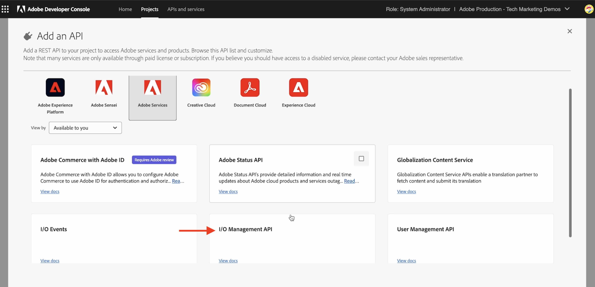

# Adobe I/O Runtime Action and AEM Events

Leer hoe u AEM gebeurtenissen kunt ontvangen met [Adobe I/O Runtime](https://developer.adobe.com/runtime/docs/guides/overview/what_is_runtime/) Handeling en revisie de gebeurtenisdetails zoals lading, kopballen, en meta-gegevens.

>[!VIDEO](https://video.tv.adobe.com/v/3427053?quality=12&learn=on)

Adobe I/O Runtime is een serverloos platform dat code-uitvoering toestaat als reactie op Adobe I/O-gebeurtenissen. Zo kunt u gebeurtenisgestuurde toepassingen maken zonder dat u zich zorgen hoeft te maken over de infrastructuur.

In dit voorbeeld maakt u een Adobe I/O Runtime [Handeling](https://developer.adobe.com/runtime/docs/guides/using/creating_actions/) die AEM Gebeurtenissen ontvangt en de gebeurtenisdetails registreert.
https://developer.adobe.com/runtime/docs/guides/overview/what_is_runtime/

De stappen op hoog niveau zijn:

- Project maken in Adobe Developer Console
- Project initialiseren voor lokale ontwikkeling
- Project configureren in Adobe Developer Console
- Trigger AEM gebeurtenis en verifieer uitvoering van handeling

## Vereisten

U hebt het volgende nodig om deze zelfstudie te voltooien:

- as a Cloud Service omgeving AEM met [AEM Event ingeschakeld](https://developer.adobe.com/experience-cloud/experience-manager-apis/guides/events/#enable-aem-events-on-your-aem-cloud-service-environment).

- Toegang tot [Adobe Developer Console](https://developer.adobe.com/developer-console/docs/guides/getting-started/).

- [ADOBE DEVELOPER CLI](https://developer.adobe.com/runtime/docs/guides/tools/cli_install/) op uw lokale computer is geïnstalleerd.

>[!IMPORTANT]
>
>AEM as a Cloud Service gebeurtenis is alleen beschikbaar voor geregistreerde gebruikers in de pre-releasemodus. Om AEM gebeurtenis op uw AEM as a Cloud Service milieu toe te laten, contacteer [AEM-team](mailto:grp-aem-events@adobe.com).

## Project maken in Adobe Developer Console

Voer de volgende stappen uit om een project te maken in Adobe Developer Console:

- Navigeren naar [Adobe Developer Console](https://developer.adobe.com/) en klik op **Console** knop.

- In de **Snel starten** sectie, klikken **Project maken van sjabloon**. Dan, in **Door sjablonen bladeren** dialoogvenster, selecteren **App Builder** sjabloon.

- Werk indien nodig de projecttitel, toepassingsnaam en werkruimte toevoegen bij. Klik vervolgens op **Opslaan**.

  


## Project initialiseren voor lokale ontwikkeling

Als u Adobe I/O Runtime Action aan het project wilt toevoegen, moet u het project voor lokale ontwikkeling initialiseren. Navigeer op de lokale computer naar de locatie waar u het project wilt initialiseren en voer de volgende stappen uit:

- Project initialiseren door

  ```bash
  aio app init
  ```

- Selecteer de `Organization`de `Project` die u in de vorige stap hebt gemaakt, en in de werkruimte. In `What templates do you want to search for?` stap, selecteren `All Templates` -optie.

  

- Selecteer in de lijst met sjablonen de optie `@adobe/generator-app-excshell` -optie.

  

- Open project in uw favoriete winde, bijvoorbeeld VSCode.

- De geselecteerde _Uitbreidingssjabloon_ (`@adobe/generator-app-excshell`) bevat een algemene runtimeactie, maar de code bevindt zich in `src/dx-excshell-1/actions/generic/index.js` bestand. Laten we het bijwerken om het eenvoudig te houden, de gebeurtenisdetails vast te leggen en een succesreactie te retourneren. In het volgende voorbeeld wordt het echter uitgebreid om de ontvangen AEM Events te verwerken.

  ```javascript
  const fetch = require("node-fetch");
  const { Core } = require("@adobe/aio-sdk");
  const {
  errorResponse,
  getBearerToken,
  stringParameters,
  checkMissingRequestInputs,
  } = require("../utils");
  
  // main function that will be executed by Adobe I/O Runtime
  async function main(params) {
  // create a Logger
  const logger = Core.Logger("main", { level: params.LOG_LEVEL || "info" });
  
  try {
      // 'info' is the default level if not set
      logger.info("Calling the main action");
  
      // log parameters, only if params.LOG_LEVEL === 'debug'
      logger.debug(stringParameters(params));
  
      const response = {
      statusCode: 200,
      body: {
          message: "Received AEM Event, it will be processed in next example",
      },
      };
  
      // log the response status code
      logger.info(`${response.statusCode}: successful request`);
      return response;
  } catch (error) {
      // log any server errors
      logger.error(error);
      // return with 500
      return errorResponse(500, "server error", logger);
  }
  }
  
  exports.main = main;
  ```

- Implementeer ten slotte de bijgewerkte actie op Adobe I/O Runtime door deze uit te voeren.

  ```bash
  aio app deploy
  ```

## Project configureren in Adobe Developer Console

Als u AEM gebeurtenissen wilt ontvangen en de Adobe I/O Runtime-actie wilt uitvoeren die u in de vorige stap hebt gemaakt, configureert u het project in Adobe Developer Console.

- Navigeer in Adobe Developer Console naar de [project](https://developer.adobe.com/console/projects) gemaakt in de vorige stap en klik om deze te openen. Selecteer de `Stage` in deze werkruimte werd actie uitgevoerd .

- Klikken **Service toevoegen** en selecteert u **API** -optie. In de **Een API toevoegen** modal, selecteer **Adobe Services** > **API voor I/O-beheer** en klik op **Volgende**, voert u aanvullende configuratiestappen uit en klikt u op **geconfigureerde API opslaan**.

  

- Klik op **Service toevoegen** en selecteert u **Gebeurtenis** -optie. In de **Gebeurtenissen toevoegen** dialoogvenster, selecteren **Experience Cloud** > **AEM Sites** en klik op **Volgende**. Voer aanvullende configuratiestappen uit en selecteer AEMCS-instantie, gebeurtenistypen en andere details.

- Tot slot, in het **Hoe kan ik gebeurtenissen ontvangen** stap, uitbreiden **Runtime, actie** en selecteert u de _algemeen_ handeling die in de vorige stap is gemaakt. Klikken **geconfigureerde gebeurtenissen opslaan**.

  

- Controleer de registratiegegevens van de gebeurtenis, ook de **Foutopsporing overtrekken** en verifieer de **Challenge Probe** verzoek en antwoord.

  


## Triggergebeurtenissen AEM

Ga als volgt te werk om AEM gebeurtenissen vanuit uw AEM as a Cloud Service omgeving die zijn geregistreerd in het bovenstaande Adobe Developer Console-project, te activeren:

- Toegang tot en aanmelding bij uw AEM as a Cloud Service auteursomgeving via [Cloud Manager](https://my.cloudmanager.adobe.com/).

- Afhankelijk van uw **Geabonneerde gebeurtenissen**, een inhoudsfragment maken, bijwerken, verwijderen, publiceren of de publicatie ervan ongedaan maken.

## Gebeurtenisdetails controleren

Nadat u de bovenstaande stappen hebt uitgevoerd, ziet u de AEM Events die aan de algemene actie worden geleverd.

U kunt de gebeurtenisdetails bekijken in het dialoogvenster **Foutopsporing overtrekken** tabblad van de gegevens van de gebeurtenisregistratie.


## Volgende stappen

In het volgende voorbeeld verbeteren wij deze actie om AEM Gebeurtenissen te verwerken, AEM de auteursdienst terug te roepen om inhouddetails te krijgen, details in de opslag van Adobe I/O Runtime op te slaan, en hen te tonen via de Toepassing van de Enige Pagina (SPA).

