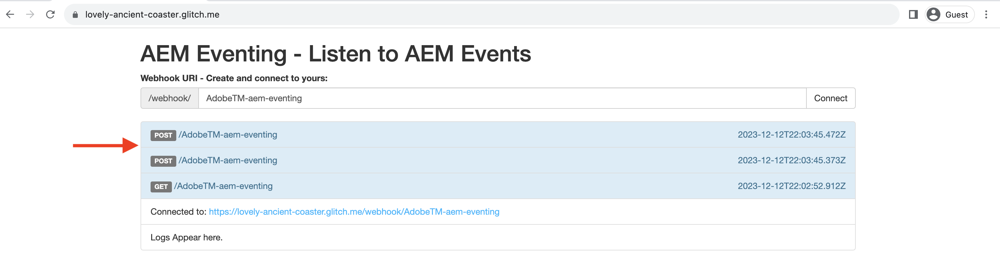

# Webhaken en AEM

Leer hoe u AEM gebeurtenissen op een webhaak ontvangt en de gebeurtenisdetails zoals lading, kopballen, en meta-gegevens bekijkt.

In dit voorbeeld gebruikt u een Adobe-geleverd _gehoste webhaak_ Hiermee kunt u AEM gebeurtenissen ontvangen zonder dat u uw eigen webhaak hoeft in te stellen. Deze door Adobe verschafte webhaak wordt gehost op [Glitch](https://glitch.com/), een platform dat bekend staat om het aanbieden van een webomgeving die bevorderlijk is voor het ontwikkelen en implementeren van webtoepassingen. De optie voor het gebruik van uw eigen webhaak is echter ook beschikbaar als u dat de voorkeur geeft.

## Vereisten

U hebt het volgende nodig om deze zelfstudie te voltooien:

- as a Cloud Service omgeving AEM met [AEM Event ingeschakeld](https://developer.adobe.com/experience-cloud/experience-manager-apis/guides/events/#enable-aem-events-on-your-aem-cloud-service-environment).

- [Adobe Developer Console-project geconfigureerd voor AEM gebeurtenissen](https://developer.adobe.com/experience-cloud/experience-manager-apis/guides/events/#how-to-subscribe-to-aem-events-in-the-adobe-developer-console).

## Toegang tot webhaak

Voer de volgende stappen uit om toegang te krijgen tot de door de Adobe verschafte webhaak:

- Controleer of u toegang hebt tot de [Glitch - gehoste webhaak](https://lovely-ancient-coaster.glitch.me/) in een nieuw browsertabblad.

  

- Voer bijvoorbeeld een unieke naam in voor uw webhaak `<YOUR_PETS_NAME>-aem-eventing` en klik op **Verbinden**. U moet `Connected to: ${YOUR-WEBHOOK-URL}` op het scherm verschijnt.

  

- Noteer de **Webhaak-URL**. U hebt het later nodig in deze zelfstudie.

## Webhaak configureren in Adobe Developer Console-project

Ga als volgt te werk om AEM gebeurtenissen op de bovenstaande URL van de webhaak te ontvangen:

- In de [Adobe Developer Console](https://developer.adobe.com), navigeer naar uw project en klik om het te openen.

- Onder **Producten en services** sectie, klikken op ovalen `...` naast de gewenste gebeurtenissenkaart die AEM gebeurtenissen naar de webhaak moet verzenden en selecteert u **Bewerken**.

  

- In de nieuw geopende **Gebeurtenisregistratie configureren** dialoogvenster, klikt u op **Volgende** Ga door naar **Hoe kan ik gebeurtenissen ontvangen** stap.

  

- In de **Hoe kan ik gebeurtenissen ontvangen** stap, selecteren **Webhaak** en plak de **Webhaak-URL** u hebt eerder gekopieerd vanaf de gehoste webhaak van Glitch en klikt op **geconfigureerde gebeurtenissen opslaan**.

  

- Op de pagina van het Webboek van Glitch, zou u een verzoek van de GET moeten zien, is het een uitdagingsverzoek die door de Gebeurtenissen van de Adobe I/O wordt verzonden om Web-haak URL te verifiëren.

  


## Triggergebeurtenissen AEM

Ga als volgt te werk om AEM gebeurtenissen vanuit uw AEM as a Cloud Service omgeving die zijn geregistreerd in het bovenstaande Adobe Developer Console-project, te activeren:

- Toegang tot en aanmelding bij uw AEM as a Cloud Service auteursomgeving via [Cloud Manager](https://my.cloudmanager.adobe.com/).

- Afhankelijk van uw **Geabonneerde gebeurtenissen**, een inhoudsfragment maken, bijwerken, verwijderen, publiceren of de publicatie ervan ongedaan maken.

## Gebeurtenisdetails controleren

Nadat u de bovenstaande stappen hebt uitgevoerd, ziet u dat de AEM Events aan de webhaak worden geleverd. Zoek het verzoek van de POST in de webhaakpagina van Glitch.



Hier volgen enkele belangrijke details van het verzoek om POST:

- pad: `/webhook/${YOUR-WEBHOOK-URL}`bijvoorbeeld `/webhook/AdobeTM-aem-eventing`

- kopteksten: aanvraagheaders die worden verzonden door de Adobe I/O Events, bijvoorbeeld:

```json
{
"connection": "close",
"x-forwarded-for": "34.205.178.127,::ffff:10.10.10.136,::ffff:10.10.84.114",
"x-forwarded-proto": "https,http,http",
"x-forwarded-port": "443,80,80",
"host": "lovely-ancient-coaster.glitch.me",
"content-length": "826",
"x-adobe-public-key2-path": "/prod/keys/pub-key-IkpzhSpTw0.pem",
"x-adobe-delivery-id": "18abfb47-d24a-4684-ade8-f442a3444033",
"x-adobe-provider": "aemsites_7ABB3E6A5A7491460A495D61@AdobeOrg_acct-aem-p46652-e1074060@adobe.com",
"x-adobe-public-key1-path": "/prod/keys/pub-key-Ptc2pD9vT9.pem",
"x-adobe-event-id": "a0f3fb7d-b02c-4612-aac6-e472b80af793",
"x-adobe-event-code": "aem.sites.contentFragment.modified",
"user-agent": "Adobe/1.0",
"x-adobe-digital-signature-2": "zGLso15+6PV6X6763/x6WqgxDlEXpkv5ty8q4njaq3aUngAI9VCcYonbScEjljRluzjZ05uMJmRfNxwjj60syxEJPuc0dpmMU635gfna7I4T7IaHs496wx4m2E5mvCM+aKbNQ+NPOutyTqI8Ovq29P2P87GIgMlGhAtOaxRVGNc6ksBxc2tCWbrKUhW8hPJ0sHphU499dN4TT32xrZaiRw4akT3M/hYydsA8dcWpJ7S4dpuDS21YyDHAB8s9Dawtr3fyPEyLgZzpwZDfCqQ8gdSCGqKscE4pScwqPkKOYCHDnBvDZVe583jhcZbHGjk7Ncp/FrgQk7avWsk5XlzcuA==",
"x-adobe-digital-signature-1": "QD7THFJ1vmJqD/BatIpzO6+ACQ9cSKPR7XVaW0LI7cN/xs7ucyri6dmkerOPe9EJpjGoqCg8rxWedrIRQB3lgVskChbHH3Ujx5YG0aTQLSd1Lsn5CFbW1U0l0GqId9Cnd6MccrqSznZXcdW1rMFuRk8+gqwabBifSaLbu3r30G5hmqQd72VtiYTE4m23O3jYIMiv62pRP+a+p4NjNj1XG320uRSry+BPniTjDJ6oN/Ng7aUEKML8idZ/ZTqeh/rJSrVO95UryUolFDRwDkRn5zKonbvhSLAeXzaPhvimWUHtldq9M1WTyRMpsBk8BRzaklxlq+woJ2UjYPUIEzjotw==",
"accept-encoding": "deflate,compress,identity",
"content-type": "application/cloudevents+json; charset=UTF-8",
"x-forwarded-host": "lovely-ancient-coaster.glitch.me",
"traceparent": "00-c27558588d994f169186ca6a3c6607d4-a7e7ee36625488d4-01"
}
```

- body/payload: aanvraaginstantie verzonden door de Adobe I/O Events, bijvoorbeeld:

```json
{
  "specversion": "1.0",
  "type": "aem.sites.contentFragment.modified",
  "source": "acct:aem-p46652-e1074060@adobe.com",
  "id": "bf922a49-9db4-4377-baf4-70e96e15c45f",
  "time": "2023-12-12T20:36:43.583228Z",
  "dataschema": "https://ns.adobe.com/xdm/aem/sites/events/content-fragment-modified.json",
  "datacontenttype": "application/json",
  "data": {
    "user": {
      "imsUserId": "933E1F8A631CAA0F0A495E53@80761f6e631c0c7d495fb3.e",
      "principalId": "xxx@adobe.com",
      "displayName": "First LastName",
    },
    "path": "/content/dam/wknd-shared/en/adventures/beervana-portland/beervana-in-portland",
    "model": {
      "id": "/conf/wknd-shared/settings/dam/cfm/models/adventure"
    },
    "id": "9a2d3e6a-efda-4079-a86e-0ef2ede692da",
    "properties": [
      {
        "name": "groupSize",
        "changeType": "modified"
      }
    ]
  },
  "event_id": "a0f3fb7d-b02c-4612-aac6-e472b80af793",
  "recipient_client_id": "f51ea733ba404db299fefbf285dc1c42"
}
```

U kunt zien dat de AEM gebeurtenisdetails alle noodzakelijke informatie hebben om de gebeurtenis in de webhaak te verwerken. Het gebeurtenistype (`type`), gebeurtenisbron (`source`), gebeurtenis-id (`event_id`), tijd van gebeurtenis (`time`) en gebeurtenisgegevens (`data`).

## Aanvullende bronnen

- [Broncode van Glitch-webhaak](https://glitch.com/edit/#!/nl-heerlijk-eeuwenoude kustgebied) is beschikbaar ter referentie.
