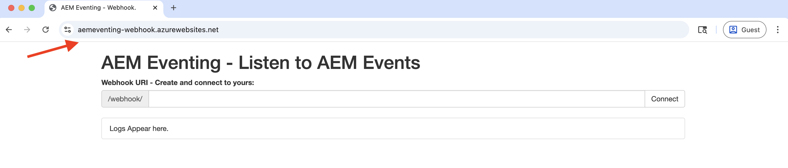
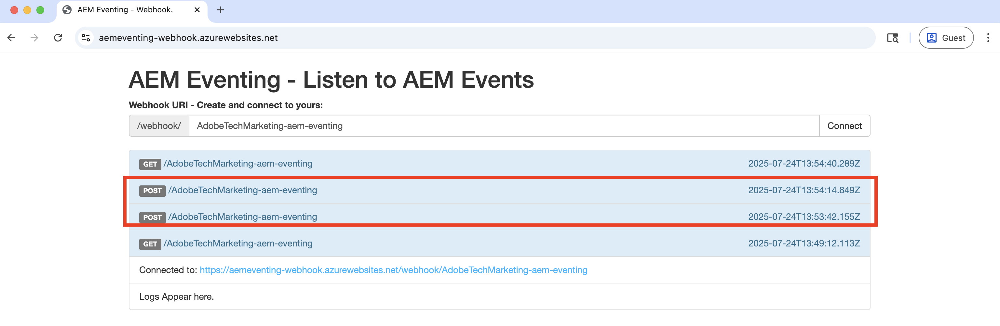

# Webhooks en AEM Events

Leer hoe u AEM-gebeurtenissen op een website kunt ontvangen en bekijk de gebeurtenisdetails zoals payload, headers en metagegevens.


>[!VIDEO](https://video.tv.adobe.com/v/3427051?quality=12&learn=on)


>[!IMPORTANT]
>
>De video verwijst naar een op Glitch gehoste webhaakeindpunt. Sinds Glitch zijn hostingservice heeft stopgezet, is de webhaak gemigreerd naar Azure App Service.
>
>De functionaliteit blijft hetzelfde — alleen het hostplatform is gewijzigd.


In plaats van gebruik te maken van een door Adobe verschafte webhaak, kunt u ook uw eigen webhaakeindpunt gebruiken om AEM Events te ontvangen.

## Vereisten

U hebt het volgende nodig om deze zelfstudie te voltooien:

- Het milieu van AEM as a Cloud Service met [ toegelaten de Gebeurtenis van AEM ](https://developer.adobe.com/experience-cloud/experience-manager-apis/guides/events/#enable-aem-events-on-your-aem-cloud-service-environment).

- [ Adobe Developer Console project dat voor de Gebeurtenissen van AEM ](https://developer.adobe.com/experience-cloud/experience-manager-apis/guides/events/#how-to-subscribe-to-aem-events-in-the-adobe-developer-console) wordt gevormd.


## Toegang tot webhaak

Voer de volgende stappen uit om toegang te krijgen tot de door Adobe verschafte webhaak:

- Verifieer u tot [ Adobe toegang hebt verstrekte steekproefwebhaak ](https://aemeventing-webhook.azurewebsites.net/) in een nieuwe browser tabel.

  

- Ga een unieke naam voor uw webhaak in, bijvoorbeeld `<YOUR_PETS_NAME>-aem-eventing` en klik **verbinden**. U moet `Connected to: ${YOUR-WEBHOOK-URL}` -bericht op het scherm zien.

  

- Maak een nota van **Webhaak URL**. U hebt het later nodig in deze zelfstudie.

## Webhaak configureren in Adobe Developer Console-project

Voer de volgende stappen uit om AEM Events te ontvangen voor de bovenstaande URL van de webhaak:

- In [ Adobe Developer Console ](https://developer.adobe.com), navigeer aan uw project en klik om het te openen.

- Onder **Producten &amp; de diensten** sectie, klik ellipsen `...` naast de gewenste gebeurteniskaart die de gebeurtenissen van AEM naar webhaak zou moeten verzenden en **uitgezocht geef** uit.

  

- In het onlangs geopende **vorm gebeurtenisregistratie** dialoog, klik **daarna** om aan **te werk te gaan hoe te gebeurtenissen** stap ontvangen.

  

- In **hoe te om gebeurtenissen** stap te ontvangen, selecteer **WebHaak** optie en kleef **Webhaak URL** u vroeger van Adobe verstrekte steekproefwebhaak en klik **sparen gevormde gebeurtenissen**.

  

- In de door Adobe verschafte voorbeeldwebhaakpagina ziet u een GET-aanvraag. Het is een challenge-aanvraag die door de Adobe I/O Events wordt verzonden om de URL van de webhaak te controleren.

  


## AEM-gebeurtenissen activeren

Ga als volgt te werk om AEM-gebeurtenissen vanuit uw AEM as a Cloud Service-omgeving te activeren die zijn geregistreerd in het bovenstaande Adobe Developer Console-project:

- De toegang en login aan uw het auteursmilieu van AEM as a Cloud Service via [ Cloud Manager ](https://my.cloudmanager.adobe.com/).

- Afhankelijk van uw **Geabonneerde Gebeurtenissen**, creeer, werk, schrap, publiceer of unpublish een Fragment van de Inhoud.

## Gebeurtenisdetails controleren

Nadat u de bovenstaande stappen hebt uitgevoerd, ziet u dat de AEM Events aan de webhaak worden geleverd. Zoek naar het POST-verzoek in de door Adobe opgegeven webhaakpagina.



Hier volgen enkele belangrijke details van de POST-aanvraag:

- path: `/webhook/${YOUR-WEBHOOK-URL}` , bijvoorbeeld `/webhook/AdobeTM-aem-eventing`

- kopteksten: aanvraagkopteksten die door de Adobe I/O Events worden verzonden, bijvoorbeeld:

```json
{
  "host": "aemeventing-webhook.azurewebsites.net",
  "user-agent": "Adobe/1.0",
  "accept-encoding": "deflate,compress,identity",
  "max-forwards": "10",
  "x-adobe-public-key2-path": "/prod/keys/pub-key-kruhWwu4Or.pem",
  "x-adobe-delivery-id": "25c36f70-9238-4e4c-b1d8-4d9a592fed9d",
  "x-adobe-provider": "aemsites_7ABB3E6A5A7491460A495D61@AdobeOrg_acct-aem-p63947-e1249010@adobe.com",
  "x-adobe-public-key1-path": "/prod/keys/pub-key-lyTiz3gQe4.pem",
  "x-adobe-event-id": "b555a1b1-935b-4541-b410-1915775338b5",
  "x-adobe-event-code": "aem.sites.contentFragment.modified",
  "x-adobe-digital-signature-2": "Lvw8+txbQif/omgOamJXJaJdJMLDH5BmPA+/RRLhKG2LZJYWKiomAE9DqKhM349F8QMdDq6FXJI0vJGdk0FGYQa6JMrU+LK+1fGhBpO98LaJOdvfUQGG/6vq8/uJlcaQ66tuVu1xwH232VwrQOKdcobE9Pztm6UX0J11Uc7vtoojUzsuekclKEDTQx5vwBIYK12bXTI9yLRsv0unBZfNRrV0O4N7KA9SRJFIefn7hZdxyYy7IjMdsoswG36E/sDOgcnW3FVM+rhuyWEizOd2AiqgeZudBKAj8ZPptv+6rZQSABbG4imOa5C3t85N6JOwffAAzP6qs7ghRID89OZwCg==",
  "x-adobe-digital-signature-1": "ZQywLY1Gp/MC/sXzxMvnevhnai3ZG/GaO4ThSGINIpiA/RM47ssAw99KDCy1loxQyovllEmN0ifAwfErQGwDa5cuJYEoreX83+CxqvccSMYUPb5JNDrBkG6W0CmJg6xMeFeo8aoFbePvRkkDOHdz6nT0kgJ70x6mMKgCBM+oUHWG13MVU3YOmU92CJTzn4hiSK8o91/f2aIdfIui/FDp8U20cSKKMWpCu25gMmESorJehe4HVqxLgRwKJHLTqQyw6Ltwy2PdE0guTAYjhDq6AUd/8Fo0ORCY+PsS/lNxim9E9vTRHS7TmRuHf7dpkyFwNZA6Au4GWHHS87mZSHNnow==",
  "x-arr-log-id": "881073f0-7185-4812-9f17-4db69faf2b68",
  "client-ip": "52.37.214.82:46066",
  "disguised-host": "aemeventing-webhook.azurewebsites.net",
  "x-site-deployment-id": "aemeventing-webhook",
  "was-default-hostname": "aemeventing-webhook.azurewebsites.net",
  "x-forwarded-proto": "https",
  "x-appservice-proto": "https",
  "x-arr-ssl": "2048|256|CN=Microsoft Azure RSA TLS Issuing CA 03, O=Microsoft Corporation, C=US|CN=*.azurewebsites.net, O=Microsoft Corporation, L=Redmond, S=WA, C=US",
  "x-forwarded-tlsversion": "1.3",
  "x-forwarded-for": "52.37.214.82:46066",
  "x-original-url": "/webhook/AdobeTechMarketing-aem-eventing",
  "x-waws-unencoded-url": "/webhook/AdobeTechMarketing-aem-eventing",
  "x-client-ip": "52.37.214.82",
  "x-client-port": "46066",
  "content-type": "application/cloudevents+json; charset=UTF-8",
  "content-length": "1178"
}
```

- body/payload: door de Adobe I/O Events verzonden aanvraaginstantie, bijvoorbeeld:

```json
{
  "specversion": "1.0",
  "id": "83b0eac0-56d6-4499-afa6-4dc58ff6ac7f",
  "source": "acct:aem-p63947-e1249010@adobe.com",
  "type": "aem.sites.contentFragment.modified",
  "datacontenttype": "application/json",
  "dataschema": "https://ns.adobe.com/xdm/aem/sites/events/content-fragment-modified.json",
  "time": "2025-07-24T13:53:23.994109827Z",
  "eventid": "b555a1b1-935b-4541-b410-1915775338b5",
  "event_id": "b555a1b1-935b-4541-b410-1915775338b5",
  "recipient_client_id": "606d4074c7ea4962aaf3bc2a5ac3b7f9",
  "recipientclientid": "606d4074c7ea4962aaf3bc2a5ac3b7f9",
  "data": {
    "user": {
      "imsUserId": "ims-933E1F8A631CAA0F0A495E53@80761f6e631c0c7d495fb3.e",
      "principalId": "xx@adobe.com",
      "displayName": "Sachin Mali"
    },
    "path": "/content/dam/wknd-shared/en/adventures/beervana-portland/beervana-in-portland",
    "sourceUrl": "https://author-p63947-e1249010.adobeaemcloud.com",
    "model": {
      "id": "L2NvbmYvd2tuZC1zaGFyZWQvc2V0dGluZ3MvZGFtL2NmbS9tb2RlbHMvYWR2ZW50dXJl",
      "path": "/conf/wknd-shared/settings/dam/cfm/models/adventure"
    },
    "id": "9e1e9835-64c8-42dc-9d36-fbd59e28f753",
    "tags": [
      "wknd-shared:region/nam/united-states",
      "wknd-shared:activity/social",
      "wknd-shared:season/fall"
    ],
    "properties": [
      {
        "name": "price",
        "changeType": "modified"
      }
    ]
  }
}
```

U ziet dat de AEM-gebeurtenisdetails alle benodigde informatie hebben om de gebeurtenis in de webhaak te verwerken. Bijvoorbeeld het gebeurtenistype (`type`), gebeurtenisbron (`source`), gebeurtenis id (`event_id`), gebeurtenistijd (`time`) en gebeurtenisgegevens (`data`).

## Aanvullende bronnen

- [ broncode 0} AEM-Eventing Webhaak {is beschikbaar voor uw verwijzing.](../assets/examples/webhook/aemeventing-webhook.tgz)
