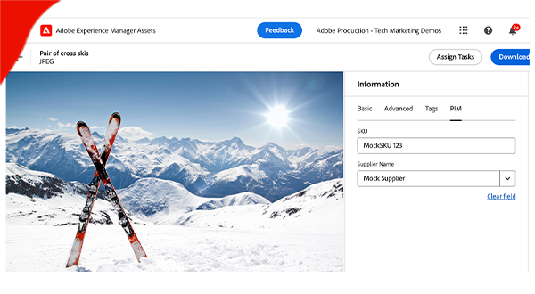

# AEM Event

Meer informatie over AEM-gebeurtenissen, wat het is, waarom en wanneer het wordt gebruikt en voorbeelden.

>[!VIDEO](https://video.tv.adobe.com/v/3426686?quality=12&learn=on)

## Wat het is

AEM Event is een &#39;cloud-native&#39; gebeurtenissysteem dat abonnementen op AEM Events inschakelt voor verwerking in externe systemen. Een AEM-gebeurtenis is een statuswijzigingsmelding die door AEM wordt verzonden wanneer een specifieke actie plaatsvindt. Dit kunnen bijvoorbeeld gebeurtenissen zijn wanneer een inhoudsfragment wordt gemaakt, bijgewerkt of verwijderd.

 tot stand komt

Het bovenstaande diagram visualiseerde hoe AEM as a Cloud Service gebeurtenissen produceert en verzendt naar Adobe I/O Events, dat hen aan gebeurtenisabonnees beurtelt.

Samengevat zijn er drie hoofdonderdelen:

1. **de leverancier van de Gebeurtenis:** AEM as a Cloud Service.
1. **Adobe I/O Events:** het platform van de Ontwikkelaar voor het integreren, uitbreiden, en het bouwen van apps en ervaringen die op de producten en de technologieën van Adobe worden gebaseerd.
1. **consument van de Gebeurtenis:** Systemen die door de klant worden bezeten die aan de Gebeurtenissen van AEM intekent. Bijvoorbeeld een CRM (Customer Relationship Management), PIM (Product Information Management), OMS (Order Management System) of een aangepaste toepassing.

### Hoe anders

De [&#x200B; Gebeurtenis Apache die &#x200B;](https://sling.apache.org/documentation/bundles/apache-sling-eventing-and-job-handling.html), OSGi gebeurtenis, en [&#x200B; JCR waarneming &#x200B;](https://jackrabbit.apache.org/oak/docs/features/observation.html) allen aanbiedt mechanismen om aan gebeurtenissen in te tekenen en te verwerken. Nochtans, zijn deze verschillend van AEM Event zoals die in deze documentatie wordt besproken.

Belangrijk onderscheid van AEM Event:

- De code voor de gebeurtenisverbruiker wordt buiten AEM uitgevoerd en wordt niet in dezelfde JVM als AEM uitgevoerd.
- De AEM-productcode is verantwoordelijk voor het definiëren van de gebeurtenissen en het verzenden ervan naar Adobe I/O Events.
- Gebeurtenisgegevens worden gestandaardiseerd en verzonden in JSON-indeling. Voor meer details, verwijs naar [&#x200B; wolken &#x200B;](https://cloudevents.io/).
- Voor de communicatie met AEM gebruikt de gebruiker van de gebeurtenis de AEM as a Cloud Service API.

## Waarom en wanneer gebruiken

AEM Event biedt tal van voordelen voor systeemarchitectuur en operationele efficiency. De belangrijkste redenen om AEM Event te gebruiken zijn:

- **om gebeurtenis-gedreven Architecturen** te bouwen: vergemakkelijkt de verwezenlijking van los gekoppelde systemen die onafhankelijk kunnen schrapen en veerkrachtig aan mislukkingen zijn.
- **Lage code en lagere operationele kosten**: Vermijdt aanpassingen in AEM, die tot systemen leiden die gemakkelijker zijn te handhaven en uit te breiden, waarbij operationele kosten worden verminderd.
- **vereenvoudigt communicatie tussen AEM en externe systemen**: Elimineert punt om verbindingen te richten door Adobe I/O Events te laten mededelingen beheren, zoals het bepalen welke gebeurtenissen van AEM aan specifieke systemen of de diensten zouden moeten worden geleverd.
- **Hogere duurzaamheid van gebeurtenissen**: Adobe I/O Events is hoogst beschikbaar en scalable systeem, dat wordt ontworpen om grote volumes van gebeurtenissen te behandelen en hen betrouwbaar te leveren aan abonnees.
- **Parallelle verwerking van gebeurtenissen**: Laat de levering van gebeurtenissen aan veelvoudige abonnees gelijktijdig toe, die voor verdeelde gebeurtenisverwerking over diverse systemen toestaan.
- **Serverless toepassingsontwikkeling**: Steunt het opstellen van de code van de gebeurtenisconsument als serverloze toepassing, die systeemflexibiliteit en scalability verder verbetert.

### Beperkingen

AEM Event is weliswaar krachtig, maar heeft bepaalde beperkingen die in overweging moeten worden genomen:

- **Beschikbaarheid beperkt tot AEM as a Cloud Service**: Momenteel, is AEM Event exclusief beschikbaar voor AEM as a Cloud Service.

- **Beschikbare gebeurtenistypen**: Herzie de huidige lijst van beschikbare gebeurtenistypen [&#x200B; hier &#x200B;](https://developer.adobe.com/experience-cloud/experience-manager-apis/guides/events/#available-event-types).

## Hoe te om toe te laten

Zie [&#x200B; de Gebeurtenissen van AEM op uw Milieu van de Dienst van de Wolk AEM &#x200B;](https://developer.adobe.com/experience-cloud/experience-manager-apis/guides/events/#enable-aem-events-on-your-aem-cloud-service-environment) voor volgende stappen toelaten.

## Abonneren

Om aan de Gebeurtenissen van AEM in te tekenen, moet u geen code in AEM schrijven, maar eerder wordt een [&#x200B; Adobe Developer Console &#x200B;](https://developer.adobe.com/) project gevormd. De Adobe Developer Console is een gateway naar Adobe APIs, SDKs, Gebeurtenissen, Runtime, en App Builder.

In dit geval, laat het a _project_ in Adobe Developer Console u toe om aan gebeurtenissen in te tekenen die van het milieu van AEM as a Cloud Service worden uitgegeven en de gebeurtenislevering aan externe systemen te vormen.

Voor meer informatie, zie [&#x200B; hoe te aan de Gebeurtenissen van AEM in Adobe Developer Console &#x200B;](https://developer.adobe.com/experience-cloud/experience-manager-apis/guides/events/#how-to-subscribe-to-aem-events-in-the-adobe-developer-console) intekenen.

## Hoe te verbruiken

Er zijn twee primaire methodes om de Gebeurtenissen van AEM te verbruiken: de _duw_ methode en de _trek_ methode.

- **methode van de Duw**: In deze benadering, wordt de gebeurtenisconsument proactief op de hoogte gebracht door Adobe I/O Events wanneer een gebeurtenis beschikbaar wordt. Tot de integratieopties behoren Webhooks, Adobe I/O Runtime en Amazon EventBridge.
- **methode van de Trek**: Hier, pollt de gebeurtenisconsument actief Adobe I/O Events om nieuwe gebeurtenissen te controleren. De primaire integratieoptie voor deze methode is de Adobe Developer Journaling API.

Voor meer informatie, zie [&#x200B; de verwerking van Gebeurtenissen van AEM via Adobe I/O Events &#x200B;](https://developer.adobe.com/experience-cloud/experience-manager-apis/guides/events/#aem-events-processing-via-adobe-io).

## Voorbeelden

<table>
  <tr>
    <td>
        
        
<strong><a href="./examples/webhook.md"> ontvang de Gebeurtenissen van AEM op een webhaak </a></strong>

        

          Met Adobe kunt u via webhaak AEM-gebeurtenissen ontvangen en de gebeurtenisdetails bekijken.
        

      </td>
      <td>
        
        
<strong><a href="./examples/journaling.md"> het dagboek van de Gebeurtenissen van AEM van de Lading </a></strong>

        

          Met Adobe kunt u AEM Events laden vanuit het journaal en de gebeurtenisdetails bekijken.
        

      </td>
    </tr>
  <tr>
    <td>
        
        
<strong><a href="./examples/runtime-action.md"> ontvang de Gebeurtenissen van AEM op de Actie van Adobe I/O Runtime </a></strong>

        

          Ontvang AEM Events en bekijk de gebeurtenisdetails.
        

      </td>
      <td>
        
        
<strong><a href="./examples/event-processing-using-runtime-action.md"> de verwerking van Gebeurtenissen van AEM gebruikend de Actie van Adobe I/O Runtime </a></strong>

        

          Leer hoe u ontvangen AEM-gebeurtenissen verwerkt met Adobe I/O Runtime Action. De gebeurtenisverwerking omvat AEM callback, de persistentie van gebeurtenisgegevens, en het tonen van hen in het KUUROORD.
        

      </td>
  </tr>
  <tr>
    <td>
        
        
<strong><a href="./examples/assets-pim-integration.md"> de gebeurtenissen van AEM Assets voor PIM integratie </a></strong>

        

          Leer hoe u AEM Assets en PIM-systemen (Product Information Management) kunt integreren voor updates van metagegevens.
        

      </td>
  </tr> 
</table>
