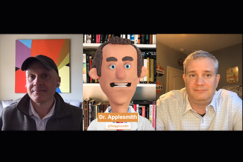

# Wolk 5 seizoen 1

## Inleiding

Welkom bij de Cloud 5 Series van AEM Engineering. Een van de belangrijkste problemen in de implementatiefase van een product is het hebben van voldoende codevoorbeelden en/of live demonstraties van deze samples, tools of API&#39;s. Het doel van deze reeks is om binnen 5 minuten nuttige informatie over AEM as a Cloud Service te leveren.

Bezoek het [ Vak van de Suggestie ](https://forms.office.com/r/74P5Xz4UH0) voor het voorleggen van onderwerpideeën.

## Seizoen 1

Elk seizoen varieert in lengte en wordt vrijgegeven volgens een vast tijdschema. De onderwerpen van seizoen 1 zijn voornamelijk gebaseerd op eerdere verzoeken die we hebben ontvangen in onze dagelijkse afspraken met klanten en partners. Bezoek deze pagina voor wekelijkse updates of volg ons op het sociale netwerk van uw keuze.

<table>
  <tr>
   <td>
      
      

         <a href="./cloud5-aem-cdn-part1.md"><strong> AEM CDN Diep Duiken (deel 1) </strong></a>         
          <em> met Darin Kuntze &amp; James Talbot, de Hogere Architecten van de Wolk </em>
      

      

         
         Deel 1 is een blik bij AEM as a Cloud Service CDN, en hoe te om het in uw implementatie te gebruiken.
      

     </td>   
     <td>
      
      

         <a href="./cloud5-aem-cdn-part2.md"><strong> AEM CDN Diep Duiken (deel 2) </strong></a>
          <em> met Darin Kuntze &amp; James Talbot, de Hogere Architecten van de Wolk </em>
      

      

         
         Deel 2 is een voortzetting van onze blik op de AEM as a Cloud Service CDN. We beantwoorden enkele van de meer algemene vragen en mythes over welke functies u krijgt met de nieuwe CDN.
      

   </td>
     <td>
        
      

         <a href="./cloud5-aem-log-files.md"><strong> de Dossiers van het Logboek &amp; het Registreren </strong></a>
          <em> met Darin Kuntze &amp; James Talbot, de Hogere Architecten van de Wolk </em>
      

      

         
         Dit is een snel overzicht van hoe te om tot logboeken in AEM as a Cloud Service toegang te hebben, met inbegrip van hoe te om tot hen via het gebruikersinterface evenals van APIs toegang te hebben.
      

   </td> 
  </tr>
  <tr>
   <td>
        
      

        <a href="./cloud5-getting-login-token-integrations.md"><strong> Integrerend met de Tokens van de Toegang </strong></a>        
          <em> met Darin Kuntze &amp; James Talbot, de Hogere Architecten van de Wolk </em>
      

      

         
         Een snel overzicht en een demo van interactie met aanmeldingstokens voor het uitvoeren van integratiewerk in omgevingen met cloudservices.
      

     </td>   
     <td>
        
      

        <a href="./cloud5-aem-dispatcher-cloud.md"><strong> Dispatcher in de Wolk </strong></a>
          <em> met Darin Kuntze &amp; James Talbot, de Hogere Architecten van de Wolk </em>
      

      

         
        Darin en James bespreken de Dispatcher in de AEM Cloud, inclusief een aantal beste praktijken en verschillen van AMS/On-Prem. 
      

   </td>
     <td>
        
      

         <a href="./cloud5-aem-content-migration-part-1.md"><strong> Migratie (deel 1) </strong></a>
          <em> met Darin Kuntze &amp; James Talbot, de Hogere Architecten van de Wolk &amp; Dr. Applesmith </em>
      

      

         
         Deel één (van twee) van onze tips en trucs voor het migreren naar de cloud. Onze belangrijkste focus in deel één is de beste praktijken en voorbereidend werk die u klaar maken voor migratie.
      

   </td> 
  </tr>
    <tr>
        <td>
            
            

                <a href="./cloud5-adobe-app-builder.md"><strong> Adobe App Builder </strong></a>         
                <em> met Darin Kuntze &amp; James Talbot, de Hogere Architecten van de Wolk &amp; Anand Amol </em>
            

            
 
                Kom wat coole dingen uit die je kunt doen met Adobe App Builder en leer iets nieuws over de toekomst van aanpassingen in de cloud.
            

        </td>
        <td></td>
        <td></td>
    </tr>
</table>
