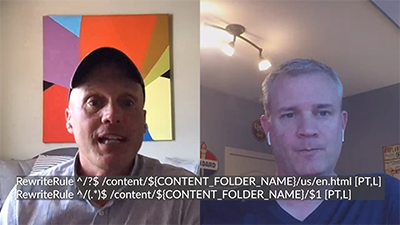

# Wolk 5 seizoen 2

>[!VIDEO](https://video.tv.adobe.com/v/346567?quality=12&learn=on)

## Inleiding

Welkom bij het seizoen van de 2 Cloud 5 Series van AEM Engineering. Een van de belangrijkste problemen in de implementatiefase van een product is het hebben van voldoende codevoorbeelden en/of live demonstraties van deze samples, tools of API&#39;s. Het doel van deze reeks is om binnen 5 minuten nuttige informatie over AEM as a Cloud Service te leveren.

## Suggestievak

Bezoek het [&#x200B; Vak van de Suggestie &#x200B;](https://forms.office.com/r/74P5Xz4UH0) voor het voorleggen van onderwerpideeën.

## Seizoen 2

Elk seizoen varieert in lengte en wordt vrijgegeven volgens een vast tijdschema. De onderwerpen van seizoen 2 zijn hoofdzakelijk gebaseerd op verzoeken uit het verleden die we hebben ontvangen in onze dagelijkse contacten met klanten en partners. Bezoek deze pagina voor wekelijkse updates of volg ons op het sociale netwerk van uw keuze.

<table>
    <tr>
        <td>
            
            

                <a href="season-2/cloud5-experience-v-content-fragments.md"><strong> Fragments </strong></a>        
                 <em> met Darin Kuntze &amp; James Talbot, de Hogere Architecten van de Wolk </em>
            

            

                 
                Een kleurrijke manier om de verschillen tussen ervaring en inhoudsfragmenten op te vangen. Spoiler: iedereen wint.
            

        </td>   
         <td>
            
            

                <a href="season-2/cloud5-repo-modernizer.md"><strong> Modernizer van de Bewaarplaats </strong></a> 
                <em> met Darin Kuntze &amp; James Talbot, de Hogere Architecten van de Wolk </em>
            

            

                 
                Snel inzicht in het gebruik van de repository modernizer om bestaande projectpakketten te herstructureren naar aparte pakketten die compatibel zijn met AEM als cloudservice.
            

         </td>
         <td>
            
            

                  <a href="season-2/cloud5-admin-console.md"><strong> Admin Console </strong></a>
                <em> met Darin Kuntze &amp; James Talbot, de Hogere Architecten van de Wolk </em>
            

            

             
               Darin en James bespreken enkele algemene zaken die mensen moeten weten over beheerconsole, provisioning en toegang.
            

         </td> 
  </tr>
  <tr>
         <td>
            
            

                  <a href="season-2/cloud5-sling-job-scheduler.md"><strong> Sling Banen </strong></a>
                <em> met Darin Kuntze &amp; James Talbot, de Hogere Architecten van de Wolk </em>
            

            

             
               Darin en James bespreken gotchas en dingen om te zoeken naar taakplanning en consumptie in AEM als cloudservice.
            

         </td> 
         <td>
            
            

                  <a href="season-2/cloud5-repoinit.md"><strong> Sling Repository Initializer </strong></a>
                <em> met Darin Kuntze &amp; James Talbot, de Hogere Architecten van de Wolk </em>
            

            

             
              Leer een paar trucs om de kracht van het gebruiken van de Initializer van de Bewaarplaats Sling te ontgrendelen, a.k.a herpoinit.
            

         </td>   
     <td>
            
      

         <a href="season-2/cloud5-fix-your-cache.md"><strong> bevestig Uw.. Cache </strong></a>
          <em> met Damian Langsweirdt &amp; James Talbot, de Hogere Architecten van de Wolk </em>
      

      

          
             Verken gebieden om uw cache te optimaliseren en uw site op AEM as a Cloud Service sneller te laten werken.
      

   </td> 
  </tr>
<tr>
   <td>
           
      

            <a href="season-2/cloud5-fix-your-rewrites.md"><strong> bevestig Uw.. Herschrijft </strong></a>
          <em> met Darin Kuntze &amp; James Talbot, de Hogere Architecten van de Wolk </em>
      

      

         
         Snel inzicht in zaken die uw herschrijfontwikkeling en optimalisatie op AEM as a Cloud Service zullen versnellen.
      

     </td>   
     <td>
            
      

            <a href="season-2/cloud5-mocm-experience-audit.md"><strong> Mysteries van Cloud Manager.. Experience Audit </strong></a>
          <em> met Darin Kuntze, Senior Cloud Architect </em>
      

      

         
        Verken de basisbeginselen van Cloud Manager en de mogelijkheden van de Experience Audit.
      

   </td>
     <td>
            
      

            <a href="season-2/cloud5-mocm-unit-tests.md"><strong> Mysteries van Cloud Manager.. Eenheidstests </strong></a>
          <em> met Darin Kuntze &amp; Bryan Stop, de Hogere Architecten van de Wolk </em>
      

      

         
        Darin en Bryan bespreken hoe Cloud Manager de uitvoering van eenheidstests en de verslaglegging van codedekking in zijn CBI/CD pijpleiding integreert om de beste praktijken van eenheid het testen AEM code te bevorderen en te bevorderen.
      

   </td> 
  </tr>
    <tr>
        <td>
               
            

                <a href="season-2/cloud5-mocm-functional-tests.md"><strong> Mysteries van Cloud Manager.. Functionele tests </strong> </a>        
                <em> met Darin Kuntze &amp; Bryan Stop, de Hogere Architecten van de Wolk </em>
            

            
 
                Darin en Bryan bespreken verschillende soorten functionele tests die in het AEM as a Cloud Service-implementatieproces zijn ingebouwd om de kwaliteit en betrouwbaarheid van uw code te garanderen.
            

        </td>
        <td></td>
        <td></td>
    </tr>
</table>
