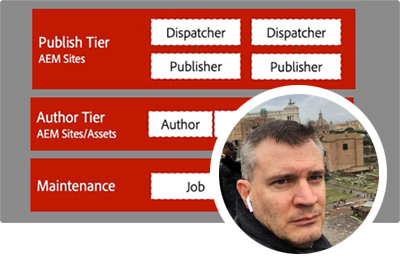
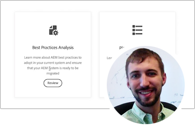

# AEM as a Cloud Service deskundigenreeks

Leer over Adobe Experience Manager (AEM) as a Cloud Service van deskundige ingenieurs van de Adobe die het bouwen, en professionele de dienstenteam die het leveren. Experts van de Adobe samenwerken bij het verkennen van wat AEM as a Cloud Service is, hoe hetzelfde is en verschilt van AEM 6, en hoe van AEM 6 naar AEM as a Cloud Service te gaan.

  
 

## Aan de slag met AEM as a Cloud Service

Leer de grondbeginselen van AEM als Cloud Servicen, en hoe het verschilt van AEM 6, van de Hogere Architecten van de Wolk van de Techniek van de Adobe.

<table>
  <tr>
   <td>
      
      

         <a href="../../migration/moving-to-aem-as-a-cloud-service/introduction.md"><strong>anders denken</strong></a>         
          <em>met Darin Kuntze, Senior Cloud Architect</em>
      

      

         
         Een blik bij AEM as a Cloud Service architectuur, en hoe te om verschillend over AEM as a Cloud Service implementaties te denken.
      

     </td>   
     <td>
      
      

         <a href="../../migration/moving-to-aem-as-a-cloud-service/onboarding.md"><strong>Aan boord gaan naar AEM as a Cloud Service</strong></a>
          <em>met Damian Langsweirdt, Senior Cloud Architect</em>
      

      

         
         Leer over het aan boord gaan aan AEM as a Cloud Service, beginnend met de contractfase aan vestiging zelf-dienstmilieu's gebruikend de Manager van de Wolk.
      

   </td>     
   </td>   
     <td>
      
      

         <a href="../../migration/moving-to-aem-as-a-cloud-service/cloud-manager.md"><strong>Cloud Manager voor AEM as a Cloud Service</strong></a>
          <em>met Bryan Stop, Senior Cloud Architect</em>
      

      

         
         Leer meer over Cloud Manager voor AEM as a Cloud Service en de verschillen met Cloud Manager voor AEM op Adobe Manage Services (AMS).
      

   </td> 
  </tr>
</table>

## Naar AEM as a Cloud Service?

Overstappen van AEM 6 naar AEM as a Cloud Service? Lees meer over de methode van de Adobe om over te stappen naar AEM as a Cloud Service, en over de verschillende hulpmiddelen en mogelijkheden die dit een vlotte overgang maken.

<table>
  <tr>
   <td>
      
      

         <a href="../../migration/moving-to-aem-as-a-cloud-service/bpa-and-cam.md" target="_aem-experts-series-video"><strong>Migratiemethode</strong></a>
          <em>met Roger Blanton, Adobe Consulting Services Technical Architect</em>
      

      

         
        Bekijk de migratiemethodologie van best practices voor de overgang van AEM 6 naar AEM as a Cloud Service met AEM Best Practice Analyzer (BPA) en Cloud Acceleration Manager (CAM).
      

   </td>   
     <td>
      
      

         <a href="../../migration/moving-to-aem-as-a-cloud-service/aem-modernization-tools.md" target="_aem-experts-series-video"><strong>Inhoud moderniseren</strong></a>
          <em>met Bryan Stop, Senior Cloud Architect</em>
      

      

         
         Leer hoe u uw AEM inhoud automatisch kunt moderniseren om te profiteren van de nieuwste AEM as a Cloud Service functies.
      

   </td>     
   </td>   
     <td>
      
      

         <a href="../../migration/moving-to-aem-as-a-cloud-service/repository-modernization.md" target="_aem-experts-series-video"><strong>Uw AEM Maven-project moderniseren</strong></a>
          <em>met Varun Mitra, Cloud Architect</em>
      

      

         
         Leer hoe u de Maven-projectstructuur en -organisatie van uw aangepaste AEM-toepassing automatisch kunt moderniseren zodat deze as a Cloud Service compatibel AEM en kunt worden afgestemd op de meest recente best practices van de Adobe.
      

   </td> 
  </tr>
  <tr>
   <td>
      
      

         <a href="../../migration/moving-to-aem-as-a-cloud-service/search-and-indexing.md" target="_aem-experts-series-video"><strong>Uw eik-indexen moderniseren</strong></a>
          <em>met Darin Kuntze, Senior Cloud Architect</em>
      

      

         
        Leer hoe u AEM 6 eik-indexdefinities automatisch omzet zodat deze as a Cloud Service compatibel AEM, en hoe u eiken-indexen behoudt voor AEM as a Cloud Service toekomst.
      

   </td>   
     <td>
      
      

         <a href="../../migration/moving-to-aem-as-a-cloud-service/dispatcher.md" target="_aem-experts-series-video"><strong>De configuratie van uw Dispatcher moderniseren</strong></a>
          <em>met Bryan Stop, Senior Cloud Architect</em>
      

      

         
         Leer over AEM Dispatcher voor AEM as a Cloud Service, zich op opmerkelijke veranderingen van Dispatcher voor AEM 6, het hulpmiddel van de Omzetting van de Verzender en hoe te om de Dispatcher Tools SDK te gebruiken.
      

   </td>     
   </td>   
     <td>
      
      

         <a href="../../migration/moving-to-aem-as-a-cloud-service/content-migration/content-transfer-tool.md" target="_aem-experts-series-video"><strong>Uw inhoud overbrengen naar AEM as a Cloud Service</strong></a>
          <em>met Kiran Murugulla, Senior Cloud Architect</em>
      

      

         
         Leer hoe u met het gereedschap Inhoud overbrengen inhoud kunt migreren naar AEM as a Cloud Service vanuit AEM 6.3+.
      

   </td> 
  </tr>  
</table>

## AEM als mogelijkheden van Cloud Servicen

Ontdek de unieke mogelijkheden van AEM as a Cloud Service van experts van de Adobe.

<table>
  <tr>
   <td>
      
      

         <a href="../../migration/moving-to-aem-as-a-cloud-service/asset-compute-microservices.md" target="_aem-experts-series-video"><strong>Asset compute microdiensten</strong></a>
          <em>met Amol Anand, Principal Cloud Architect</em>
      

      

         
        Meer informatie over de Asset compute microservices van AEM Assets, hoe deze services de verwerking van AEM 6-middelen vervangen en hoe deze kunnen worden uitgebreid om aangepaste uitvoeringen van elementen te genereren.
      

   </td>   
   <td>
      
      

         <a href="../../migration/moving-to-aem-as-a-cloud-service/content-migration/bulk-import-service.md" target="_aem-experts-series-video"><strong>Inhoud bulksgewijs importeren</strong></a>
          <em>met Kiran Murugulla, Senior Cloud Architect</em>
      

      

         
        Leer hoe u inhoud veilig en efficiënt in bulk importeert naar AEM as a Cloud Service met de Bulk Import Service en AEM Package Manager.
      

   </td> 
    <td></td>
  </tr>
</table>

## Hebt u hulp nodig bij AEM als Cloud Servicen?

Leer hoe te om AEM as a Cloud Service en AEM SDK van de deskundigen te zuiveren en problemen op te lossen!

<table>
  <tr>
   <td>
      
      

         <a href="../../migration/moving-to-aem-as-a-cloud-service/troubleshooting.md" 
         target="_aem-experts-series-video"><strong>Problemen oplossen AEM as a Cloud Service</strong></a>
          <em>met Kunwar Saluja, Cloud Architect</em>
      

      

         
        Leer hoe u verschillende aspecten van AEM as a Cloud Service kunt oplossen, variërend van foutopsporing in de AEM SDK en AEM as a Cloud Service tot fouten bij het maken en implementeren van cloudbeheer.
      

   </td>   
    <td></td>
    <td></td>
  </tr>
</table>
