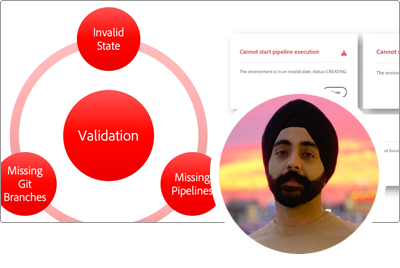

# AEM as a Cloud Service Experts-reeks

Leer over Adobe Experience Manager (AEM) as a Cloud Service van deskundige ingenieurs van de Adobe die het bouwen, en professionele de dienstenteam die het leveren. Experts van de Adobe onderzoeken wat AEM as a Cloud Service is, hoe hetzelfde is en anders dan AEM 6, en hoe van AEM 6 naar AEM as a Cloud Service kan worden overgeschakeld.

  
 

## Aan de slag met AEM as a Cloud Service

Leer de grondbeginselen van AEM als Cloud Servicen, en hoe het verschilt van AEM 6, van de Hogere Architecten van de Wolk van de Techniek van de Adobe.

<table>
  <tr>
   <td>
      
      

         <a href="../../migration/moving-to-aem-as-a-cloud-service/introduction.md"><strong> anders Dinking </strong></a>         
          <em> met Darin Kuntze, Senior Cloud Architect </em>
      

      

         
         Een blik op de architectuur van AEM as a Cloud Service, en hoe te om verschillend over de implementaties van AEM as a Cloud Service te denken.
      

     </td>   
     <td>
      
      

         <a href="../../migration/moving-to-aem-as-a-cloud-service/onboarding.md"><strong> Onboarding aan AEM as a Cloud Service </strong></a>
          <em> met Damian Langsweirdt, Senior Cloud Architect </em>
      

      

         
         Meer informatie over instaptoegang tot AEM as a Cloud Service, vanaf de contractfase tot het instellen van zelfbedieningsomgevingen met Cloud Manager.
      

   </td>     
   </td>   
     <td>
      
      

         <a href="../../migration/moving-to-aem-as-a-cloud-service/cloud-manager.md"><strong> Cloud Manager voor AEM as a Cloud Service </strong></a>
          <em> met Bryan Stop, Senior Cloud Architect </em>
      

      

         
         Meer informatie over Cloud Manager for AEM as a Cloud Service en de verschillen met Cloud Manager for AEM over Adobe Manage Services (AMS).
      

   </td> 
  </tr>
</table>

## Naar AEM as a Cloud Service?

Overstappen van AEM 6 naar AEM as a Cloud Service? Leer meer over de methode van de Adobe om naar AEM as a Cloud Service te verhuizen, en de verschillende hulpmiddelen en mogelijkheden die dit een vlotte overgang maken.

<table>
  <tr>
   <td>
      
      

         <a href="../../migration/moving-to-aem-as-a-cloud-service/bpa-and-cam.md" target="_aem-experts-series-video"><strong> methodologie van de Migratie </strong></a>
          <em> met Roger Blanton, de Technische Architect van de Diensten van Adobe Consulting </em>
      

      

         
        Kijk eens naar de migratie van best practices voor de overgang van AEM 6 naar AEM as a Cloud Service met behulp van AEM Best Practice Analyzer (BPA) en Cloud Acceleration Manager (CAM).
      

   </td>   
     <td>
      
      

         <a href="../../migration/moving-to-aem-as-a-cloud-service/aem-modernization-tools.md" target="_aem-experts-series-video"><strong> Moderniserend uw inhoud </strong></a>
          <em> met Bryan Stop, Senior Cloud Architect </em>
      

      

         
         Leer hoe u uw AEM inhoud automatisch kunt moderniseren om te profiteren van de nieuwste AEM as a Cloud Service-functies.
      

   </td>     
   </td>   
     <td>
      
      

         <a href="../../migration/moving-to-aem-as-a-cloud-service/repository-modernization.md" target="_aem-experts-series-video"><strong> Moderniserend uw AEM Maven project </strong></a>
          <em> met Varun Mitra, de Architect van de Wolk </em>
      

      

         
         Leer hoe u de Maven-projectstructuur en -organisatie van uw aangepaste AEM-toepassing automatisch kunt moderniseren om compatibel te zijn met AEM as a Cloud Service en kunt afstemmen op de meest recente best practices van de Adobe.
      

   </td> 
  </tr>
  <tr>
   <td>
      
      

         <a href="../../migration/moving-to-aem-as-a-cloud-service/search-and-indexing.md" target="_aem-experts-series-video"><strong> Moderniserend uw indexen van Oak </strong></a>
          <em> met Darin Kuntze, Senior Cloud Architect </em>
      

      

         
        Leer hoe u AEM 6 Oak-indexdefinities automatisch omzet in AEM as a Cloud Service-compatibel systeem en hoe u Oak-indexen kunt onderhouden voor AEM as a Cloud Service.
      

   </td>   
     <td>
      
      

         <a href="../../migration/moving-to-aem-as-a-cloud-service/dispatcher.md" target="_aem-experts-series-video"><strong> Moderniserend uw configuratie van Dispatcher </strong></a>
          <em> met Bryan Stop, Senior Cloud Architect </em>
      

      

         
         Meer informatie over AEM Dispatcher for AEM as a Cloud Service, waarbij u zich richt op opmerkelijke wijzigingen van Dispatcher voor AEM 6, het Dispatcher-conversieprogramma en het gebruik van de SDK van Dispatcher Tools.
      

   </td>     
   </td>   
     <td>
      
      

         <a href="../../migration/moving-to-aem-as-a-cloud-service/content-migration/content-transfer-tool.md" target="_aem-experts-series-video"><strong> die uw inhoud overbrengen aan AEM as a Cloud Service </strong></a>
          <em> met Kiran Murugulla, Senior Cloud Architect </em>
      

      

         
         Leer hoe u met Content Transfer Tool inhoud van AEM 6.3+ naar AEM as a Cloud Service kunt migreren.
      

   </td> 
  </tr>  
</table>

## AEM als mogelijkheden van Cloud Servicen

Ontdek de unieke mogelijkheden van AEM as a Cloud Service van experts van de Adobe.

<table>
  <tr>
   <td>
      
      

         <a href="../../migration/moving-to-aem-as-a-cloud-service/asset-compute-microservices.md" target="_aem-experts-series-video"><strong> microservices van de Asset compute </strong></a>
          <em> met Anand Amol, HoofdArchitect van de Wolk </em>
      

      

         
        Meer informatie over de Asset compute microservices van AEM Assets, hoe deze services de verwerking van AEM 6-middelen vervangen en hoe deze kunnen worden uitgebreid om aangepaste uitvoeringen van elementen te genereren.
      

   </td>   
   <td>
      
      

         <a href="../../migration/moving-to-aem-as-a-cloud-service/content-migration/bulk-import-service.md" target="_aem-experts-series-video"><strong> het Invoeren inhoud in bulk </strong></a>
          <em> met Kiran Murugulla, Senior Cloud Architect </em>
      

      

         
        Leer hoe u inhoud in bulk op een veilige en efficiënte manier importeert naar AEM as a Cloud Service met de Bulk Import Service en AEM Package Manager.
      

   </td> 
    <td></td>
  </tr>
</table>

## Hebt u hulp nodig bij AEM als Cloud Servicen?

Leer hoe u fouten in AEM as a Cloud Service en de AEM SDK kunt opsporen en problemen kunt oplossen bij de experts!

<table>
  <tr>
   <td>
      
      

         <a href="../../migration/moving-to-aem-as-a-cloud-service/troubleshooting.md" 
         target="_aem-experts-series-video"><strong> het Oplossen van problemen AEM as a Cloud Service </strong></a>
          <em> met Kunwar Saluja, de Architect van de Wolk </em>
      

      

         
        Leer hoe u verschillende aspecten van AEM as a Cloud Service kunt oplossen, variërend van foutopsporing in de SDK van de AEM en AEM as a Cloud Service tot fouten bij het maken en implementeren van Cloud Manager.
      

   </td>   
    <td></td>
    <td></td>
  </tr>
</table>
