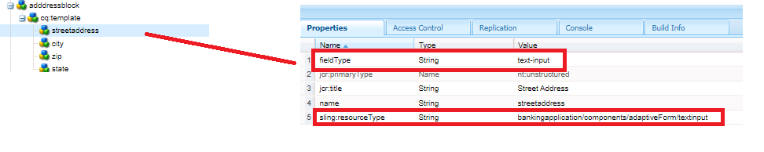

# Adrescomponent maken

Meld u aan bij CRXDE van uw lokale, voor de cloud geschikte exemplaar van AEM Forms.

Maak een kopie van het knooppunt ``/apps/bankingapplication/components/adaptiveForm/button`` en wijzig de naam van het knooppunt in addressblock. Selecteer de adressblock knoop en plaats zijn eigenschappen zoals hieronder getoond.

>[!NOTE]
>
> ``bankingapplication`` is de appId die is opgegeven bij het maken van het Maven-project. Deze appID kan in uw omgeving anders zijn. U kunt een exemplaar van om het even welke component maken, toevallig maakte ik enkel een exemplaar van de knoopcomponent

## eigenschappen van cq-sjabloonknooppunten

Selecteer het knooppunt ``cq-template`` onder het knooppunt ``addressblock`` en stel de eigenschappen ervan in zoals hieronder weergegeven. Het veldType is ingesteld op deelvenster

## Knooppunten toevoegen onder cq-sjabloon

Voeg de volgende knooppunten van het type ``nt:unstructured`` onder ``cq-template`` toe

* streetaddress
* stad
* zip
* state

Deze knopen vertegenwoordigen de gebieden van de component van het adresblok. De velden streetaddress, city en zip zijn een tekstinvoerveld en het statusveld is een vervolgkeuzeveld.

## Eigenschappen van streetadresknooppunt instellen

>[!NOTE]
>
> De **_bankingapplication_** in de weg verwijst naar appId van het gemaakte project. Dit kan in uw omgeving anders zijn

Selecteer het knooppunt ``streetaddress`` en stel de eigenschappen ervan in zoals hieronder weergegeven.

## Eigenschappen van stadsknooppunt instellen

Selecteer het knooppunt ``city`` en stel de eigenschappen ervan in zoals hieronder weergegeven.

## Eigenschappen van ZIP-knooppunt instellen

Selecteer het knooppunt ``zip`` en stel de eigenschappen ervan in zoals hieronder weergegeven.

## Eigenschappen van statusknooppunt instellen

Selecteer het knooppunt ``state`` en stel de eigenschappen ervan in zoals hieronder weergegeven. Let op het fieldType van de status - deze is ingesteld op een vervolgkeuzelijst

## Standaardwaarden instellen voor het statusveld

Selecteer het knooppunt ``state`` en voeg de volgende eigenschappen toe.

| Naam | Type | Waarde |
|----------|----------|---------------------|
| enum | String [] | CA,NY |
| enumNames | String [] | Californië, New York |

De uiteindelijke adresblokcomponent ziet er als volgt uit

## Volgende stappen

[Het project implementeren](./deploy-your-project.md)
