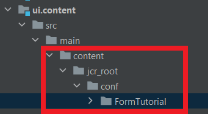

# Configuratie van cloudservices opnemen in uw project

Maak een configuratiecontainer met de naam &#39;FormTutorial&#39; om uw configuratie voor cloudservices in te stellen. Maak een configuratie voor cloudservices voor Azure Storage met de naam &#39;FormsCSAndAzureBlob&#39; in de &#39;FormTutorial&#39;-container door de gegevens van de Azure-opslagaccount en de Azure-toegangssleutel op te geven.

Open uw AEM project in IntelliJ. Zorg ervoor dat u de map FormTutorial toevoegt zoals hieronder in het project ui.content wordt weergegeven


Zorg ervoor u de volgende ingang in het ui.content- project filter.xml toevoegt

```xml
<filter root="/conf/FormTutorial" mode="replace"/>
```


## Formuliergegevensmodel opnemen in uw project

Maak een formuliergegevensmodel op basis van de configuratie voor cloudservices die u in de vorige stap hebt gemaakt. Om het model van vormgegevens in uw project te omvatten creeer de aangewezen omslagstructuur in uw AEM project in intelliJ. Mijn formuliergegevensmodel bevindt zich bijvoorbeeld in een map die registraties wordt genoemd


Neem het juiste item op in het bestand filter.xml van het project ui.content

```xml
<filter root="/content/dam/formsanddocuments-fdm/registrations" mode="replace"/>
```


>[!NOTE]
>
>Wanneer u nu uw project bouwt en implementeert met gebruik van cloudbeheer, moet u uw Azure-toegangssleutel opnieuw invoeren in de configuratie van cloudservices. Als u wilt voorkomen dat de toegangstoets opnieuw wordt ingevoerd, kunt u het beste contextbewuste configuratie maken met behulp van de omgevingsvariabelen die in het dialoogvenster [volgend artikel](./context-aware-fdm.md)
