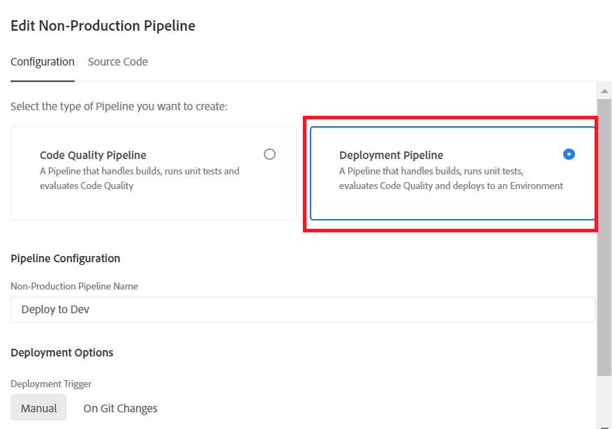

# Distribueren naar ontwikkelomgeving

In de vorige stap duwden we onze master vertakking van onze lokale git-opslagplaats naar de MyFirstAF-vertakking van de cloudbeheeropslagplaats.

De volgende stap is de code aan het ontwikkelmilieu op te stellen.
Meld u aan bij Cloud Manager en selecteer uw programma

Selecteer de Deplosie aan Dev zoals hieronder getoond

Distributiepijpleiding selecteren zoals wordt weergegeven

Selecteer de broncode en de juiste Git-vertakking

Controleer of uw wijzigingen zijn bijgewerkt

De pijplijn uitvoeren

Als de code eenmaal is geïmplementeerd, worden de wijzigingen weergegeven in de cloudservice-instantie van AEM Forms.

## Volgende stappen

[Bezig met bijwerken van toegepast archetype-project](./updating-project-archetype.md)
