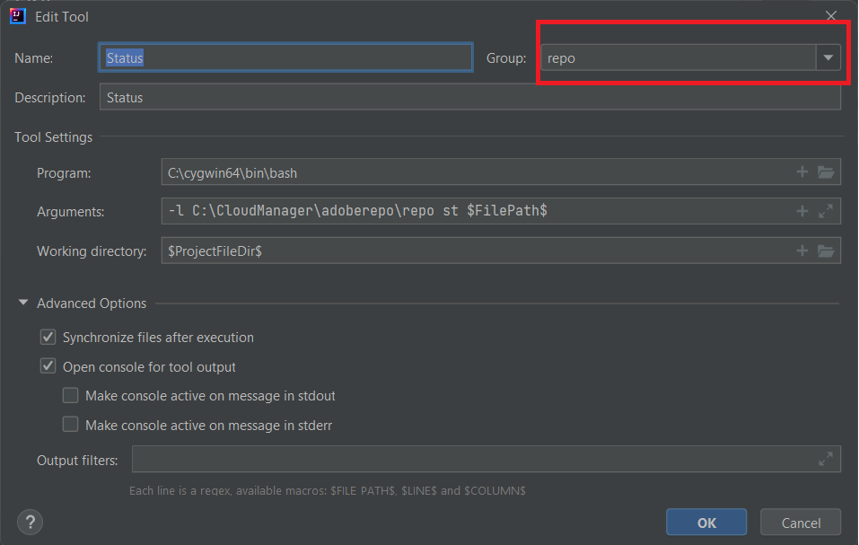

# Cygwin installeren

Cygwin is een met POSIX compatibele programmeeromgeving en runtimeomgeving die native op Microsoft Windows wordt uitgevoerd.
Installeren [Cygwin](https://www.cygwin.com/). Ik ben geïnstalleerd in de map C:\cygwin64
>[!NOTE]
> Zorg ervoor dat u ZIP-, unzip-, curl- en synchronisatiepakketten installeert met uw cygwin-installatie

Maak een map met de naam adoberepo onder de map c:\cloudmanager.

[Het gereedschap Repo installeren](https://github.com/Adobe-Marketing-Cloud/tools/tree/master/repo) U hoeft het gereedschap Repo alleen te installeren als u het repobestand kopieert en in de map c:\cloudmanger\adoberepo plaatst.

Voeg het volgende toe aan de omgevingsvariabele Pad C:\cygwin64\bin;C:\CloudManager\adoberepo;

## Externe gereedschappen instellen

* Start IntelliJ
* Druk op Ctrl+Alt+S om het instellingenvenster te openen.
* Selecteer Gereedschappen->Externe gereedschappen, klik op het plusteken (+) en voer het volgende in zoals in de schermafbeelding.
  
* Zorg ervoor dat u een groep met de naam Repo maakt door &quot;repo&quot; te typen in het vervolgkeuzemenu Groep en alle opdrachten die u maakt, behoren tot de opdracht **repo** groep

**Opdracht plaatsen**
**Programma**: C:\cygwin64\bin\bash
**Argumenten**: -l C:\CloudManager\adoberepo\repo put -f \$FilePath\$
**Werkmap**: \$ProjectFileDir\$

**Opdracht ophalen**
**Programma**: C:\cygwin64\bin\bash
**Argumenten**: -l C:\CloudManager\adoberepo\repo get -f \$FilePath\$
**Werkmap**: \$ProjectFileDir\$

**Status, opdracht**
**Programma**: C:\cygwin64\bin\bash
**Argumenten**: -l C:\CloudManager\adoberepo\repo st-f \$FilePath\$
**Werkmap**: \$ProjectFileDir\$

**Diff-opdracht**
**Programma**: C:\cygwin64\bin\bash
**Argumenten**: -l C:\CloudManager\adoberepo\repo diff -f $FilePath$
**Werkmap**: \$ProjectFileDir\$

Het .repo-bestand extraheren uit [repo.zip](assets/repo.zip) en plaatst het in de hoofdmap van uw AEM projecten. (C:\CloudManager\aem-banking-application) Open het .repo-bestand en zorg ervoor dat de server en de aanmeldingsinstellingen overeenkomen met uw omgeving.
Open het .gitignore-bestand en voeg het volgende toe onder aan het bestand en sla de wijzigingen \# repo.repo op

Selecteer elk project in uw em-bank-toepassingsproject, zoals ui.content en klik met de rechtermuisknop, en u ziet de optie Repo en onder de optie Repo ziet u de vier opdrachten die we eerder hebben toegevoegd.

## Instellen AEM instantie van auteur{#set-up-aem-author-instance}

U kunt de volgende stappen volgen om snel een cloudinstantie op uw lokale systeem in te stellen.
* [Download de nieuwste AEM SDK](https://experience.adobe.com/#/downloads/content/software-distribution/en/aemcloud.html)

* [Download de nieuwste AEM Forms addon](https://experience.adobe.com/#/downloads/content/software-distribution/en/aemcloud.html)

* De volgende mapstructuur maken c:\aemformscs\aem-sdk\author

* Extraheer het bestand aem-sdk-quickstart-xxxxxxxxx.jar uit het ZIP-bestand van de AEM SDK en plaats dit in de map c:\aemformscs\aem-sdk\author.Wijzig de naam van het jar-bestand in aem-auteur-p4502.jar

* Open de bevelherinnering en navigeer aan c:\aemformscs\aem-sdk\author ga het volgende bevel java -jar aem-auteur-p4502.jar -gui in. Hiermee wordt de installatie van AEM gestart.
* Aanmelden met admin/admin-referenties
* De AEM-instantie stoppen
* Maak de volgende mapstructuur.C:\aemformscs\aem-sdk\author\crx-quickstart\install
* Kopieer aem-forms-addon-xxxxxx.far in installatiemap
* Open de bevelherinnering en navigeer aan c:\aemformscs\aem-sdk\author ga het volgende bevel java -jar aem-auteur-p4502.jar -gui in. Hiermee implementeert u de formulieren die u toevoegt aan het pakket in uw AEM.

## Volgende stappen

[Synchroniseer uw AEM formulieren en sjablonen met AEM project](./deploy-your-first-form.md)
