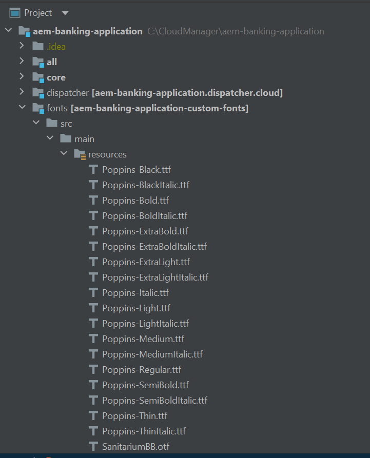

# IntelliJ installeren

Installeren [IntelliJ community edition](https://www.jetbrains.com/idea/download/#section=windows). U kunt de standaardinstellingen accepteren terwijl u dit tijdens de installatie aanbeveelt.

## Het AEM project importeren

* Start IntelliJ
* Importeer het AEM project dat u in de vorige stap hebt gemaakt. Nadat het project is geïmporteerd, moet uw scherm er ongeveer zo uitzien . U zult typisch met kern,ui.apps, ui.config en ui.content subprojecten werken.
* Als u het gemaakte en terminalvenster niet ziet, gaat u naar view->Tools Window en selecteert u Maven en Terminal

## De module Lettertypen toevoegen

Als u aangepaste lettertypen in uw PDF-bestand wilt gebruiken, moet u de aangepaste lettertypen naar de AEM Forms CS-instantie duwen. Voer de volgende stappen uit

* Een map maken met de naam **lettertypen** in C:\CloudManager\aem-banking-application
* De inhoud van [font.zip](assets/fonts.zip) in de nieuwe map met lettertypen
* In de module Lettertypen bevat een aantal aangepaste lettertypen. U kunt aangepaste lettertypen van uw organisatie toevoegen aan de map C:\CloudManager\aem-banking-application\fonts\src\main\resources van de module Lettertypen
* Het bestand C:\CloudManager\aem-banking-application\pom.xml openen
* De volgende regel toevoegen  ```<module>fonts</module>``` in het gedeelte modules van de pom.xml
* Uw pom.xml opslaan
* Vernieuw het aem-bank-toepassingsproject in IntelliJ

Projectstructuur met de module Lettertypen


De module Fonts die is opgenomen in de POM Projecten


## Volgende stappen

[Installatiegit](./setup-git.md)
