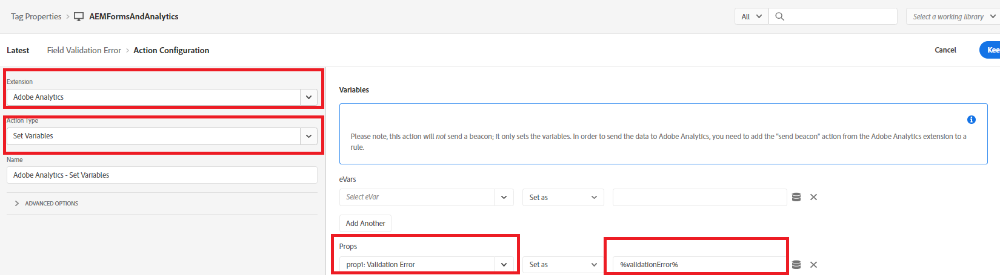

# De regel definiëren

In het bezit van Markeringen hebben wij 2 nieuw gecreeerd [regels](https://experienceleague.adobe.com/docs/platform-learn/implement-in-websites/configure-tags/add-data-elements-rules.html) (**Veldvalidatiefout en FormSubmit**).

## Veldvalidatiefout

De **Veldvalidatiefout** regel wordt geactiveerd telkens wanneer zich een validatiefout voordoet in het adaptieve formulierveld. Als het telefoonnummer of de e-mail bijvoorbeeld in ons formulier niet de verwachte indeling heeft, wordt een foutbericht voor validatie weergegeven.

De regel van de Fout van de Bevestiging van het Gebied wordt gevormd door de gebeurtenis te plaatsen aan _**Adobe Experience Manager Forms-Error**_ zoals getoond in het het schermschot

De Adobe Analytics - de Vastgestelde Variabelen worden gevormd als volgt

## Regel voor verzenden van formulier

De regel Formulier verzenden wordt geactiveerd telkens wanneer een adaptief formulier is verzonden.

De regel Formulier verzenden is geconfigureerd met de _**Adobe Experience Manager Forms - Verzenden**_ event

In de regel Formulier verzenden, de waarde van het gegevenselement _**ApplicantsStateOfResidence**_ wordt toegewezen aan prop5 en de waarde van het gegevenselement FormTitle wordt toegewezen aan prop8.

De variabelen Adobe Analytics - Set zijn als volgt geconfigureerd.

Wanneer u klaar bent om uw code van Markeringen te testen,[de aangebrachte wijzigingen in de labels publiceren](https://experienceleague.adobe.com/docs/experience-platform/tags/publish/publishing-flow.html) de publicatiestroom gebruiken.

## Volgende stappen

[De oplossing testen](./test.md)