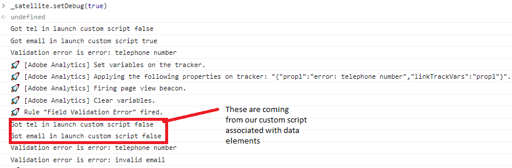

# Uw oplossing testen

Bekijk een voorbeeld van een formulier en verzend het formulier met behulp van verschillende combinaties van formulierwaarden. Sta meerdere tot 30 minuten toe om uw gegevens te bekijken in Adobe Analytics-rapporten. Gegevensset die naar props wordt gestuurd, wordt eerder weergegeven dan gegevensset die naar eVars wordt ingesteld.

## Rapportsuite

De formuliergegevens die in Adobe Analytics zijn vastgelegd, worden in donut-indeling weergegeven

**Indiening per staat**


Veldvalidatiefouten


## Foutopsporing

Zorg ervoor dat het Adaptieve formulier dezelfde configuratiecontainer gebruikt die de Adobe Launch Configuration bevat.

Ga als volgt te werk om te bevestigen dat het formulier gegevens naar Adobe Analytics verzendt

* Open de Developer Tools in uw browser.
* Typ de volgende tekst in het deelvenster Console.

```javascript
_satellite.setDebug(true)
```

Communiceer met uw formulier terwijl u het consolevenster open houdt. Je moet zoiets zien



## Adobe Experience Platform Debugger gebruiken

Voeg de [AEP-extensie foutopsporing](https://experienceleague.adobe.com/docs/experience-platform/debugger/home.html) aan uw browser (u moet zich aanmelden) om meer het zuiveren informatie te krijgen


## Gefeliciteerd

U hebt AEM Forms as a Cloud Service met Adobe Analytics geïntegreerd om formuliergegevensvelden te rapporteren.