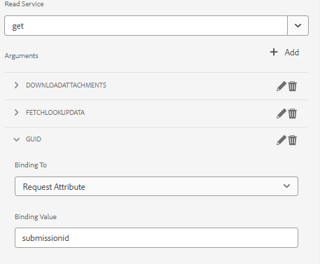

# Aangepast formulier vooraf invullen met gegevens uit de deelpuntlijst

In de vorige versie van AEM formulier(6.5) moest aangepaste code worden geschreven naar het vooraf ingevulde formuliergegevensmodel met ondersteuning voor adaptief formulier met behulp van aanvraagkenmerk. In AEM Forms als cloudservice is het niet langer nodig aangepaste code te schrijven.

In dit artikel worden de stappen beschreven die nodig zijn om een adaptief formulier vooraf in te vullen of in te vullen met gegevens die uit de SharePoint-lijst zijn opgehaald met de service voor het vooraf invullen van het formuliergegevensmodel.

In dit artikel wordt ervan uitgegaan dat u [adaptief formulier is geconfigureerd voor het verzenden van gegevens naar de SharePoint-lijst.](https://experienceleague.adobe.com/docs/experience-manager-cloud-service/content/forms/adaptive-forms-authoring/authoring-adaptive-forms-core-components/create-an-adaptive-form-on-forms-cs/configure-submit-actions-core-components.html?lang=en#connect-af-sharepoint-list)

Hier volgt een overzicht van de gegevens in de SharePoint-lijst


Als u een adaptief formulier vooraf wilt invullen met de gegevens die bij een bepaalde hulplijn horen, moeten de volgende stappen worden uitgevoerd

## Vorm de get dienst

* Een get-service maken voor het object op het hoogste niveau van het formuliergegevensmodel met het kenmerk guid
  

In deze schermafbeelding is de hulplijnkolom gebonden via een aanvraagkenmerk dat wordt aangeroepen `submissionid`.

De get dienst volledig gevormd kijkt als dit



## Het aangepaste formulier configureren voor het gebruik van de vooraf ingevulde service van het formuliergegevensmodel

* Open een adaptief formulier op basis van het formuliergegevensmodel van de lijst met deelpunten. De service Prefill-up formuliergegevensmodel koppelen
  

## Het formulier testen

Geef een voorbeeld van het formulier weer door de `submissionid` in de URL, zoals hieronder weergegeven

```html
http://localhost:4502/content/dam/formsanddocuments/contactusform/jcr:content?wcmmode=disabled&submissionid=57e12249-751a-4a38-a81f-0a4422b24412
```
