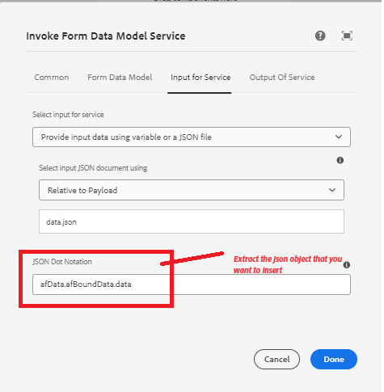
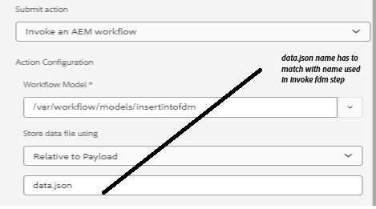

# Gegevens in SharePoint-lijst invoegen met FDM-workflowstap aanroepen


In dit artikel worden de stappen beschreven die nodig zijn om gegevens in te voegen in de SharePoint-lijst met de FDM-stap opvragen in AEM workflow.

Dit artikel veronderstelt u [ met succes gevormd adaptieve vorm hebt om gegevens naar de lijst van SharePoint voor te leggen.](https://experienceleague.adobe.com/docs/experience-manager-cloud-service/content/forms/adaptive-forms-authoring/authoring-adaptive-forms-core-components/create-an-adaptive-form-on-forms-cs/configure-submit-actions-core-components.html?lang=en#connect-af-sharepoint-list)


## Een formuliergegevensmodel maken op basis van de gegevensbron in de SharePoint-lijst

* Maak een nieuw formuliergegevensmodel op basis van de gegevensbron van de SharePoint-lijst.
* Voeg het juiste model toe en ontvang de service van het formuliergegevensmodel.
* Vorm de tussenvoegseldienst om het hoogste niveaumodelvoorwerp op te nemen.
* Test de tussenvoegseldienst.


## Een workflow maken

* Maak een eenvoudige workflow met een FDM-stap aanroepen.
* Vorm aanhalen FDM stap om het model van vormgegevens te gebruiken dat in de vorige stap wordt gecreeerd.
* 

## Adaptief formulier op basis van kerncomponenten

De ingediende gegevens hebben de volgende indeling. We moeten het ContactUS-object extraheren met behulp van puntnotatie in de workflowstap Formuliergegevensmodel aanroepen, zoals weergegeven in de schermafbeelding

```json
{
  "ContactUS": {
    "Title": "Mr",
    "Products": "Photoshop",
    "HighNetWorth": "1",
    "SubmitterName": "John Does"
  }
}
```


* 


## Adaptief formulier op basis van basiscomponenten

De ingediende gegevens hebben de volgende indeling. Extraheer het ContactUS JSON-object met de puntnotatie in de workflowstap Formuliergegevensmodel aanroepen

```json
{
    "afData": {
        "afUnboundData": {
            "data": {}
        },
        "afBoundData": {
            "data": {
                "ContactUS": {
                    "Title": "Lord",
                    "HighNetWorth": "true",
                    "SubmitterName": "John Doe",
                    "Products": "Forms"
                }
            }
        },
        "afSubmissionInfo": {
            "lastFocusItem": "guide[0].guide1[0].guideRootPanel[0].afJsonSchemaRoot[0]",
            "stateOverrides": {},
            "signers": {},
            "afPath": "/content/dam/formsanddocuments/foundationform",
            "afSubmissionTime": "20240517100126"
        }
    }
}
```



## Adaptief formulier configureren om AEM workflow te activeren

* Maak een adaptief formulier met het formuliergegevensmodel dat u eerder hebt gemaakt.
* Sleep enkele velden van de gegevensbron naar het formulier.
* De verzendactie van het formulier configureren, zoals hieronder wordt weergegeven
* 


## Het formulier testen

Bekijk een voorbeeld van het formulier dat u in de vorige stap hebt gemaakt. Vul het formulier in en verzend het. De gegevens uit het formulier moeten worden ingevoegd in de SharePoint-lijst.
