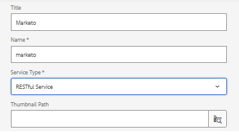

# Source voor gegevens maken

Marketo REST API&#39;s worden geverifieerd met OAuth 2.0 met twee poten. We kunnen eenvoudig een gegevensbron maken met behulp van het wagerbestand dat u in de vorige stap hebt gedownload

## Configuratiecontainer maken

* Aanmelden bij AEM.
* Klik op het hulpmiddelenmenu en dan **Browser van de Configuratie** zoals hieronder getoond

* 

* Klik op **creeer** en verstrek een betekenisvolle naam zoals hieronder getoond. Controleer of de optie Cloud Configurations (Cloud Configurations) is geselecteerd, zoals hieronder wordt weergegeven

* 

## Cloudservices maken

* Navigeer naar het menu Gereedschappen en klik vervolgens op cloudservices -> Gegevensbronnen

* 

* Selecteer de configuratiecontainer die in de vroegere stap wordt gecreeerd en klik op **creeer** om een nieuwe gegevensbron tot stand te brengen.Verstrek een betekenisvolle naam en de uitgezochte dienst RESTful van de drop-down lijst van het Type van de Dienst en klik **daarna**
* 

* Upload het wagerbestand en geef het giftype, de Client Id, de Client Secret en Access Token-URL op die specifiek zijn voor uw Marketo-instantie, zoals wordt weergegeven in de onderstaande schermafbeelding.

* Test de verbinding en als de verbinding succesvol is zorg ervoor u op de blauwe **creeert** knoop klikt om het proces te beëindigen om de gegevensbron tot stand te brengen.

* 

## Volgende stappen

[Formuliergegevensmodel maken](./part3.md)
