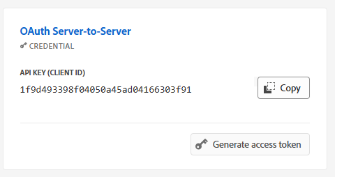

# AEM Forms Communication-API&#39;s op basis van OpenAPI configureren op AEM Forms as a Cloud Service

## Vereisten

* Laatste exemplaar van AEM Forms as a Cloud Service.
* Alle noodzakelijke [ productprofielen worden toegevoegd aan het milieu.](https://experienceleague.adobe.com/en/docs/experience-manager-learn/cloud-service/aem-apis/invoke-openapi-based-aem-apis)

* AEM API-toegang tot het productprofiel inschakelen, zoals hieronder wordt weergegeven
  
  

## Adobe Developer Console-project maken

Login aan [ Adobe Developer Console ](https://developer.adobe.com/console/) gebruikend uw Adobe ID.
Een nieuw project maken door op het juiste pictogram te klikken

Geef een betekenisvolle naam aan het project en klik op het pictogram API toevoegen

Experience Cloud selecteren

Selecteer AEM Forms Communications API en klik op Next

Controleer of u server-naar-server verificatie hebt geselecteerd en klik op Volgende

Selecteer de profielen en klik op de knop geconfigureerde API opslaan om uw instellingen op te slaan

Klik in OAuth server-aan-server

Kopieer de client-id, clientgeheim en segmenten

## AEM-instantie configureren om ADC-projectcommunicatie in te schakelen

Als u reeds een project van AEM Forms hebt, [ gelieve deze instructies ](https://experienceleague.adobe.com/en/docs/experience-manager-learn/cloud-service/aem-apis/invoke-openapi-based-aem-apis) te volgen om OAuth van het Project van Adobe Developer Console Server-aan-Server referentie ClientID toe te laten om met de instantie van AEM te communiceren

Als u geen project van AEM Forms hebt, te creëren gelieve een [ Project van AEM Forms door deze documentatie te volgen.](https://experienceleague.adobe.com/en/docs/experience-manager-learn/cloud-service/forms/developing-for-cloud-service/getting-started) en laat dan OAuth van het Project van Adobe Developer Console Server-aan-Server referentie ClientID toe om met de instantie van AEM [ te communiceren gebruikend deze documentatie.](https://experienceleague.adobe.com/en/docs/experience-manager-learn/cloud-service/aem-apis/invoke-openapi-based-aem-apis)

## Volgende stappen

[Toegangstoken genereren](./generate-access-token.md)