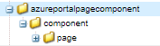

# Pagina-component

Een paginacomponent is een reguliere component die verantwoordelijk is voor het weergeven van een pagina. Er wordt een nieuwe pagina-component gemaakt en deze pagina-component wordt gekoppeld aan een nieuwe aangepaste formuliersjabloon. Zo zorgt u ervoor dat onze code alleen wordt uitgevoerd wanneer een adaptief formulier op deze specifieke sjabloon is gebaseerd.

## Pagina-component maken

Meld u aan bij uw lokale AEM Forms-exemplaar dat klaar is voor de cloud. De volgende structuur maken in de map apps


1. Klik met de rechtermuisknop op de paginamap en maak een knooppunt met de naam storeandfetch van het type cq:Component
1. Sla de wijzigingen op
1. Voeg de volgende eigenschappen toe aan de `storeandfetch` knooppunt en opslaan

| **Eigenschapnaam** | **Type eigenschap** | **Waarde van eigenschap** |
|-------------------------|-------------------|----------------------------------------|
| componentGroup | String | verborgen |
| jcr:beschrijving | String | Paginatype Adaptief formuliersjabloon |
| jcr:titel | String | Aangepaste formuliersjabloonpagina |
| sling:resourceSuperType | String | `fd/af/components/page2/aftemplatedpage` |

De `/libs/fd/af/components/page2/aftemplatedpage/aftemplatedpage.jsp` en plak het onder de `storeandfetch` knooppunt. De naam van de `aftemplatedpage.jsp` tot `storeandfetch.jsp`.

Openen `storeandfetch.jsp` en voeg de volgende regel toe:

```jsp
<cq:include script="azureportal.jsp"/>
```

onder de

```jsp
<cq:include script="fallbackLibrary.jsp"/>
```

De uiteindelijke code moet er hieronder uitzien

```jsp
<cq:include script="fallbackLibrary.jsp"/>
<cq:include script="azureportal.jsp"/>
```

Maak een bestand genaamd azureportal.jsp onder het knooppunt storeandfetch en kopieer de volgende code naar azureportal.jsp en sla de wijzigingen op

```jsp
<%@page session="false" %>
<%@include file="/libs/fd/af/components/guidesglobal.jsp" %>
<%@ page import="org.apache.commons.logging.Log" %>
<%@ page import="org.apache.commons.logging.LogFactory" %>
<%
    if(request.getParameter("guid")!=null) {
            logger.debug( "Got Guid in the request" );
            String BlobId = request.getParameter("guid");
            java.util.Map paraMap = new java.util.HashMap();
            paraMap.put("BlobId",BlobId);
            slingRequest.setAttribute("paramMap",paraMap);
    } else {
            logger.debug( "There is no Guid in the request " );
    }            
%>
```

In deze code krijgen we de waarde van de parameter request **guid** en sla deze op in een variabele met de naam BlobId. Dit BlobId wordt dan overgegaan in het hellingsverzoek gebruikend het paramMap attribuut. Om deze code te laten werken, wordt aangenomen dat u een formulier hebt dat is gebaseerd op een Azure Storage-ondersteund formuliergegevensmodel en dat de leesservice van het formuliergegevensmodel is gebonden aan een aanvraagkenmerk met de naam BlobId, zoals hieronder in de schermafbeelding wordt getoond.


### Volgende stappen

[De paginacomponent aan de sjabloon koppelen](./associate-page-component.md)
