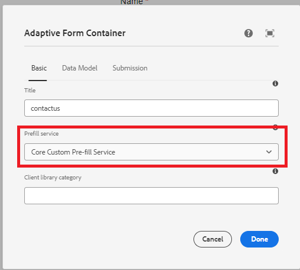

# De oplossing testen

Nadat de code is geïmplementeerd, maakt u een adaptief formulier op basis van kerncomponenten. Koppel het adaptieve formulier aan de Prefill-service, zoals in de onderstaande schermafbeelding wordt getoond.


Telkens wanneer het formulier wordt gegenereerd, wordt de bijbehorende Prefill-service uitgevoerd en wordt het formulier gevuld met de gegevens die door de Prefill-service worden geretourneerd.

U kunt bijvoorbeeld het formulier vooraf invullen met de gegevens die aan de hulplijn zijn gekoppeld **d815a2b3-5f4c-4422-8197-d0b73479bf0e**wordt de volgende URL gebruikt.
De code in de prefill dienst zal de waarde van guid parameter halen en zal de gegevens verbonden aan guid uit de gegevensbron halen.

```html
http://localhost:4502/content/dam/formsanddocuments/contactus/jcr:content?wcmmode=disabled&guid=d815a2b3-5f4c-4422-8197-d0b73479bf0e
```
