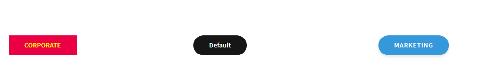

# Wijzigingen testen

Creeer een adaptieve vorm die op **&quot;Leeg met de malplaatje van de Componenten van de Kern&quot;wordt gebaseerd**. Sleep drie knoppen naar het formulier en geef deze het label &#39;&#39;Corporate&#39;&#39;, &#39;&#39;Marketing&#39;&#39; en &#39;&#39;Default&#39;&#39;.
Wijs de juiste stijlvarianten toe aan de bedrijfs- en marketingknoppen door het penseel hieronder te selecteren.

Op de derde knop wordt de standaardstijl toegepast.

## Het themaproject samenstellen

De volgende stap is het themaproject te bouwen. Navigeer aan de wortelomslag van uw themaproject en stel in werking bevel _&#x200B;**npm looppas bouwt**&#x200B;_ zoals aangetoond in het hieronder ontsproten scherm.

Zodra het themaproject met succes wordt gebouwd, zijn uw bereid om de veranderingen te testen.

## Snelle en eenvoudige manier om uw CSS te testen

* Open het bestand theme.css in de map dist van uw themaproject. Selecteer en kopieer de volledige bestandsinhoud.
* Bekijk een voorbeeld van het formulier dat u in de vorige stap hebt gemaakt.
* Klik met de rechtermuisknop op een van de knoppen en selecteer Inspecteren om de ontwikkelaarsconsole te openen.
* Klik in de ontwikkelingsconsole op theme.css om theme.css te openen
* Selecteer en schrap de volledige inhoud van theme.css door CTR-A te gebruiken en de schrappingsknoop te drukken.
* Kopieer en plak de inhoud van theme.css die u in de vroegere stap bouwde.
* De knoppen moeten worden bijgewerkt met de juiste stijlen, zoals hieronder wordt weergegeven.

## De wijzigingen verschuiven

Als u met de veranderingen wordt tevredengesteld, kunt u de veranderingen in uw wolkeninstantie duwen gebruikend de [&#x200B; front-end pijpleiding &#x200B;](https://experienceleague.adobe.com/nl/docs/experience-manager-learn/getting-started-wknd-tutorial-develop/enable-frontend-pipeline-devops/create-frontend-pipeline)
