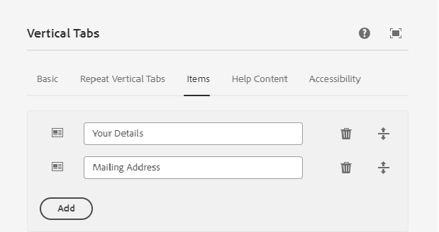

# Adaptief formulier maken

Maak een adaptief basisformulier op basis van een basiscomponent en voeg een verticale tabcomponent in uw formulier in.

## Verticale component configureren

Klik op de verticale component van lusjes om de pagina van het configuratiebezit te openen. De volgende tabbladen configureren

1. Eenvoudig - Geef een betekenisvolle naam en titel op voor de verticale tabcomponent, zoals hieronder wordt weergegeven
   
1. Items - Op het tabblad Items kunt u items toevoegen aan de verticale tabcomponent. In het algemeen voegt u een deelvenster toe als een item en voegt u vervolgens de formulierelementen toe aan het deelvenster. De verticale tab heeft standaard twee items en u kunt de items naar wens benoemen, zoals hieronder wordt weergegeven
   

## Afzonderlijke deelvensters configureren

1. Uw Details - selecteer punt 1 onder de **Uw knoop van de Informatie** en open het blad van het configuratiebezit. Geef een betekenisvolle naam en titel op zoals hieronder wordt weergegeven
   

Voeg de volgende velden toe aan het deelvenster Uw details, zoals weergegeven

1. Adres - selecteer punt 2 onder de **Uw knoop van de Informatie** en open het blad van het configuratiebezit. Geef een betekenisvolle naam en titel op zoals hieronder wordt weergegeven
   

Voeg de volgende twee tekstvelden toe aan het deelvenster Adres, zoals hieronder wordt weergegeven

