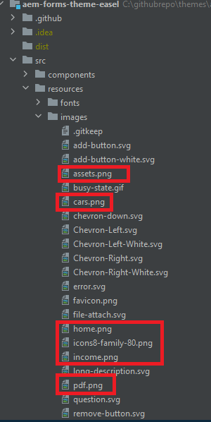

# Aangepaste pictogrammen toevoegen

Het toevoegen van aangepaste pictogrammen aan tabbladen kan de gebruikerservaring en visuele aantrekkingskracht op een aantal manieren verbeteren:

* Verbeterde bruikbaarheid: pictogrammen kunnen snel het doel van elk tabblad overbrengen, zodat gebruikers gemakkelijker kunnen zien wat ze in één oogopslag zoeken. Visuele aanwijzingen zoals pictogrammen helpen gebruikers intuïtiever te navigeren.

* Visuele hiërarchie en focus: pictogrammen maken een duidelijker scheiding tussen tabbladen, waardoor de visuele hiërarchie wordt verbeterd. Hierdoor kunnen belangrijke tabbladen beter opvallen en de aandacht van de gebruikers effectief sturen.
Als u dit artikel volgt, kunt u de pictogrammen zoals hieronder weergegeven plaatsen


## Vereisten

Als u dit artikel wilt volgen, moet u vertrouwd zijn met Git, een AEM-project maken en implementeren met cloud Manager, een front-end-pijplijn instellen in AEM Cloud Manager en een beetje CSS. Als u niet vertrouwd met de bovengenoemde onderwerpen bent, te volgen gelieve [ gebruikend thema&#39;s aan de componenten van de stijlkern ](https://experienceleague.adobe.com/nl/docs/experience-manager-cloud-service/content/forms/adaptive-forms-authoring/authoring-adaptive-forms-core-components/create-an-adaptive-form-on-forms-cs/using-themes-in-core-components#rename-env-file-theme-folder) artikel.

## Pictogrammen toevoegen aan het thema

Open het themaproject in visuele studiocode of een andere redacteur van uw keus.
Voeg de gewenste pictogrammen toe aan de map met afbeeldingen.
De rood gemarkeerde pictogrammen zijn de nieuwe pictogrammen die worden toegevoegd.


## Pictogramafbeelding maken om de pictogrammen op te slaan

Maak de pictogramkaart in het bestand _variable.scss. De kaart SCSS $icon-map is een inzameling van zeer belangrijk-waardeparen, waar elke sleutel een pictogramnaam (zoals huis, familie, enz.) vertegenwoordigt, en elke waarde is de weg aan het beelddossier verbonden aan dat pictogram.


```css
$icon-map: (
    home: "./resources/images/home.png",
    family: "./resources/images/icons8-family-80.png",
    pdf: "./resources/images/pdf.png",
    income: "./resources/images/income.png",
    assets: "./resources/images/assets.png",
    cars: "./resources/images/cars.png"
);
```

## Mengsel toevoegen

De volgende code toevoegen aan _mixin.scss

```css
@mixin add-icon-to-vertical-tab($image-url) {
  display: inline-flex;
  align-self: center;
  &::before {
    content: "";
    display:inline-block;
    background: url($image-url) left center / cover no-repeat;
    margin-right: 8px; /* Space between icon and text */
    height:40px;
    width:40px;
    vertical-align:middle;
    
  }
  
}
```

De add-icon-to-vertical-tab-mix is ontworpen om een aangepast pictogram naast de tekst op een verticaal tabblad toe te voegen. Zo kunt u eenvoudig een afbeelding als een pictogram op tabbladen plaatsen, naast de tekst plaatsen en de afbeelding opmaken om de consistentie en uitlijning te garanderen.

Onderverdeling van de mixin, dit is wat elk deel van de mix doet:

Parameters:

* $image-url: De URL van het pictogram of de afbeelding die u naast de tabtekst wilt weergeven. Als u deze parameter doorgeeft, is de mix veelzijdig omdat er zo nodig verschillende pictogrammen aan verschillende tabbladen kunnen worden toegevoegd.

* Toegepaste stijlen:

   * display: inline-flex: hiermee wordt van het element een flex-container gemaakt, waarbij alle geneste inhoud (zoals het pictogram en de tekst) horizontaal wordt uitgelijnd.
   * align-self: center: zorgt dat het element verticaal gecentreerd is in de container.
   * Pseudo-element (::before):
   * content: &quot;&quot;: initialiseert het element ::before pseudo-element, dat wordt gebruikt om het pictogram weer te geven als een achtergrondafbeelding.
   * display: inline-block: hiermee stelt u het pseudo-element in op inline-block, zodat het zich gedraagt als een pictogram dat inline met de tekst wordt geplaatst.
   * achtergrond: url($image-url) left center / cover no-repeat;: voegt de achtergrondafbeelding toe via de URL die wordt geboden via $image-url. Het pictogram wordt links uitgelijnd en verticaal gecentreerd.

## _verticaltabs.scss bijwerken

Ten behoeve van het artikel heb ik een nieuwe CSS-klasse (cmp-verticaltabs—marketing) gemaakt om de tabpictogrammen weer te geven. In deze nieuwe klasse breiden we het tabelement uit door de pictogrammen toe te voegen. De volledige lijst van de klasse css is als volgt

```css
.cmp-verticaltabs--marketing
{
  .cmp-verticaltabs
    {
      &__tab 
        {
          cursor:pointer;
            @each $name, $url in $icon-map {
            &[data-icon-name="#{$name}"]
              {
                  @include add-icon-to-vertical-tab($url);
              }
            }
        }
    }
}
```

## De component verticaltabs wijzigen

Kopieer het bestand verticaltabs.html vanuit ```/apps/core/fd/components/form/verticaltabs/v1/verticaltabs/verticaltabs.html``` en plak het onder de component verticaltabs van uw project. Voeg de volgende regel ```data-icon-name="${tab.name}"``` toe aan het gekopieerde bestand met de rol li, zoals in de onderstaande afbeelding wordt getoond

wij plaatsen een attribuut van douanegegevens genoemd gegeven-pictogram-name met de waarde van de lusjenaam. Als de lusjenaam een beeldnaam in de pictogramkaart aanpast, wordt het overeenkomstige beeld geassocieerd met het lusje.


## De code testen

Implementeer de bijgewerkte component verticaltabs in uw cloudinstantie.
Stel het bijgewerkte thema op gebruikend de frontend pijpleiding.
Maak een stijlvariatie voor de verticale tabcomponenten, zoals hieronder wordt weergegeven

Wij hebben een stijlvariatie genoemd Marketing gecreeerd die met css klasse _&#x200B;**cmp-verticaltabs-marketing**&#x200B;_ wordt geassocieerd.
Maak een adaptief formulier met een verticale tabcomponent. Koppel de verticale tabcomponent aan de variatie in de marketingstijl.
Voeg een aantal tabbladen toe aan de verticale tabbladen en geef deze de naam die overeenkomt met de afbeeldingen die zijn gedefinieerd in de pictogramkaart, zoals home,family.


Geef een voorbeeld van het formulier weer. De juiste pictogrammen worden aan het tabblad gekoppeld
