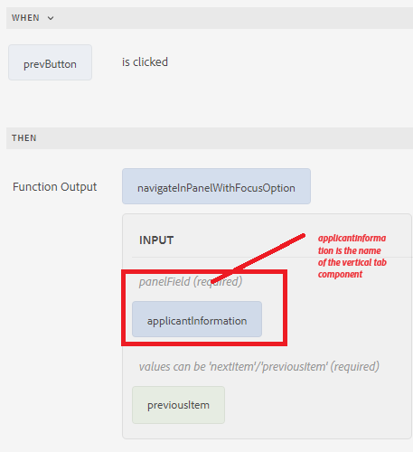

# Navigeren tussen de tabbladen

U kunt tussen de tabbladen navigeren door op de afzonderlijke tabbladen te klikken of door de knoppen Vorige en Volgende op het formulier te gebruiken.
Als u met knoppen wilt navigeren, voegt u twee knoppen toe aan het formulier en geeft u deze de namen Vorige en Volgende. Koppel de volgende aangepaste functie aan de gebeurtenis click van de knop om tussen de tabbladen te navigeren.

Hier volgt de aangepaste functie waarmee u tussen de tabbladen kunt navigeren.


```javascript
/**
 * Navigate in panel with focusOption
 * @name navigateInPanelWithFocusOption
 * @param {object} panelField
 * @param {string} focusOption - values can be 'nextItem'/'previousItem'
 * @param {scope} globals
 */
function navigateInPanelWithFocusOption(panelField, focusOption, globals)
{
    globals.functions.setFocus(panelField, focusOption);
}
```

Het volgende is de regelredacteur voor de Volgende en Vorige knopen

**Volgende Knoop**


**Vorige Knoop**


