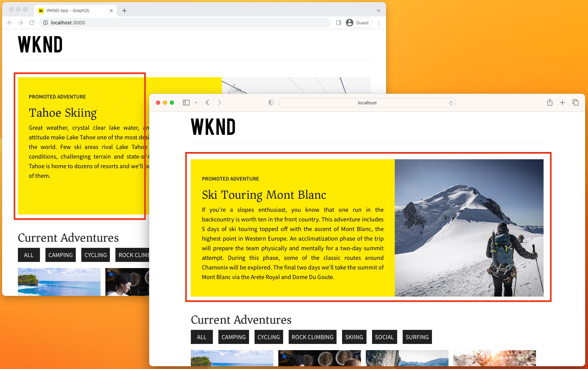

# Ervaringen zonder kop aanpassen AEM inhoudfragmenten

Deze zelfstudie verkent hoe AEM Content Fragments naar Adobe Target worden geëxporteerd en vervolgens worden gebruikt om ervaringen zonder kop aan te passen met de SDK van het Web Adobe. De [WKND-app Reageren](https://experienceleague.adobe.com/docs/experience-manager-learn/getting-started-with-aem-headless/how-to/example-apps/react-app.html) wordt gebruikt om te onderzoeken hoe een gepersonaliseerde activiteit van het Doel gebruikend de Aanbiedingen van de Fragmenten van de Inhoud aan de ervaring kan worden toegevoegd, om een avontuur te bevorderen WKND.

>[!VIDEO](https://video.tv.adobe.com/v/3416585/?quality=12&learn=on)

In de zelfstudie worden de stappen beschreven die nodig zijn voor het opzetten van AEM en Adobe Target:

1. [Adobe IMS-configuratie voor Adobe Target maken](#adobe-ims-configuration) in AEM-auteur
1. [Adobe Target-Cloud Service maken](#adobe-target-cloud-service) in AEM-auteur
1. [Adobe Target-Cloud Service toepassen op AEM Assets-mappen](#configure-asset-folders) in AEM-auteur
1. [Machtiging voor de Adobe Target-Cloud Service](#permission) in Adobe Admin Console
1. [Inhoudsfragmenten exporteren](#export-content-fragments) van AEM-auteur naar doel
1. [Een activiteit maken met Content Fragment-aanbiedingen](#activity) in Adobe Target
1. [Een Experience Platform DataStream maken](#datastream-id) in Experience Platform
1. [Integreer personalisatie in een React-gebaseerde AEM Headless-app](#code) het gebruiken van de SDK van het Web van Adobe.

## Adobe IMS-configuratie{#adobe-ims-configuration}

Een configuratie van Adobe IMS die de authentificatie tussen AEM en Adobe Target vergemakkelijkt.

Controleren [de documentatie](https://experienceleague.adobe.com/docs/experience-manager-cloud-service/content/sites/integrations/integration-adobe-target-ims.html) voor stapsgewijze instructies voor het maken van een Adobe IMS-configuratie.

>[!VIDEO](https://video.tv.adobe.com/v/3416495/?quality=12&learn=on)

## Adobe Target Cloud Service{#adobe-target-cloud-service}

In AEM wordt een Adobe Target-Cloud Service gemaakt om het exporteren van inhoudsfragmenten naar Adobe Target te vergemakkelijken.

Controleren [de documentatie](https://experienceleague.adobe.com/docs/experience-manager-cloud-service/content/sites/integrations/integrating-adobe-target.html) voor stapsgewijze instructies voor het maken van een Adobe Target-Cloud Service.

>[!VIDEO](https://video.tv.adobe.com/v/3416499/?quality=12&learn=on)


## Elementmappen configureren{#configure-asset-folders}

De Adobe Target-Cloud Service, geconfigureerd in een contextbewuste configuratie, moet worden toegepast op de AEM Assets-maphiërarchie die de Content Fragments bevat die naar Adobe Target moeten worden geëxporteerd.

+++Vergroten voor geleidelijke instructies

1. Aanmelden bij __AEM-auteurservice__ als DAM-beheerder
1. Navigeren naar __Middelen > Bestanden__, zoekt u de elementenmap met de `/conf` toegepast op
1. Selecteer de elementenmap en selecteer __Eigenschappen__ van de bovenste actiebalk
1. Selecteer __Cloud Services__ tab
1. Zorg ervoor dat de Configuratie van de Wolk aan de context-bewuste config wordt geplaatst (`/conf`) die de configuratie Adobe Target Cloud Services bevat.
1. Selecteren __Adobe Target__ van de __Configuraties van Cloud Servicen__ vervolgkeuzelijst.
1. Selecteren __Opslaan en sluiten__ rechtsboven

+++

<br/>

>[!VIDEO](https://video.tv.adobe.com/v/3416504/?quality=12&learn=on)

## Toestemming voor de integratie AEM{#permission}

De integratie van Adobe Target, die zich manifesteert als een project developer.adobe.com, moet worden toegekend aan de __Editor__ productrol in Adobe Admin Console, om Content Fragments naar Adobe Target uit te voeren.

+++Vergroten voor geleidelijke instructies

1. Meld u aan bij Experience Cloud als gebruiker die het Adobe Target-product in Adobe Admin Console kan beheren
1. Open de [Adobe Admin Console](https://adminconsole.adobe.com)
1. Selecteren __Producten__ en open vervolgens __Adobe Target__
1. Op de __Productprofielen__ tab, selecteert u __*DefaultWorkspace*__
1. Selecteer __API-referenties__ tab
1. Zoek de toepassing developer.adobe.com in deze lijst en stel de id ervan in __Productrol__ tot __Editor__

+++

<br/>

>[!VIDEO](https://video.tv.adobe.com/v/3416505/?quality=12&learn=on)

## Inhoudsfragmenten exporteren naar doel{#export-content-fragments}

Inhoudsfragmenten die onder de [geconfigureerde AEM Assets-maphiërarchie](#apply-adobe-target-cloud-service-to-aem-assets-folders) kan als Content Fragment-aanbiedingen naar Adobe Target worden geëxporteerd. Deze Content Fragment-aanbiedingen, een speciale vorm van JSON-aanbiedingen in Target, kunnen worden gebruikt in Target-activiteiten om persoonlijke ervaringen te bieden in toepassingen zonder kop.

+++Vergroten voor geleidelijke instructies

1. Aanmelden bij __AEM-auteur__ als DAM-gebruiker
1. Navigeren naar __Middelen > Bestanden__ en zoek Inhoudsfragmenten die u wilt exporteren als JSON naar Doel in de map &quot;Adobe Target ingeschakeld&quot;
1. Selecteer de inhoudsfragmenten die u wilt exporteren naar Adobe Target
1. Selecteren __Exporteren naar Adobe Target-aanbiedingen__ van de bovenste actiebalk
   + Met deze actie exporteert u de volledig gehydrateerde JSON-weergave van het inhoudsfragment naar Adobe Target als een &quot;Content Fragment-aanbieding&quot;
   + De volledig gehydrateerde JSON-representatie kan in AEM worden bekeken
      + Selecteer het inhoudsfragment
      + Het zijpaneel uitvouwen
      + Selecteren __Voorvertoning__ pictogram in het linkerzijpaneel
      + De JSON-representatie die naar Adobe Target wordt geëxporteerd, wordt weergegeven in de hoofdweergave
1. Aanmelden bij [Adobe Experience Cloud](https://experience.adobe.com) met een gebruiker in de Editor-rol voor Adobe Target
1. Van de [Experience Cloud](https://experience.adobe.com), selecteert u __Doel__ met de productschakelaar rechtsboven om Adobe Target te openen.
1. Zorg ervoor dat de standaardwerkruimte is geselecteerd in het dialoogvenster __Werkruimteschakelaar__ in de rechterbovenhoek.
1. Selecteer __Aanbiedingen__ tabblad in de bovenste navigatie
1. Selecteer __Type__ vervolgkeuzelijst en selecteren __Inhoudsfragmenten__
1. Controleren of het uit AEM geëxporteerde inhoudsfragment in de lijst wordt weergegeven
   + Houd de muisaanwijzer boven de aanbieding en selecteer de __Weergave__ knop
   + Controleer de __Aanbiedingsgegevens__ en zie __AEM diepe koppeling__ waarmee het inhoudsfragment rechtstreeks in de AEM-auteurservice wordt geopend

+++

<br/>

>[!VIDEO](https://video.tv.adobe.com/v/3416506/?quality=12&learn=on)

## Doelactiviteit met Content Fragment-aanbiedingen{#activity}

In Adobe Target kan een activiteit worden gemaakt die JSON-inhoud voor Content Fragment als inhoud gebruikt, waardoor persoonlijke ervaringen in een app zonder kop mogelijk zijn met inhoud die in AEM is gemaakt en beheerd.

In dit voorbeeld, gebruiken wij een eenvoudige activiteit A/B, nochtans kan om het even welke activiteit van het Doel worden gebruikt.

+++Vergroten voor geleidelijke instructies

1. Selecteer __Activiteiten__ tabblad in de bovenste navigatie
1. Selecteren __+ Activiteit maken__ en selecteer vervolgens het type activiteit dat u wilt maken.
   + In dit voorbeeld wordt een eenvoudig __A/B-test__ maar Aanbiedingen voor inhoudsfragmenten kunnen elk type activiteit beïnvloeden
1. In de __Activiteit maken__ wizard
   + Selecteren __Web__
   + In __Kies Experience Composer__, selecteert u __Formulier__
   + In __Werkruimte kiezen__, selecteert u __Standaardwerkruimte__
   + In __Eigenschap kiezen__ selecteert u de eigenschap waarin de activiteit beschikbaar is of selecteert u __Geen eigenschapsbeperkingen__ om het toe te staan om in alle Eigenschappen worden gebruikt.
   + Selecteren __Volgende__ om de activiteit te creëren
1. De naam van de activiteit wijzigen door __naam wijzigen__ linksboven
   + Geef de activiteit een betekenisvolle naam
1. In de eerste ervaring stelt u __Locatie 1__ voor de activiteit
   + In dit voorbeeld verwijst u naar een aangepaste locatie met de naam `wknd-adventure-promo`
1. Onder __Inhoud__ Selecteer de inhoud Standaard en selecteer __Inhoudsfragment wijzigen__
1. Selecteer het geëxporteerde inhoudsfragment dat u voor deze ervaring wilt gebruiken en selecteer __Gereed__
1. Bekijk de JSON Content Fragment Offer in het tekstgebied Inhoud. Dit is dezelfde JSON die beschikbaar is in de AEM Author-service via de Voorvertoning van Content Fragment.
1. Voeg in de linkertrack een ervaring toe en selecteer een andere Content Fragment-aanbieding die u wilt gebruiken
1. Selecteren __Volgende__ en configureer de doelregels zoals vereist voor de activiteit
   + In dit voorbeeld laat u de A/B-test handmatig 50/50 splitsen.
1. Selecteren __Volgende__ en voltooi de instellingen voor de activiteit
1. Selecteren __Opslaan en sluiten__ en een betekenisvolle naam geven
1. Selecteer bij Activiteit in Adobe Target __Activeren__ in het vervolgkeuzemenu Inactief/Activeren/archiveren rechtsboven.

De Adobe Target-activiteit die gericht is op de `wknd-adventure-promo` De locatie kan nu worden geïntegreerd en weergegeven in een AEM headless-app.

+++

<br/>

>[!VIDEO](https://video.tv.adobe.com/v/3416507/?quality=12&learn=on)

## Experience Platform DataStream-id{#datastream-id}

An [Adobe Experience Platform DataStream](https://experienceleague.adobe.com/docs/platform-learn/implement-web-sdk/initial-configuration/configure-datastream.html) De id is vereist voor AEM headless-apps die met Adobe Target werken met de [Adobe Web SDK](https://experienceleague.adobe.com/docs/experience-platform/edge/fundamentals/configuring-the-sdk.html).

+++Vergroten voor geleidelijke instructies

1. Navigeren naar [Adobe Experience Cloud](https://experience.adobe.com/)
1. Openen __Experience Platform__
1. Selecteren __Gegevensverzameling > Gegevensstromen__ en selecteert u __Nieuwe DataStream__
1. In de Nieuwe tovenaar DataStream, ga binnen:
   + Naam: `AEM Target integration`
   + Beschrijving: `Datastream used by the Adobe Web SDK to serve personalized Content Fragments Offers.`
   + Gebeurtenisschema: `Leave blank`
1. Selecteren __Opslaan__
1. Selecteren __Service toevoegen__
1. In __Service__ selecteren __Adobe Target__
   + Ingeschakeld: __Ja__
   + Token eigenschap: __Leeg laten__
   + Id doelomgeving: __Leeg laten__
      + De doelomgeving kan in Adobe Target worden ingesteld op __Beheer > Gastheren__.
   + Id-naamruimte van doel: __Leeg laten__
1. Selecteren __Opslaan__
1. Kopieer de __DataStream-id__ voor gebruik in [Adobe Web SDK](https://experienceleague.adobe.com/docs/experience-platform/edge/fundamentals/configuring-the-sdk.html) configuratieaanroep.

+++

<br/>

>[!VIDEO](https://video.tv.adobe.com/v/3416500/?quality=12&learn=on)

## Aanpassing toevoegen aan een app zonder koppen AEM{#code}

In deze zelfstudie wordt uitgelegd hoe u een eenvoudige React-app kunt personaliseren met behulp van Content Fragment-aanbiedingen in Adobe Target via [Adobe Experience Platform Web SDK](https://experienceleague.adobe.com/docs/experience-platform/edge/home.html). Deze benadering kan worden gebruikt om een JavaScript-webbeleving aan te passen.

Mobiele Android™- en iOS-ervaringen kunnen op maat worden gemaakt met behulp van vergelijkbare patronen [Adobe SDK](https://developer.adobe.com/client-sdks/documentation/).

### Vereisten

+ Node.js 14
+ Git
+ [WKND Shared 2.1.4+](https://github.com/adobe/aem-guides-wknd-shared/releases/latest) geïnstalleerd op AEM als Cloud Author and Publish-services

### Instellen

1. Download de broncode voor voorbeeld React app van [Github.com](https://github.com/adobe/aem-guides-wknd-graphql)

   ```shell
   $ mkdir -p ~/Code
   $ git clone git@github.com:adobe/aem-guides-wknd-graphql.git
   ```

1. Codebasis openen op `~/Code/aem-guides-wknd-graphql/personalization-tutorial` in uw favoriete IDE
1. Werk de host bij van de AEM service waarmee de app verbinding moet maken `~/Code/aem-guides-wknd-graphql/personalization-tutorial/src/.env.development`

   ```
   ...
   REACT_APP_HOST_URI=https://publish-p1234-e5678.adobeaemcloud.com/
   ...
   ```

1. Voer de app uit en zorg ervoor dat deze verbinding maakt met de geconfigureerde AEM. Voer vanaf de opdrachtregel de volgende handelingen uit:

   ```shell
   $ cd ~/Code/aem-guides-wknd-graphql/personalization-tutorial
   $ npm install
   $ npm run start
   ```

1. Installeer de [Adobe Web SDK](https://experienceleague.adobe.com/docs/experience-platform/edge/fundamentals/installing-the-sdk.html#option-3%3A-using-the-npm-package) als een NPM-pakket.

   ```shell
   $ cd ~/Code/aem-guides-wknd-graphql/personalization-tutorial
   $ npm install @adobe/alloy
   ```

   SDK van het Web kan in code worden gebruikt om de Aanbieding JSON van het Fragment van de Inhoud door activiteitenplaats te halen.

   Wanneer het vormen van SDK van het Web, zijn er twee vereiste identiteitskaarts:

   + `edgeConfigId` de [DataStream-id](#datastream-id)
   + `orgId` de AEM as a Cloud Service/Doel-Adobe, organisatie-id die u kunt vinden op __Experience Cloud > Profiel > Accountgegevens > Huidige organisatie-id__

   Wanneer het aanhalen van SDK van het Web, de de activiteitenplaats van Adobe Target (in ons voorbeeld, `wknd-adventure-promo`) moet worden ingesteld als de waarde in het dialoogvenster `decisionScopes` array.

   ```javascript
   import { createInstance } from "@adobe/alloy";
   const alloy = createInstance({ name: "alloy" });
   ...
   alloy("config", { ... });
   alloy("sendEvent", { ... });
   ```

### Implementatie

1. Een component React maken `AdobeTargetActivity.js` aan de oppervlakte van Adobe Target.

   __src/components/AdobeTargetActivity.js__

   ```javascript
   import React, { useEffect } from 'react';
   import { createInstance } from '@adobe/alloy';
   
   const alloy = createInstance({ name: 'alloy' });
   
   alloy('configure', { 
     'edgeConfigId': 'e3db252d-44d0-4a0b-8901-aac22dbc88dc', // AEP Datastream ID
     'orgId':'7ABB3E6A5A7491460A495D61@AdobeOrg',
     'debugEnabled': true,
   });
   
   export default function AdobeTargetActivity({ activityLocation, OfferComponent }) { 
     const [offer, setOffer] = React.useState();
   
     useEffect(() => {
       async function sendAlloyEvent() {
         // Get the activity offer from Adobe Target
         const result = await alloy('sendEvent', {
           // decisionScopes is set to an array containing the Adobe Target activity location
           'decisionScopes': [activityLocation],
         });
   
         if (result.propositions?.length > 0) {
           // Find the first proposition for the active activity location
           var proposition = result.propositions?.filter((proposition) => { return proposition.scope === activityLocation; })[0];
   
           // Get the Content Fragment Offer JSON from the Adobe Target response
           const contentFragmentOffer = proposition?.items[0]?.data?.content || { status: 'error', message: 'Personalized content unavailable'};
   
           if (contentFragmentOffer?.data) {
             // Content Fragment Offers represent a single Content Fragment, hydrated by
             // the byPath GraphQL query, we must traverse the JSON object to retrieve the 
             // Content Fragment JSON representation
             const byPath = Object.keys(contentFragmentOffer.data)[0];
             const item = contentFragmentOffer.data[byPath]?.item;
   
             if (item) {
               // Set the offer to the React state so it can be rendered
               setOffer(item);
   
               // Record the Content Fragment Offer as displayed for Adobe Target Activity reporting
               // If this request is omitted, the Target Activity's Reports will be blank
               alloy("sendEvent", {
                   xdm: {
                       eventType: "decisioning.propositionDisplay",
                       _experience: {
                           decisioning: {
                               propositions: [proposition]
                           }
                       }
                   }
               });          
             }
           }
         }
       };
   
       sendAlloyEvent();
   
     }, [activityLocation, OfferComponent]);
   
     if (!offer) {
       // Adobe Target offer initializing; we render a blank component (which has a fixed height) to prevent a layout shift
       return (<OfferComponent></OfferComponent>);
     } else if (offer.status === 'error') {
       // If Personalized content could not be retrieved either show nothing, or optionally default content.
       console.error(offer.message);
       return (<></>);
     }
   
     console.log('Activity Location', activityLocation);
     console.log('Content Fragment Offer', offer);
   
     // Render the React component with the offer's JSON
     return (<OfferComponent content={offer} />);
   };
   ```

   De component AdobeTargetActivity React wordt als volgt aangeroepen:

   ```jsx
   <AdobeTargetActivity activityLocation={"wknd-adventure-promo"} OfferComponent={AdventurePromo}/>
   ```

1. Een component React maken `AdventurePromo.js` om het avontuur te renderen dat JSON Adobe Target dient.

   Deze React component neemt volledig gehydrateerde JSON die een fragment van de avontuurinhoud vertegenwoordigt, en op een promotionele manier toont. De React componenten die JSON tonen die van de Aanbiedingen van het Fragment van de Inhoud van Adobe Target wordt onderhouden kunnen zo gevarieerd en complex zijn zoals vereist gebaseerd op de Inhoudsfragmenten die naar Adobe Target worden uitgevoerd.

   __src/components/AdventurePromo.js__

   ```javascript
   import React from 'react';
   
   import './AdventurePromo.scss';
   
   /**
   * @param {*} content is the fully hydrated JSON data for a WKND Adventure Content Fragment
   * @returns the Adventure Promo component
   */
   export default function AdventurePromo({ content }) {
       if (!content) {
           // If content is still loading, then display an empty promote to prevent layout shift when Target loads the data
           return (<div className="adventure-promo"></div>)
       }
   
       const title = content.title;
       const description = content?.description?.plaintext;
       const image = content.primaryImage?._publishUrl;
   
       return (
           <div className="adventure-promo">
               <div className="adventure-promo-text-wrapper">
                   <h3 className="adventure-promo-eyebrow">Promoted adventure</h3>
                   <h2 className="adventure-promo-title">{title}</h2>
                   <p className="adventure-promo-description">{description}</p>
               </div>
               <div className="adventure-promo-image-wrapper">
                   
               </div>
           </div>
       )
   }
   ```

   __src/components/AdventurePromo.scss__

   ```css
   .adventure-promo {
       display: flex;
       margin: 3rem 0;
       height: 400px;
   }
   
   .adventure-promo-text-wrapper {
       background-color: #ffea00;
       color: black;
       flex-grow: 1;
       padding: 3rem 2rem;
       width: 55%;
   }
   
   .adventure-promo-eyebrow {
       font-family: Source Sans Pro,Helvetica Neue,Helvetica,Arial,sans-serif;
       font-weight: 700;
       font-size: 1rem;
       margin: 0;
       text-transform: uppercase;
   }
   
   .adventure-promo-description {
       line-height: 1.75rem;
   }
   
   .adventure-promo-image-wrapper {
       height: 400px;
       width: 45%;
   }
   
   .adventure-promo-image {
       height: 100%;
       object-fit: cover;
       object-position: center center;
       width: 100%;
   }
   ```

   Deze component React wordt als volgt aangeroepen:

   ```jsx
   <AdventurePromo adventure={adventureJSON}/>
   ```

1. Voeg de component AdobeTargetActivity toe aan React app `Home.js` boven de lijst van avonturen.

   __src/components/Home.js__

   ```javascript
   import AdventurePromo from './AdventurePromo';
   import AdobeTargetActivity from './AdobeTargetActivity';
   ... 
   export default function Home() {
       ...
       return(
           <div className="Home">
   
             <AdobeTargetActivity activityLocation={"wknd-adventure-promo"} OfferComponent={AdventurePromo}/>
   
             <h2>Current Adventures</h2>
             ...
       )
   }
   ```

1. Als de React-app niet wordt uitgevoerd, kunt u deze opnieuw starten met `npm run start`.

   Open de React-app in twee verschillende browsers, zodat de A/B-test de verschillende ervaringen voor elke browser kan weergeven. Als in beide browsers dezelfde avontuuraanbieding wordt weergegeven, probeert u een van de browsers te sluiten of opnieuw te openen totdat de andere ervaring wordt weergegeven.

   In de onderstaande afbeelding ziet u de twee verschillende Content Fragment-aanbiedingen voor de `wknd-adventure-promo` Activiteit, gebaseerd op Adobe Target-logica.

   

## Gefeliciteerd!

Nu we AEM as a Cloud Service hebben geconfigureerd voor het exporteren van inhoudsfragmenten naar Adobe Target, de Content Fragments-aanbiedingen in een Adobe Target-activiteit hebben gebruikt en die activiteit in een AEM Headless-app hebben opgezocht, waardoor de ervaring wordt aangepast.
