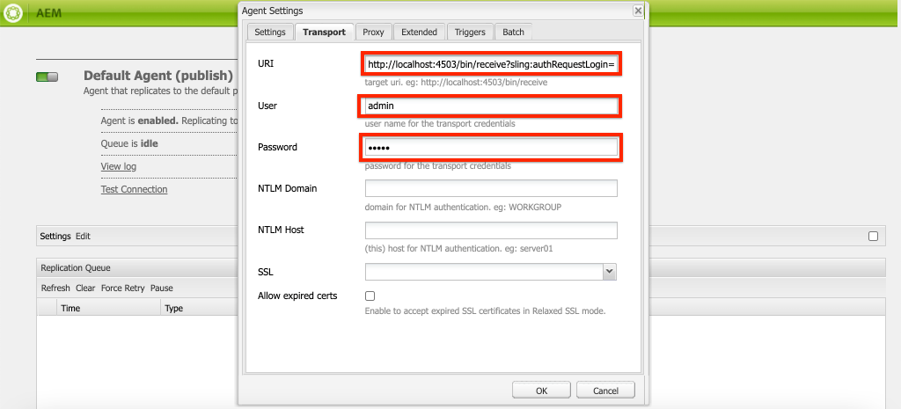

# Lokale AEM SDK instellen {#set-up-local-aem-sdk}

>[!CONTEXTUALHELP]
>id="aemcloud_localdev_aemruntime"
>title="Lokale AEM Runtime"
>abstract="Adobe Experience Manager (AEM) kan lokaal worden uitgevoerd met de AEM as a Cloud Service SDK QuickStart Jar. Dit staat ontwikkelaars toe om op te stellen aan, en douanecode, configuratie, en inhoud te testen alvorens het aan broncontrole te bevestigen, en het op te stellen aan een milieu van AEM as a Cloud Service."
>additional-url="https://experienceleague.adobe.com/docs/experience-manager-cloud-service/content/implementing/developing/aem-as-a-cloud-service-sdk.html?lang=nl-NL" text="AEM as a Cloud Service SDK"
>additional-url="https://experience.adobe.com/#/downloads/content/software-distribution/en/aemcloud.html" text="AEM as a Cloud Service SDK downloaden"

Adobe Experience Manager (AEM) kan lokaal worden uitgevoerd met de AEM as a Cloud Service SDK QuickStart Jar. Dit staat ontwikkelaars toe om op te stellen aan, en douanecode, configuratie, en inhoud te testen alvorens het aan broncontrole te bevestigen, en het op te stellen aan een milieu van AEM as a Cloud Service.

`~` wordt gebruikt als steno voor de gebruikerslijst. In Windows is dit het equivalent van `%HOMEPATH%` .

## Java™ installeren

Experience Manager is een Java™-toepassing en vereist daarom dat de Oracle Java™ SDK de ontwikkelingstool ondersteunt.

1. [&#x200B; Download en installeer recentste Java™ SDK 11 &#x200B;](https://experience.adobe.com/#/downloads/content/software-distribution/en/general.html?1_group.propertyvalues.property=.%2Fjcr%3Acontent%2Fmetadata%2Fdc%3AsoftwareType&1_group.propertyvalues.operation=equals&1_group.propertyvalues.0_values=software-type%3Atooling&fulltext=Oracle%7E+JDK%7E+11%7E&orderby=%40jcr%3Acontent%2fx jcr%3AlastModified&amp;orderby.sort=desc&amp;layout=list&amp;p.offset=0&amp;p.limit=14)
1. Controleer of Oracle Java™ 11 SDK is geïnstalleerd met de opdracht:

>[!BEGINTABS]

>[!TAB  macOS ]

```shell
$ java --version
```

>[!TAB  Vensters ]

```shell
$ java -version
```

>[!TAB  Linux® ]

```shell
$ java --version
```

>[!ENDTABS]


## Download de AEM as a Cloud Service SDK

De AEM as a Cloud Service SDK, of AEM SDK, bevat de Quickstart Jar die wordt gebruikt om AEM Author en Publish plaatselijk voor ontwikkeling, evenals de compatibele versie van de Hulpmiddelen van Dispatcher in werking te stellen.

1. Login aan [&#x200B; https://experience.adobe.com/#/downloads/content/software-distribution/en/aemcloud.html &#x200B;](https://experience.adobe.com/#/downloads/content/software-distribution/en/aemcloud.html) met uw Adobe ID
   + Merk op dat uw organisatie van Adobe ____ provisioned voor AEM as a Cloud Service moet zijn om AEM as a Cloud Service SDK te downloaden.
1. Navigeer aan het __AEM as a Cloud Service__ lusje
1. Soort door __Gepubliceerde Datum__ in __Aflopende__ orde
1. Klik op de recentste __resultaatrij van AEM SDK van 0&rbrace; &lbrace;__
1. Herzie en keur EULA goed, en tik de __Download__ knoop

## Quickstart Jar extraheren uit het zip van AEM SDK

1. Het gedownloade `aem-sdk-XXX.zip` bestand uitpakken

## Lokale AEM Author-service instellen{#set-up-local-aem-author-service}

De lokale AEM Author Service biedt ontwikkelaars een lokale ervaring met auteurs van digitale markten/content die ze delen om inhoud te maken en te beheren.  De AEM Author Service is ontworpen als zowel een ontwikkelings- als een voorvertoningsomgeving, zodat de meeste validaties van de ontwikkeling van functies kunnen worden uitgevoerd, waardoor deze service een essentieel onderdeel van het lokale ontwikkelingsproces wordt.

1. De map maken `~/aem-sdk/author`
1. Kopieer het __QuickStart JAR__ dossier aan `~/aem-sdk/author` en noem het aan `aem-author-p4502.jar` anders
1. Start de lokale AEM Auteur Service door het volgende uit te voeren vanaf de opdrachtregel:
   + `java -jar aem-author-p4502.jar`
      + Geef het beheerderswachtwoord op als `admin` . Om het even welk admin wachtwoord is aanvaardbaar, nochtans adviseert het om het gebrek voor lokale ontwikkeling te gebruiken om de behoefte te verminderen om te vormen.

   U *kunt niet* AEM beginnen als Cloud Service QuickStart Jar [&#x200B; door &#x200B;](#troubleshooting-double-click) tweemaal te klikken.
1. Heb toegang tot de lokale Dienst van de Auteur van AEM in [&#x200B; http://localhost:4502 &#x200B;](http://localhost:4502) in browser van het Web

>[!BEGINTABS]

>[!TAB  macOS ]

```shell
$ mkdir -p ~/aem-sdk/author
$ cp aem-sdk-quickstart-XXX.jar ~/aem-sdk/author/aem-author-p4502.jar
$ cd ~/aem-sdk/author
$ java -jar aem-author-p4502.jar
```

>[!TAB  Vensters ]

```shell
$ mkdir -p c:\Users\<My User>\aem-sdk\author
$ copy aem-sdk-quickstart-XXX.jar c:\Users\<My User>\aem-sdk\author\aem-author-p4502.jar
$ cd c:\Users\<My User>\aem-sdk\author
$ java -jar aem-author-p4502.jar
```

>[!TAB  Linux® ]

```shell
$ mkdir -p ~/aem-sdk/author
$ cp aem-sdk-quickstart-XXX.jar ~/aem-sdk/author/aem-author-p4502.jar
$ cd ~/aem-sdk/author
$ java -jar aem-author-p4502.jar
```

>[!ENDTABS]


## Lokale publicatieservice voor AEM instellen

De lokale AEM-publicatieservice biedt ontwikkelaars de lokale ervaring die eindgebruikers van de AEM zullen hebben, zoals bladeren door de website die op AEM wordt gehost. Een lokale AEM publiceert Dienst is belangrijk aangezien het met AEM SDK [&#x200B; hulpmiddelen van Dispatcher &#x200B;](./dispatcher-tools.md) integreert en ontwikkelaars toestaat om de definitieve eindgebruiker te roken-test en te verfijnen die ervaring onder ogen ziet.

1. De map maken `~/aem-sdk/publish`
1. Kopieer het __QuickStart JAR__ dossier aan `~/aem-sdk/publish` en noem het aan `aem-publish-p4503.jar` anders
1. Start de lokale AEM-publicatieservice door het volgende vanaf de opdrachtregel uit te voeren:
   + `java -jar aem-publish-p4503.jar`
      + Geef het beheerderswachtwoord op als `admin` . Om het even welk admin wachtwoord is aanvaardbaar, nochtans adviseert het om het gebrek voor lokale ontwikkeling te gebruiken om de behoefte te verminderen om te vormen.

   U *kunt niet* AEM beginnen als Cloud Service QuickStart Jar [&#x200B; door &#x200B;](#troubleshooting-double-click) tweemaal te klikken.
1. Heb toegang tot lokale AEM publiceer Dienst in [&#x200B; http://localhost:4503 &#x200B;](http://localhost:4503) in browser van het Web

>[!BEGINTABS]

>[!TAB  macOS ]

```shell
$ mkdir -p ~/aem-sdk/publish
$ cp aem-sdk-quickstart-XXX.jar ~/aem-sdk/publish/aem-publish-p4503.jar
$ cd ~/aem-sdk/publish
$ java -jar aem-publish-p4503.jar
```

>[!TAB  Vensters ]

```shell
$ mkdir -p c:\Users\<My User>\aem-sdk\publish
$ copy aem-sdk-quickstart-XXX.jar c:\Users\<My User>\aem-sdk\publish\aem-publish-p4503.jar
$ cd c:\Users\<My User>\aem-sdk\publish
$ java -jar aem-publish-p4503.jar
```

>[!TAB  Linux® ]

```shell
$ mkdir -p ~/aem-sdk/publish
$ cp aem-sdk-quickstart-XXX.jar ~/aem-sdk/publish/aem-publish-p4503.jar
$ cd ~/aem-sdk/publish
$ java -jar aem-publish-p4503.jar
```

>[!ENDTABS]


## Lokale AEM-services instellen in de pre-releasemodus

De lokale runtime van AEM kan op [&#x200B; pre-releasemodus &#x200B;](https://experienceleague.adobe.com/docs/experience-manager-cloud-service/content/release-notes/prerelease.html?lang=nl-NL) worden begonnen toestaand een ontwikkelaar om tegen de volgende eigenschappen van de volgende versie van AEM as a Cloud Service te bouwen. Prerelease wordt ingeschakeld door het argument `-r prerelease` door te geven bij het eerste starten van de lokale AEM-runtime. Deze kan zowel met de lokale AEM Author als met de publicatieservices van AEM worden gebruikt.


>[!BEGINTABS]

>[!TAB  macOS ]

```shell
# For AEM Author service in prerelease mode
$ java -jar aem-author-p4502.jar -r prerelease

# For AEM Publish service in prerelease mode
$ java -jar aem-publish-p4503.jar -r prerelease
```

>[!TAB  Vensters ]

```shell
# For AEM Author service in prerelease mode
$ java -jar aem-author-p4502.jar -r prerelease

# For AEM Publish service in prerelease mode
$ java -jar aem-publish-p4503.jar -r prerelease
```

>[!TAB  Linux® ]

```shell
# For AEM Author service in prerelease mode
$ java -jar aem-author-p4502.jar -r prerelease

# For AEM Publish service in prerelease mode
$ java -jar aem-publish-p4503.jar -r prerelease
```

>[!ENDTABS]

## Inhoudsdistributie simuleren {#content-distribution}

In ware Cloud Service wordt de milieu-inhoud van de Auteur aan de Publish Dienst verdeeld gebruikend [&#x200B; het Verdelen van de Inhoud &#x200B;](https://sling.apache.org/documentation/bundles/content-distribution.html) en de Pijpleiding van Adobe. [&#x200B; de Pijpleiding van Adobe &#x200B;](https://experienceleague.adobe.com/docs/experience-manager-cloud-service/core-concepts/architecture.html?lang=nl-NL#content-distribution) is een geïsoleerde microdienst beschikbaar slechts in het wolkenmilieu.

Tijdens de ontwikkeling, kan het wenselijk zijn om de distributie van inhoud te simuleren gebruikend de lokale auteur en de Publish dienst. Dit kan worden bereikt door de agenten van de erfenisReplicatie toe te laten.

>[!NOTE]
>
> De agenten van de replicatie zijn slechts beschikbaar aan gebruik in lokale QuickStart JAR en verstrekken slechts een simulatie van inhoudsdistributie.

1. Login aan de **dienst van de Auteur** en navigeer aan [&#x200B; http://localhost:4502/etc/replication/agents.author.html &#x200B;](http://localhost:4502/etc/replication/agents.author.html).
1. Klik **StandaardAgent (publiceren)** om de agent van de standaardReplicatie te openen.
1. Klik **uitgeven** om de configuratie van de agent te openen.
1. Onder het **lusje van Montages**, werk de volgende gebieden bij:

   + **Toegelaten** - controle waar
   + **Gebruiker - identiteitskaart van de Agent** - verlaat dit gebied leeg

   

1. Onder het **Vervoer** lusje, werk de volgende gebieden bij:

   + **URI** - `http://localhost:4503/bin/receive?sling:authRequestLogin=1`
   + **Gebruiker** - `admin`
   + **Wachtwoord** - `admin`

   

1. Klik **O.K.** om de configuratie te bewaren en de **Standaard** Agent van de Replicatie toe te laten.
1. U kunt nu wijzigingen aanbrengen in de inhoud van de service Auteur en deze publiceren naar de service Publiceren.


## Snelstartmodi voor Jar

De naam van de QuickStart-jar `aem-<tier>_<environment>-p<port number>.jar` geeft aan hoe deze wordt gestart. Als AEM eenmaal is gestart in een specifieke laag, auteur of publicatie, kan deze niet worden gewijzigd in de alternatieve laag. Hiervoor moet de map `crx-Quickstart` die tijdens de eerste uitvoering wordt gegenereerd, worden verwijderd en moet QuickStart Jar opnieuw worden uitgevoerd. Het milieu en de Havens kunnen worden veranderd, nochtans vereisen zij einde/begin van de lokale instantie van AEM.

Het wijzigen van omgevingen ( `dev` , `stage` en `prod` ) kan handig zijn voor ontwikkelaars om ervoor te zorgen dat omgevingspecifieke configuraties correct worden gedefinieerd en opgelost door AEM. Aanbevolen wordt om lokale ontwikkeling voornamelijk uit te voeren in de standaarduitvoermodus van de `dev` -omgeving.

De beschikbare permutaties zijn als volgt:

| Quickstart Jar-bestandsnaam | Beschrijving van modus |
|------------------------------|-----------------------------------------------------------------------------|
| `aem-author-p4502.jar` | Als Auteur in Dev loopwijze op haven 4502 |
| `aem-author_dev-p4502.jar` | Als auteur in Dev loopwijze op haven 4502 (het zelfde als `aem-author-p4502.jar`) |
| `aem-author_stage-p4502.jar` | Als Auteur in Staging run mode op poort 4502 |
| `aem-author_prod-p4502.jar` | Als Auteur in de run mode van de Productie op haven 4502 |
| `aem-publish-p4503.jar` | Als Publiceren in Dev loopwijze op haven 4503 |
| `aem-publish_dev-p4503.jar` | Zoals publiceren in de uitvoermodus Dev op poort 4503 (zelfde als `aem-publish-p4503.jar`) |
| `aem-publish_stage-p4503.jar` | Als Publiceren in Staging-uitvoeringsmodus op poort 4503 |
| `aem-publish_prod-p4503.jar` | Als Publish op de loopwijze van de Productie op haven 4503 |

Merk op dat het havenaantal om het even welke beschikbare haven op de lokale ontwikkelingsmachine kan zijn, echter door overeenkomst:

+ De haven __4502__ wordt gebruikt voor de __lokale dienst van de Auteur van AEM__
+ De haven __4503__ wordt gebruikt voor de __lokale AEM publiceer dienst__

Als u deze instellingen wijzigt, moet u mogelijk aanpassingen aanbrengen in AEM SDK-configuraties

## Een lokale AEM-runtime stoppen

Als u een lokale AEM-runtime wilt stoppen (AEM Author of Publish service), opent u het opdrachtregelvenster waarmee de AEM Runtime is gestart en tikt u op `Ctrl-C` . Wacht tot AEM is afgesloten. Wanneer het sluitingsproces volledig is, is de herinnering van de bevellijn beschikbaar.

## Optionele lokale instellingstaken voor AEM-runtime

+ __OSGi de variabelen van het configuratiemilieu en geheim variabelen__ zijn [&#x200B; speciaal plaats voor lokale runtime van AEM &#x200B;](https://experienceleague.adobe.com/docs/experience-manager-cloud-service/implementing/deploying/configuring-osgi.html?lang=nl-NL#local-development), eerder dan het beheren van hen die air CLI gebruiken.

## Wanneer werkt u de QuickStart-jar bij

Werk de AEM SDK ten minste maandelijks bij op of kort na de laatste donderdag van elke maand. Dit is de releasekaart voor de &quot;feature releases&quot; van AEM as a Cloud Service.

>[!WARNING]
>
> Als u de QuickStart-jar wilt bijwerken naar een nieuwe versie, moet u de volledige lokale ontwikkelomgeving vervangen. Dit leidt tot verlies van alle code, configuratie en inhoud in de lokale AEM-opslagruimten. Zorg ervoor dat code, config of inhoud die niet zou moeten worden vernietigd veilig aan Git wordt begaan, of uit de lokale instantie van AEM als Pakketten van AEM wordt uitgevoerd.

### Inhoud verliezen bij upgrades van de AEM SDK voorkomen

Door de AEM SDK te upgraden wordt in feite een geheel nieuwe AEM-runtime gemaakt, waaronder een nieuwe opslagplaats. Dit betekent dat eventuele wijzigingen die zijn aangebracht in een eerdere AEM SDK-opslagplaats verloren gaan. Hieronder vindt u levensvatbare strategieën voor het ondersteunen van blijvende inhoud tussen AEM SDK-upgrades, die u op discrete wijze of in overleg kunt gebruiken:

1. Maak een inhoudspakket dat gewijd is aan het bevatten van &#39;sample&#39;-inhoud voor hulp bij ontwikkeling en onderhoud dit in Git. Alle inhoud die door AEM SDK-upgrades moet worden gecontinueerd, blijft in dit pakket aanwezig en wordt opnieuw geïmplementeerd nadat de AEM SDK is bijgewerkt.
1. Gebruik [&#x200B; eiken-verbetering &#x200B;](https://jackrabbit.apache.org/oak/docs/migration.html) met de `includepaths` richtlijn, om inhoud van de vroegere bewaarplaats van AEM SDK aan de nieuwe bewaarplaats van AEM SDK te kopiëren.
1. Maak een back-up van alle inhoud met AEM Package Manager en inhoudspakketten op de eerdere AEM SDK en installeer deze opnieuw op de nieuwe AEM SDK.

Houd er rekening mee dat met de bovenstaande methoden code wordt onderhouden tussen AEM SDK-upgrades en dat dit een anti-patroonontwikkelingstitel aangeeft. Niet-wegwerpcode moet afkomstig zijn uit uw ontwikkelings-IDE en via implementaties overstappen op AEM SDK.

## Problemen oplossen

### Als u dubbelklikt op het QuickStart Jar-bestand, treedt er een fout op{#troubleshooting-double-click}

Wanneer u dubbelklikt op de Quickstart Jar om te starten, wordt een modaal foutbericht weergegeven om te voorkomen dat AEM lokaal wordt gestart.


AEM as a Cloud Service Quickstart Jar biedt namelijk geen ondersteuning voor dubbelklikken op de QuickStart Jar om AEM lokaal te starten. In plaats daarvan moet u het Jar-bestand vanaf die opdrachtregel uitvoeren.

Als u de AEM Auteur-service wilt starten, gaat u naar `cd` in de map met de Quickstart Jar en voert u de opdracht uit:

>[!BEGINTABS]

>[!TAB  macOS ]

```shell
$ java -jar aem-author-p4502.jar
```

>[!TAB  Vensters ]

```shell
$ java -jar aem-author-p4502.jar
```

>[!TAB  Linux® ]

```shell
$ java -jar aem-author-p4502.jar
```

>[!ENDTABS]

of, om de AEM-publicatieservice te starten, `cd` in de map met de Quickstart Jar en voer de opdracht uit:

>[!BEGINTABS]

>[!TAB  macOS ]

```shell
$ java -jar aem-publish-p4503.jar
```

>[!TAB  Vensters ]

```shell
$ java -jar aem-publish-p4503.jar
```

>[!TAB  Linux® ]

```shell
$ java -jar aem-publish-p4503.jar
```

>[!ENDTABS]

### Het beginnen van Jar Quickstart van de bevellijn aborteert onmiddellijk{#troubleshooting-java-8}

Bij het starten van de Quickstart Jar vanaf de opdrachtregel wordt het proces onmiddellijk afgebroken en start de AEM-service niet, met de volgende fout:

```shell
➜  ~/aem-sdk/author: java -jar aem-author-p4502.jar
Loading quickstart properties: default
Loading quickstart properties: instance
java.lang.Exception: Quickstart requires a Java Specification 11 VM, but your VM (Java HotSpot(TM) 64-Bit Server VM / Oracle Corporation) reports java.specification.version=1.8
  at com.adobe.granite.quickstart.base.impl.Main.checkEnvironment(Main.java:1046)
  at com.adobe.granite.quickstart.base.impl.Main.<init>(Main.java:646)
  at com.adobe.granite.quickstart.base.impl.Main.main(Main.java:981)
Quickstart: aborting
```

AEM as a Cloud Service heeft Java™ SDK 11 nodig en u gebruikt een andere versie, waarschijnlijk Java™ 8. Om deze kwestie op te lossen, download en installeer [&#x200B; Oracle Java™ SDK 11 &#x200B;](https://experience.adobe.com/#/downloads/content/software-distribution/en/general.html?1_group.propertyvalues.property=.%2Fjcr%3Acontent%2Fmetadata%2Fdc%3AsoftwareType&1_group.propertyvalues.operation=equals&1_group.propertyvalues.0_values=software-type%3Atooling&fulltext=Oracle%7E+JDK%7E+11%7E&orderby=%40jcr%3Acontent%2fx jcr%3AlastModified&amp;orderby.sort=desc&amp;layout=list&amp;p.offset=0&amp;p.limit=14).

Nadat Oracle Java™ 11 SDK is geïnstalleerd, controleert u of dit de actieve versie is door de opdracht uit te voeren vanaf de opdrachtregel:

>[!BEGINTABS]

>[!TAB  macOS ]

```shell
$ java --version
```

>[!TAB  Vensters ]

```shell
$ java -version
```

>[!TAB  Linux® ]

```shell
$ java --version
```

>[!ENDTABS]

## Aanvullende bronnen

+ [&#x200B; Download AEM SDK &#x200B;](https://experience.adobe.com/#/downloads)
+ [&#x200B; Adobe Cloud Manager &#x200B;](https://my.cloudmanager.adobe.com/)
+ [&#x200B; Docker van de Download &#x200B;](https://www.docker.com/)
+ [&#x200B; de Documentatie van Experience Manager Dispatcher &#x200B;](https://experienceleague.adobe.com/docs/experience-manager-dispatcher/using/dispatcher.html?lang=nl-NL)
