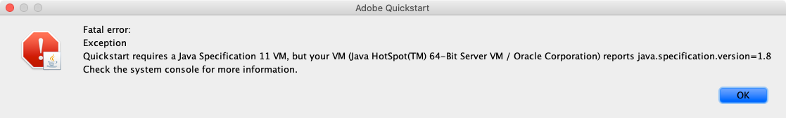

# Lokale AEM SDK instellen {#set-up-local-aem-sdk}

>[!CONTEXTUALHELP]
>id="aemcloud_localdev_aemruntime"
>title="Lokale AEM Runtime"
>abstract="Adobe Experience Manager (AEM) kan lokaal worden uitgevoerd met de AEM as a Cloud Service SDK QuickStart Jar. Dit staat ontwikkelaars toe om op te stellen aan, en douanecode, configuratie, en inhoud te testen alvorens het aan broncontrole te bevestigen, en het op te stellen aan een milieu van AEM as a Cloud Service."
>additional-url="https://experienceleague.adobe.com/docs/experience-manager-cloud-service/content/implementing/developing/aem-as-a-cloud-service-sdk.html" text="AEM as a Cloud Service SDK"
>additional-url="https://experience.adobe.com/#/downloads/content/software-distribution/en/aemcloud.html" text="AEM as a Cloud Service SDK downloaden"

Adobe Experience Manager (AEM) kan lokaal worden uitgevoerd met de AEM as a Cloud Service SDK QuickStart Jar. Dit staat ontwikkelaars toe om op te stellen aan, en douanecode, configuratie, en inhoud te testen alvorens het aan broncontrole te bevestigen, en het op te stellen aan een milieu van AEM as a Cloud Service.

`~` wordt gebruikt als steno voor de gebruikerslijst. In Windows is dit het equivalent van `%HOMEPATH%` .

## Java™ installeren

Experience Manager is een Java™-toepassing en vereist daarom de Oracle Java™ SDK voor ondersteuning van de ontwikkelingstool.

1. [ Download en installeer recentste Java™ SDK 11 ](https://experience.adobe.com/#/downloads/content/software-distribution/en/general.html?1_group.propertyvalues.property=.%2Fjcr%3Acontent%2Fmetadata%2Fdc%3AsoftwareType&amp;1_group.propertyvalues.operation=equals&amp;1_group.propertyvalues.0_values=software-type%3Atooling&amp;fulltext=Oracle%7E+JDK%7E+11%7E&amp;orderby=%40jcr%3Acontent%2 Fjcr%3AlastModified&amp;orderby.sort=desc&amp;layout=list&amp;p.offset=0&amp;p.limit=14)
1. Controleer of Oracle Java™ 11 SDK is geïnstalleerd door de opdracht uit te voeren:

>[!BEGINTABS]

>[!TAB  macOS ]

```shell
$ java --version
```

>[!TAB  Vensters ]

```shell
$ java -version
```

>[!TAB  Linux® ]

```shell
$ java --version
```

>[!ENDTABS]


## Download de AEM as a Cloud Service SDK

De AEM as a Cloud Service SDK, of AEM SDK, bevat de Quickstart Jar die wordt gebruikt om AEM Auteur en Publish lokaal voor ontwikkeling in werking te stellen, evenals de compatibele versie van Dispatcher Tools.

1. Login aan [ https://experience.adobe.com/#/downloads ](https://experience.adobe.com/#/downloads) met uw Adobe ID
   + Merk op dat uw organisatie van de Adobe ____ voor AEM as a Cloud Service moet worden provisioned om AEM as a Cloud Service SDK te downloaden.
1. Navigeer aan het __AEM as a Cloud Service__ lusje
1. Soort door __Gepubliceerde Datum__ in __Aflopende__ orde
1. Klik op de recentste __AEM SDK__ resultaatrij
1. Herzie en keur EULA goed, en tik de __Download__ knoop

## De QuickStart-jar extraheren uit het ZIP van AEM SDK

1. Het gedownloade `aem-sdk-XXX.zip` bestand uitpakken

## Lokale AEM Auteur-service instellen{#set-up-local-aem-author-service}

De lokale AEM Auteur Service biedt ontwikkelaars een lokale ervaring met ontwerpers van digitale markten/content die ze delen om inhoud te maken en te beheren.  AEM Auteursdienst wordt ontworpen zowel als creatie als voorproefmilieu, toestaand de meeste bevestigingen van eigenschapontwikkeling kunnen tegen het worden uitgevoerd, die tot het een essentieel element van het lokale ontwikkelingsproces maken.

1. De map maken `~/aem-sdk/author`
1. Kopieer het __QuickStart JAR__ dossier aan `~/aem-sdk/author` en noem het aan `aem-author-p4502.jar` anders
1. Start de lokale AEM Auteur Service door het volgende uit te voeren vanaf de opdrachtregel:
   + `java -jar aem-author-p4502.jar`
      + Geef het beheerderswachtwoord op als `admin` . Om het even welk admin wachtwoord is aanvaardbaar, nochtans adviseert het om het gebrek voor lokale ontwikkeling te gebruiken om de behoefte te verminderen om te vormen.

   U *kunt niet* beginnen AEM als Cloud Service QuickStart Jar [ door ](#troubleshooting-double-click) tweemaal te klikken.
1. Heb toegang tot de lokale AEM Dienst van de Auteur in [ http://localhost:4502 ](http://localhost:4502) in browser van het Web

>[!BEGINTABS]

>[!TAB  macOS ]

```shell
$ mkdir -p ~/aem-sdk/author
$ cp aem-sdk-Quickstart-XXX.jar ~/aem-sdk/author/aem-author-p4502.jar
$ cd ~/aem-sdk/author
$ java -jar aem-author-p4502.jar
```

>[!TAB  Vensters ]

```shell
$ mkdir -p c:\Users\<My User>\aem-sdk\author
$ copy aem-sdk-Quickstart-XXX.jar c:\Users\<My User>\aem-sdk\author\aem-author-p4502.jar
$ cd c:\Users\<My User>\aem-sdk\author
$ java -jar aem-author-p4502.jar
```

>[!TAB  Linux® ]

```shell
$ mkdir -p ~/aem-sdk/author
$ cp aem-sdk-Quickstart-XXX.jar ~/aem-sdk/author/aem-author-p4502.jar
$ cd ~/aem-sdk/author
$ java -jar aem-author-p4502.jar
```

>[!ENDTABS]


## Lokale AEM Publish-service instellen

De lokale AEM Publish Service biedt ontwikkelaars de lokale ervaring die eindgebruikers van de AEM zullen hebben, zoals bladeren door de website die op AEM wordt gehost. Een lokale AEMDienst van Publish is belangrijk aangezien het met AEM SDK [ hulpmiddelen van Dispatcher ](./dispatcher-tools.md) integreert en ontwikkelaars toestaat om de definitieve eindgebruiker te roken-test en te verfijnen die ervaring onder ogen ziet.

1. De map maken `~/aem-sdk/publish`
1. Kopieer het __QuickStart JAR__ dossier aan `~/aem-sdk/publish` en noem het aan `aem-publish-p4503.jar` anders
1. Start de lokale AEM Publish Service door het volgende uit te voeren vanaf de opdrachtregel:
   + `java -jar aem-publish-p4503.jar`
      + Geef het beheerderswachtwoord op als `admin` . Om het even welk admin wachtwoord is aanvaardbaar, nochtans adviseert het om het gebrek voor lokale ontwikkeling te gebruiken om de behoefte te verminderen om te vormen.

   U *kunt niet* beginnen AEM als Cloud Service QuickStart Jar [ door ](#troubleshooting-double-click) tweemaal te klikken.
1. Heb toegang tot de lokale Dienst van AEMPublish in [ http://localhost:4503](http://localhost:4503) in browser van het Web

>[!BEGINTABS]

>[!TAB  macOS ]

```shell
$ mkdir -p ~/aem-sdk/publish
$ cp aem-sdk-Quickstart-XXX.jar ~/aem-sdk/publish/aem-publish-p4503.jar
$ cd ~/aem-sdk/publish
$ java -jar aem-publish-p4503.jar
```

>[!TAB  Vensters ]

```shell
$ mkdir -p c:\Users\<My User>\aem-sdk\publish
$ copy aem-sdk-Quickstart-XXX.jar c:\Users\<My User>\aem-sdk\publish\aem-publish-p4503.jar
$ cd c:\Users\<My User>\aem-sdk\publish
$ java -jar aem-publish-p4503.jar
```

>[!TAB  Linux® ]

```shell
$ mkdir -p ~/aem-sdk/publish
$ cp aem-sdk-Quickstart-XXX.jar ~/aem-sdk/publish/aem-publish-p4503.jar
$ cd ~/aem-sdk/publish
$ java -jar aem-publish-p4503.jar
```

>[!ENDTABS]


## Lokale AEM instellen in de pre-releasemodus

De lokale AEM runtime kan op [ pre-releasemodus ](https://experienceleague.adobe.com/docs/experience-manager-cloud-service/content/release-notes/prerelease.html) worden begonnen toestaand een ontwikkelaar om tegen de volgende eigenschappen van de volgende versie van AEM as a Cloud Service te bouwen. Prerelease wordt ingeschakeld door het argument `-r prerelease` door te geven bij het eerste starten van de lokale AEM runtime. Dit kan zowel met lokale AEM Auteur als AEM de diensten van Publish worden gebruikt.


>[!BEGINTABS]

>[!TAB  macOS ]

```shell
# For AEM Author service in prerelease mode
$ java -jar aem-author-p4502.jar -r prerelease

# For AEM Publish service in prerelease mode
$ java -jar aem-publish-p4503.jar -r prerelease
```

>[!TAB  Vensters ]

```shell
# For AEM Author service in prerelease mode
$ java -jar aem-author-p4502.jar -r prerelease

# For AEM Publish service in prerelease mode
$ java -jar aem-publish-p4503.jar -r prerelease
```

>[!TAB  Linux® ]

```shell
# For AEM Author service in prerelease mode
$ java -jar aem-author-p4502.jar -r prerelease

# For AEM Publish service in prerelease mode
$ java -jar aem-publish-p4503.jar -r prerelease
```

>[!ENDTABS]

## Inhoudsdistributie simuleren {#content-distribution}

In een ware milieu van de Cloud Service wordt de inhoud van de Auteur van de Dienst aan de Dienst van Publish verdeeld gebruikend [ het Verzenden van Inhoud ](https://sling.apache.org/documentation/bundles/content-distribution.html) en de Pijpleiding van de Adobe. De [ Pijpleiding van de Adobe ](https://experienceleague.adobe.com/docs/experience-manager-cloud-service/core-concepts/architecture.html?lang=en#content-distribution) is een geïsoleerde microdienst beschikbaar slechts in het wolkenmilieu.

Tijdens de ontwikkeling, kan het wenselijk zijn om de distributie van inhoud te simuleren gebruikend de lokale dienst van de Auteur en van Publish. Dit kan worden bereikt door de agenten van de erfenisReplicatie toe te laten.

>[!NOTE]
>
> De agenten van de replicatie zijn slechts beschikbaar aan gebruik in lokale QuickStart JAR en verstrekken slechts een simulatie van inhoudsdistributie.

1. Login aan de **dienst van de Auteur** en navigeer aan [ http://localhost:4502/etc/replication/agents.author.html ](http://localhost:4502/etc/replication/agents.author.html).
1. Klik **StandaardAgent (publiceren)** om de agent van de standaardReplicatie te openen.
1. Klik **uitgeven** om de configuratie van de agent te openen.
1. Onder het **lusje van Montages**, werk de volgende gebieden bij:

   + **Toegelaten** - controle waar
   + **Gebruiker - identiteitskaart van de Agent** - verlaat dit gebied leeg

   

1. Onder het **Vervoer** lusje, werk de volgende gebieden bij:

   + **URI** - `http://localhost:4503/bin/receive?sling:authRequestLogin=1`
   + **Gebruiker** - `admin`
   + **Wachtwoord** - `admin`

   

1. Klik **O.K.** om de configuratie te bewaren en de **Standaard** Agent van de Replicatie toe te laten.
1. U kunt nu wijzigingen aanbrengen in de inhoud van de Auteur-service en deze publiceren naar de Publish-service.


## Snelstartmodi voor Jar

De naam van de QuickStart-jar `aem-<tier>_<environment>-p<port number>.jar` geeft aan hoe deze wordt gestart. Wanneer AEM zoals begonnen in een specifieke rij, auteur of publiceert, kan het niet in de afwisselende rij worden veranderd. Hiervoor moet de map `crx-Quickstart` die tijdens de eerste uitvoering wordt gegenereerd, worden verwijderd en moet QuickStart Jar opnieuw worden uitgevoerd. Het milieu en de Havens kunnen worden veranderd, nochtans vereisen zij einde/begin van de lokale AEM instantie.

Het wijzigen van omgevingen ( `dev` , `stage` en `prod` ) kan handig zijn voor ontwikkelaars om ervoor te zorgen dat omgevingspecifieke configuraties correct worden gedefinieerd en AEM worden omgezet. Aanbevolen wordt om lokale ontwikkeling voornamelijk uit te voeren in de standaarduitvoermodus van de `dev` -omgeving.

De beschikbare permutaties zijn als volgt:

| Quickstart Jar-bestandsnaam | Beschrijving van modus |
|------------------------------|-----------------------------------------------------------------------------|
| `aem-author-p4502.jar` | Als Auteur in Dev loopwijze op haven 4502 |
| `aem-author_dev-p4502.jar` | Als auteur in Dev loopwijze op haven 4502 (het zelfde als `aem-author-p4502.jar`) |
| `aem-author_stage-p4502.jar` | Als Auteur in Staging run mode op poort 4502 |
| `aem-author_prod-p4502.jar` | Als Auteur in de run mode van de Productie op haven 4502 |
| `aem-publish-p4503.jar` | Als Publish in Dev run mode op poort 4503 |
| `aem-publish_dev-p4503.jar` | Als Publish in de uitvoermodus Dev op poort 4503 (gelijk aan `aem-publish-p4503.jar`) |
| `aem-publish_stage-p4503.jar` | Als Publish in de uitvoeringsmodus Staging op poort 4503 |
| `aem-publish_prod-p4503.jar` | Als Publish in productiemodus op poort 4503 |

Merk op dat het havenaantal om het even welke beschikbare haven op de lokale ontwikkelingsmachine kan zijn, echter door overeenkomst:

+ De haven __4502__ wordt gebruikt voor de __lokale AEM dienst van de Auteur__
+ De haven __4503__ wordt gebruikt voor de __lokale dienst van AEMPublish__

Als u deze instellingen wijzigt, moet u mogelijk AEM SDK-configuraties aanpassen

## Een lokale AEM-runtime stoppen

Als u een lokale AEM-runtime wilt stoppen, AEM de Auteur of de Publish-service, opent u het opdrachtregelvenster dat is gebruikt om de AEM Runtime te starten en tikt u op `Ctrl-C` . Wacht tot AEM is afgesloten. Wanneer het sluitingsproces volledig is, is de herinnering van de bevellijn beschikbaar.

## Optionele lokale AEM-runtime instellingstaken

+ __OSGi de variabelen van het configuratiemilieu en geheim variabelen__ zijn [ speciaal plaats voor AEM lokale runtime ](https://experienceleague.adobe.com/docs/experience-manager-cloud-service/implementing/deploying/configuring-osgi.html#local-development), eerder dan het beheren van hen die de lucht CLI gebruiken.

## Wanneer werkt u de QuickStart-jar bij

Werk de AEM SDK ten minste maandelijks bij op of kort na de laatste donderdag van elke maand. Dit is de releasekaart voor de &quot;feature releases&quot; van AEM as a Cloud Service.

>[!WARNING]
>
> Als u de QuickStart-jar wilt bijwerken naar een nieuwe versie, moet u de volledige lokale ontwikkelomgeving vervangen. Dit leidt tot verlies van alle code, configuratie en inhoud in de lokale AEM. Zorg ervoor dat om het even welke code, config of inhoud die niet zou moeten worden vernietigd veilig aan Git wordt begaan, of uit de lokale AEM instantie als AEM Pakketten wordt uitgevoerd.

### Hoe te vermijden inhoudsverlies wanneer het bevorderen van de AEM SDK

Door de upgrade van de AEM SDK wordt in feite een geheel nieuwe AEM-runtime gemaakt, waaronder een nieuwe opslagplaats. Dit betekent dat eventuele wijzigingen in een eerdere AEM SDK-opslagplaats verloren gaan. Hieronder vindt u levensvatbare strategieën voor het ondersteunen van blijvende inhoud tussen AEM SDK-upgrades. U kunt deze strategieën op discrete wijze of in overleg gebruiken:

1. Maak een inhoudspakket dat gewijd is aan het bevatten van &#39;sample&#39;-inhoud voor hulp bij ontwikkeling en onderhoud dit in Git. Alle inhoud die via AEM SDK-upgrades zou moeten worden voortgezet, blijft in dit pakket aanwezig en wordt opnieuw geïmplementeerd na de upgrade van de AEM SDK.
1. Gebruik [ eiken-verbetering ](https://jackrabbit.apache.org/oak/docs/migration.html) met de `includepaths` richtlijn, om inhoud van de vroegere AEM bewaarplaats van SDK aan de nieuwe bewaarplaats van SDK van AEM te kopiëren.
1. Maak een back-up van alle inhoud met AEM Package Manager en inhoudspakketten op de vorige AEM SDK en installeer deze opnieuw op de nieuwe AEM SDK.

Herinner me, gebruikend de bovengenoemde benaderingen om code tussen AEM verbeteringen van SDK te handhaven, wijst op een ontwikkelantipatroon. De niet-wegwerpcode zou in uw Ontwikkeling winde moeten voortkomen en in AEM SDK via plaatsingen stromen.

## Problemen oplossen

### Als u dubbelklikt op het QuickStart Jar-bestand, treedt er een fout op{#troubleshooting-double-click}

Wanneer u dubbelklikt op de Quickstart Jar om te starten, wordt een modaal foutbericht weergegeven om te voorkomen dat AEM lokaal wordt gestart.



Dit komt omdat AEM as a Cloud Service Quickstart Jar geen ondersteuning biedt voor dubbelklikken op de QuickStart Jar om lokaal AEM te starten. In plaats daarvan moet u het Jar-bestand vanaf die opdrachtregel uitvoeren.

Als u AEM Auteur-service wilt starten, gaat u naar `cd` in de map met de QuickStart Jar en voert u de opdracht uit:

>[!BEGINTABS]

>[!TAB  macOS ]

```shell
$ java -jar aem-author-p4502.jar
```

>[!TAB  Vensters ]

```shell
$ java -jar aem-author-p4502.jar
```

>[!TAB  Linux® ]

```shell
$ java -jar aem-author-p4502.jar
```

>[!ENDTABS]

of, om de dienst van Publish te beginnen, `cd` in de folder die QuickStart Jar bevat en het bevel uitvoeren:

>[!BEGINTABS]

>[!TAB  macOS ]

```shell
$ java -jar aem-publish-p4503.jar
```

>[!TAB  Vensters ]

```shell
$ java -jar aem-publish-p4503.jar
```

>[!TAB  Linux® ]

```shell
$ java -jar aem-publish-p4503.jar
```

>[!ENDTABS]

### Het beginnen van Jar Quickstart van de bevellijn aborteert onmiddellijk{#troubleshooting-java-8}

Wanneer het beginnen van Jar QuickStart van de bevellijn, het proces onmiddellijk aborteert en de AEM dienst begint niet, met de volgende fout:

```shell
➜  ~/aem-sdk/author: java -jar aem-author-p4502.jar
Loading quickstart properties: default
Loading quickstart properties: instance
java.lang.Exception: Quickstart requires a Java Specification 11 VM, but your VM (Java HotSpot(TM) 64-Bit Server VM / Oracle Corporation) reports java.specification.version=1.8
  at com.adobe.granite.quickstart.base.impl.Main.checkEnvironment(Main.java:1046)
  at com.adobe.granite.quickstart.base.impl.Main.<init>(Main.java:646)
  at com.adobe.granite.quickstart.base.impl.Main.main(Main.java:981)
Quickstart: aborting
```

AEM as a Cloud Service heeft Java™ SDK 11 nodig en u gebruikt een andere versie, waarschijnlijk Java™ 8. Om deze kwestie op te lossen, download en installeer [ Oracle Java™ SDK 11 ](https://experience.adobe.com/#/downloads/content/software-distribution/en/general.html?1_group.propertyvalues.property=.%2Fjcr%3Acontent%2Fmetadata%2Fdc%3AsoftwareType&amp;1_group.propertyvalues.operation=equals&amp;1_group.propertyvalues.0_values=software-type%3Atooling&amp;fulltext=Oracle%7E+JDK%7E+11%7E&amp;orderby=%40jcr%3Acontent%2 Fjcr%3AlastModified&amp;orderby.sort=desc&amp;layout=list&amp;p.offset=0&amp;p.limit=14).

Zodra Oracle Java™ 11 SDK wordt geïnstalleerd, verifieer het de actieve versie door het bevel van de bevellijn in werking te stellen:

>[!BEGINTABS]

>[!TAB  macOS ]

```shell
$ java --version
```

>[!TAB  Vensters ]

```shell
$ java -version
```

>[!TAB  Linux® ]

```shell
$ java --version
```

>[!ENDTABS]

## Aanvullende bronnen

+ [ Download AEM SDK ](https://experience.adobe.com/#/downloads)
+ [ Adobe Cloud Manager ](https://my.cloudmanager.adobe.com/)
+ [ Docker van de Download ](https://www.docker.com/)
+ [ de Documentatie van Dispatcher van de Experience Manager ](https://experienceleague.adobe.com/docs/experience-manager-dispatcher/using/dispatcher.html)
