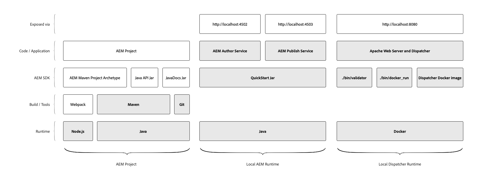

# Lokale ontwikkelomgeving instellen {#local-development-environment-set-up}

>[!CONTEXTUALHELP]
>id="aemcloud_localdev_overview"
>title="Overzicht"
>abstract="De vestiging lokale ontwikkelomgeving voor AEM as a Cloud Service omvat ontwikkelingshulpmiddelen die worden vereist om AEM Projecten te ontwikkelen, te bouwen en te compileren, evenals lokale runtime die ontwikkelaars toestaat om nieuwe eigenschappen plaatselijk snel te bevestigen alvorens hen aan AEM as a Cloud Service via de Manager van de Wolk van de Adobe op te stellen."
>additional-url="https://experienceleague.adobe.com/docs/experience-manager-cloud-service/implementing/developing/development-guidelines.html" text="Richtlijnen voor ontwikkeling"
>additional-url="https://experienceleague.adobe.com/docs/experience-manager-learn/cloud-service/developing/basics/aem-sdk.html" text="Grondbeginselen van ontwikkeling"

Deze zelfstudie doorloopt het instellen van een lokale ontwikkelomgeving voor Adobe Experience Manager (AEM) met behulp van de AEM as a Cloud Service SDK. Hieronder vindt u de ontwikkelingstool die nodig is voor het ontwikkelen, bouwen en compileren van AEM projecten, en lokale runtimes waarmee ontwikkelaars nieuwe functies snel lokaal kunnen valideren voordat ze deze naar AEM as a Cloud Service kunnen implementeren via Adobe Cloud Manager.

>[!VIDEO](https://video.tv.adobe.com/v/32565?quality=12&learn=on)

De lokale ontwikkelomgeving voor AEM kan worden opgesplitst in drie logische groepen:

+ De __AEM project__ bevat de aangepaste code, configuratie en inhoud die de aangepaste AEM toepassing is.
+ De __Lokale AEM Runtime__ die een lokale versie van AEM diensten van de Auteur en van de Publicatie plaatselijk in werking stelt.
+ De __Runtime van lokale verzending__ die een lokale versie van Apache HTTP Web Server en Dispatcher uitvoert.

Dit leerprogramma analyseert hoe te om de benadrukte punten in het bovengenoemde diagram te installeren en te plaatsen, die een stabiele lokale ontwikkelomgeving voor AEM ontwikkeling verstrekken.

## Bestandssysteemorganisatie

In deze zelfstudie werd de locatie van de AEM as a Cloud Service SDK-artefacten en AEM projectcode als volgt vastgesteld:

+ `~/aem-sdk` is een organisatiemap met de diverse hulpmiddelen die door de AEM as a Cloud Service SDK worden verstrekt
+ `~/aem-sdk/author` bevat de AEM Auteur Service
+ `~/aem-sdk/publish` bevat de AEM-publicatieservice
+ `~/aem-sdk/dispatcher` bevat de Dispatcher-gereedschappen
+ `~/code/<project name>` bevat de aangepaste AEM-broncode van het project

Let op: `~` is verkort voor de Folder van de Gebruiker. In Windows is dit het equivalent van `%HOMEPATH%`;

## Ontwikkelingsinstrumenten voor AEM projecten

Het AEM project is de basis van de douanecode die de code, de configuratie en de inhoud bevat die via de Manager van de Wolk aan AEM as a Cloud Service wordt opgesteld. De basislijnprojectstructuur wordt gegenereerd via de [AEM Project Maven Archetype](https://github.com/adobe/aem-project-archetype).

In dit gedeelte van de zelfstudie wordt getoond hoe u:

+ Installeren [!DNL Java]
+ Installeren [!DNL Node.js] (en npm)
+ Installeren [!DNL Maven]
+ Installeren [!DNL Git]

[Ontwikkelingshulpmiddelen instellen voor AEM projecten](./development-tools.md)

## Lokale AEM Runtime

De AEM as a Cloud Service SDK biedt een [!DNL QuickStart Jar] dat een lokale versie van AEM uitvoert. De [!DNL QuickStart Jar] kan worden gebruikt om of de Dienst van de Auteur van de AEM of AEM plaatselijk de Dienst van de Publicatie in werking te stellen. Let op: terwijl de [!DNL QuickStart Jar] biedt een lokale ontwikkelervaring, maar niet alle functies die beschikbaar zijn in AEM as a Cloud Service zijn opgenomen in de [!DNL QuickStart Jar].

In dit gedeelte van de zelfstudie wordt getoond hoe u:

+ Installeren [!DNL Java]
+ De AEM SDK downloaden
+ Voer de [!DNL AEM Author Service]
+ Voer de [!DNL AEM Publish Service]

[De lokale AEM-runtime instellen](./aem-runtime.md)

## Lokaal [!DNL Dispatcher] Runtime

AEM as a Cloud Service Dispatcher Tools van SDK biedt alles wat vereist is voor het instellen van de lokale [!DNL Dispatcher] runtime. [!DNL Dispatcher] Gereedschappen zijn [!DNL Docker]-based en verstrekt bevellijnhulpmiddelen om te transporten [!DNL Apache HTTP] Webserver en [!DNL Dispatcher] configuratiebestanden in een compatibele indeling te configureren en te implementeren [!DNL Dispatcher] die in [!DNL Docker] container.

In dit gedeelte van de zelfstudie wordt getoond hoe u:

+ De AEM SDK downloaden
+ Installeren [!DNL Dispatcher] Gereedschappen
+ Lokaal uitvoeren [!DNL Dispatcher] runtime

[De lokale [!DNL Dispatcher] Runtime](./dispatcher-tools.md)
