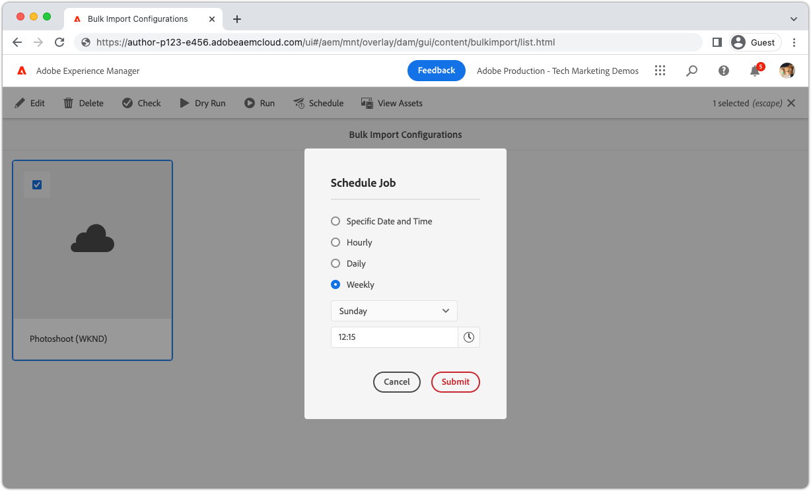

# Bulkimport gebruiken

Met het gereedschap Bulk importeren in AEM as a Cloud Service kunnen beheerders op een veilige en efficiënte manier elementen in bulk importeren uit de cloudopslag.

>[!BEGINTABS]

>[!TAB  de mening van Assets ]

Leer hoe te om talrijke dossiers in AEM Assets in te voeren gebruikend de [ mening van Activa ](https://experienceleague.adobe.com/docs/experience-manager-cloud-service/content/assets/assets-view/assets-view-introduction.html) [ BulkInvoer ](https://experienceleague.adobe.com/docs/experience-manager-cloud-service/content/assets/assets-view/bulk-import-assets-view.html), met Dropbox die als leverancier van de de voorbeeldwolkenopslag voor een duidelijk en gemakkelijk-aan-volgt integratieproces dient.

>[!VIDEO](https://video.tv.adobe.com/v/3426857/?learn=on)

>[!TAB  Admin mening ]

>[!VIDEO](https://video.tv.adobe.com/v/329680?quality=12&learn=on)

>[!TIP]
>
> De inputbronnen in deze video tonen slechts Azure Blob Storage en Amazon S3; nochtans blijven de beschikbare bronnen in tijd groeien. Voor een volledige lijst van gesteunde inputbronnen, te verwijzen gelieve naar de beschikbare opties in product, of [ documentatie ](https://experienceleague.adobe.com/docs/experience-manager-cloud-service/content/assets/manage/add-assets.html#bulk-upload).

## Bulkimport plannen

Bulkimport ondersteunt geplande uitvoering van configuraties, waaronder:

+ Eén uitvoering op een gedefinieerde datum en tijd
+ Uitvoeringen per uur, dag of week

>[!ENDTABS]
