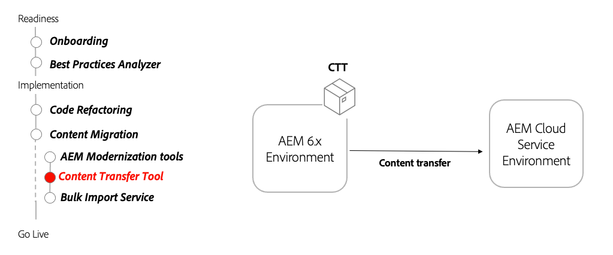

# Inhoud overbrengen

Leer hoe u met Content Transfer Tool inhoud van AEM 6.3+ naar AEM as a Cloud Service kunt migreren.

>[!VIDEO](https://video.tv.adobe.com/v/3454753?quality=12&learn=on&captions=dut)

## Het gereedschap Inhoud overbrengen gebruiken

De Content Transfer Tool is geïnstalleerd op AEM 6.3+ en verzendt inhoud naar AEM as a Cloud Service.

## Belangrijkste activiteiten

+ Download het [ recentste Hulpmiddel van de Overdracht van de Inhoud ](https://experience.adobe.com/#/downloads/content/software-distribution/en/aemcloud.html?fulltext=Content*+Transfer*+Tool*&amp;1_group.propertyvalues.property=.%2Fjcr%3Acontent%2Fmetadata%2Fdc%3AsoftwareType&amp;1_group.propertyvalues.operation=equals&amp;1_group.propertyvalues.0_values=software-type%3Atooling&amp;orderby=%40jcr%3Acontent%2Fjcr%3AlastModified&amp;orderby.sort=desc&amp;layout=list p.offset=0&amp;p.limit=2).
+ Breng de uiteindelijke AEM Author 6.3+-inhoud over naar de AEM as a Cloud Service Author-service.
   + Installeer het gereedschap Inhoud overbrengen op de AEM 6.3+-auteur met de uiteindelijke inhoud die u wilt overbrengen.
   + Voer het gereedschap Inhoud overbrengen in batches uit en breng sets inhoud over.
+ Breng AEM Publish 6.3+ definitieve inhoud naar de publicatieservice van AEM as a Cloud Service over.
   + Installeer het gereedschap Inhoud overbrengen op AEM 6.3+ Publiceren met de uiteindelijke inhoud die u wilt overbrengen.
   + Voer het gereedschap Inhoud overbrengen in batches uit en breng sets inhoud over.
+ Optioneel &#39;top-up&#39;-inhoud op AEM as a Cloud Service, door nieuwe inhoud over te brengen sinds de laatste inhoudsoverdracht

## Handbeweging

Pas je kennis toe door uit te proberen wat je geleerd hebt met deze praktische oefening.

Voordat u de praktische oefening probeert, moet u controleren of u de bovenstaande video en de volgende materialen hebt bekeken en begrepen:

+ [AEM-moderniseringstools](../aem-modernization-tools.md)
+ [Onboarding](../onboarding.md)
+ [Cloud Manager](../cloud-manager.md)

Zorg er ook voor dat u de vorige hands-on oefening hebt uitgevoerd:

+ [Dispatcher hands-on oefening](../dispatcher.md#hands-on-exercise)

<table style="border-width:0">
    <tr>
        <td style="width:150px">
                    
        </td>
        <td style="width:100%;margin-bottom:1rem;">
            
Handmatig aan met het gereedschap Inhoud overbrengen

            

                Ontdek hoe u met het gereedschap Inhoud overbrengen inhoud automatisch kunt verplaatsen van AEM 6 naar AEM as a Cloud Service.
            

            <a  rel="noreferrer"
                target="_blank"
                href="https://github.com/adobe/aem-cloud-engineering-video-series-exercises/tree/session6-transfercontent#cloud-acceleration-bootcamp---session-6-content" class="spectrum-Button spectrum-Button--primary spectrum-Button--sizeM">
                 probeert uit het Hulpmiddel van de Overdracht van de Inhoud 
            </a>
        </td>
    </tr>
</table>

## Overige middelen

+ [ het Hulpmiddel van de Overdracht van de Inhoud van de Download ](https://experience.adobe.com/#/downloads/content/software-distribution/en/aemcloud.html?fulltext=Content*+Transfer*+Tool*&amp;1_group.propertyvalues.property=.%2Fjcr%3Acontent%2Fmetadata%2Fdc%3AsoftwareType&amp;1_group.propertyvalues.operation=equals&amp;1_group.propertyvalues.0_values=software-type%3Atooling&amp;orderby=%40jcr%3Acontent%2Fjcr%3AlastModified&amp;orderby.sort=desc&amp;layout=list p.offset=0&amp;p.limit=2)
+ [ Bulk de Dienst van de Invoer hoe te video ](https://experienceleague.adobe.com/docs/experience-manager-learn/cloud-service/migration/bulk-import.html?lang=nl-NL)

