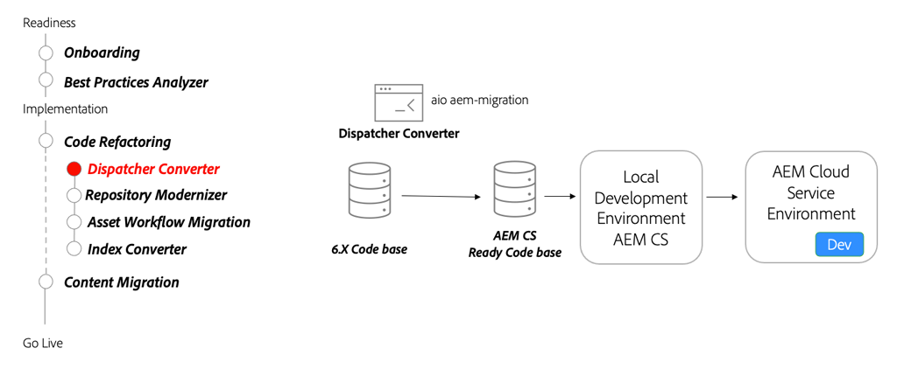

# Dispatcher

Leer over AEM Dispatcher voor AEM as a Cloud Service, zich op opmerkelijke veranderingen van Dispatcher voor AEM 6, het hulpmiddel van de Omzetting van de Verzender en hoe te om de Dispatcher Tools SDK te gebruiken.

>[!VIDEO](https://video.tv.adobe.com/v/336962?quality=12&learn=on)

## Dispatcher Converter

Als deel van het refactoring van uw codebasis, gebruik [AEM Dispatcher Converter](https://experienceleague.adobe.com/docs/experience-manager-cloud-service/moving/refactoring-tools/dispatcher-transformation-utility-tools.html) bestaande Managed Services Dispatcher-configuraties op locatie of Adobe te vernieuwen om de as a Cloud Service compatibele Dispatcher-configuratie te AEM.

## Belangrijkste activiteiten

+ Gebruik de [Adobe I/O Dispatcher Converter, gereedschap](https://github.com/adobe/aio-cli-plugin-aem-cloud-service-migration#aio-aem-migrationdispatcher-converter) om een bestaande Dispatcher-configuratie te migreren.
+ Verwijs naar de module Dispatcher van de [Projectarchetype AEM](https://github.com/adobe/aem-project-archetype/tree/develop/src/main/archetype/dispatcher.cloud) als beste praktijk.
+ [Lokale gereedschappen voor Dispatcher instellen](https://experienceleague.adobe.com/docs/experience-manager-learn/cloud-service/local-development-environment-set-up/dispatcher-tools.html) om de verzender te valideren, voordat u gaat testen in een Cloud Service-omgeving.

## Handbeweging

Pas je kennis toe door uit te proberen wat je geleerd hebt met deze praktische oefening.

Voordat u de praktische oefening probeert, moet u controleren of u de bovenstaande video en de volgende materialen hebt bekeken en begrepen:

+ [AEM-moderniseringstools](./aem-modernization-tools.md)
+ [Onboarding](./onboarding.md)
+ [Cloud Manager](./cloud-manager.md)

Zorg er ook voor dat u de vorige hands-on oefening hebt uitgevoerd:

+ [Praktische oefening van Cloud Manager](./cloud-manager.md#hands-on-exercise)

<table style="border-width:0">
    <tr>
        <td style="width:150px">
                    
        </td>
        <td style="width:100%;margin-bottom:1rem;">
            
Handmatig aan met Dispatcher Tools

            

                Ontdek het gebruik van de Dispatcher Tools van de AEM SDK om Dispatcher-configuraties te valideren en AEM Dispatcher lokaal uit te voeren met Docker.
            

            <a  rel="noreferrer"
                target="_blank"
                href="https://github.com/adobe/aem-cloud-engineering-video-series-exercises/tree/session5-dispatcher#cloud-acceleration-bootcamp---session-5-dispatcher" class="spectrum-Button spectrum-Button--primary spectrum-Button--sizeM">
                Verzendprogramma's uitproberen
            </a>
        </td>
    </tr>
</table>
