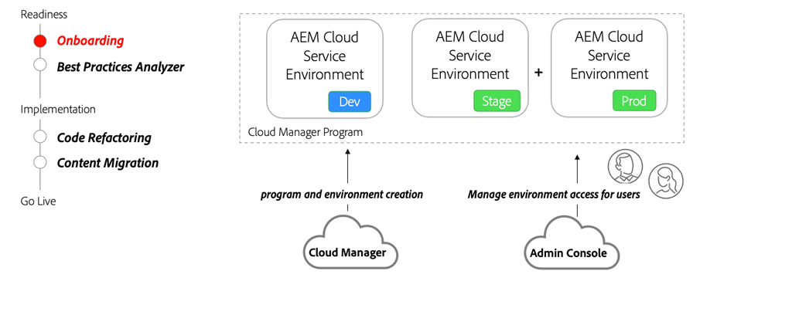

# Onboarding van AEM as a Cloud Service

Meer informatie over instaptoegang tot AEM as a Cloud Service vanaf de contractfase tot aan de installatie van de omgevingen met Cloud Manager.

>[!VIDEO](https://video.tv.adobe.com/v/336959?quality=12&learn=on)

## Cloud Manager- en beheerconsole

Een essentieel onderdeel van instapweigering is het maken van AEM as a Cloud Service-programma&#39;s en het bieden van verschillende omgevingen met behulp van Adobe Cloud Manager. De [ Admin Console ](https://adminconsole.adobe.com/) wordt gebruikt om rollen toe te wijzen en toegang voor gebruikers in uw organisatie te verlenen aan AEM milieu&#39;s.

## Belangrijkste activiteiten

+ Een systeembeheerder gebruikt de [ Admin Console ](https://adminconsole.adobe.com/) om één of meerdere gebruikers aan [ Cloud Manager toe te wijzen - BedrijfsEigenaar ](https://experienceleague.adobe.com/docs/experience-manager-cloud-manager/using/requirements/setting-up-users-and-roles.html) productprofiel.
+ Gebruiker(s) die aan het Profiel van het Product van de BedrijfsEigenaar worden toegewezen gebruikt de zelfbediening eigenschappen van [ Cloud Manager ](https://experienceleague.adobe.com/docs/experience-manager-cloud-manager/using/introduction-to-cloud-manager.html) aan [ creeer programma(s) ](https://experienceleague.adobe.com/docs/experience-manager-cloud-service/implementing/using-cloud-manager/production-programs/creating-production-program.html) en [ voeg milieu&#39;s ](https://experienceleague.adobe.com/docs/experience-manager-cloud-service/implementing/using-cloud-manager/manage-environments.html) toe
+ Gebruik de [ Admin Console ](https://adminconsole.adobe.com/) om Ontwikkelaars en gebruikers aan verschillende [ rollen van Cloud Manager ](https://experienceleague.adobe.com/docs/experience-manager-cloud-manager/using/requirements/setting-up-users-and-roles.html) toe te wijzen en toestemming aan diverse AEM milieu&#39;s te verlenen.

## Handbeweging

Pas je kennis toe door uit te proberen wat je geleerd hebt met deze praktische oefening.

Voordat u de praktische oefening probeert, moet u controleren of u de bovenstaande video en de volgende materialen hebt bekeken en begrepen:

+ [AEM as a Cloud Service anders denken](./introduction.md)
+ [Cloud Manager](./cloud-manager.md)

Zorg er ook voor dat u de vorige hands-on oefening hebt uitgevoerd:

+ [AEM Moderniseringsgereedschappen, praktische oefening](./aem-modernization-tools.md#hands-on-exercise)

<table style="border-width:0">
    <tr>
        <td style="width:150px">
                    
        </td>
        <td style="width:100%;margin-bottom:1rem;">
            
Hands-on met onboarding

            

                Ontdek het AEM as a Cloud Service-instapproces en hoe u een AEM toepassing kunt implementeren in de AEM SDK.
            

            <a  rel="noreferrer"
                target="_blank"
                href="https://github.com/adobe/aem-cloud-engineering-video-series-exercises/tree/session3-onboarding#bootcamp---session-3-on-boarding" class="spectrum-Button spectrum-Button--primary spectrum-Button--sizeM">
                 Uitproberen onboarding 
            </a>
        </td>
    </tr>
</table>
