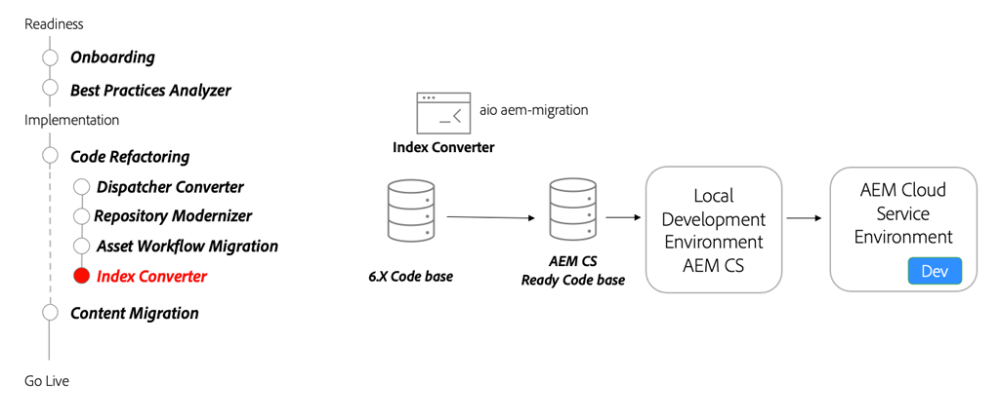

# Zoeken en indexeren

Leer over AEM as a Cloud Service onderzoeksindexen, hoe te om AEM 6 indexdefinities om te zetten om as a Cloud Service compatibel AEM te zijn, en hoe te om indexen op te stellen om as a Cloud Service te AEM.

>[!VIDEO](https://video.tv.adobe.com/v/336963?quality=12&learn=on)

## Indexconversie

Als deel van het refactoring van uw codebasis, gebruik [Gereedschap Index omzetten](https://github.com/adobe/aio-cli-plugin-aem-cloud-service-migration#command-aio-aem-migrationindex-converter) om aangepaste Eak-indexdefinities om te zetten in AEM as a Cloud Service compatibele indexdefinities.

Controleer de [documentatie over indexconverter](https://experienceleague.adobe.com/docs/experience-manager-cloud-service/content/migration-journey/refactoring-tools/index-converter.html) voor de volledige en huidige set mogelijkheden van Index Converter.

## Belangrijkste activiteiten

+ Gebruik de [Adobe I/O Workflow Migrator](https://github.com/adobe/aio-cli-plugin-aem-cloud-service-migration#command-aio-aem-migrationindex-converter) hulpmiddel om werkstromen voor middelenverwerking te migreren voor het gebruik van de Asset compute microservices.
+ Een [plaatselijke ontwikkelomgeving](https://experienceleague.adobe.com/docs/experience-manager-learn/cloud-service/local-development-environment-set-up/overview.html) en implementeer de aangepaste indexen. Zorg ervoor dat de bijgewerkte indexen up-to-date zijn.
+ Implementeer de bijgewerkte codebasis in een AEM as a Cloud Service ontwikkelomgeving en blijf valideren.
+ Indien een waarde uit de index van het vak wordt gewijzigd **ALTIJD** kopieer de meest recente indexdefinitie van een AEM as a Cloud Service omgeving die op de meest recente release wordt uitgevoerd. Pas de gekopieerde indexdefinitie aan uw behoeften aan.

## Handbeweging

Pas je kennis toe door uit te proberen wat je geleerd hebt met deze praktische oefening.

Voordat u de praktische oefening probeert, moet u controleren of u de bovenstaande video en de volgende materialen hebt bekeken en begrepen:

+ [ anders denken over AEM as a Cloud Service](./introduction.md)
+ [Modernisering opslagplaats](./repository-modernization.md)

Zorg er ook voor dat u de vorige hands-on oefening hebt uitgevoerd:

+ [Praktische oefening van het gereedschap Inhoudsoverdracht](./content-migration/content-transfer-tool.md#hands-on-exercise)

<table style="border-width:0">
    <tr>
        <td style="width:150px">
                    
        </td>
        <td style="width:100%;margin-bottom:1rem;">
            
Hands-on met indexen

            

                Ontdek het definiëren en implementeren van eiken-indexen om as a Cloud Service te AEM.
            

            <a  rel="noreferrer"
                target="_blank"
                href="https://github.com/adobe/aem-cloud-engineering-video-series-exercises/tree/session7-indexes#cloud-acceleration-bootcamp---session-7-search-and-indexing" class="spectrum-Button spectrum-Button--primary spectrum-Button--sizeM">
                Index uitproberen
            </a>
        </td>
    </tr>
</table>
