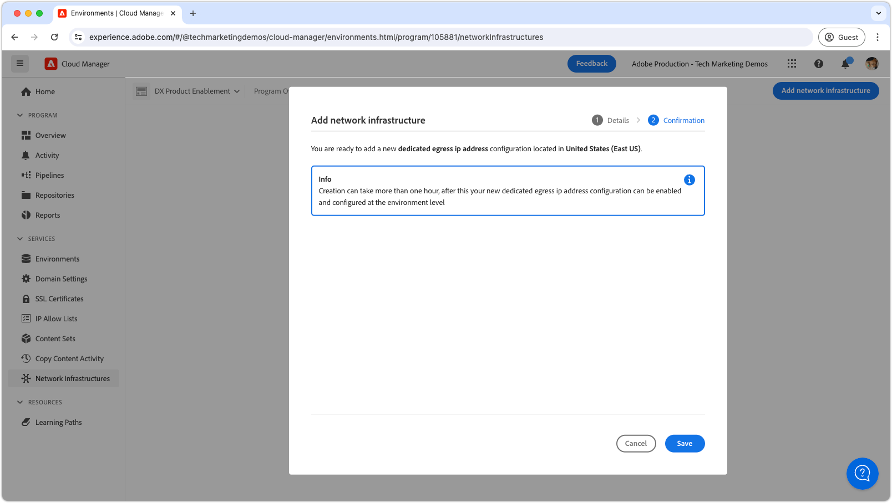
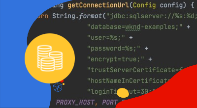

# IP-adres van specifiek egress

Leer hoe te opstelling en gebruik specifiek uitgangIP adres, dat uitgaande verbindingen van AEM toestaat om uit specifieke IP voort te komen.

## Wat is specifiek IP adres van de uitgang?

Het specifieke IP adres van de uitgang staat verzoeken van AEM as a Cloud Service toe om een specifiek IP adres te gebruiken, toestaand de externe diensten om inkomende verzoeken door dit IP adres te filtreren. leuk [flexibele uitgangen](./flexible-port-egress.md), kunt u met speciale IP-adressen toegang krijgen tot niet-standaardpoorten.

Een Cloud Manager-programma kan alleen een __enkel__ type netwerkinfrastructuur. Zorg ervoor dat het IP-adres van de betreffende uitgang het meest is [geschikt type netwerkinfrastructuur](./advanced-networking.md) voor uw AEM as a Cloud Service alvorens de volgende bevelen uit te voeren.

>[!MORELIKETHIS]
>
> De as a Cloud Service AEM lezen [geavanceerde documentatie van de netwerkconfiguratie](https://experienceleague.adobe.com/en/docs/experience-manager-cloud-service/content/security/configuring-advanced-networking) voor meer details over specifiek uitgang IP adres.

## Vereisten

Het volgende is vereist wanneer u een specifiek IP-adres voor een uitgang instelt met gebruik van de API&#39;s van Cloud Manager:

+ Cloud Manager-API met [Machtigingen van Business Owner van Cloud Manager](https://developer.adobe.com/experience-cloud/cloud-manager/guides/getting-started/permissions/)
+ Toegang tot [Verificatiereferenties van de Cloud Manager API](https://developer.adobe.com/experience-cloud/cloud-manager/guides/getting-started/create-api-integration/)
   + Organisatie-id (ook bekend als IMS Org ID)
   + Client-id (ook bekend als API-sleutel)
   + Toegangstoken (ook bekend als Dragertoken)
+ Programma-id van Cloud Manager
+ De omgevings-id&#39;s van Cloud Manager

Voor meer details bekijk de volgende analyse voor hoe te opstelling, vormen, en verkrijgen de geloofsbrieven van de Manager van de Wolk API, en hoe te om hen te gebruiken om een vraag van de Manager van de Wolk te maken API.

>[!VIDEO](https://video.tv.adobe.com/v/342235?quality=12&learn=on)

Deze zelfstudie gebruikt `curl` om de API-configuraties van Cloud Manager te maken. De verstrekte `curl` veronderstellen een syntaxis van Linux/macOS. Als het gebruiken van de het bevelherinnering van Vensters, vervang `\` regeleindeteken met `^`.

## IP-adres voor speciale uitgang inschakelen voor het programma

Begin door het specifieke uitgangIP adres op AEM as a Cloud Service toe te laten en te vormen.

>[!BEGINTABS]

>[!TAB Cloud Manager]

IP-adres voor speciale toegang kan worden ingeschakeld met Cloud Manager. In de volgende stappen wordt beschreven hoe u toegewezen IP-adres voor egress inschakelt bij AEM as a Cloud Service via Cloud Manager.

1. Aanmelden bij de [Adobe Experience Manager Cloud Manager](https://experience.adobe.com/cloud-manager/) als Business Owner van Cloud Manager.
1. Navigeer naar het gewenste programma.
1. Navigeer in het linkermenu naar __Services > Netwerkinfrastructuur__.
1. Selecteer de __Netwerkinfrastructuur toevoegen__ knop.

   

1. In de __Netwerkinfrastructuur toevoegen__ selecteert u de __IP-adres van specifiek egress__ en selecteert u de __Regio__ om het specifieke uitgangIP adres te creëren.

   

1. Selecteren __Opslaan__ om de toevoeging van het specifieke IP adres van de uitgang te bevestigen.

   

1. Wacht tot de netwerkinfrastructuur is gemaakt en gemarkeerd als __Gereed__. Dit proces kan tot 1 uur duren.

   

Als het IP-adres voor speciale toegang is gemaakt, kunt u het nu configureren met de API&#39;s van Cloud Manager, zoals hieronder beschreven.

>[!TAB Cloud Manager-API&#39;s]

IP-adres voor speciale toegang kan worden ingeschakeld met de API&#39;s van Cloud Manager. In de volgende stappen wordt beschreven hoe u IP-adres van een specifiek egress-adres kunt inschakelen bij AEM as a Cloud Service met de API van Cloud Manager.


1. Bepaal eerst met de API van Cloud Manager in welk gebied geavanceerde netwerken nodig zijn. [listRegions](https://developer.adobe.com/experience-cloud/cloud-manager/reference/api/) -bewerking. De `region name` is vereist om volgende API-aanroepen van Cloud Manager uit te voeren. Doorgaans wordt de regio waarin de productieomgeving zich bevindt, gebruikt.

   Zoek het gebied van uw AEM as a Cloud Service omgeving in [Cloud Manager](https://my.cloudmanager.adobe.com) onder de [details van de omgeving](https://experienceleague.adobe.com/en/docs/experience-manager-cloud-service/content/implementing/using-cloud-manager/manage-environments). De regionaam die wordt weergegeven in Cloud Manager kan [toegewezen aan de regiocode](https://developer.adobe.com/experience-cloud/cloud-manager/guides/api-usage/creating-programs-and-environments/#creating-aem-cloud-service-environments) worden gebruikt in de API van Cloud Manager.

   __listRegions HTTP request__

   ```shell
   $ curl -X GET https://cloudmanager.adobe.io/api/program/{programId}/regions \
       -H 'x-gw-ims-org-id: <ORGANIZATION_ID>' \
       -H 'x-api-key: <CLIENT_ID>' \
       -H 'Authorization: Bearer <ACCESS_TOKEN>' \
       -H 'Content-Type: application/json' 
   ```

2. Speciaal IP-adres voor toegang tot een Cloud Manager-programma inschakelen met de Cloud Manager-API [createNetworkInfrastructure](https://developer.adobe.com/experience-cloud/cloud-manager/reference/api/) -bewerking. Gebruik de juiste `region` code die is verkregen via de API voor Cloud Manager `listRegions` -bewerking.

   __createNetworkInfrastructure HTTP request__

   ```shell
   $ curl -X POST https://cloudmanager.adobe.io/api/program/{programId}/networkInfrastructures \
       -H 'x-gw-ims-org-id: <ORGANIZATION_ID>' \
       -H 'x-api-key: <CLIENT_ID>' \
       -H 'Authorization: Bearer <ACCESS_TOKEN>' \
       -H 'Content-Type: application/json' \
       -d '{ "kind": "dedicatedEgressIp", "region": "va7" }'
   ```

   Wacht 15 minuten op het Programma van de Manager van de Wolk om de netwerkinfrastructuur te verstrekken.

3. Controleren of het programma is voltooid __specifiek IP-adres van uitgang__ configuratie met de API voor Cloud Manager [getNetworkInfrastructure](https://developer.adobe.com/experience-cloud/cloud-manager/reference/api/#operation/getNetworkInfrastructure) bewerking, gebruiken van de `id` geretourneerd door `createNetworkInfrastructure` HTTP-aanvraag in de vorige stap.

   __getNetworkInfrastructure HTTP-aanvraag__

   ```shell
   $ curl -X GET https://cloudmanager.adobe.io/api/program/{programId}/networkInfrastructure/{networkInfrastructureId} \
       -H 'x-gw-ims-org-id: <ORGANIZATION_ID>' \
       -H 'x-api-key: <CLIENT_ID>' \
       -H 'Authorization: Bearer <ACCESS_TOKEN>' \
       -H 'Content-Type: application/json'
   ```

   Controleer of de HTTP-respons een __status__ van __klaar__. Controleer de status om de paar minuten als u dat nog niet hebt gedaan.

Als het IP-adres voor speciale toegang is gemaakt, kunt u het nu configureren met de API&#39;s van Cloud Manager, zoals hieronder beschreven.

>[!ENDTABS]


## Vorm specifieke IP van de uitgang adresvolmachten per milieu

1. Vorm __specifiek IP-adres van uitgang__ configuratie op elke AEM as a Cloud Service omgeving met gebruik van de API voor Cloud Manager [enableEnvironmentAdvancedNetworkingConfiguration](https://developer.adobe.com/experience-cloud/cloud-manager/reference/api/) -bewerking.

   __enableEnvironmentAdvancedNetworkingConfiguration HTTP request__

   ```shell
   $ curl -X PUT https://cloudmanager.adobe.io/api/program/{programId}/environment/{environmentId}/advancedNetworking \
       -H 'x-gw-ims-org-id: <ORGANIZATION_ID>' \
       -H 'x-api-key: <CLIENT_ID>' \
       -H 'Authorization: Bearer <ACCESS_TOKEN>' \
       -H 'Content-Type: application/json' \
       -d @./dedicated-egress-ip-address.json
   ```

   De JSON-parameters definiëren in een `dedicated-egress-ip-address.json` en verstrekt via `... -d @./dedicated-egress-ip-address.json`.

   [Download het voorbeeld specific-egress-ip-address.json](./assets/dedicated-egress-ip-address.json). Dit bestand is slechts een voorbeeld. Configureer uw bestand naar wens op basis van de optionele/verplichte velden die zijn gedocumenteerd op [enableEnvironmentAdvancedNetworkingConfiguration](https://developer.adobe.com/experience-cloud/cloud-manager/reference/api/).

   ```json
   {
       "nonProxyHosts": [
           "example.net",
           "*.example.org",
       ],
       "portForwards": [
           {
               "name": "mysql.example.com",
               "portDest": 3306,
               "portOrig": 30001
           },
           {
               "name": "smtp.sendgrid.net",
               "portDest": 465,
               "portOrig": 30002
           }
       ]
   }
   ```

   De specifieke IP van het uitgang adresconfiguratie handtekening van HTTP verschilt slechts van [flexibele uitstappoort](./flexible-port-egress.md#enable-dedicated-egress-ip-address-per-environment) in die zin dat het ook de facultatieve `nonProxyHosts` configuratie.

   `nonProxyHosts` verklaart een reeks gastheren waarvoor haven 80 of 443 door de standaard gedeelde IP adreswaaiers eerder dan specifieke uitgang IP zou moeten worden verpletterd. `nonProxyHosts` kan nuttig zijn aangezien het verkeer dat door gedeelde IPs wordt behandeld automatisch door Adobe wordt geoptimaliseerd.

   Voor elke `portForwards` afbeelding, bepaalt het geavanceerde voorzien van een netwerk de volgende het door:sturen regel:

   | Proxyhost | Proxypoort |  | Externe host | Externe poort |
   |---------------------------------|----------|----------------|------------------|----------|
   | `AEM_PROXY_HOST` | `portForwards.portOrig` | → | `portForwards.name` | `portForwards.portDest` |

1. Voor elke omgeving valideert u de egress-regels die van kracht zijn met de API voor Cloud Manager [getEnvironmentAdvancedNetworkingConfiguration](https://developer.adobe.com/experience-cloud/cloud-manager/reference/api/) -bewerking.

   __getEnvironmentAdvancedNetworkingConfiguration HTTP-aanvraag__

   ```shell
   $ curl -X GET https://cloudmanager.adobe.io/api/program/{programId}/environment/{environmentId}/advancedNetworking \
       -H 'x-gw-ims-org-id: <ORGANIZATION_ID>' \
       -H 'x-api-key: <CLIENT_ID>' \
       -H 'Authorization: <YOUR_TOKEN>' \
       -H 'Content-Type: application/json'
   ```

1. De specifieke IP van de uitgang adresconfiguraties kunnen worden bijgewerkt gebruikend de Manager API van de Wolk [enableEnvironmentAdvancedNetworkingConfiguration](https://developer.adobe.com/experience-cloud/cloud-manager/reference/api/) -bewerking. Herinneren `enableEnvironmentAdvancedNetworkingConfiguration` is een `PUT` bewerking, zodat alle regels moeten worden voorzien van elke aanroep van deze bewerking.

1. Verkrijg __specifiek IP-adres van uitgang__ door een DNS Resolver (zoals [DNSChecker.org](https://dnschecker.org/)) op de host: `p{programId}.external.adobeaemcloud.com`, of via `dig` vanaf de opdrachtregel.

   ```shell
   $ dig +short p{programId}.external.adobeaemcloud.com
   ```

   De hostnaam kan niet `pinged`, aangezien het een uitgang is en _niet_ en toegang.

   Merk op dat het specifieke IP adres van de uitgang door alle AEM as a Cloud Service milieu&#39;s in het programma wordt gedeeld.

1. Nu, kunt u het specifieke uitgangIP adres in uw douane AEM code en configuratie gebruiken. Vaak wanneer het gebruiken van specifiek uitgangIP adres, de externe diensten AEM as a Cloud Service verbindingen worden gevormd om verkeer van dit specifieke IP adres slechts toe te staan.

## Verbinding maken met externe services via toegewezen IP-adres voor uitgang

Met het specifieke toegelaten adres van uitgang IP, AEM code en configuratie kan specifieke uitgang IP gebruiken om vraag aan externe diensten te maken. Er zijn twee vlotten van externe vraag die AEM verschillend behandelt:

1. HTTP/HTTPS-aanroepen naar externe services
   + Omvat HTTP/HTTPS vraag die aan de diensten wordt gemaakt die op havens buiten standaard 80 of 443 havens lopen.
1. niet-HTTP/HTTPS-aanroepen naar externe services
   + Omvat om het even welke niet-HTTP vraag, zoals verbindingen met de servers van de Post, SQL gegevensbestanden, of de diensten die op andere niet-HTTP/HTTPS protocollen lopen.

HTTP/HTTPS-verzoeken van AEM op standaardpoorten (80/443) zijn standaard toegestaan, maar gebruiken het toegewezen IP-adres voor egress niet als dit niet op de hieronder beschreven manier is geconfigureerd.

>[!TIP]
>
> Zie AEM de specifieke IP van de uitgang IP van de as a Cloud Service adresdocumentatie voor [de volledige reeks verpletterende regels](https://experienceleague.adobe.com/en/docs/experience-manager-cloud-service/content/security/configuring-advanced-networking).


### HTTP/HTTPS

Wanneer u HTTP/HTTPS-verbindingen maakt van AEM, worden bij het gebruik van een toegewezen IP-adres voor toegang, HTTP/HTTPS-verbindingen automatisch buiten de AEM geplaatst met behulp van het toegewezen IP-adres voor toegang. Er is geen aanvullende code of configuratie vereist voor ondersteuning van HTTP/HTTPS-verbindingen.

#### Codevoorbeelden

<table>
<tr>
<td>
    <a  href="./examples/http-dedicated-egress-ip-vpn.md"></a>
    <div><strong><a href="./examples/http-dedicated-egress-ip-vpn.md">HTTP/HTTPS</a></strong></div>
    <p>
        Java™-codevoorbeeld waarbij een HTTP/HTTPS-verbinding van AEM as a Cloud Service wordt gemaakt met een externe service via het HTTP/HTTPS-protocol.
    </p>
</td>   
<td></td>   
<td></td>   
</tr>
</table>

### Niet-HTTP/HTTPS-verbindingen met externe services

Bij het maken van niet-HTTP/HTTPS-verbindingen (bijvoorbeeld SQL, SMTP, etc.) van AEM, moet de verbinding door een speciale gastheernaam worden gemaakt die door AEM wordt verstrekt.

| Naam variabele | Gebruiken | Java™-code | OSGi-configuratie |
| - |  - | - | - |
| `AEM_PROXY_HOST` | Proxyhost voor niet-HTTP/HTTPS-verbindingen | `System.getenv("AEM_PROXY_HOST")` | `$[env:AEM_PROXY_HOST]` |


De verbindingen aan de externe diensten worden dan geroepen door `AEM_PROXY_HOST` en de toegewezen poort (`portForwards.portOrig`), die dan aan toegewezen externe hostname AEM leiden (`portForwards.name`) en poort (`portForwards.portDest`).

| Proxyhost | Proxypoort |  | Externe host | Externe poort |
|---------------------------------|----------|----------------|------------------|----------|
| `AEM_PROXY_HOST` | `portForwards.portOrig` | → | `portForwards.name` | `portForwards.portDest` |

#### Codevoorbeelden

<table><tr>
   <td>
      <a  href="./examples/sql-datasourcepool.md"></a>
      <div><strong><a href="./examples/sql-datasourcepool.md">SQL-verbinding met JDBC DataSourcePool</a></strong></div>
      <p>
            Java™ codevoorbeeld die met externe SQL gegevensbestanden verbinden door AEM JDBC datasource pool te vormen.
      </p>
    </td>   
   <td>
      <a  href="./examples/sql-java-apis.md"></a>
      <div><strong><a href="./examples/sql-java-apis.md">SQL-verbinding met Java™ API's</a></strong></div>
      <p>
            Java™-codevoorbeeld voor verbinding met externe SQL-databases met SQL API's van Java™.
      </p>
    </td>   
   <td>
      <a  href="./examples/email-service.md"></a>
      <div><strong><a href="./examples/email-service.md">E-mailservice</a></strong></div>
      <p>
        OSGi configuratievoorbeeld dat AEM gebruikt om met externe e-maildiensten te verbinden.
      </p>
    </td>   
</tr></table>
