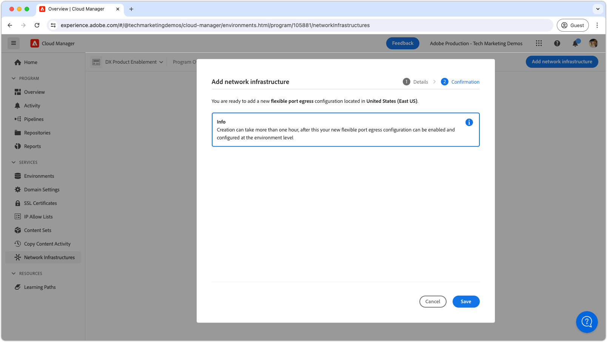

# Flexibele poortuitgang

Leer hoe u flexibele poorttoegang instelt en gebruikt om externe verbindingen van AEM as a Cloud Service naar externe services te ondersteunen.

## Wat is Flexibele havenuitgang?

De flexibele havenuitgang staat voor douane, specifieke haven toe die regels door:sturen om aan AEM as a Cloud Service worden vastgemaakt, die verbindingen van AEM aan externe diensten toestaan om worden gemaakt.

Een programma van Cloud Manager kan het type van a __enige__ netwerkinfrastructuur slechts hebben. Zorg ervoor dat de flexibele havenuitgang het meest [ aangewezen type van netwerkinfrastructuur ](./advanced-networking.md) voor uw AEM as a Cloud Service is alvorens de volgende bevelen uit te voeren.

>[!MORELIKETHIS]
>
> Lees de AEM as a Cloud Service [ geavanceerde documentatie van de netwerkconfiguratie ](https://experienceleague.adobe.com/en/docs/experience-manager-cloud-service/content/security/configuring-advanced-networking) voor meer details op flexibele havenuitgang.


## Vereisten

Het volgende is vereist wanneer u flexibele poorttoegang instelt of configureert met Cloud Manager API&#39;s:

+ Adobe Developer Console-project met Cloud Manager API ingeschakeld en [ Cloud Manager Business Owner-machtigingen ](https://developer.adobe.com/experience-cloud/cloud-manager/guides/getting-started/permissions/)
+ Toegang tot [ de authentificatiegeloofsbrieven van Cloud Manager API ](https://developer.adobe.com/experience-cloud/cloud-manager/guides/getting-started/create-api-integration/)
   + Organisatie-id (ook bekend als IMS Org ID)
   + Client-id (ook bekend als API-sleutel)
   + Toegangstoken (ook bekend als Dragertoken)
+ Cloud Manager-programma-id
+ De milieu-id&#39;s van Cloud Manager

Voor meer details [ overzicht hoe te opstelling, vorm, en verkrijg de geloofsbrieven van de Manager van de Wolk API ](https://experienceleague.adobe.com/en/docs/experience-manager-learn/cloud-service/developing/extensibility/app-builder/server-to-server-auth), om hen te gebruiken om een Cloud Manager API vraag te maken.

Deze zelfstudie gebruikt `curl` om de Cloud Manager API-configuraties te maken. De opgegeven `curl` -opdrachten nemen een Linux/macOS-syntaxis aan. Als u de Windows-opdrachtregel gebruikt, vervangt u het teken voor het `\` regeleinde door `^` .


## Flexibele poorttoegang per programma inschakelen

Begin door het flexibele havenuitgang op AEM as a Cloud Service toe te laten.

>[!BEGINTABS]

>[!TAB Cloud Manager]

Flexibele poortuitgang kan worden ingeschakeld met Cloud Manager. In de volgende stappen wordt beschreven hoe u flexibele poorttoegang op AEM as a Cloud Service kunt inschakelen met de Cloud Manager.

1. Login aan [ Adobe Experience Manager Cloud Manager ](https://experience.adobe.com/cloud-manager/) als Bedrijfseigenaar van Cloud Manager.
1. Navigeer naar het gewenste programma.
1. In het linkermenu, navigeer aan __Diensten > de Infrastructuur van het Netwerk__.
1. Selecteer __toevoegen netwerkinfrastructuur__ knoop.

    toe

1. In __voeg netwerkinfrastructuur__ dialoog toe, selecteer de __Flexibele havenuitgang__ optie, en selecteer het __Gebied__ om het specifieke uitgangIP adres tot stand te brengen.

    toe

1. Selecteer __sparen__ om de toevoeging van de flexibele havenuitgang te bevestigen.

   

1. Wacht op de netwerkinfrastructuur die moet worden gecreeerd en als __Klaar__ worden gemerkt. Dit proces kan tot 1 uur duren.

   

Met het flexibele gemaakte poortegres kunt u nu de regels voor het doorsturen van poorten configureren met behulp van de Cloud Manager API&#39;s, zoals hieronder beschreven.

>[!TAB  Cloud Manager APIs ]

Flexibele poortuitgang kan worden ingeschakeld met Cloud Manager API&#39;s. In de volgende stappen wordt beschreven hoe u flexibele poorttoegang op AEM as a Cloud Service kunt inschakelen met de Cloud Manager API.

1. Eerst, bepaal het gebied Geavanceerd Voorzien van een netwerk binnen door de Cloud Manager API [ listRegions ](https://developer.adobe.com/experience-cloud/cloud-manager/reference/api/) verrichting te gebruiken. `region name` is vereist om volgende Cloud Manager API-aanroepen te kunnen uitvoeren. Doorgaans wordt de regio waarin de productieomgeving zich bevindt, gebruikt.

   Vind het gebied van uw milieu van AEM as a Cloud Service in [ Cloud Manager ](https://my.cloudmanager.adobe.com) onder de [ details van het milieu ](https://experienceleague.adobe.com/en/docs/experience-manager-cloud-service/content/implementing/using-cloud-manager/manage-environments). De gebiedsnaam die in Cloud Manager wordt getoond kan [ aan de gebiedscode ](https://developer.adobe.com/experience-cloud/cloud-manager/guides/api-usage/creating-programs-and-environments/#creating-aem-cloud-service-environments) worden in kaart gebracht die in Cloud Manager API wordt gebruikt.

   __listRegions HTTP- verzoek__

   ```shell
   $ curl -X GET https://cloudmanager.adobe.io/api/program/{programId}/regions \
       -H 'x-gw-ims-org-id: <ORGANIZATION_ID>' \
       -H 'x-api-key: <CLIENT_ID>' \
       -H 'Authorization: Bearer <ACCESS_TOKEN>' \
       -H 'Content-Type: application/json' 
   ```

2. Laat flexibele havenuitgang voor een Programma van Cloud Manager toe gebruikend Cloud Manager API [ createNetworkInfrastructure ](https://developer.adobe.com/experience-cloud/cloud-manager/reference/api/) verrichting. Gebruik de juiste `region` -code die is verkregen via de Cloud Manager API `listRegions` -bewerking.

   __createNetworkInfrastructure HTTP- verzoek__

   ```shell
   $ curl -X POST https://cloudmanager.adobe.io/api/program/{programId}/networkInfrastructures \
       -H 'x-gw-ims-org-id: <ORGANIZATION_ID>' \
       -H 'x-api-key: <CLIENT_ID>' \ 
       -H 'Authorization: Bearer <ACCESS_TOKEN>' \
       -H 'Content-Type: application/json' \
       -d '{ "kind": "flexiblePortEgress", "region": "va7" }'
   ```

   Wacht 15 minuten op het Cloud Manager-programma om de netwerkinfrastructuur te voorzien.

3. Controleer dat het milieu __flexibele havenuitgang__ configuratie gebruikend de Cloud Manager API [ getNetworkInfrastructure ](https://developer.adobe.com/experience-cloud/cloud-manager/reference/api/#operation/getNetworkInfrastructure) verrichting heeft gebeëindigd, gebruikend `id` teruggekeerd van het `createNetworkInfrastructure` HTTP- verzoek in de vorige stap.

   __getNetworkInfrastructure HTTP- verzoek__

   ```shell
   $ curl -X GET https://cloudmanager.adobe.io/api/program/{programId}/networkInfrastructure/{networkInfrastructureId} \
       -H 'x-gw-ims-org-id: <ORGANIZATION_ID>' \
       -H 'x-api-key: <CLIENT_ID>' \ 
       -H 'Authorization: Bearer <ACCESS_TOKEN>' \
       -H 'Content-Type: application/json'
   ```

   Verifieer dat de reactie van HTTP a __status__ van __klaar__ bevat. Controleer de status om de paar minuten als u dat nog niet hebt gedaan.

Met het flexibele gemaakte poortegres kunt u nu de regels voor het doorsturen van poorten configureren met behulp van de Cloud Manager API&#39;s, zoals hieronder beschreven.

>[!ENDTABS]

## Flexibele proxy&#39;s voor poortuitgang per omgeving configureren

1. Laat en vorm toe de __flexibele configuratie van de havenuitgang__ op elk milieu van AEM as a Cloud Service toe gebruikend de Cloud Manager API [ enableEnvironmentAdvancedNetworkingConfiguration ](https://developer.adobe.com/experience-cloud/cloud-manager/reference/api/) verrichting.

   __enableEnvironmentAdvancedNetworkingConfiguration HTTP- verzoek__

   ```shell
   $ curl -X PUT https://cloudmanager.adobe.io/api/program/{programId}/environment/{environmentId}/advancedNetworking \
       -H 'x-gw-ims-org-id: <ORGANIZATION_ID>' \
       -H 'x-api-key: <CLIENT_ID>' \ 
       -H 'Authorization: Bearer <ACCESS_TOKEN>' \
       -H 'Content-Type: application/json' \
       -d @./flexible-port-egress.json
   ```

   Definieer de JSON-parameters in een `flexible-port-egress.json` en opgegeven voor krullen via `... -d @./flexible-port-egress.json` .

   [ Download het voorbeeld flexibel-haven-egress.json ](./assets/flexible-port-egress.json). Dit bestand is slechts een voorbeeld. Vorm uw dossier zoals vereist gebaseerd op de facultatieve/vereiste gebieden die bij [ worden gedocumenteerd enableEnvironmentAdvancedNetworkingConfiguration ](https://developer.adobe.com/experience-cloud/cloud-manager/reference/api/).

   ```json
   {
       "portForwards": [
           {
               "name": "mysql.example.com",
               "portDest": 3306,
               "portOrig": 30001
           },
           {
               "name": "smtp.sendgrid.com",
               "portDest": 465,
               "portOrig": 30002
           }
       ]
   }
   ```

   Voor elke `portForwards` afbeelding, bepaalt het geavanceerde voorzien van een netwerk de volgende het door:sturen regel:

   | Proxyhost | Proxypoort |  | Externe host | Externe poort |
   |---------------------------------|----------|----------------|------------------|----------|
   | `AEM_PROXY_HOST` | `portForwards.portOrig` | → | `portForwards.name` | `portForwards.portDest` |

   Als uw plaatsing van AEM __slechts__ verbindingen HTTP/HTTPS (haven 80/443) aan externe dienst vereist, verlaat de `portForwards` serie leeg, aangezien deze regels slechts voor niet-HTTP/HTTPS verzoeken worden vereist.

1. Voor elk milieu, bevestig de spelregels in feite gebruikend Cloud Manager API [ getEnvironmentAdvancedNetworkingConfiguration ](https://developer.adobe.com/experience-cloud/cloud-manager/reference/api/) verrichting.

   __getEnvironmentAdvancedNetworkingConfiguration HTTP- verzoek__

   ```shell
   $ curl -X GET https://cloudmanager.adobe.io/api/program/{programId}/environment/{environmentId}/advancedNetworking \
       -H 'x-gw-ims-org-id: <ORGANIZATION_ID>' \
       -H 'Authorization: Bearer <ACCESS_TOKEN>' \
       -H 'x-api-key: <CLIENT_ID>' \ 
       -H 'Content-Type: application/json'
   ```

1. De flexibele configuraties van de havenuitgang kunnen worden bijgewerkt gebruikend Cloud Manager API [ enableEnvironmentAdvancedNetworkingConfiguration ](https://developer.adobe.com/experience-cloud/cloud-manager/reference/api/) verrichting. Vergeet niet dat `enableEnvironmentAdvancedNetworkingConfiguration` een `PUT` -bewerking is. Alle regels moeten daarom bij elke aanroep van deze bewerking worden opgegeven.

1. Nu kunt u de flexibele configuratie van de poortuitgang gebruiken in uw aangepaste AEM-code en -configuratie.


## Verbinding maken met externe services via flexibele poortuitgang

Met de flexibele toegelaten volmacht van de havenuitgang, kan de code en de configuratie van AEM hen gebruiken om vraag aan externe diensten te maken. Er zijn twee flavors van externe vraag die AEM verschillend behandelt:

1. HTTP/HTTPS-aanroepen naar externe services op niet-standaard poorten
   + Omvat HTTP/HTTPS vraag die aan de diensten wordt gemaakt die op havens buiten standaard 80 of 443 havens lopen.
1. niet-HTTP/HTTPS-aanroepen naar externe services
   + Omvat om het even welke niet-HTTP vraag, zoals verbindingen met de servers van de Post, SQL gegevensbestanden, of de diensten die op andere niet-HTTP/HTTPS protocollen lopen.

HTTP/HTTPS-aanvragen van AEM op standaardpoorten (80/443) zijn standaard toegestaan en hebben geen extra configuratie of overwegingen nodig.


### HTTP/HTTPS op niet-standaardpoorten

Wanneer u HTTP/HTTPS-verbindingen maakt met niet-standaardpoorten (niet-80/443) vanuit AEM, moeten de verbindingen tot stand worden gebracht via speciale host en poorten, die via plaatsaanduidingen worden geleverd.

AEM biedt twee sets speciale Java™-systeemvariabelen die zijn toegewezen aan AEM HTTP/HTTPS-proxy&#39;s.

| Naam variabele | Gebruiken | Java™-code | OSGi-configuratie |
| - |  - | - | - |
| `AEM_PROXY_HOST` | Proxyhost voor zowel HTTP/HTTPS-verbindingen | `System.getenv().getOrDefault("AEM_PROXY_HOST", "proxy.tunnel")` | `$[env:AEM_PROXY_HOST;default=proxy.tunnel]` |
| `AEM_HTTP_PROXY_PORT` | Proxypoort voor HTTPS-verbindingen (fallback instellen op `3128`) | `System.getenv().getOrDefault("AEM_HTTP_PROXY_PORT", 3128)` | `$[env:AEM_HTTP_PROXY_PORT;default=3128]` |
| `AEM_HTTPS_PROXY_PORT` | Proxypoort voor HTTPS-verbindingen (fallback instellen op `3128`) | `System.getenv().getOrDefault("AEM_HTTPS_PROXY_PORT", 3128)` | `$[env:AEM_HTTPS_PROXY_PORT;default=3128]` |

Wanneer u HTTP/HTTPS-aanroepen uitvoert naar externe services op niet-standaard poorten, hoeft er geen corresponderend `portForwards` te worden gedefinieerd met de Cloud Manager API `enableEnvironmentAdvancedNetworkingConfiguration` -bewerking, aangezien de &#39;regels&#39; voor het doorsturen van poorten &#39;in code&#39; zijn gedefinieerd.

>[!TIP]
>
> Zie de flexibele documentatie van de havenuitgang van AEM as a Cloud Service voor [ de volledige reeks het verpletteren van regels ](https://experienceleague.adobe.com/en/docs/experience-manager-cloud-service/content/security/configuring-advanced-networking).

#### Codevoorbeelden

<table>
<tr>
<td>
    <a  href="./examples/http-on-non-standard-ports-flexible-port-egress.md"></a>
    <div><strong><a href="./examples/http-on-non-standard-ports-flexible-port-egress.md"> HTTP/HTTPS op niet-standaardhavens </a></strong></div>
    <p>
        Java™-codevoorbeeld waarbij een HTTP/HTTPS-verbinding wordt gemaakt van AEM as a Cloud Service naar een externe service op niet-standaard HTTP/HTTPS-poorten.
    </p>
</td>   
<td></td>   
<td></td>   
</tr>
</table>

### Niet-HTTP/HTTPS-verbindingen met externe services

Bij het maken van niet-HTTP/HTTPS-verbindingen (bijvoorbeeld SQL, SMTP, etc.) van AEM, moet de verbinding door een speciale gastheernaam worden gemaakt die door AEM wordt verstrekt.

| Naam variabele | Gebruiken | Java™-code | OSGi-configuratie |
| - |  - | - | - |
| `AEM_PROXY_HOST` | Proxyhost voor niet-HTTP/HTTPS-verbindingen | `System.getenv().getOrDefault("AEM_PROXY_HOST", "proxy.tunnel")` | `$[env:AEM_PROXY_HOST;default=proxy.tunnel]` |


Verbindingen met externe diensten worden dan geroepen door `AEM_PROXY_HOST` en de in kaart gebrachte haven (`portForwards.portOrig`), die AEM dan aan toegewezen externe hostname (`portForwards.name`) en haven (`portForwards.portDest`) leidt.

| Proxyhost | Proxypoort |  | Externe host | Externe poort |
|---------------------------------|----------|----------------|------------------|----------|
| `AEM_PROXY_HOST` | `portForwards.portOrig` | → | `portForwards.name` | `portForwards.portDest` |

#### Codevoorbeelden

<table><tr>
   <td>
      <a  href="./examples/sql-datasourcepool.md"></a>
      <div><strong><a href="./examples/sql-datasourcepool.md"> SQL verbinding gebruikend JDBC DataSourcePool </a></strong></div>
      <p>
            Java™ codevoorbeeld die met externe SQL gegevensbestanden verbinden door AEM te vormen JDBC datasource pool.
      </p>
    </td>   
   <td>
      <a  href="./examples/sql-java-apis.md"></a>
      <div><strong><a href="./examples/sql-java-apis.md"> SQL verbinding gebruikend Java™ APIs </a></strong></div>
      <p>
            Java™-codevoorbeeld voor verbinding met externe SQL-databases met SQL API's van Java™.
      </p>
    </td>   
   <td>
      <a  href="./examples/email-service.md"></a>
      <div><strong><a href="./examples/email-service.md"> E-maildienst </a></strong></div>
      <p>
        OSGi-configuratievoorbeeld dat AEM gebruikt om verbinding te maken met externe e-mailservices.
      </p>
    </td>   
</tr></table>
