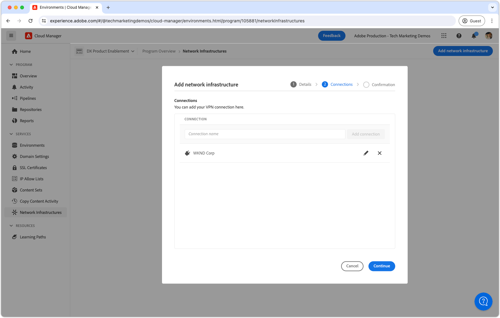

# Virtueel particulier netwerk (VPN)

Leer hoe u AEM as a Cloud Service verbindt met uw VPN om veilige communicatiekanalen te creëren tussen AEM en interne services.

>[!IMPORTANT]
>
>U kunt VPN&#39;s en port forwarding configureren via de Cloud Manager-gebruikersinterface of met behulp van API-aanroepen. Deze tutorial richt zich op de API-methode.
>
>Als u verkiest gebruikend UI, zie [ Geavanceerd Voorzien van een netwerk voor AEM as a Cloud Service ](https://experienceleague.adobe.com/nl/docs/experience-manager-cloud-service/content/security/configuring-advanced-networking) vormen.

## Wat is een Virtueel Privé Netwerk?

Het virtuele Privé Netwerk (VPN) staat een klant van AEM as a Cloud Service toe om **de milieu&#39;s van AEM** binnen een Programma van Cloud Manager aan bestaand, [ gesteund ](https://experienceleague.adobe.com/nl/docs/experience-manager-cloud-service/content/security/configuring-advanced-networking) VPN te verbinden. VPN staat veilige en gecontroleerde verbindingen tussen AEM as a Cloud Service en de diensten binnen het netwerk van de klant toe.

Een programma van Cloud Manager kan het type van a __enige__ netwerkinfrastructuur slechts hebben. Zorg ervoor dat het Virtuele Privé Netwerk het meest [ aangewezen type van netwerkinfrastructuur ](https://experienceleague.adobe.com/nl/docs/experience-manager-cloud-service/content/security/configuring-advanced-networking) voor uw AEM as a Cloud Service is alvorens de volgende bevelen uit te voeren.

>[!NOTE]
>
>Gelieve te merken op, wordt het verbinden van het bouwstijlmilieu van Cloud Manager met VPN niet gesteund. Als u binaire artefacten moet openen vanuit een privéopslagplaats, moet u een beveiligde en met een wachtwoord beveiligde opslagplaats instellen met een URL die beschikbaar is op het openbare internet [, zoals hier](https://experienceleague.adobe.com/nl/docs/experience-manager-cloud-service/content/implementing/using-cloud-manager/create-application-project/setting-up-project) wordt beschreven.

>[!MORELIKETHIS]
>
> Lees de documentatie over[&#128279;](https://experienceleague.adobe.com/nl/docs/experience-manager-cloud-service/content/security/configuring-advanced-networking) de geavanceerde netwerkconfiguratie van AEM as a Cloud Service voor meer informatie over Virtual Private Network.

## Vereisten

Voor het instellen van een Virtual Private Network met Cloud Manager API&#39;s is het volgende vereist:

+ De rekening van Adobe met [ de Toestemmingen van de BedrijfsEigenaar van Cloud Manager ](https://developer.adobe.com/experience-cloud/cloud-manager/guides/getting-started/permissions/)
+ Toegang tot [ de authentificatiegeloofsbrieven van Cloud Manager API ](https://developer.adobe.com/experience-cloud/cloud-manager/guides/getting-started/create-api-integration/)
   + Organisatie-ID (ook wel IMS-organisatie-ID genoemd)
   + Client-ID (ook wel API-sleutel genoemd)
   + Access Token (ook bekend als Bearer Token)
+ De Cloud Manager-programma-ID
+ De omgevings-ID&#39;s van Cloud Manager
+ A **route-Gebaseerd** Virtueel Privé Netwerk, met toegang tot alle noodzakelijke verbindingsparameters.

Voor meer details [ overzicht hoe te opstelling, vorm, en verkrijg de geloofsbrieven van de Manager van de Wolk API ](https://experienceleague.adobe.com/nl/docs/experience-manager-learn/cloud-service/developing/extensibility/app-builder/server-to-server-auth), om hen te gebruiken om een Cloud Manager API vraag te maken.

>[!IMPORTANT]
>
>Dit leerprogramma gebruikt `curl` om de configuraties van Cloud Manager API te maken - *als u een programmatic benadering* verkiest. Voor de geleverde `curl` opdrachten wordt uitgegaan van een Linux®- of macOS-syntaxis. Als u de Windows-opdrachtregel gebruikt, vervangt u het teken voor het `\` regeleinde door `^` .
>
>U kunt dezelfde taak ook uitvoeren via de gebruikersinterface van Cloud Manager. *als u de UI benadering* verkiest, zie [ Geavanceerd Voorzien van een netwerk voor AEM as a Cloud Service ](https://experienceleague.adobe.com/nl/docs/experience-manager-cloud-service/content/security/configuring-advanced-networking) vormen.

## Virtuele privénetwerk per programma inschakelen

Begin met het inschakelen van het Virtual Private Network op AEM as a Cloud Service.


>[!BEGINTABS]

>[!TAB Cloud Manager]

Flexibel poortuitgaand verkeer kan worden ingeschakeld met behulp van Cloud Manager. In de volgende stappen wordt beschreven hoe u flexibel poortverkeer op AEM as a Cloud Service kunt inschakelen met behulp van de Cloud Manager.

1. Meld u aan bij Adobe [Experience Manager Cloud Manager](https://experience.adobe.com/cloud-manager/) als eigenaar van een Cloud Manager-bedrijf.
1. Navigeer naar het gewenste programma.
1. Navigeer in het linkermenu naar __Services > netwerkinfrastructuren__.
1. Selecteer de __knop Netwerkinfrastructuur__ toevoegen.

   

1. Selecteer in het __dialoogvenster Netwerkinfrastructuur__ toevoegen de __optie Virtueel particulier netwerk__ . Vul de velden in en selecteer __Doorgaan__. Werk samen met de netwerkbeheerder van uw organisatie om de juiste waarden te verkrijgen.

    toe

1. Creeer minstens één verbinding van VPN. Geef de verbinding een betekenisvolle naam en selecteer __verbindingsknoop__ toevoegen.

   

1. Vorm de verbinding van VPN. Werk met de netwerkbeheerder van uw organisatie om de correcte waarden te verkrijgen. Selecteer __sparen__ om de toevoeging van de verbinding te bevestigen.

   

1. Als de veelvoudige verbindingen van VPN worden vereist, zoals meer verbindingen zoals nodig. Wanneer alle verbindingen van VPN worden toegevoegd, uitgezochte __gaat__ verder.

   

1. Selecteer __sparen__ om de toevoeging van VPN en alle gevormde verbindingen te bevestigen.

   

1. Wacht op de netwerkinfrastructuur die moet worden gecreeerd en als __Klaar__ worden gemerkt. Dit proces kan tot 1 uur duren.

   

Met VPN gecreeerd, kunt u het nu vormen gebruikend Cloud Manager APIs zoals hieronder beschreven.

>[!TAB  Cloud Manager APIs ]

Virtual Private Network kan worden ingeschakeld met Cloud Manager API&#39;s. In de volgende stappen wordt beschreven hoe u VPN in AEM as a Cloud Service kunt inschakelen met de Cloud Manager API.

1. Eerst, bepaal het gebied waarin het Geavanceerde Voorzien van een netwerk nodig is door de Cloud Manager API [ listRegions ](https://developer.adobe.com/experience-cloud/cloud-manager/reference/api/) verrichting te gebruiken. `region name` is vereist om volgende Cloud Manager API-aanroepen te kunnen uitvoeren. Doorgaans wordt de regio waarin de productieomgeving zich bevindt, gebruikt.

   Vind het gebied van uw milieu van AEM as a Cloud Service in [ Cloud Manager ](https://my.cloudmanager.adobe.com) onder de [ details van het milieu ](https://experienceleague.adobe.com/nl/docs/experience-manager-cloud-service/content/implementing/using-cloud-manager/manage-environments). De gebiedsnaam die in Cloud Manager wordt getoond kan [ aan de gebiedscode ](https://developer.adobe.com/experience-cloud/cloud-manager/guides/api-usage/creating-programs-and-environments/#creating-aem-cloud-service-environments) worden in kaart gebracht die in Cloud Manager API wordt gebruikt.

   __listRegions HTTP- verzoek__

   ```shell
   $ curl -X GET https://cloudmanager.adobe.io/api/program/{programId}/regions \
       -H 'x-gw-ims-org-id: <ORGANIZATION_ID>' \
       -H 'x-api-key: <CLIENT_ID>' \
       -H 'Authorization: Bearer <ACCESS_TOKEN>' \
       -H 'Content-Type: application/json'
   ```

1. Laat Virtueel Privé Netwerk voor een Programma van Cloud Manager toe gebruikend Cloud Manager APIs [ createNetworkInfrastructure ](https://developer.adobe.com/experience-cloud/cloud-manager/reference/api/) verrichting. Gebruik de juiste `region` -code die is verkregen via de Cloud Manager API `listRegions` -bewerking.

   __createNetworkInfrastructure HTTP- verzoek__

   ```shell
   $ curl -X POST https://cloudmanager.adobe.io/api/program/{programId}/networkInfrastructures \
       -H 'x-gw-ims-org-id: <ORGANIZATION_ID>' \
       -H 'x-api-key: <CLIENT_ID>' \
       -H 'Authorization: Bearer <ACCESS_TOKEN>' \
       -H 'Content-Type: application/json'
       -d @./vpn-create.json
   ```

   Definieer de JSON-parameters in een `vpn-create.json` en op voorwaarde dat u krult door middel van `... -d @./vpn-create.json`.

   [Download het voorbeeld vpn-create.json](./assets/vpn-create.json).  Dit bestand is slechts een voorbeeld. Configureer uw bestand naar wens op basis van de optionele/vereiste velden die zijn gedocumenteerd op [enableEnvironmentAdvancedNetworkingConfiguration](https://developer.adobe.com/experience-cloud/cloud-manager/reference/api/).

   ```json
   {
       "kind": "vpn",
       "region": "va7",
       "addressSpace": [
           "10.104.182.64/26"
       ],
       "dns": {
           "resolvers": [
               "10.151.201.22",
               "10.151.202.22",
               "10.154.155.22"
           ],
           "domains": [
               "wknd.site",
               "wknd.com"
           ]
       },
       "connections": [{
           "name": "connection-1",
           "gateway": {
               "address": "195.231.212.78",
               "addressSpace": [
                   "10.151.0.0/16",
                   "10.152.0.0/16",
                   "10.153.0.0/16",
                   "10.154.0.0/16",
                   "10.142.0.0/16",
                   "10.143.0.0/16",
                   "10.124.128.0/17"
               ]
           },
           "sharedKey": "<secret_shared_key>",
           "ipsecPolicy": {
               "dhGroup": "ECP256",
               "ikeEncryption": "AES256",
               "ikeIntegrity": "SHA256",
               "ipsecEncryption": "AES256",
               "ipsecIntegrity": "SHA256",
               "pfsGroup": "ECP256",
               "saDatasize": 102400000,
               "saLifetime": 3600
           }
       }]
   }
   ```

   Wacht 45-60 minuten op het Programma van Cloud Manager om de netwerkinfrastructuur te verstrekken.

1. Controleer dat het milieu __Virtuele Privé Configuratie van het Netwerk__ gebruikend de Cloud Manager API [ getNetworkInfrastructure ](https://developer.adobe.com/experience-cloud/cloud-manager/reference/api/#operation/getNetworkInfrastructure) verrichting gebeëindigd heeft, gebruikend `id` die van het `createNetworkInfrastructure` HTTP- verzoek in de vorige stap is teruggekeerd.

   __getNetworkInfrastructure HTTP- verzoek__

   ```shell
   $ curl -X GET https://cloudmanager.adobe.io/api/program/{programId}/networkInfrastructure/{networkInfrastructureId} \
       -H 'x-gw-ims-org-id: <ORGANIZATION_ID>' \
       -H 'x-api-key: <CLIENT_ID>' \
       -H 'Authorization: <YOUR_BEARER_TOKEN>' \
       -H 'Content-Type: application/json'
   ```

   Verifieer dat de reactie van HTTP a __status__ van __klaar__ bevat. Controleer de status om de paar minuten als u dat nog niet hebt gedaan.


Met VPN gecreeerd, kunt u het nu vormen gebruikend Cloud Manager APIs zoals hieronder beschreven.

>[!ENDTABS]

## Virtual Private Network-proxy&#39;s per omgeving configureren

1. Schakel de configuratie van het __Virtual Private Network__ in en configureer deze op elke AEM as a Cloud Service-omgeving met behulp van de Cloud Manager-API [enableEnvironmentAdvancedNetworkingConfiguration-bewerking](https://developer.adobe.com/experience-cloud/cloud-manager/reference/api/) .

   __enableEnvironmentAdvancedNetworkingConfiguration HTTP- verzoek__

   ```shell
   $ curl -X PUT https://cloudmanager.adobe.io/api/program/{programId}/environment/{environmentId}/advancedNetworking \
       -H 'x-gw-ims-org-id: <ORGANIZATION_ID>' \
       -H 'x-api-key: <CLIENT_ID>' \
       -H 'Authorization: Bearer <ACCESS_TOKEN>' \
       -H 'Content-Type: application/json' \
       -d @./vpn-configure.json
   ```

   Definieer de JSON-parameters in een `vpn-configure.json` -instructie en geef deze als `... -d @./vpn-configure.json` op.

[Download het voorbeeld vpn-configure.json](./assets/vpn-configure.json)

   ```json
   {
       "nonProxyHosts": [
           "example.net",
           "*.example.org"
       ],
       "portForwards": [
           {
               "name": "mysql.example.com",
               "portDest": 3306,
               "portOrig": 30001
           },
           {
               "name": "smtp.sendgrid.com",
               "portDest": 465,
               "portOrig": 30002
           }
       ]
   }
   ```

   `nonProxyHosts` verklaart een reeks gastheren waarvoor haven 80 of 443 door de standaard gedeelde IP adreswaaiers eerder dan specifieke uitgang IP zou moeten worden verpletterd. `nonProxyHosts` kan nuttig zijn als verkeer dat wordt uitgaand via gedeelde IP-adressen die automatisch door Adobe worden geoptimaliseerd.

   Voor elke `portForwards` toewijzing definieert het geavanceerde netwerk de volgende doorstuurregel:

   | Proxy-host | Proxy-poort |  | Externe host | Externe poort |
   |---------------------------------|----------|----------------|------------------|----------|
   | `AEM_PROXY_HOST` | `portForwards.portOrig` | → | `portForwards.name` | `portForwards.portDest` |

   Als uw plaatsing van AEM __slechts__ verbindingen HTTP/HTTPS aan externe dienst vereist, verlaat de `portForwards` serie leeg, aangezien deze regels slechts voor niet-HTTP/HTTPS verzoeken worden vereist.


&#x200B;2. Voor elk milieu, bevestig VPN die regels verplettert in feite gebruikend de Cloud Manager API [ getEnvironmentAdvancedNetworkingConfiguration ](https://developer.adobe.com/experience-cloud/cloud-manager/reference/api/) verrichting.

   __getEnvironmentAdvancedNetworkingConfiguration HTTP- verzoek__

   ```shell
   $ curl -X GET https://cloudmanager.adobe.io/api/program/{programId}/environment/{environmentId}/advancedNetworking \
       -H 'x-gw-ims-org-id: <ORGANIZATION_ID>' \
       -H 'x-api-key: <CLIENT_ID>' \
       -H 'Authorization: Bearer <ACCESS_TOKEN>' \
       -H 'Content-Type: application/json'
   ```

&#x200B;3. De virtuele Privé de volmachtsconfiguraties van het Netwerk kunnen worden bijgewerkt gebruikend Cloud Manager API [ enableEnvironmentAdvancedNetworkingConfiguration ](https://developer.adobe.com/experience-cloud/cloud-manager/reference/api/) verrichting. Vergeet niet dat `enableEnvironmentAdvancedNetworkingConfiguration` een `PUT` -bewerking is. Alle regels moeten daarom bij elke aanroep van deze bewerking worden opgegeven.

&#x200B;4. Nu kunt u de configuratie van het Virtual Private Network voor uitgaand verkeer gebruiken in uw aangepaste AEM code en configuratie.

## Verbinding maken met externe services via het Virtual Private Network

Als het Virtual Private Network is ingeschakeld, kunnen AEM code en configuratie deze gebruiken om via het VPN oproepen te doen naar externe services. Er zijn twee soorten externe oproepen die AEM anders behandelt:

1. HTTP/HTTPS-aanroepen naar externe services
   + Deze externe services omvatten HTTP/HTTPS-aanroepen naar services die worden uitgevoerd op andere poorten dan de standaardpoorten 80 of 443.
1. Niet-HTTP/HTTPS-aanroepen naar externe services
   + Deze externe services omvatten alle niet-HTTP-aanroepen, zoals verbindingen met e-mailservers, SQL-databases of services die gebruikmaken van andere protocollen dan HTTP/HTTPS.

HTTP/HTTPS-verzoeken van AEM op standaardpoorten (80/443) zijn standaard toegestaan, maar gebruiken de VPN-verbinding niet als deze niet op de juiste manier is geconfigureerd zoals hieronder beschreven.

### HTTP/HTTPS

Bij het maken van HTTP/HTTPS-verbindingen van AEM, wanneer u VPN gebruikt, worden HTTP/HTTPS-verbindingen automatisch uit AEM geproxied. Er is geen extra code of configuratie vereist om HTTP/HTTPS-verbindingen te ondersteunen.

>[!TIP]
>
> Zie de Virtuele documentatie Privé van het Netwerk van AEM as a Cloud Service voor [ de volledige reeks het verpletteren van regels ](https://experienceleague.adobe.com/nl/docs/experience-manager-cloud-service/content/security/configuring-advanced-networking).

#### Codevoorbeelden

<table>
<tr>
<td>
    <a  href="./examples/http-dedicated-egress-ip-vpn.md"></a>
    <div><strong><a href="./examples/http-dedicated-egress-ip-vpn.md"> HTTP/HTTPS </a></strong></div>
    <p>
        Java™-codevoorbeeld waarbij via het HTTP/HTTPS-protocol een HTTP/HTTPS-verbinding van AEM as a Cloud Service naar een externe service wordt gemaakt.
    </p>
</td>
<td></td>
<td></td>
</tr>
</table>

### Codevoorbeelden van niet-HTTP/HTTPS-verbindingen

Bij het maken van niet-HTTP/HTTPS-verbindingen (bijvoorbeeld SQL, SMTP, etc.) van AEM, moet de verbinding door een speciale gastheernaam worden gemaakt die door AEM wordt verstrekt.

| Naam variabele | Gebruiken | Java™-code | OSGi-configuratie |
| - |  - | - | - |
| `AEM_PROXY_HOST` | Proxyhost voor niet-HTTP/HTTPS-verbindingen | `System.getenv("AEM_PROXY_HOST")` | `$[env:AEM_PROXY_HOST]` |


Verbindingen met externe diensten worden dan geroepen door `AEM_PROXY_HOST` en de in kaart gebrachte haven (`portForwards.portOrig`), die AEM dan aan toegewezen externe hostname (`portForwards.name`) en haven (`portForwards.portDest`) leidt.

| Proxyhost | Proxypoort |  | Externe host | Externe poort |
|---------------------------------|----------|----------------|------------------|----------|
| `AEM_PROXY_HOST` | `portForwards.portOrig` | → | `portForwards.name` | `portForwards.portDest` |


#### Codevoorbeelden

<table><tr>
   <td>
      <a  href="./examples/sql-datasourcepool.md"></a>
      <div><strong><a href="./examples/sql-datasourcepool.md"> SQL verbinding gebruikend JDBC DataSourcePool </a></strong></div>
      <p>
            Java™ codevoorbeeld die met externe SQL gegevensbestanden verbinden door AEM te vormen JDBC datasource pool.
      </p>
    </td>
   <td>
      <a  href="./examples/sql-java-apis.md"></a>
      <div><strong><a href="./examples/sql-java-apis.md">SQL-verbinding met behulp van Java-API's™</a></strong></div>
      <p>
            Voorbeeld van Java-code™ die verbinding maakt met externe SQL-databases met behulp van Java's™ SQL-API's.
      </p>
    </td>
   <td>
      <a  href="./examples/email-service.md"></a>
      <div><strong><a href="./examples/email-service.md">E-mail service</a></strong></div>
      <p>
        OSGi-configuratievoorbeeld dat AEM gebruikt om verbinding te maken met externe e-mailservices.
      </p>
    </td>
</tr></table>

### Toegang tot AEM as a Cloud Service beperken via VPN

De Virtual Private Network-configuratie beperkt de toegang tot AEM as a Cloud Service-omgevingen tot een VPN.

#### Configuratievoorbeelden

<table><tr>
   <td>
      <a href="https://experienceleague.adobe.com/nl/docs/experience-manager-cloud-service/content/implementing/using-cloud-manager/ip-allow-lists/apply-allow-list"></a>
      <div><strong><a href="https://experienceleague.adobe.com/nl/docs/experience-manager-cloud-service/content/implementing/using-cloud-manager/ip-allow-lists/apply-allow-list"> Toepassend een IP lijst van gewenste personen </a></strong></div>
      <p>
            Vorm een IP lijst van gewenste personen dusdanig dat slechts het verkeer van VPN tot AEM kan toegang hebben.
      </p>
    </td>
    </td>
   <td></td>
</tr></table>
