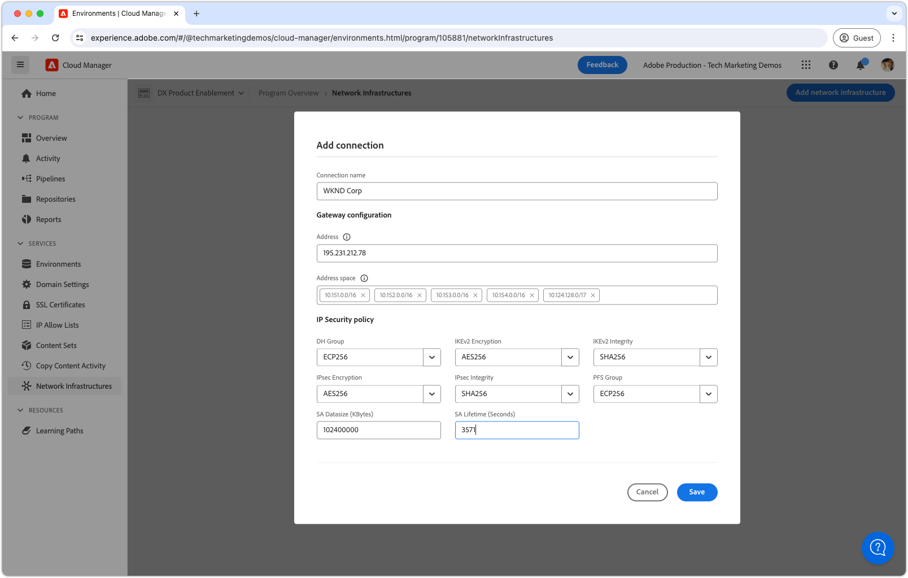

# Virtual Private Network (VPN)

Leer hoe te om AEM as a Cloud Service met uw VPN te verbinden om veilige communicatie kanalen tussen AEM en de interne diensten tot stand te brengen.

## Wat is Virtual Private Network?

Het virtuele Privé Netwerk (VPN) staat een klant van AEM as a Cloud Service toe om **de AEM milieu&#39;s** binnen een Programma van Cloud Manager aan bestaand, [ gesteund ](https://experienceleague.adobe.com/en/docs/experience-manager-cloud-service/content/security/configuring-advanced-networking) VPN te verbinden. VPN staat veilige en gecontroleerde verbindingen tussen AEM as a Cloud Service en de diensten binnen het netwerk van de klant toe.

Een programma van Cloud Manager kan het type van a __enige__ netwerkinfrastructuur slechts hebben. Zorg ervoor dat het Virtuele Privé Netwerk het meest [ aangewezen type van netwerkinfrastructuur ](https://experienceleague.adobe.com/en/docs/experience-manager-cloud-service/content/security/configuring-advanced-networking) voor uw AEM as a Cloud Service is alvorens de volgende bevelen uit te voeren.

>[!NOTE]
>
>Gelieve te merken op, wordt het verbinden van het bouwstijlmilieu van Cloud Manager met VPN niet gesteund. Als u tot binaire artefacten van een privé bewaarplaats moet toegang hebben, moet u opstelling een veilige en wachtwoord-beschermde bewaarplaats met een URL die op openbaar Internet [ beschikbaar is zoals hier beschreven ](https://experienceleague.adobe.com/en/docs/experience-manager-cloud-service/content/implementing/using-cloud-manager/create-application-project/setting-up-project).

>[!MORELIKETHIS]
>
> Lees de AEM as a Cloud Service [ geavanceerde documentatie van de netwerkconfiguratie ](https://experienceleague.adobe.com/en/docs/experience-manager-cloud-service/content/security/configuring-advanced-networking) voor meer details over Virtueel Privé Netwerk.

## Vereisten

Voor het instellen van een Virtual Private Network met Cloud Manager API&#39;s is het volgende vereist:

+ De rekening van de Adobe met [ BedrijfsEigenaar van Cloud Manager toestemmingen ](https://developer.adobe.com/experience-cloud/cloud-manager/guides/getting-started/permissions/)
+ Toegang tot [ de authentificatiegeloofsbrieven van Cloud Manager API ](https://developer.adobe.com/experience-cloud/cloud-manager/guides/getting-started/create-api-integration/)
   + Organisatie-id (ook bekend als IMS Org ID)
   + Client-id (ook bekend als API-sleutel)
   + Toegangstoken (ook bekend als Dragertoken)
+ Cloud Manager-programma-id
+ De milieu-id&#39;s van Cloud Manager
+ A **route-Gebaseerd** Virtueel Privé Netwerk, met toegang tot alle noodzakelijke verbindingsparameters.

Voor meer details [ overzicht hoe te opstelling, vorm, en verkrijg de geloofsbrieven van de Manager van de Wolk API ](https://experienceleague.adobe.com/en/docs/experience-manager-learn/cloud-service/developing/extensibility/app-builder/server-to-server-auth), om hen te gebruiken om een Cloud Manager API vraag te maken.

Deze zelfstudie gebruikt `curl` om de Cloud Manager API-configuraties te maken. De opgegeven `curl` -opdrachten nemen een Linux/macOS-syntaxis aan. Als u de Windows-opdrachtregel gebruikt, vervangt u het teken voor het `\` regeleinde door `^` .

## Virtuele privénetwerk per programma inschakelen

Begin door het Virtuele Privé Netwerk op AEM as a Cloud Service toe te laten.


>[!BEGINTABS]

>[!TAB Cloud Manager]

Flexibele poortuitgang kan worden ingeschakeld met Cloud Manager. In de volgende stappen wordt beschreven hoe u flexibele poorttoegang op AEM as a Cloud Service kunt inschakelen met de Cloud Manager.

1. Login aan [ Adobe Experience Manager Cloud Manager ](https://experience.adobe.com/cloud-manager/) als Bedrijfseigenaar van Cloud Manager.
1. Navigeer naar het gewenste programma.
1. In het linkermenu, navigeer aan __Diensten > de Infrastructuur van het Netwerk__.
1. Selecteer __toevoegen netwerkinfrastructuur__ knoop.

    toe

1. In __voeg de dialoog van de netwerkinfrastructuur__ toe, selecteer de __Virtuele privé netwerk__ optie. Vul de gebieden uit en selecteer __verdergaan__. Werk met de netwerkbeheerder van uw organisatie om de correcte waarden te verkrijgen.

    toe

1. Creeer minstens één verbinding van VPN. Geef de verbinding een betekenisvolle naam en selecteer __verbindingsknoop__ toevoegen.

   

1. Vorm de verbinding van VPN. Werk met de netwerkbeheerder van uw organisatie om de correcte waarden te verkrijgen. Selecteer __sparen__ om de toevoeging van de verbinding te bevestigen.

   

1. Als de veelvoudige verbindingen van VPN worden vereist, zoals meer verbindingen zoals nodig. Wanneer alle verbindingen van VPN worden toegevoegd, uitgezochte __gaat__ verder.

   

1. Selecteer __sparen__ om de toevoeging van VPN en alle gevormde verbindingen te bevestigen.

   

1. Wacht op de netwerkinfrastructuur die moet worden gecreeerd en als __Klaar__ worden gemerkt. Dit proces kan tot 1 uur duren.

   

Met VPN gecreeerd, kunt u het nu vormen gebruikend Cloud Manager APIs zoals hieronder beschreven.

>[!TAB  Cloud Manager APIs ]

Virtual Private Network kan worden ingeschakeld met Cloud Manager API&#39;s. In de volgende stappen wordt beschreven hoe u VPN in AEM as a Cloud Service kunt inschakelen met de Cloud Manager API.

1. Eerst, bepaal het gebied waarin het Geavanceerde Voorzien van een netwerk nodig is door de Cloud Manager API [ listRegions ](https://developer.adobe.com/experience-cloud/cloud-manager/reference/api/) verrichting te gebruiken. `region name` is vereist om volgende Cloud Manager API-aanroepen te kunnen uitvoeren. Doorgaans wordt de regio waarin de productieomgeving zich bevindt, gebruikt.

   Vind het gebied van uw milieu van AEM as a Cloud Service in [ Cloud Manager ](https://my.cloudmanager.adobe.com) onder de [ details van het milieu ](https://experienceleague.adobe.com/en/docs/experience-manager-cloud-service/content/implementing/using-cloud-manager/manage-environments). De gebiedsnaam die in Cloud Manager wordt getoond kan [ aan de gebiedscode ](https://developer.adobe.com/experience-cloud/cloud-manager/guides/api-usage/creating-programs-and-environments/#creating-aem-cloud-service-environments) worden in kaart gebracht die in Cloud Manager API wordt gebruikt.

   __listRegions HTTP- verzoek__

   ```shell
   $ curl -X GET https://cloudmanager.adobe.io/api/program/{programId}/regions \
       -H 'x-gw-ims-org-id: <ORGANIZATION_ID>' \
       -H 'x-api-key: <CLIENT_ID>' \
       -H 'Authorization: Bearer <ACCESS_TOKEN>' \
       -H 'Content-Type: application/json'
   ```

1. Laat Virtueel Privé Netwerk voor een Programma van Cloud Manager toe gebruikend Cloud Manager APIs [ createNetworkInfrastructure ](https://developer.adobe.com/experience-cloud/cloud-manager/reference/api/) verrichting. Gebruik de juiste `region` -code die is verkregen via de Cloud Manager API `listRegions` -bewerking.

   __createNetworkInfrastructure HTTP- verzoek__

   ```shell
   $ curl -X POST https://cloudmanager.adobe.io/api/program/{programId}/networkInfrastructures \
       -H 'x-gw-ims-org-id: <ORGANIZATION_ID>' \
       -H 'x-api-key: <CLIENT_ID>' \
       -H 'Authorization: Bearer <ACCESS_TOKEN>' \
       -H 'Content-Type: application/json'
       -d @./vpn-create.json
   ```

   Definieer de JSON-parameters in een `vpn-create.json` en opgegeven voor krullen via `... -d @./vpn-create.json` .

   [ Download het voorbeeld vpn-create.json ](./assets/vpn-create.json).  Dit bestand is slechts een voorbeeld. Vorm uw dossier zoals vereist gebaseerd op de facultatieve/vereiste gebieden die bij [ worden gedocumenteerd enableEnvironmentAdvancedNetworkingConfiguration ](https://developer.adobe.com/experience-cloud/cloud-manager/reference/api/).

   ```json
   {
       "kind": "vpn",
       "region": "va7",
       "addressSpace": [
           "10.104.182.64/26"
       ],
       "dns": {
           "resolvers": [
               "10.151.201.22",
               "10.151.202.22",
               "10.154.155.22"
           ],
           "domains": [
               "wknd.site",
               "wknd.com"
           ]
       },
       "connections": [{
           "name": "connection-1",
           "gateway": {
               "address": "195.231.212.78",
               "addressSpace": [
                   "10.151.0.0/16",
                   "10.152.0.0/16",
                   "10.153.0.0/16",
                   "10.154.0.0/16",
                   "10.142.0.0/16",
                   "10.143.0.0/16",
                   "10.124.128.0/17"
               ]
           },
           "sharedKey": "<secret_shared_key>",
           "ipsecPolicy": {
               "dhGroup": "ECP256",
               "ikeEncryption": "AES256",
               "ikeIntegrity": "SHA256",
               "ipsecEncryption": "AES256",
               "ipsecIntegrity": "SHA256",
               "pfsGroup": "ECP256",
               "saDatasize": 102400000,
               "saLifetime": 3600
           }
       }]
   }
   ```

   Wacht 45-60 minuten op het Programma van Cloud Manager om de netwerkinfrastructuur te verstrekken.

1. Controleer dat het milieu __Virtuele Privé Configuratie van het Netwerk__ gebruikend de Cloud Manager API [ getNetworkInfrastructure ](https://developer.adobe.com/experience-cloud/cloud-manager/reference/api/#operation/getNetworkInfrastructure) verrichting gebeëindigd heeft, gebruikend `id` die van het `createNetworkInfrastructure` HTTP- verzoek in de vorige stap is teruggekeerd.

   __getNetworkInfrastructure HTTP- verzoek__

   ```shell
   $ curl -X GET https://cloudmanager.adobe.io/api/program/{programId}/networkInfrastructure/{networkInfrastructureId} \
       -H 'x-gw-ims-org-id: <ORGANIZATION_ID>' \
       -H 'x-api-key: <CLIENT_ID>' \
       -H 'Authorization: <YOUR_BEARER_TOKEN>' \
       -H 'Content-Type: application/json'
   ```

   Verifieer dat de reactie van HTTP a __status__ van __klaar__ bevat. Controleer de status om de paar minuten als u dat nog niet hebt gedaan.


Met VPN gecreeerd, kunt u het nu vormen gebruikend Cloud Manager APIs zoals hieronder beschreven.

>[!ENDTABS]

## Virtual Private Network-proxy&#39;s per omgeving configureren

1. Laat en vorm de __Virtuele Privé configuratie van het Netwerk__ op elk milieu van AEM as a Cloud Service toe gebruikend Cloud Manager API [ enableEnvironmentAdvancedNetworkingConfiguration ](https://developer.adobe.com/experience-cloud/cloud-manager/reference/api/) verrichting.

   __enableEnvironmentAdvancedNetworkingConfiguration HTTP- verzoek__

   ```shell
   $ curl -X PUT https://cloudmanager.adobe.io/api/program/{programId}/environment/{environmentId}/advancedNetworking \
       -H 'x-gw-ims-org-id: <ORGANIZATION_ID>' \
       -H 'x-api-key: <CLIENT_ID>' \
       -H 'Authorization: Bearer <ACCESS_TOKEN>' \
       -H 'Content-Type: application/json' \
       -d @./vpn-configure.json
   ```

   Definieer de JSON-parameters in een `vpn-configure.json` en opgegeven voor krullen via `... -d @./vpn-configure.json` .

[Download het voorbeeld vpn-configure.json](./assets/vpn-configure.json)

   ```json
   {
       "nonProxyHosts": [
           "example.net",
           "*.example.org"
       ],
       "portForwards": [
           {
               "name": "mysql.example.com",
               "portDest": 3306,
               "portOrig": 30001
           },
           {
               "name": "smtp.sendgrid.com",
               "portDest": 465,
               "portOrig": 30002
           }
       ]
   }
   ```

   `nonProxyHosts` verklaart een reeks gastheren waarvoor haven 80 of 443 door de standaard gedeelde IP adreswaaiers eerder dan specifieke uitgang IP zou moeten worden verpletterd. `nonProxyHosts` kan nuttig zijn aangezien het verkeer dat door gedeelde IPs wordt behandeld automatisch door Adobe wordt geoptimaliseerd.

   Voor elke `portForwards` afbeelding, bepaalt het geavanceerde voorzien van een netwerk de volgende het door:sturen regel:

   | Proxyhost | Proxypoort |  | Externe host | Externe poort |
   |---------------------------------|----------|----------------|------------------|----------|
   | `AEM_PROXY_HOST` | `portForwards.portOrig` | → | `portForwards.name` | `portForwards.portDest` |

   Als uw AEM plaatsing __slechts__ verbindingen HTTP/HTTPS aan de externe dienst vereist, verlaat de `portForwards` serie leeg, aangezien deze regels slechts voor niet-HTTP/HTTPS verzoeken worden vereist.


2. Voor elk milieu, bevestig VPN die regels verplettert in feite gebruikend de Cloud Manager API [ getEnvironmentAdvancedNetworkingConfiguration ](https://developer.adobe.com/experience-cloud/cloud-manager/reference/api/) verrichting.

   __getEnvironmentAdvancedNetworkingConfiguration HTTP- verzoek__

   ```shell
   $ curl -X GET https://cloudmanager.adobe.io/api/program/{programId}/environment/{environmentId}/advancedNetworking \
       -H 'x-gw-ims-org-id: <ORGANIZATION_ID>' \
       -H 'x-api-key: <CLIENT_ID>' \
       -H 'Authorization: Bearer <ACCESS_TOKEN>' \
       -H 'Content-Type: application/json'
   ```

3. De virtuele privé configuraties van de netwerkvolmacht kunnen worden bijgewerkt gebruikend de 1} verrichting van Cloud Manager API [ enableEnvironmentAdvancedNetworkingConfiguration. ](https://developer.adobe.com/experience-cloud/cloud-manager/reference/api/) Vergeet niet dat `enableEnvironmentAdvancedNetworkingConfiguration` een `PUT` -bewerking is. Alle regels moeten daarom bij elke aanroep van deze bewerking worden opgegeven.

4. Nu, kunt u de Virtuele Privé configuratie van de uitgang van het Netwerk in uw douane AEM code en configuratie gebruiken.

## Verbinding maken met externe services via het Virtual Private Network

Met het Virtuele Privé Toegelaten Netwerk, kunnen AEM code en configuratie hen gebruiken om vraag aan externe diensten via VPN te maken. Er zijn twee vlotten van externe vraag die AEM verschillend behandelt:

1. HTTP/HTTPS-aanroepen naar externe services
   + Omvat HTTP/HTTPS vraag die aan de diensten wordt gemaakt die op havens buiten standaard 80 of 443 havens lopen.
1. niet-HTTP/HTTPS-aanroepen naar externe services
   + Omvat om het even welke niet-HTTP vraag, zoals verbindingen met de servers van de Post, SQL gegevensbestanden, of de diensten die op andere niet-HTTP/HTTPS protocollen lopen.

HTTP/HTTPS-aanvragen van AEM op standaardpoorten (80/443) zijn standaard toegestaan, maar gebruiken de VPN-verbinding niet als deze niet op de hieronder beschreven manier is geconfigureerd.

### HTTP/HTTPS

Wanneer u HTTP/HTTPS-verbindingen maakt van AEM, worden bij gebruik van VPN HTTP/HTTPS-verbindingen automatisch buiten de AEM geplaatst. Er is geen aanvullende code of configuratie vereist voor ondersteuning van HTTP/HTTPS-verbindingen.

>[!TIP]
>
> Zie de Virtuele documentatie Privé van het Netwerk van AEM as a Cloud Service voor [ de volledige reeks het verpletteren van regels ](https://experienceleague.adobe.com/en/docs/experience-manager-cloud-service/content/security/configuring-advanced-networking).

#### Codevoorbeelden

<table>
<tr>
<td>
    <a  href="./examples/http-dedicated-egress-ip-vpn.md"></a>
    <div><strong><a href="./examples/http-dedicated-egress-ip-vpn.md"> HTTP/HTTPS </a></strong></div>
    <p>
        Java™-codevoorbeeld waarbij via het HTTP/HTTPS-protocol een HTTP/HTTPS-verbinding van AEM as a Cloud Service naar een externe service wordt gemaakt.
    </p>
</td>
<td></td>
<td></td>
</tr>
</table>

### Codevoorbeelden van niet-HTTP/HTTPS-verbindingen

Bij het maken van niet-HTTP/HTTPS-verbindingen (bijvoorbeeld SQL, SMTP, etc.) van AEM, moet de verbinding door een speciale gastheernaam worden gemaakt die door AEM wordt verstrekt.

| Naam variabele | Gebruiken | Java™-code | OSGi-configuratie |
| - |  - | - | - |
| `AEM_PROXY_HOST` | Proxyhost voor niet-HTTP/HTTPS-verbindingen | `System.getenv("AEM_PROXY_HOST")` | `$[env:AEM_PROXY_HOST]` |


De verbindingen aan externe diensten worden dan geroepen door `AEM_PROXY_HOST` en de in kaart gebrachte haven (`portForwards.portOrig`), die dan aan toegewezen externe hostname (`portForwards.name`) en haven AEM (`portForwards.portDest`).

| Proxyhost | Proxypoort |  | Externe host | Externe poort |
|---------------------------------|----------|----------------|------------------|----------|
| `AEM_PROXY_HOST` | `portForwards.portOrig` | → | `portForwards.name` | `portForwards.portDest` |


#### Codevoorbeelden

<table><tr>
   <td>
      <a  href="./examples/sql-datasourcepool.md"></a>
      <div><strong><a href="./examples/sql-datasourcepool.md"> SQL verbinding gebruikend JDBC DataSourcePool </a></strong></div>
      <p>
            Java™ codevoorbeeld die met externe SQL gegevensbestanden verbinden door AEM JDBC datasource pool te vormen.
      </p>
    </td>
   <td>
      <a  href="./examples/sql-java-apis.md"></a>
      <div><strong><a href="./examples/sql-java-apis.md"> SQL verbinding gebruikend Java™ APIs </a></strong></div>
      <p>
            Java™-codevoorbeeld voor verbinding met externe SQL-databases met SQL API's van Java™.
      </p>
    </td>
   <td>
      <a  href="./examples/email-service.md"></a>
      <div><strong><a href="./examples/email-service.md"> E-maildienst </a></strong></div>
      <p>
        OSGi configuratievoorbeeld dat AEM gebruikt om met externe e-maildiensten te verbinden.
      </p>
    </td>
</tr></table>

### Toegang tot AEM as a Cloud Service beperken via VPN

De Virtual Private Network-configuratie beperkt de toegang tot AEM as a Cloud Service-omgevingen tot een VPN.

#### Configuratievoorbeelden

<table><tr>
   <td>
      <a href="https://experienceleague.adobe.com/en/docs/experience-manager-cloud-service/content/implementing/using-cloud-manager/ip-allow-lists/apply-allow-list"></a>
      <div><strong><a href="https://experienceleague.adobe.com/en/docs/experience-manager-cloud-service/content/implementing/using-cloud-manager/ip-allow-lists/apply-allow-list"> Toepassend een IP lijst van gewenste personen </a></strong></div>
      <p>
            Vorm een IP lijst van gewenste personen dusdanig dat slechts het verkeer van VPN tot AEM kan toegang hebben.
      </p>
    </td>
   <td>
      <a  href="https://experienceleague.adobe.com/en/docs/experience-manager-cloud-service/content/security/configuring-advanced-networking"></a>
      <div><strong><a href="https://experienceleague.adobe.com/en/docs/experience-manager-cloud-service/content/security/configuring-advanced-networking"> Op weg-Gebaseerde de toegangsbeperkingen van VPN aan AEM Publish </a></strong></div>
      <p>
            Vereis de toegang van VPN voor specifieke wegen op AEM Publish.
      </p>
    </td>
   <td></td>
</tr></table>
