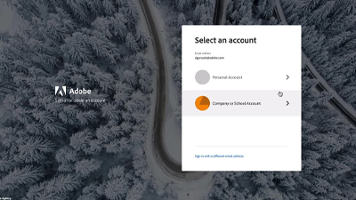

# Video&#39;s en zelfstudies AEM als Cloud Servicen {#overview}

Adobe Experience Manager (AEM) is nu beschikbaar as a Cloud Service. AEM as a Cloud Service introduceert de volgende generatie van de productlijn van de Experience Manager, voortbouwend op vroegere investeringen en innovaties, het bewaren en uitbreiden van alle gebruiksgevallen en -functies.

>[!VIDEO](https://video.tv.adobe.com/v/31085/?quality=12&learn=on)

## Wat is er nieuw

* **[Tokengebaseerde verificatie (zelfstudie)](https://experienceleague.adobe.com/docs/experience-manager-learn/getting-started-with-aem-headless/authentication/overview.html)**

   *Leer hoe te om op teken-gebaseerde authentificatie te gebruiken met AEM as a Cloud Service over HTTP in wisselwerking te staan*

* **[Headless GraphQL (zelfstudie)](https://experienceleague.adobe.com/docs/experience-manager-learn/getting-started-with-aem-headless/graphql/overview.html)**

   *Leer hoe u AEM GraphQL API&#39;s kunt gebruiken om ervaringen in een externe toepassing aan te zwengelen.*

* **[Bulk importeren (video)](./migration/bulk-import.md)**

   *Leer hoe u importmiddelen in AEM kunt bulken van Azure Blob Storage of Amazon S3*

* **[asset compute metadata worker (zelfstudie)](./asset-compute/advanced/metadata.md)**

   *Leer hoe u metagegevens van middelen van een Asset compute-worker naar AEM schrijft*

* **[Uitbreidbaarheid van microservices voor asset compute (zelfstudie)](./asset-compute/overview.md)**

   *Leer hoe u Asset compute-workers kunt ontwikkelen om aangepaste asset-uitvoeringen te genereren*

## Personeelsselectie

<table>
   <td>
      
      

         <a href="./accessing/overview.md">
         <strong>Toegang tot AEM zelfstudie configureren</strong>
         </a>
      

      

         <em>Configureer IMS-gebruikers in Adobe Admin Console voor toegang tot AEM.</em>
      

   </td>   
   <td>
      
      

         <a href="./local-development-environment/overview.md">
         <strong>Zelfstudie voor instelling lokale ontwikkelomgeving</strong>
         </a>
      

      

         <em>Bereid uw lokale ontwikkelmachine klaar voor AEM as a Cloud Service ontwikkeling!</em>
      

   </td>   
   <td>
      
      

         <a href="./debugging/aem-sdk-local-quickstart/overview.md">
         <strong>Foutopsporing AEM SDK</strong>
         </a>
      

      

         <em>Ontdek de tools die worden gebruikt om fouten in uw toepassing op te sporen in de lokale snelstartfunctie van de AEM as a Cloud Service SDK.</em>
      

   </td>
</table>

## Aanvullende bronnen

* [Experience League - Adobe Experience Manager verkennen](https://experienceleague.adobe.com/#recommended/solutions/experience-manager)
* [Adobe Experience Manager as a Cloud Service-documentatie](https://experienceleague.adobe.com/docs/experience-manager-cloud-service/landing/home.html)
