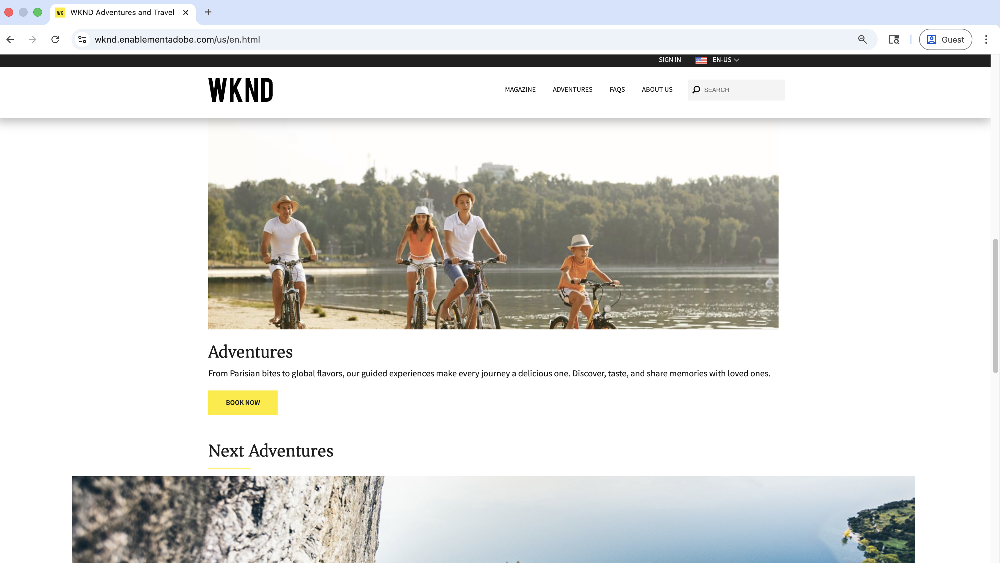
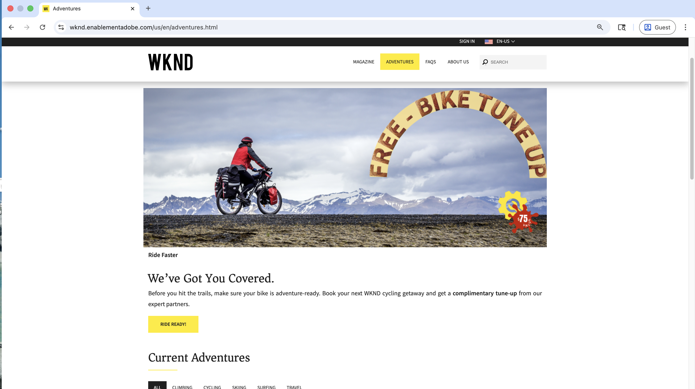

# Live demonstratie van gebruiksgevallen voor personalisatie

Bezoek de [ website van Enablement WKND ](https://wknd.enablementadobe.com/us/en.html){target="wknd"} om voorbeelden in real-world van het testen A/B, gedrag het richten, en bekende-gebruikersverpersoonlijking te zien.

>[!VIDEO](https://video.tv.adobe.com/v/3476461/?learn=on&enablevpops)

Deze pagina begeleidt u door hands-on demonstraties van elk verpersoonlijkingsscenario. Gebruik deze functie om te verkennen wat er mogelijk is voordat u deze mogelijkheden gaat ontwikkelen op uw eigen AEM-site.

>[!IMPORTANT]
>
> Open de demosite in meerdere browservensters of in de modus voor incognito/Private Browsing om verschillende persoonlijke variaties tegelijk te ervaren.
> Als u de Private Browsing-modus gebruikt, blokkeren Firefox en Safari het CID-cookie. U kunt ook de standaardmodus voor bladeren gebruiken of cookies wissen voordat u een nieuw verpersoonlijkingsscenario probeert.

## Gebruiksgevallen demo

De [ website van Enablement WKND ](https://wknd.enablementadobe.com/us/en.html){target="wknd"} toont drie soorten verpersoonlijking aan:

| Personalization-type | Wat je ziet | Timing |
|---------------------|-----------------|---------|
| **Gedrag dat richt** | Inhoud wordt aangepast op basis van uw browsergedrag en interesses. Algemeen verwezen naar als _volgende-pagina of zelfde-pagina verpersoonlijking_ | In real time &amp; Batch |
| **gekende-gebruiker Personalization** | Op maat gesneden ervaringen gebaseerd op complete klantprofielen die zijn gebaseerd op gegevens die op meerdere systemen zijn gebaseerd. Algemeen verwezen naar als _verpersoonlijking bij schaal_ | In real time |
| **het Testen A/B** | Verschillende variaties in inhoud die zijn getest om de beste prestaties te vinden. Algemeen verwezen naar als _experimenteren_ | In real time |

## Gedragsgerichte acties

De inhoud wordt tijdens de bladersessie automatisch aangepast op basis van acties en interesses van de bezoeker. Dit wordt algemeen bedoeld als _volgende-pagina of zelfde-pagina verpersoonlijking_.

### Home-, avonturen- en tijdschriftpagina&#39;s

Deze ervaringen worden direct weergegeven op basis van uw huidige browsergedrag (realtime personalisatie). De Adobe Experience Platform Edge Network wordt gebruikt om realtime beslissingen te nemen over personalisatie.

| Pagina | Wat u zult zien | Procedure | Ervaring |
|------|-----------------|-------------|------------|
| [ Huis ](https://wknd.enablementadobe.com/us/en.html){target="wknd"} | Een gepersonaliseerde **familievriendelijke Banner van Adventures held banner** kenmerkend een familie die zich door een lakeside samenrijdt, die geleide ervaringen bevordert die gedeelde herinneringen creëren | Bezoek [ Bali Surf Camp ](https://wknd.enablementadobe.com/us/en/adventures/bali-surf-camp.html){target="wknd"} of [ Gastronomische Tour van Marais ](https://wknd.enablementadobe.com/us/en/adventures/gastronomic-marais-tour.html){target="wknd"}, dan terugkeer aan homepage | {width="200" zoomable="yes"} |
| [ avonturen ](https://wknd.enablementadobe.com/us/en/adventures.html){target="wknd"} | Een op fietsen gerichte **&quot;Free Bike Tune Up&quot;-promotieheld** met &quot;We hebben You Covered&quot;-berichten en een gratis aanbieding voor fietsonderhoud van WKND-partners | Bezoek om het even welk op biking betrekking hebbende avontuur (bijvoorbeeld, [ het Cycleren Toscane ](https://wknd.enablementadobe.com/us/en/adventures/cycling-tuscany.html){target="wknd"}), dan navigeer aan de pagina van Adventures | {width="200" zoomable="yes"} |
| [ avonturen ](https://wknd.enablementadobe.com/us/en/adventures.html){target="wknd"} | Een op camping-georiënteerde **held van de tandwielinzameling** tonend essentieel camping materiaal (slaapzakken, colbertjassen, laarzen) met &quot;Uw Volgende avontuur begint met het juiste overseinen van het Gear&quot; | Bezoek om het even welk op camping betrekking hebbende avontuur (bijvoorbeeld, [ Yosemite Backpackaging ](https://wknd.enablementadobe.com/us/en/adventures/yosemite-backpacking.html){target="wknd"}), dan navigeer aan de pagina van avonturen | {width="200" zoomable="yes"} |
| [ Tijdschrift ](https://wknd.enablementadobe.com/us/en/magazine.html){target="wknd"} | Een time-sensitive **bevordering van de tijdschriftverkoop** die gewalste tijdschriften WKND met duidelijke &quot;VERKOOP kenmerkt!&quot; badges en speciale lezerprijzen voor uitgaven en collecties buitenshuis | Lees één of meerdere tijdschriftartikelen (bijvoorbeeld, [ Toerisme van de Ski ](https://wknd.enablementadobe.com/us/en/magazine/ski-touring.html){target="wknd"}), dan navigeer aan de het landen van het Tijdschrift pagina | {width="200" zoomable="yes"} |

### Adventures en Magazine-pagina&#39;s (batch)

Deze ervaringen zijn gebaseerd op historisch gedrag en verschijnen op uw volgende bezoek of later dezelfde dag (partijpersonalisatie). De gegevens worden geaggregeerd en verwerkt tot profielkenmerken en geactiveerd voor Adobe Experience Platform Edge Network.

| Pagina | Wat u zult zien | Procedure | Ervaring |
|------|-----------------|-------------|------------|
| [ avonturen ](https://wknd.enablementadobe.com/us/en/adventures.html){target="wknd"} | Een op surf-thema gebaseerde held die **kleurrijke surfboards onder palmbomen** met &quot;Uw Reis van het Surf hier&quot;overseinen en gekromde inhoud van de surfbestemming kenmerkt die op uw belangen wordt gebaseerd | Bezoek veelvoudige [ surf-Verwante avonturen ](https://wknd.enablementadobe.com/us/en/adventures.html#tabs-b4210c6ff3-item-b411b19941-tab){target="wknd"}, dan terugkeer aan de pagina van avonturen de volgende dag | {width="200" zoomable="yes"} |
| [ Tijdschrift ](https://wknd.enablementadobe.com/us/en/magazine.html){target="wknd"} | A **gepersonaliseerde de aanbieding van het tijdschriftabonnement** kenmerkend de bestemmingen van de wereldreis met een klassieke VW van, benadrukkend &quot;Uw gepersonaliseerde tijdschriftervaring&quot;met exclusieve abonneevoordelen | Lees 3 of meer [ artikelen van het tijdschrift ](https://wknd.enablementadobe.com/us/en/magazine.html){target="wknd"}, dan terugkeer aan de het landen pagina van het Tijdschrift de volgende dag | {width="200" zoomable="yes"} |

**Leer meer:** Klaar om gedrag het richten op uw eigen plaats van AEM uit te voeren? Begin met het [ Gedrag dat Leerprogramma richt ](./use-cases/behavioral-targeting.md) om het volledige opstellingsproces te leren.

## Verpersoonlijking van bekende gebruikers

Persoonlijke ervaringen op basis van complete klantprofielen die zijn gebaseerd op gegevens op meerdere systemen, waaronder de aankoopgeschiedenis en de levenscyclusfase van de klant. De Adobe Experience Platform Edge Network wordt gebruikt om realtime beslissingen te nemen over personalisatie.

### Hoofdscherm van startpagina

De hoofdbanner van de WKND-homepage wordt gepersonaliseerd op basis van geverifieerde gebruikersprofielen. Test met deze demo-accounts om een persoonlijke ervaring te zien:

| Pagina | Wat u zult zien | Procedure | Profielcontext | Ervaring |
|------|-----------------|-------------|-----------------|------------|
| [ Huis ](https://wknd.enablementadobe.com/us/en.html){target="wknd"} | Een skishop binnenland die **premiumskiapparatuur met &quot;EXTRA 25% VAN VERSCHAFFING&quot;toont** bevordering, die deskundige verpakkingsuiteinden bevat om voor hun aanstaande ski-avontuur voor te bereiden | Aanmelden met `rwilson/rwilson` en de pagina vernieuwen | Onlangs aangekochte skiavonturen, waardoor skischoenen worden geüpseld | {width="200" zoomable="yes"} |

**Leer meer:** Klaar om gekende-gebruikersverpersoonlijking op uw eigen plaats van AEM uit te voeren? Begin met het [ Bekende-gebruikerPersonalization Leerprogramma ](./use-cases/known-user-personalization.md) om het volledige opstellingsproces te leren.

## A/B-tests (experimenten)

Test verschillende inhoudvariaties om te bepalen welke het beste voor uw bedrijfsdoelstellingen presteert. Adobe Target bedient willekeurig verschillende variaties voor bezoekers en tracks die beter presteren. Dit wordt algemeen bedoeld als _experimenteren_.

### Topaanbieding op homepage, artikel

De homepage WKND stelt een actieve A/B test met drie variaties van de _Camping in West Australië_ in werking gekenmerkte artikel. Elke bezoeker wordt willekeurig toegewezen om één van deze variaties te zien:

| Pagina | Wat u zult zien | Procedure | Ervaring |
|------|-----------------|-------------|------------|
| [ Huis ](https://wknd.enablementadobe.com/us/en.html){target="wknd"} | Één van drie willekeurig toegewezen kenmerkende artikelvariaties in de &quot;Onze Eigenschap&quot;sectie: **&quot;van het Net: De Routes van de Camping van de Epic over West Australië&quot;** of **&quot;Wandering Wild: De Ontventures van de Camping in West Australië&quot;** (of een derde variatie), elk met unieke beelden en overseinen om te testen die resoneert het best | Ga naar de startpagina in verschillende browsers, gebruik de modus Incognito/Private of wissel cookies om verschillende variaties te zien | {width="200" zoomable="yes"} |

**Leer meer:** Klaar om het testen A/B op uw eigen plaats van AEM uit te voeren? Begin met de [ Zelfstudie van de Experimentatie (het Testen A/B) ](./use-cases/experimentation.md) om het volledige opstellingsproces te leren.

## Volgende stappen

Klaar om personalisatie op uw eigen AEM-site te implementeren? Begin met het [ Overzicht van Personalization ](./overview.md) om het volledige opstellingsproces te leren.

