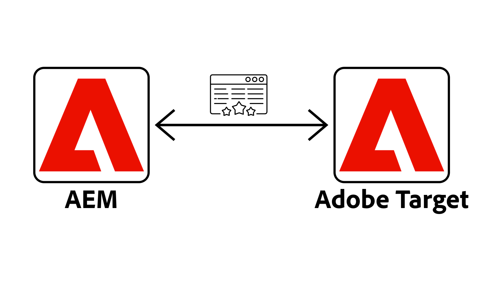
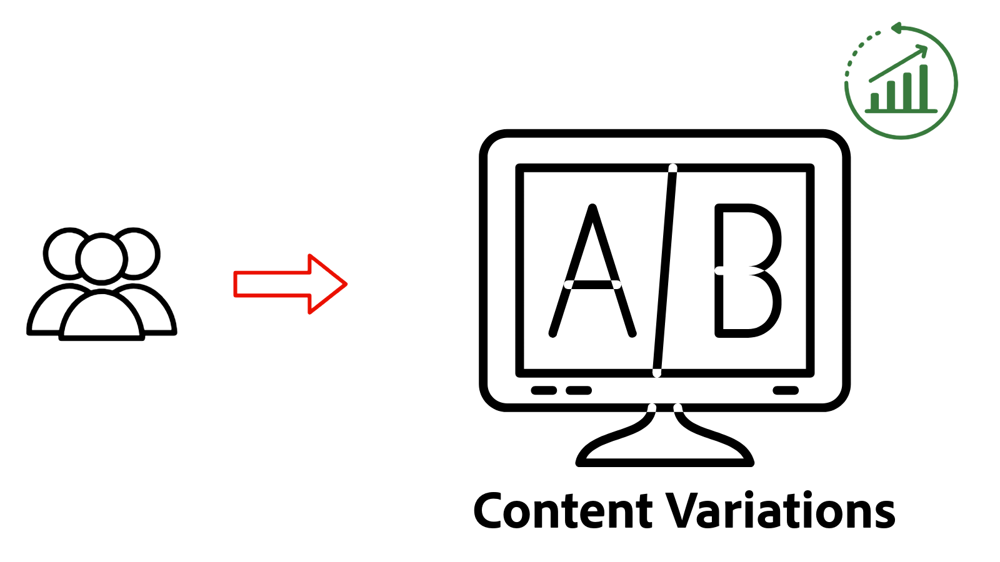

# Personalization - Overzicht

Leer hoe AEM as a Cloud Service (AEMCS) integreert met Adobe Target en Adobe Experience Platform (AEP). Ontdek hoe u persoonlijke ervaringen kunt bieden met behulp van A/B-tests, gebruikers kunt aanwijzen op basis van hun gedrag of inhoud kunt aanpassen met behulp van klantprofielen.

## Vereisten

Om diverse verpersoonlijkingsscenario&#39;s aan te tonen, gebruikt dit leerprogramma het steekproef [ AEM WKND ](https://github.com/adobe/aem-guides-wknd/) project. U hebt de volgende stappen nodig:

- Een Adobe org met toegang tot:
   - **milieu van AEM as a Cloud Service** - om inhoud tot stand te brengen en te beheren
   - **Adobe Target** - om gepersonaliseerde ervaringen samen te stellen en te leveren
   - **de toepassingen van Adobe Experience Platform** - om klantenprofielen en publiek te beheren
   - **Markeringen (vroeger Lancering) in AEP** - om het Web SDK en douane JavaScript voor gegevensinzameling en verpersoonlijking op te stellen

- Basiskennis van AEM-componenten en Experience Fragments

- Het [ AEM WKND ](https://github.com/adobe/aem-guides-wknd/) project dat aan uw milieu van AEM as a Cloud Service wordt opgesteld.

## Aan de slag

Voordat u specifieke gebruiksgevallen gaat verkennen, configureert u eerst AEM as a Cloud Service voor personalisatie. Begin door Adobe Target en Markeringen te integreren om cliënt-zijpersonalisatie toe te laten gebruikend het Web SDK van AEP. Met deze basisstappen ondersteunen uw AEM-pagina&#39;s experimenten, doelgroepen en realtime personalisatie.

<!-- CARDS
{target = _self}

* ./setup/integrate-adobe-target.md
  {title = Integrate Adobe Target}
  {description = Integrate AEMCS with Adobe Target to activate personalized content as Adobe Target offers.}
  {image = ./assets/setup/integrate-target.png}
  {cta = Integrate Target}

* ./setup/integrate-adobe-tags.md
  {title = Integrate Tags}
  {description = Integrate AEMCS with Tags to inject the Web SDK and custom JavaScript for data collection and personalization.}
  {image = ./assets/setup/integrate-tags.png}
  {cta = Integrate Tags}
-->
<!-- START CARDS HTML - DO NOT MODIFY BY HAND -->

    

        

            

                <figure class="image x-is-16by9">
                    
                </figure>
            

            

                

                    

                        <a href="./setup/integrate-adobe-target.md" target="_self" rel="referrer" title="Adobe Target integreren"> integreer Adobe Target </a>
                    

                    
Integreer AEMCS met Adobe Target om persoonlijke inhoud te activeren zoals Adobe Target biedt.

                

                <a href="./setup/integrate-adobe-target.md" target="_self" rel="referrer" class="spectrum-Button spectrum-Button--outline spectrum-Button--primary spectrum-Button--sizeM" style="align-self: flex-start; margin-top: 1rem;">
                     integreer Doel 
                </a>
            

        

    

    

        

            

                <figure class="image x-is-16by9">
                    
                </figure>
            

            

                

                    

                        <a href="./setup/integrate-adobe-tags.md" target="_self" rel="referrer" title="Tags integreren"> integreer Markeringen </a>
                    

                    
Integreer AEMCS met Tags om het Web SDK en de aangepaste JavaScript te injecteren voor gegevensverzameling en personalisatie.

                

                <a href="./setup/integrate-adobe-tags.md" target="_self" rel="referrer" class="spectrum-Button spectrum-Button--outline spectrum-Button--primary spectrum-Button--sizeM" style="align-self: flex-start; margin-top: 1rem;">
                     integreer Markeringen 
                </a>
            

        

    

<!-- END CARDS HTML - DO NOT MODIFY BY HAND -->

## Gevallen gebruiken

Ontdek de volgende veelvoorkomende gebruiksgevallen voor personalisatie die worden ondersteund door AEMCS, Adobe Target en Adobe Experience Platform.

<!-- CARDS
{target = _self}

* ./use-cases/experimentation.md
  {title = Experimentation (A/B Testing)}
  {description = Learn how to test different content variations in AEMCS using Adobe Target for A/B testing.}
  {image = ./assets/use-cases/experiment/experimentation.png}
  {cta = Learn Experimentation}
-->
<!-- START CARDS HTML - DO NOT MODIFY BY HAND -->

    

        

            

                <figure class="image x-is-16by9">
                    
                </figure>
            

            

                

                    

                        <a href="./use-cases/experimentation.md" target="_self" rel="referrer" title="Experimentatie (A/B-test)"> Experimentatie (het Testen A/B) </a>
                    

                    
Leer hoe u verschillende inhoudvariaties in AEMCS kunt testen met Adobe Target voor A/B-tests.

                

                <a href="./use-cases/experimentation.md" target="_self" rel="referrer" class="spectrum-Button spectrum-Button--outline spectrum-Button--primary spectrum-Button--sizeM" style="align-self: flex-start; margin-top: 1rem;">
                     Leer Experimentatie 
                </a>
            

        

    

<!-- END CARDS HTML - DO NOT MODIFY BY HAND -->

